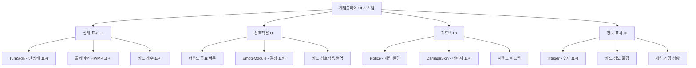
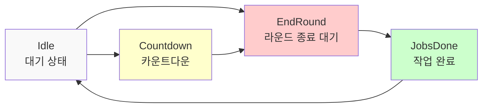
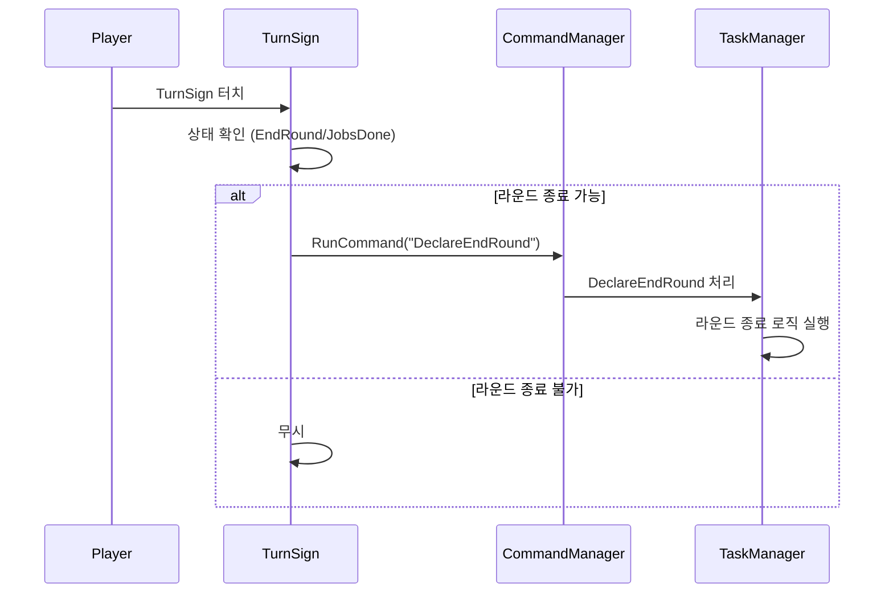
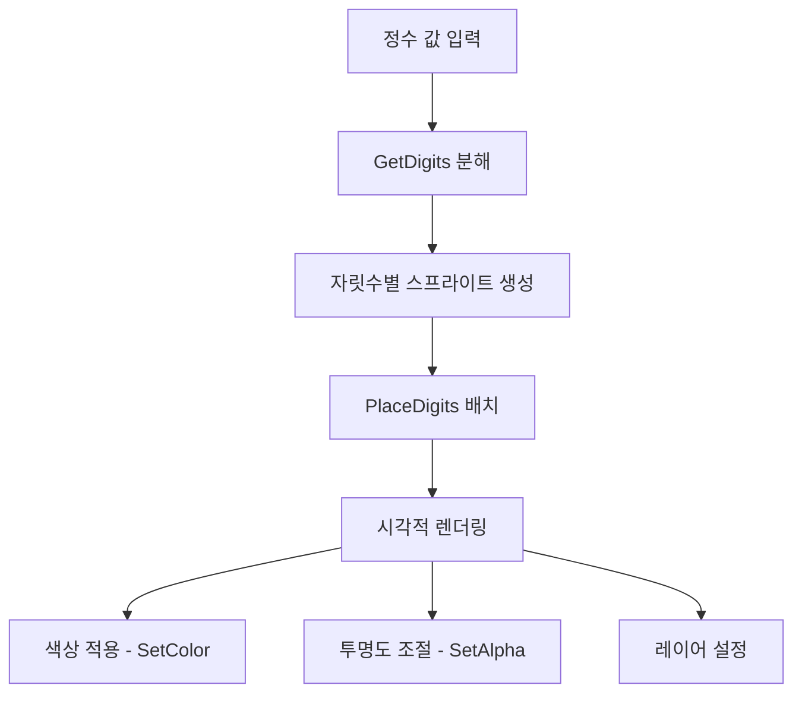
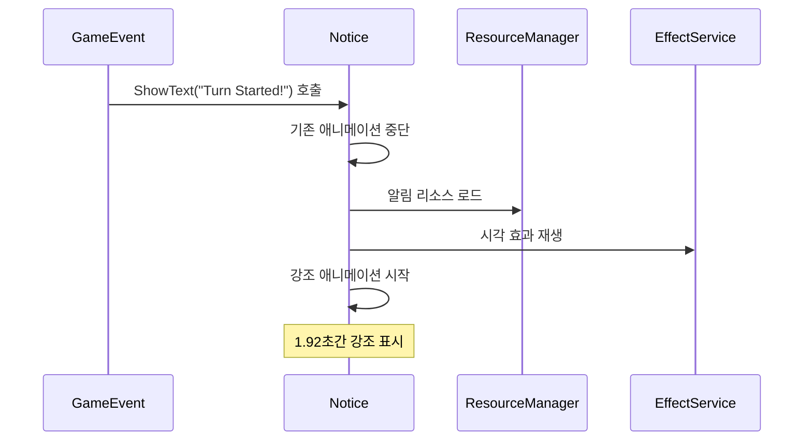
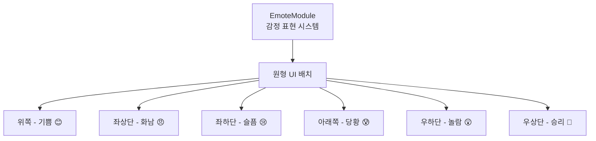
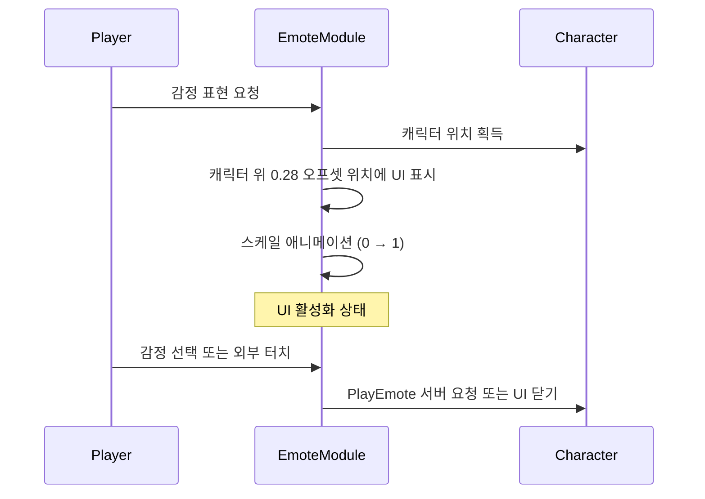
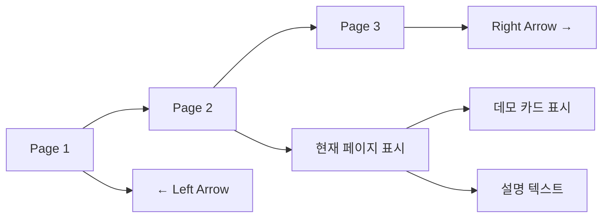

# 게임 플레이 UI

## 📋 개요

메이플 듀얼의 게임 플레이 UI는 실제 카드 대전이 진행되는 동안 플레이어에게 필요한 모든 시각적 정보와 상호작용 수단을 제공합니다. 턴 표시, 플레이어 정보, 게임 상태 알림, 감정 표현 등 게임 진행에 직접적으로 관여하는 UI 요소들로 구성되어 있으며, 게임의 몰입감과 편의성을 극대화하도록 설계되었습니다.

**관련 파일**: 
- `RootDesk/MyDesk/Components/TurnSign.mlua`
- `RootDesk/MyDesk/Components/Integer.mlua`
- `RootDesk/MyDesk/Components/Notice.mlua`
- `RootDesk/MyDesk/Components/UIs/EmoteModule.mlua`

## 🏗️ 게임플레이 UI 아키텍처

### UI 계층 구조



## 🎯 1. 턴 표시 시스템 (TurnSign)

### 턴 상태 관리

#### TurnSign 상태 전환 시스템


**SetState() 상태별 특징**:
- `TurnSign.mlua :: SetState()` — 상태별 회전, 텍스트, 색상 설정
- 각 상태마다 고유한 시각적 표현

### 라운드 종료 상호작용

#### 터치 기반 라운드 종료 시스템


**터치 이벤트 처리**:
```lua
self.imageEntity:ConnectEvent(TouchEvent, function(event)
    if not _Server:IsRequesting() and 
       (self.duel.turnSign.state == "EndRound" or self.duel.turnSign.state == "JobsDone") then
        local player = _UserService.LocalPlayer.Character.player
        if isvalid(player) then
            self.commandManager:RunCommand("DeclareEndRound", {player, false}, {})
        end
    end
end)
```

### 시각적 효과

#### 애니메이션과 시각적 피드백
- **회전 효과**: 상태 변경 시 15도 회전으로 시각적 강조
- **색상 변화**: 상황별 색상으로 직관적인 상태 표현
- **텍스트 표시**: 현재 상태를 명확한 텍스트로 안내
- **트위닝**: 부드러운 상태 전환 애니메이션

## 🔢 2. 숫자 표시 시스템 (Integer)

### 동적 숫자 렌더링

#### 멀티 디지트 시스템


#### 스프라이트 기반 숫자 표시
- `Integer.mlua :: SetInteger()` — 숫자 값 설정 및 자릿수 배치
- `GetDigits()` 및 `PlaceDigits()` 연동으로 시각적 렌더링

**숫자 분해 알고리즘**:
- **음수 처리**: 음수 기호 별도 처리
- **0 특수 처리**: 0일 때도 한 자리 표시
- **자릿수 계산**: 큰 수도 정확하게 표시

#### 정밀한 배치 시스템
**배치 조정:**
- `positionGapX` — 디지트 간격 설정
- `sortingLayer`, `orderInLayer` — UI 표시 순서 제어

### 특수 숫자 표시

#### SetPositiveInteger() 시스템
양수 표시 시 '+' 기호를 자동으로 추가하는 기능:
- `Integer.mlua :: SetPositiveInteger()` — '+' 기호 자동 추가

**활용 사례**:
- **체력 회복**: "+5 HP" 표시
- **MP 증가**: "+1 MP" 표시  
- **점수 상승**: "+100" 표시
- **버프 효과**: "+2 ATK" 표시

## 📢 3. 게임 알림 시스템 (Notice)

### 실시간 알림 표시

#### ShowText() 중앙 알림 시스템


#### 시각적/음향적 효과 통합
**알림 표시:**
- `Notice.mlua :: ShowText()` — 알림 표시 및 강조 애니메이션
- `_Tween:Emphasize()` 활용한 시각적 강조
    local resource = self.resourceManager:GetResource("Notice")
    _EffectService:RemoveEffect(self.effectSerial)
    _SoundService:StopSound(resource.sound)
    
    -- 시각 효과와 사운드 동시 재생
    self.effectSerial = _EffectService:PlayEffect(
        resource.animation, self.Entity, Vector3.zero, 0, Vector3(2, 2, 1))
    _SoundService:PlaySound(resource.sound, 2)
end
```

**알림 메시지 예시**:
- **"Turn Started!"** - 턴 시작 알림
- **"Round End!"** - 라운드 종료
- **"Victory!"** / **"Defeat!"** - 게임 결과
- **"Card Played!"** - 카드 사용 알림

## 😀 4. 감정 표현 시스템 (EmoteModule)

### 원형 감정 표현 UI

#### 6방향 원형 레이아웃


#### 극좌표 기반 입력 처리
**감정 선택 로직:**
- 터치 위치를 극좌표로 변환
- 반지름과 각도로 감정 선택 영역 결정
- `_Server:Request(character, "PlayEmote")` 호출

### 동적 위치 계산

#### 캐릭터 위치 기반 표시


**위치 계산**:
- 캐릭터 위치 기반으로 UI 동적 배치
- 0.28 오프셋으로 캐릭터 위쪽에 표시

## 🎛️ 5. 제어 메뉴 시스템 (ControlMenu)

### 페이지네이션 UI

#### 다중 콘텐츠 관리


**페이지 전환 시스템**:
- 좌/우 애로우 버튼으로 페이지 네비게이션
- `ControlMenu.mlua :: ShowContent()` 호출로 콘텐츠 전환

#### 데모 카드 시스템
가이드용 데모 카드를 UI 레이어에 표시:
- `GetChildComponentsByTypeName()` 활용
- UI 레이어에 스프라이트 렌더러 설정
for _, renderer in ipairs(rendererArray) do
    renderer.SortingLayer = "UI"
    renderer.OrderInLayer = 5
end
```

## 🔊 6. 피드백 시스템

### 음향 피드백

#### 상황별 사운드 시스템
모든 UI 상호작용에는 적절한 사운드가 적용됩니다:

```lua
-- 버튼 클릭 사운드 종류
_SoundService:PlaySound(self.resourceManager:GetResource("UI").buttonClickOpenSound, 1)    -- 모듈 열기
_SoundService:PlaySound(self.resourceManager:GetResource("UI").buttonClickRawSound, 1)     -- 일반 버튼
_SoundService:PlaySound(self.resourceManager:GetResource("UI").buttonClickSwitchSound, 1)  -- 전환 버튼
```

### 시각적 피드백

#### 강조 및 전환 효과
- **_Tween:Emphasize()**: 알림 강조 효과
- **_Tween:ScaleTo()**: 크기 변환 애니메이션
- **Color 변경**: 상태별 색상 피드백
- **투명도 조절**: 비활성화 상태 표시

## 🎯 7. UI 상호작용 최적화

### 상태 기반 제어

#### 안전한 상호작용 보장
모든 게임플레이 UI는 게임 상태를 확인하여 안전한 상호작용을 보장합니다:

```lua
-- 공통 상태 검증 패턴
if not character.isLoaded or _Server:IsRequesting() then
    return  -- 캐릭터 미로딩 또는 서버 요청 중
end

if character.isMatching or isvalid(character.player) then
    return  -- 매칭 중이거나 게임 중
end
```

### 반응형 레이아웃

#### 다양한 화면 크기 지원
- **월드 좌표 기반**: 게임 월드에 고정된 UI 요소들
- **화면 좌표 변환**: 터치 입력의 정확한 위치 계산
- **동적 크기 조절**: 화면 크기에 따른 UI 스케일링

## 🎨 8. 성능 및 최적화

### 리소스 관리

#### 효율적인 UI 생성/정리
- `Integer.mlua :: Clear()` — 숫자 표시 UI 요소 정리 및 메모리 해제
- 디지트 엔티티 배열 초기화

### 메모리 최적화

#### 재사용 가능한 컴포넌트
- **Integer**: 여러 UI에서 공통 사용
- **Notice**: 게임 전반에 걸친 알림 시스템
- **TurnSign**: 턴제 게임의 핵심 UI

## 💡 코드 참조

핵심 게임플레이 UI 로직:
- `TurnSign.mlua :: SetState()` — 턴 상태 시각화
- `Integer.mlua :: SetInteger()` — 동적 숫자 표시
- `Notice.mlua :: ShowText()` — 중앙 알림 시스템
- `EmoteModule.mlua :: Open()` — 원형 감정 표현 UI
- `ControlMenu.mlua :: ShowContent()` — 페이지네이션 시스템

게임플레이 UI 시스템은 플레이어가 게임에 몰입할 수 있도록 직관적이고 반응성 좋은 인터페이스를 제공하며, 게임의 전술적 판단을 돕는 중요한 정보들을 효과적으로 전달하는 핵심 시스템입니다.
