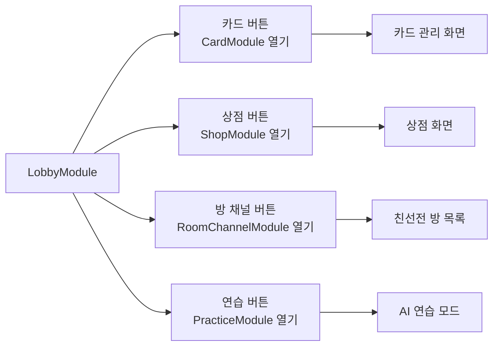
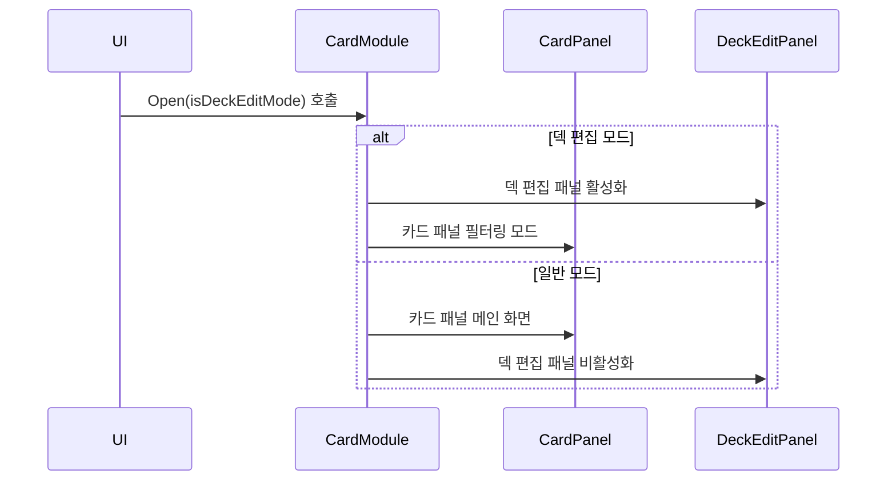
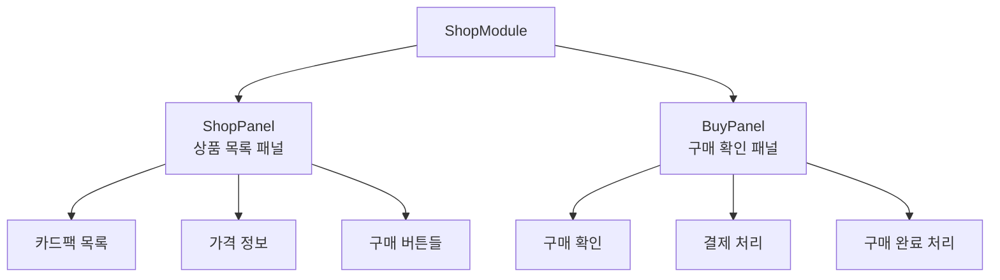
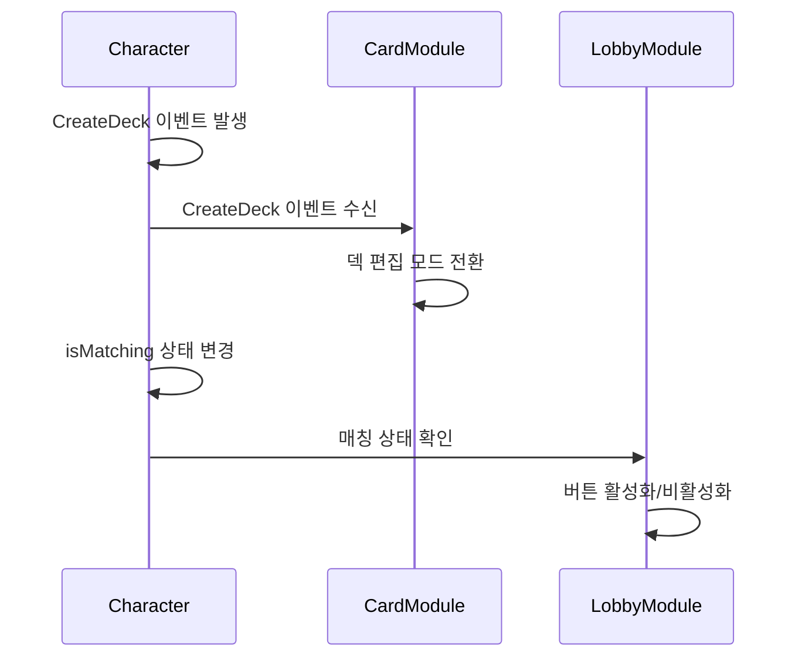

# 메인 UI 모듈

## 📋 개요

메이플 듀얼의 UI 시스템은 모듈 기반 아키텍처를 통해 게임의 각 기능별로 독립적인 UI 모듈을 제공합니다. 각 모듈은 특정 게임 기능에 집중하며, `UIManager`를 통해 통합적으로 관리됩니다. 로비, 듀얼, 카드 관리, 상점, 소셜 기능 등 게임의 모든 주요 기능이 각각의 전용 UI 모듈을 통해 구현됩니다.

**관련 파일**: 
- `RootDesk/MyDesk/Components/UIs/` 폴더의 모든 UI 모듈들

## 🏗️ UI 시스템 아키텍처

### 모듈 기반 구조

```mermaid
graph TB
    A[UIManager<br/>중앙 UI 관리자] --> B[게임 진행 모듈]
    A --> C[카드 관리 모듈]
    A --> D[소셜 기능 모듈]
    A --> E[상점 및 경제 모듈]
    A --> F[시스템 모듈]
    
    B --> B1[LobbyModule - 로비]
    B --> B2[DuelModule - 듀얼 게임]
    B --> B3[RankedMatchModule - 랭크 매치]
    B --> B4[FriendlyMatchModule - 친선전]
    B --> B5[PracticeModule - 연습 모드]
    
    C --> C1[CardModule - 카드 관리]
    C --> C2[DeckEditPanel - 덱 편집]
    C --> C3[CardPackModule - 카드팩 개봉]
    
    D --> D1[SocialModule - 친구 시스템]
    D --> D2[ChatModule - 채팅]
    D --> D3[InteractionModule - 상호작용]
    D --> D4[RankingModule - 랭킹]
    
    E --> E1[ShopModule - 상점]
    E --> E2[RewardModule - 보상]
    E --> E3[MesoModule - 메소 관리]
    
    F --> F1[GuideModule - 가이드]
    F --> F2[TutorialModule - 튜토리얼]  
    F --> F3[PopupModule - 팝업]
    F --> F4[NoticeModule - 알림]
```



### 공통 모듈 패턴

#### 기본 모듈 구조
**공통 컴포넌트 패턴:**
- 매니저 참조 (`UIManager`, `ResourceManager`)
- UI 상태 (`isOpen`, `menuEntity`, `menuTweener`)
- 기본 메서드 (`Open()`, `Close()`, `SetButtonsEnable()`)

## 🎮 1. 게임 진행 모듈

### LobbyModule - 로비 시스템

#### 핵심 기능
LobbyModule은 게임의 메인 허브 역할을 하는 로비 UI를 관리합니다.



**주요 버튼 기능들**:
- **cardButton**: 카드 컬렉션 및 덱 관리 화면 열기
- **shopButton**: 카드팩 구매 상점 열기
- **roomChannelButton**: 친선전 방 채널 목록 열기
- **practiceButton**: AI와의 연습 게임 시작

#### 상태 검증 시스템
모든 버튼 클릭에는 공통적인 검증 로직이 적용됩니다:

```lua
if not character.isLoaded or _Server:IsRequesting() then
    return  -- 캐릭터 로딩 미완료 또는 서버 요청 중
end

if character.isMatching then
    return  -- 매칭 진행 중에는 다른 기능 사용 불가
end
```

### DuelModule - 듀얼 게임 UI

#### 게임 중 UI 관리
DuelModule은 실제 카드 게임이 진행되는 동안의 UI를 관리합니다.

**주요 기능들**:
- **cardButton**: 게임 중 카드 확인 (게임 중이 아닐 때만 가능)
- **shopButton**: 게임 중 상점 접근 (게임 중이 아닐 때만 가능)  
- **returnButton**: 로비 복귀 (게임 진행 중에는 비활성화)

**게임 상태 검증:**
- 플레이어 게임 참여 중인지 확인 (`isvalid(character.player)`)

#### 이벤트 카드팩 표시
- `SetOpenEventCardPackCount` 이벤트 연결
- 이벤트 카드팩 개봉 가능 시 알림 표시

### RankedMatchModule & FriendlyMatchModule

#### 매치 메이킹 시스템
- **RankedMatchModule**: 랭크 점수 기반 경쟁전 매칭
- **FriendlyMatchModule**: 친구 또는 일반 사용자와의 친선 게임

## 🎴 2. 카드 관리 모듈

### CardModule - 통합 카드 관리

#### 모드 전환 시스템


#### 덱 편집 상태 관리
```lua
-- X 버튼 클릭 시 저장 확인
if self.isDeckEditMode then
    if self.deckEditPanel.isDirty then
        -- 변경사항이 있으면 저장 확인 팝업
        self.uiManager.PopupModule:Open("DoubleCheckSaveDeck", 
            false, 
            function() self.deckEditPanel:RequestSaveDeck() end,
            function() self:Close() end)
    else
        self:Close()  -- 변경사항 없으면 바로 닫기
    end
end
```

#### 덱 관리 이벤트 처리
Character 컴포넌트와 연동하여 덱 상태 변화에 반응합니다:
- `CreateDeck`: 새 덱 생성 시 편집 모드로 전환
- `FinishDeck`: 덱 완성 시 일반 모드로 전환
- `SaveDeck`: 덱 저장 시 모듈 닫기
- `DeleteDeck`: 덱 삭제 시 일반 모드로 전환

### CardPackModule - 카드팩 개봉

카드팩을 구매하고 개봉하는 전체적인 과정을 관리합니다:
- 카드팩 구매 애니메이션
- 카드 공개 연출
- 새로 획득한 카드 표시

## 🛒 3. 상점 및 경제 모듈

### ShopModule - 통합 상점 시스템

#### 패널 관리 구조


#### 상호 배타적 패널 제어
```lua
method void SetButtonsEnable(boolean enable)
    self.buyPanel:SetButtonsEnable(enable)
    
    -- BuyPanel이 열려있으면 ShopPanel 버튼 비활성화
    enable = enable and not self.buyPanel.isOpen
    self.shopPanel:SetButtonsEnable(enable)
    self.xButton.Entity.SpriteGUIRendererComponent.RaycastTarget = enable
end
```

### RewardModule & MesoModule

#### 보상 시스템 UI
- **RewardModule**: 일일 보상, 랭크 보상, 이벤트 보상 관리
- **MesoModule**: 메소(게임 화폐) 표시 및 관리
- **다양한 메소 UI**: PlayMeso, RankedWinMeso, RankedPlayMeso, RankMeso 등

## 👥 4. 소셜 기능 모듈

### SocialModule - 친구 시스템

#### 통합 소셜 기능 관리
- 친구 목록 표시 및 관리
- 친구 요청 송수신
- 온라인 상태 표시
- 친구와의 게임 초대

### ChatModule - 채팅 시스템

#### 실시간 채팅 지원
- 로비 채팅
- 개발자 명령어 처리 (`/` 명령어)
- 채팅 벌룬 표시 시스템

### InteractionModule - 상호작용

플레이어 간 직접적인 상호작용을 관리합니다:
- 친구 요청 버튼 표시
- 플레이어 정보 확인
- 게임 초대 기능

### RankingModule - 랭킹 시스템

#### 순위 표시 및 관리
- 전체 랭킹 리스트
- 개인 랭크 정보
- 티어 시스템 표시

## 🔧 5. 시스템 및 유틸리티 모듈

### PopupModule - 팝업 시스템

#### 동적 팝업 관리
```lua
-- 확인/취소 팝업 예시
self.uiManager.PopupModule:Open("DoubleCheckSaveDeck", 
    false,                          -- 팝업 타입
    function() -- 확인 콜백
        self.deckEditPanel:RequestSaveDeck() 
    end,
    function() -- 취소 콜백
        self:Close() 
    end)
```

다양한 상황에서 사용되는 확인, 경고, 정보 팝업들을 통합 관리합니다.

### NoticeModule - 알림 시스템

게임 내 공지사항, 시스템 메시지, 이벤트 알림 등을 표시합니다.

### GuideModule & TutorialModule

#### 신규 사용자 지원
- **GuideModule**: 게임 기능별 가이드 및 도움말
- **TutorialModule**: 튜토리얼 진행 관리 및 단계별 안내

## 🎯 6. UI 모듈 간 상호작용

### UIManager 중재 시스템

#### 전역 UI 상태 관리
```lua
-- 모듈 열기/닫기 시 공통 처리
method void Open()
    self.isOpen = true
    self.uiManager:UpdateButtons()        -- 버튼 상태 업데이트
    self.uiManager:UpdatePlayerController()  -- 플레이어 조작 업데이트  
    self.uiManager:UpdateMobileUI()       -- 모바일 UI 업데이트
end
```

#### 상호 배타적 모듈 관리
여러 모듈이 동시에 열리지 않도록 하는 시스템:
- 한 번에 하나의 메인 모듈만 활성화
- 팝업과 메인 모듈의 계층 관리
- 게임 상태에 따른 접근 권한 제어

### 이벤트 기반 통신

#### Character 이벤트 연동


## 🎨 7. 사용자 경험 최적화

### 일관된 상태 검증

#### 공통 검증 패턴
모든 UI 모듈에서 일관된 사용자 상태 검증을 적용:
- 캐릭터 로딩 완료 확인
- 서버 요청 진행 중 확인  
- 게임 참여 상태 확인
- 매칭 진행 상태 확인

### 시각적 피드백

#### 사운드 시스템 연동
```lua
_SoundService:PlaySound(
    self.resourceManager:GetResource("UI").buttonClickOpenSound, 1)
```

모든 사용자 액션에 대한 적절한 사운드 피드백 제공

### 애니메이션 시스템

#### 부드러운 전환 효과
- 모듈 열기/닫기 애니메이션
- 버튼 상호작용 효과
- 상태 변화 시각적 피드백

## 💡 코드 참조

주요 UI 모듈 로직:
- `LobbyModule.mlua :: OnBeginPlay()` — 로비 버튼 이벤트 설정
- `CardModule.mlua :: SetMode()` — 카드 모듈 모드 전환
- `ShopModule.mlua :: SetButtonsEnable()` — 상점 패널 상호작용 제어
- `DuelModule.mlua` — 게임 중 UI 접근 제어
- `PopupModule.mlua` — 동적 팝업 생성 및 관리

메인 UI 모듈 시스템은 메이플 듀얼의 모든 사용자 인터페이스를 체계적으로 관리하며, 직관적이고 일관된 사용자 경험을 제공하는 핵심 시스템입니다.
