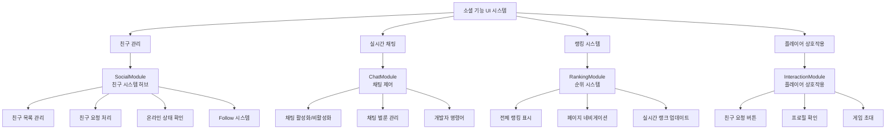
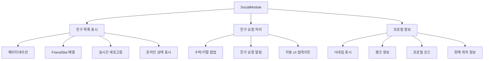
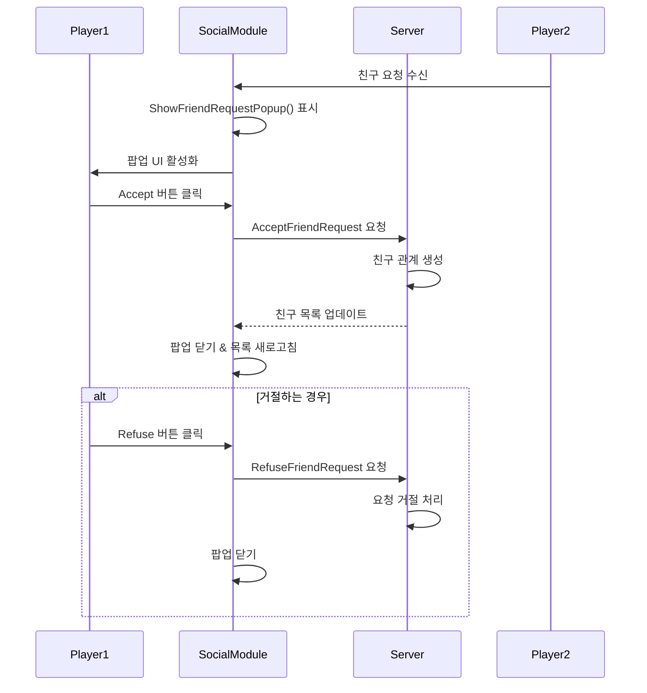
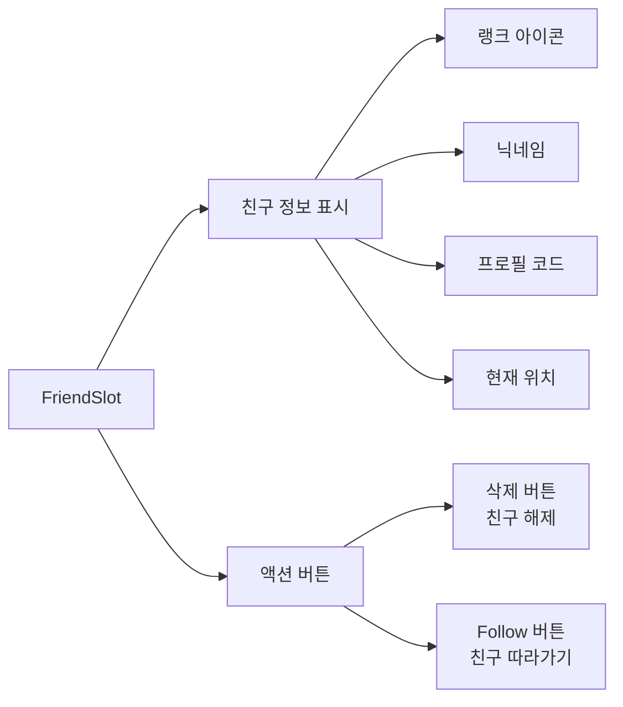
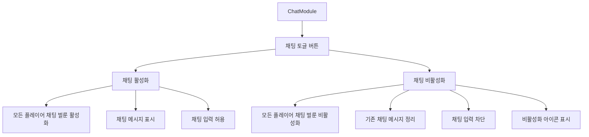
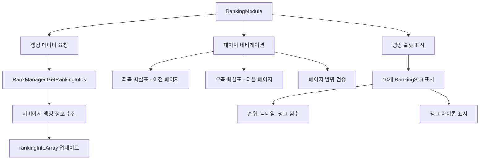
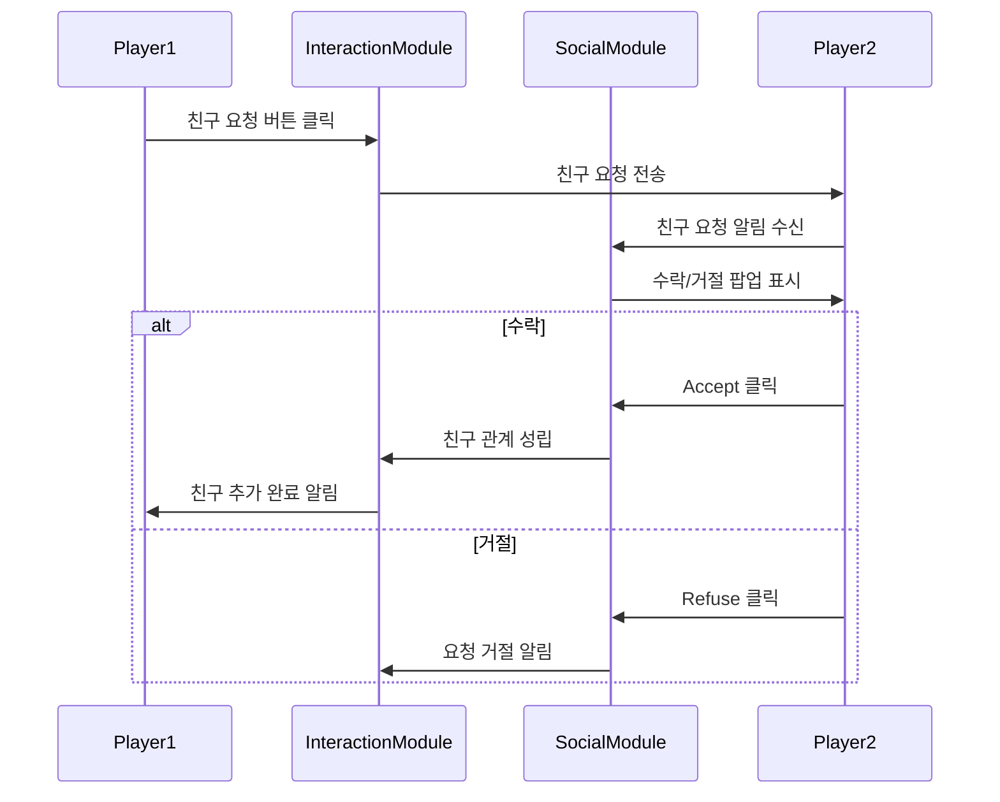
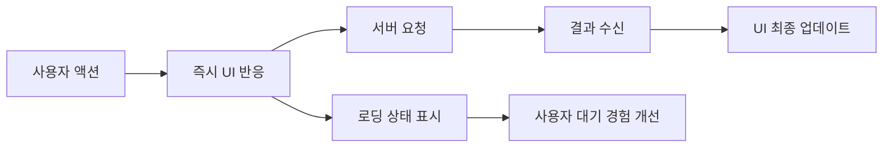

# 소셜 기능 UI

## 📋 개요

메이플 듀얼의 소셜 기능 UI는 플레이어 간의 상호작용과 커뮤니티 참여를 지원하는 핵심 시스템입니다. 친구 관리, 실시간 채팅, 랭킹 시스템, 플레이어 상호작용 등을 통해 단순한 카드 게임을 넘어 살아있는 소셜 플랫폼으로 만듭니다. 직관적인 UI와 안전한 상호작용 시스템을 통해 건전하고 즐거운 커뮤니티 환경을 제공합니다.

**관련 파일**: 
- `RootDesk/MyDesk/Components/UIs/SocialModule.mlua` (친구 시스템)
- `RootDesk/MyDesk/Components/UIs/ChatModule.mlua` (채팅 시스템)
- `RootDesk/MyDesk/Components/UIs/RankingModule.mlua` (랭킹 시스템)
- `RootDesk/MyDesk/Components/UIs/FriendSlot.mlua` (친구 슬롯)
- `RootDesk/MyDesk/Components/UIs/InteractionModule.mlua` (플레이어 상호작용)

## 🏗️ 소셜 UI 시스템 아키텍처

### 통합 소셜 기능 구조



## 👥 1. 친구 시스템 (SocialModule)

### 친구 관리 허브

#### 친구 목록 시스템


#### 친구 요청 처리 시스템


#### 자동 새로고침 시스템
```lua
-- 주기적 친구 목록 업데이트
if self.refreshTimer then
    _TimerService:ClearTimer(self.refreshTimer)
end
self.refreshTimer = _TimerService:SetTimer(function()
    if self.isOpen then
        _Server:Request(character, "GetFriends", {})
    end
end, 10, true)  -- 10초마다 새로고침
```

### 친구 슬롯 상호작용 (FriendSlot)

#### 개별 친구 관리


#### Follow 시스템
```lua
self.followButton.Entity:ConnectEvent(ButtonClickEvent, function()
    -- 상태 검증
    if character.isMatching then
        self.uiManager.PopupModule:Open("NotPossibleWhileMatching", true, nil, nil)
        return
    end
    
    -- 동일 위치 확인
    if isvalid(_UserService:GetUserEntityByUserId(self.userId)) then
        self.uiManager.PopupModule:Open("SameLocation", true, nil, nil)
        return
    end
    
    -- 게임 중일 때 확인 팝업
    if isvalid(character.player) and character.player.duel.isDueling then
        self.uiManager.PopupModule:Open("DoubleCheckFollow", false, function()
            _Server:Request(map, "Follow", {character, self.userId, self.friend})
        end, nil)
    else
        _Server:Request(map, "Follow", {character, self.userId, self.friend})
    end
end)
```

**Follow 기능 특징**:
- **위치 이동**: 친구가 있는 방으로 즉시 이동
- **상태 확인**: 매칭 중이거나 게임 중일 때 제한
- **확인 시스템**: 게임 중단 시 확인 팝업
- **동일 위치**: 이미 같은 곳에 있으면 알림

## 💬 2. 채팅 시스템 (ChatModule)

### 채팅 제어 시스템

#### 통합 채팅 관리


#### 전역 채팅 상태 관리
```lua
method void OnBeginPlay()
    self.chatButton.Entity:ConnectEvent(ButtonClickEvent, function()
        -- 채팅 상태 토글
        self.isChatEnable = not self.isChatEnable
        self.disableIcon.Entity.Enable = not self.isChatEnable
        self.uiManager:UpdateChat()
        
        -- 현재 맵의 모든 사용자에게 적용
        local currentMap = _UserService.LocalPlayer.CurrentMap
        for _, userEntity in ipairs(_UserService:GetUsersByMapComponent(currentMap.MapComponent)) do
            local character = userEntity.Character
            if isvalid(character.player) then
                -- 게임 중인 플레이어
                character.player.chatBalloon.Enable = self.isChatEnable
                if not self.isChatEnable then
                    character.player:ClearChat()
                end
            else
                -- 로비에 있는 플레이어
                userEntity.ChatBalloonComponent.Enable = self.isChatEnable
            end
        end
    end)
end
```

### 채팅 벌룬 시스템

#### 상황별 채팅 표시
- **로비 채팅**: 일반 ChatBalloonComponent 사용
- **게임 중 채팅**: Player의 전용 채팅 벌룬 사용
- **개발자 명령어**: `/` 접두사 명령어 지원
- **자동 정리**: 채팅 비활성화 시 기존 메시지 제거

## 🏆 3. 랭킹 시스템 (RankingModule)

### 계층별 랭킹 표시

#### 페이지네이션 랭킹 시스템


#### 동적 페이지 계산
```lua
-- 페이지 수 계산
local totalPages = math.ceil(#self.rankingInfoArray / #self.rankingSlotArray)

-- 페이지 네비게이션 제어
self.leftArrowButton.Entity:ConnectEvent(ButtonClickEvent, function()
    if self.pageIndex > 1 then
        self:ShowRanking(self.pageIndex - 1)
    end
end)

self.rightArrowButton.Entity:ConnectEvent(ButtonClickEvent, function()
    if self.pageIndex < totalPages then
        self:ShowRanking(self.pageIndex + 1)
    end
end)
```

### 랭킹 슬롯 시스템

#### 계층화된 정보 표시
- **RankingSlot_1~10**: 페이지당 10명의 랭킹 정보
- **순위 정보**: 전체 순위 및 페이지 내 순위
- **플레이어 정보**: 닉네임, 랭크 아이콘, 점수
- **실시간 업데이트**: 모듈 열 때마다 최신 정보 요청

## 🤝 4. 플레이어 상호작용 (InteractionModule)

### 게임 중 소셜 상호작용

#### 친구 요청 시스템
게임 중 상대방과의 즉석 친구 요청 기능을 제공합니다.



### 프로필 정보 표시

#### 실시간 플레이어 정보
- **랭크 정보**: 현재 티어와 랭크 포인트
- **게임 통계**: 승률, 게임 수 등
- **온라인 상태**: 현재 활동 상태
- **친구 관계**: 이미 친구인지 여부

## 🛡️ 5. 안전 및 보안 시스템

### 상태 기반 제한

#### 스마트 상호작용 제한
```lua
-- 공통 안전 검증 패턴
if not character.isLoaded or _Server:IsRequesting() then
    return  -- 캐릭터 미로딩 또는 서버 처리 중
end

if character.isMatching then
    self.uiManager.PopupModule:Open("NotPossibleWhileMatching", true, nil, nil)
    return  -- 매칭 중 제한
end

if isvalid(character.player) and character.player.duel.isDueling then
    -- 게임 중 특별 처리 (확인 팝업 등)
end
```

### 악용 방지 시스템

#### 스팸 방지 및 제한
- **요청 제한**: 서버 처리 중 중복 요청 방지
- **시간 제한**: 친구 요청 간격 제한
- **상태 확인**: 게임 상황에 따른 기능 제한
- **자동 정리**: 비정상 상태 자동 복구

## 🎨 6. UI/UX 최적화

### 반응성 향상

#### 즉시 피드백 시스템


#### 스마트 새로고침
- **조건부 업데이트**: 필요한 경우에만 서버 요청
- **캐싱**: 최근 데이터 로컬 보관
- **증분 업데이트**: 변경된 부분만 업데이트

### 시각적 일관성

#### 통일된 디자인 패턴
- **공통 버튼 스타일**: Accept/Refuse, Delete/Follow 등
- **일관된 애니메이션**: 스케일, 페이드, 슬라이드 효과
- **표준 색상**: 상태별 색상 코드 통일
- **반응형 레이아웃**: 다양한 화면 크기 지원

## 🔄 7. 실시간 업데이트 시스템

### 이벤트 기반 동기화

#### Character 이벤트 연동
```lua
-- 친구 관련 이벤트 자동 처리
character.Entity:ConnectEvent(Unfriend, function(event)
    local userId = event.userId
    -- 해당 친구 슬롯 자동 정리
    for _, slot in ipairs(self.friendSlotArray) do
        if slot.userId == userId then
            slot:Clear()
            break
        end
    end
end)

character.Entity:ConnectEvent(FriendStatusChanged, function(event)
    -- 친구 상태 변화 시 UI 즉시 업데이트
    self:RefreshFriendList()
end)
```

### 네트워크 최적화

#### 효율적 데이터 전송
- **변경 감지**: 실제 변화가 있을 때만 전송
- **배치 요청**: 여러 작업을 하나의 요청으로 통합
- **압축된 응답**: 필요한 정보만 선별 전송

## 💡 코드 참조

핵심 소셜 UI 로직:
- `SocialModule.mlua :: ShowFriendRequestPopup()` — 친구 요청 팝업
- `SocialModule.mlua :: RefreshFriendList()` — 친구 목록 새로고침
- `FriendSlot.mlua :: Follow()` — 친구 따라가기 기능
- `ChatModule.mlua :: UpdateChat()` — 채팅 상태 전환
- `RankingModule.mlua :: ShowRanking()` — 랭킹 페이지 표시

소셜 기능 UI 시스템은 메이플 듀얼을 단순한 카드 게임을 넘어 살아있는 커뮤니티로 만들어주는 핵심 시스템으로, 안전하고 즐거운 플레이어 간 상호작용을 지원합니다.
