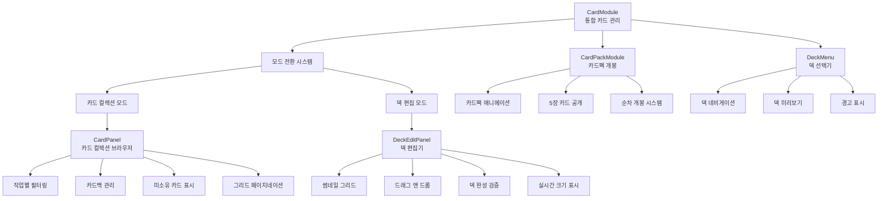
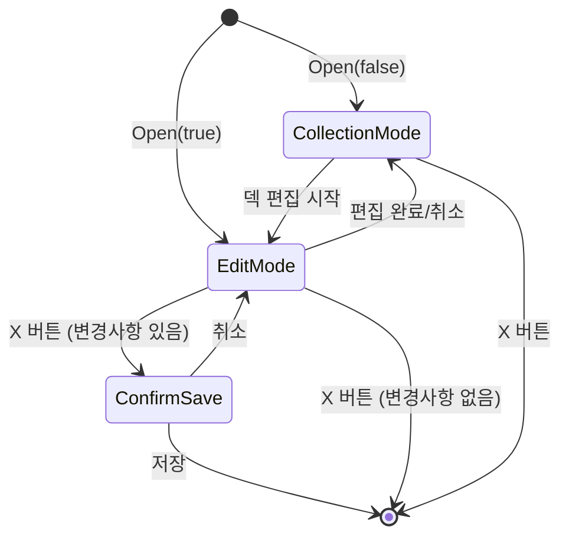
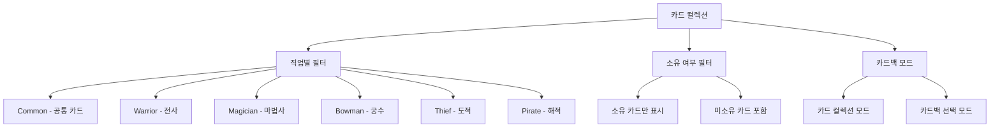
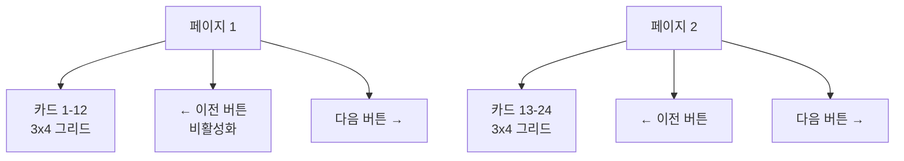
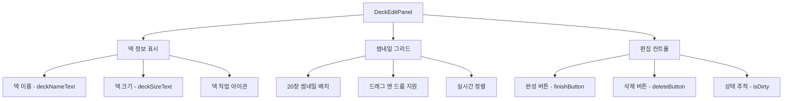
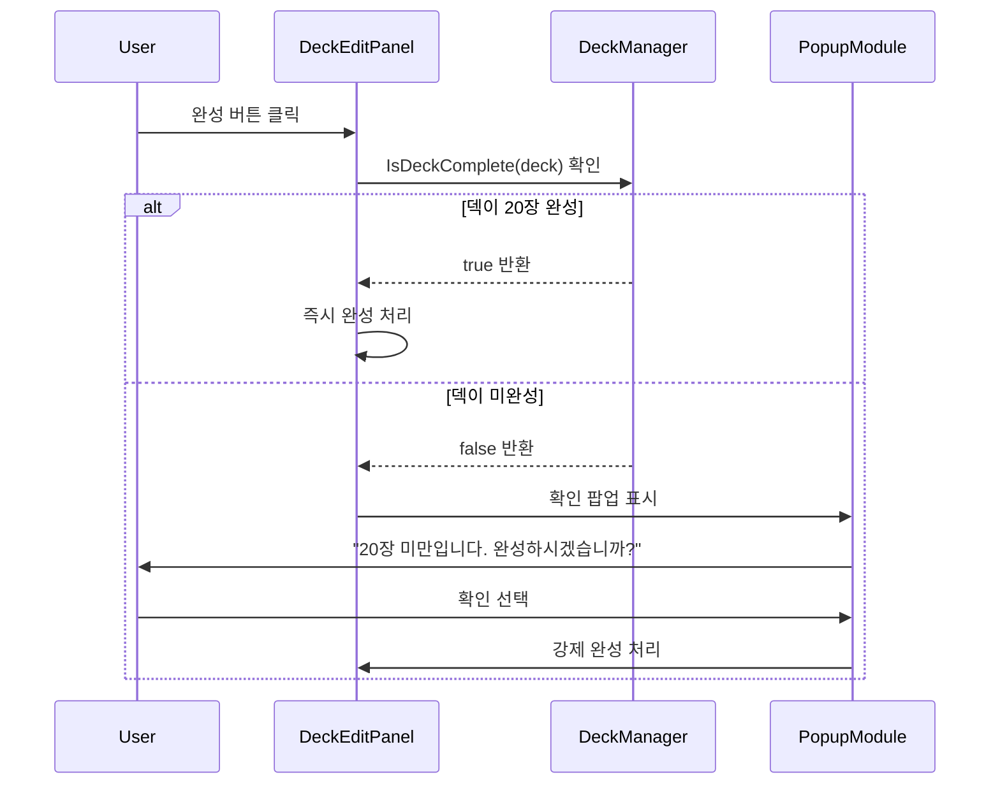
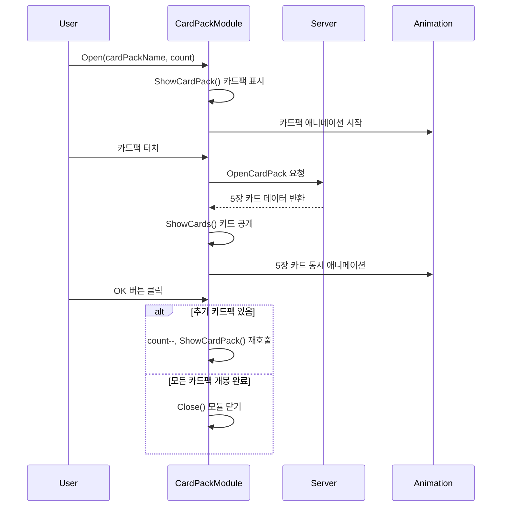
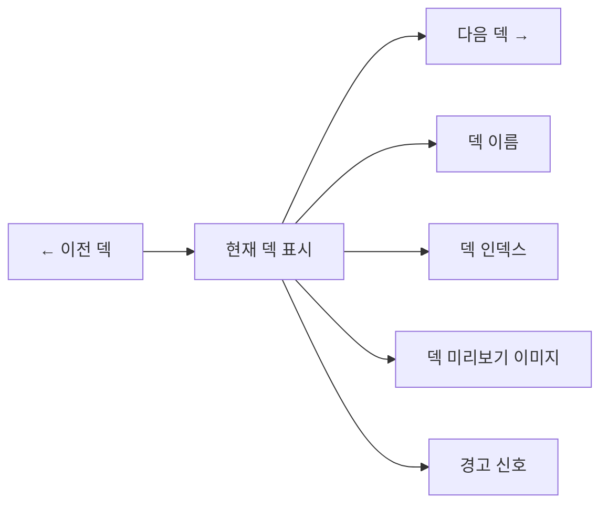
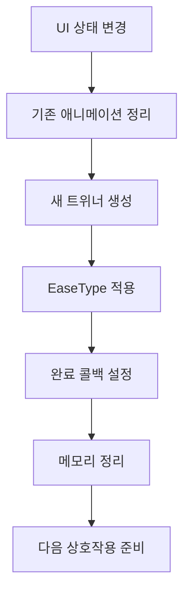

# 카드 관리 UI

## 📋 개요

메이플 듀얼의 카드 관리 UI는 플레이어가 카드 컬렉션을 확인하고, 덱을 편집하며, 카드팩을 개봉하는 등 카드와 관련된 모든 활동을 지원하는 통합 시스템입니다. 직관적인 그리드 레이아웃, 다양한 필터링 옵션, 드래그 앤 드롭 덱 편집, 그리고 화려한 카드팩 개봉 연출을 통해 카드 게임의 핵심인 컬렉션 관리를 즐겁고 효율적인 경험으로 만듭니다.

**관련 파일**: 
- `RootDesk/MyDesk/Components/UIs/CardModule.mlua` (통합 관리자)
- `RootDesk/MyDesk/Components/UIs/CardPanel.mlua` (카드 컬렉션)
- `RootDesk/MyDesk/Components/UIs/DeckEditPanel.mlua` (덱 편집)
- `RootDesk/MyDesk/Components/UIs/CardPackModule.mlua` (카드팩 개봉)
- `RootDesk/MyDesk/Components/UIs/DeckMenu.mlua` (덱 선택)

## 🏗️ 카드 관리 UI 아키텍처

### 통합 시스템 구조



### 모드 기반 UI 전환

#### CardModule 모드 시스템


## 🎴 1. 카드 컬렉션 시스템 (CardPanel)

### 그리드 기반 카드 표시

#### 다차원 필터링 시스템


#### 직업 버튼 시스템
```lua
-- 각 직업별 버튼 이벤트 설정
self.warriorButton.Entity:ConnectEvent(ButtonClickEvent, function()
    self:SetClass("Warrior")
end)

self.magicianButton.Entity:ConnectEvent(ButtonClickEvent, function()
    self:SetClass("Magician")
end)
-- ... 다른 직업들도 동일한 패턴
```

**필터링 특징**:
- **덱 편집 모드**: 현재 덱의 직업과 Common 카드만 표시
- **컬렉션 모드**: 선택된 직업의 모든 카드 표시
- **미소유 카드**: 투명도 조절로 구분 표시
- **실시간 업데이트**: 필터 변경 시 즉시 그리드 재구성

### 페이지네이션 시스템

#### 동적 페이지 계산
```lua
-- 그리드 크기에 따른 페이지 계산
local totalCards = #self.infoArray
local cardsPerPage = self.gridSize.x * self.gridSize.y
local totalPages = math.ceil(totalCards / cardsPerPage)

-- 페이지 네비게이션
if self.pageIndex > 1 then
    self.leftArrowButton.Entity.Enable = true
else
    self.leftArrowButton.Entity.Enable = false
end
```

#### 카드 그리드 배치


### 카드 상태 표시

#### 시각적 상태 구분
- **신규 카드**: NewSign으로 표시
- **경고 표시**: WarningSign (덱에서 제외된 카드 등)
- **소유 수량**: CardCount로 보유 개수 표시
- **선택 상태**: SelectedSign으로 현재 선택 카드 강조

## ⚙️ 2. 덱 편집 시스템 (DeckEditPanel)

### 썸네일 기반 덱 관리

#### 덱 구성 시각화


#### 덱 편집 상호작용
```lua
method void Open()
    -- 기존 썸네일 정리
    for _, thumbnail in ipairs(self.thumbnailArray) do
        self:DestroyAnchor(thumbnail)
        thumbnail.Entity:Destroy()
    end
    table.clear(self.thumbnailArray)
    
    -- 현재 덱 복사 및 표시
    local character = _UserService.LocalPlayer.Character
    self.deck = _Table:DeepCopy(character:GetDeck())
    
    -- 덱 정보 업데이트
    self.deckNameText.Text = self.deck.name
    self:SetDeckSize()
    
    -- 썸네일 생성
    for _, info in ipairs(self.cardManager:ToInfoArray(self.deck.cardTable)) do
        local thumbnail = _SpawnService:SpawnByModelId(_EntryService:GetModelIdByName("Thumbnail"), "Thumbnail", Vector3.zero, self.Entity).Thumbnail
        table.insert(self.thumbnailArray, thumbnail)
        thumbnail:SetInfo(info)
        -- ... 위치 설정 및 이벤트 연결
    end
end
```

### 덱 완성 검증

#### 스마트 완성 시스템


### 변경사항 추적

#### isDirty 플래그 시스템
```lua
property boolean isDirty = false

-- 카드 추가/제거 시 자동 설정
method void AddCardToDeck(info)
    -- 덱에 카드 추가 로직
    self.isDirty = true
    self:SetDeckSize()
end

method void RemoveCardFromDeck(thumbnail)
    -- 덱에서 카드 제거 로직
    self.isDirty = true
    self:SetDeckSize()
end
```

**변경사항 확인**:
- X 버튼 클릭 시 저장 확인 팝업
- 자동 저장 방지로 의도하지 않은 변경 방지
- 실시간 덱 크기 업데이트

## 🎁 3. 카드팩 개봉 시스템 (CardPackModule)

### 단계별 개봉 연출

#### 카드팩 개봉 플로우


#### 5장 카드 배치 시스템
```lua
-- 카드 배치 위치 사전 정의
self.positionArray = {
    Vector2(0, 2.2),      -- 상단 중앙
    Vector2(-2.1, 1.5),   -- 좌상단
    Vector2(-1.05, -0.7), -- 좌하단
    Vector2(1.05, -0.7),  -- 우하단
    Vector2(2.1, 1.5)     -- 우상단
}

-- 카드팩 개봉 시 5장 동시 애니메이션
method void ShowCards(cardInfoArray)
    for i, cardInfo in ipairs(cardInfoArray) do
        local card = self.cardArray[i]
        card:SetBlueprint({
            info = cardInfo,
            enchantmentArray = {},
            independentVariableTable = {}
        })
        
        local targetPosition = self.positionArray[i]
        -- 카드별 애니메이션 적용
        local tweener = _Tween:MoveTo(card.actor.Entity, targetPosition, 0.5, EaseType.CubicEaseOut)
        table.insert(self.cardTweenerArray, tweener)
    end
end
```

### 멀티 카드팩 지원

#### 연속 개봉 시스템
- **count 관리**: 구매한 카드팩 개수만큼 반복
- **상태 보존**: 개봉 중 다른 UI 접근 차단
- **애니메이션 최적화**: 기존 트위너 정리 후 새 애니메이션 시작

## 🎯 4. 덱 선택 시스템 (DeckMenu)

### 덱 네비게이션

#### 좌우 화살표 네비게이션


#### 덱 전환 애니메이션
```lua
character.Entity:ConnectEvent(SetDeckIndex, function()
    -- 덱 이미지 스케일 초기화
    deckImageTransform.Scale.x = 0
    deckImageTransform.Scale.y = 0
    
    -- 덱 정보 업데이트
    local deck = character:GetDeck()
    self.deckNameText.Text = deck.name
    self.deckIndexText.Text = string.format("%d / %d", character.deckIndex, #character.deckArray)
    
    -- 이미지 및 경고 표시 업데이트
    self:UpdateDeckImage()
    self:UpdateWarningSign()
    
    -- 스케일 애니메이션으로 부드러운 전환
    if self.deckImageTweener then
        self.deckImageTweener:Destroy()
    end
    self.deckImageTweener = _Tween:ScaleTo(self.deckImage.Entity, self.deckImageScale, 0.175, EaseType.Linear)
end)
```

### 덱 상태 표시

#### 경고 시스템
- **WarningSign**: 덱이 불완전하거나 문제가 있을 때 표시
- **위치 동기화**: 덱 이미지 위에 정확히 오버레이
- **애니메이션**: 문제 해결 시 자동으로 사라지는 효과

## 🎨 5. UI 상호작용 최적화

### 상태 기반 제어

#### 게임 상태별 접근 제한
모든 카드 관리 UI는 게임 상황에 따라 접근이 제한됩니다:

```lua
-- 공통 검증 패턴
if not character.isLoaded or _Server:IsRequesting() then
    return  -- 캐릭터 미로딩 또는 서버 처리 중
end

if isvalid(character.player) or character.isMatching then
    return  -- 게임 중이거나 매칭 중
end
```

### 애니메이션 시스템

#### 부드러운 전환 효과


**주요 애니메이션 패턴**:
- **ScaleTo**: 패널 열기/닫기
- **MoveTo**: 카드 위치 이동
- **Emphasize**: 강조 효과
- **FadeIn/Out**: 투명도 전환

## 🔄 6. 데이터 동기화

### 실시간 카드 정보 업데이트

#### Character 이벤트 연동
```lua
-- 덱 관련 이벤트 자동 처리
character.Entity:ConnectEvent(CreateDeck, function()
    -- 새 덱 생성 시 편집 모드 전환
end)

character.Entity:ConnectEvent(FinishDeck, function()
    -- 덱 완성 시 컬렉션 모드 복귀
end)

character.Entity:ConnectEvent(SaveDeck, function()
    -- 덱 저장 시 모듈 닫기
end)
```

### 카드 소유권 실시간 반영

#### 동적 컬렉션 업데이트
- 카드팩 개봉 후 즉시 컬렉션 업데이트
- 미소유 카드 상태 실시간 변경
- New 마크 자동 표시/해제

## 🎯 7. 사용자 경험 최적화

### 직관적인 드래그 앤 드롭

#### 시각적 피드백
- 드래그 중 카드 하이라이트
- 유효한 드롭 영역 표시
- 실시간 덱 크기 업데이트
- 애니메이션으로 결과 확인

### 스마트 필터링

#### 컨텍스트 인식
- **덱 편집 모드**: 현재 덱 직업만 표시
- **컬렉션 모드**: 전체 컬렉션 표시
- **미소유 토글**: 필요에 따른 선택적 표시

## 💡 코드 참조

핵심 카드 관리 UI 로직:
- `CardModule.mlua :: SetMode()` — 컬렉션/편집 모드 전환
- `CardPanel.mlua :: SetClass()` — 직업별 필터링
- `DeckEditPanel.mlua :: AddCardToDeck()` — 덱 편집 로직
- `CardPackModule.mlua :: ShowCards()` — 카드팩 개봉 연출
- `DeckMenu.mlua :: UpdateDeckImage()` — 덱 미리보기 업데이트

카드 관리 UI 시스템은 메이플 듀얼의 핵심인 카드 컬렉션과 덱 구성을 직관적이고 효율적으로 관리할 수 있게 해주며, 아름다운 시각적 연출을 통해 카드 게임의 즐거움을 극대화하는 중요한 시스템입니다.
