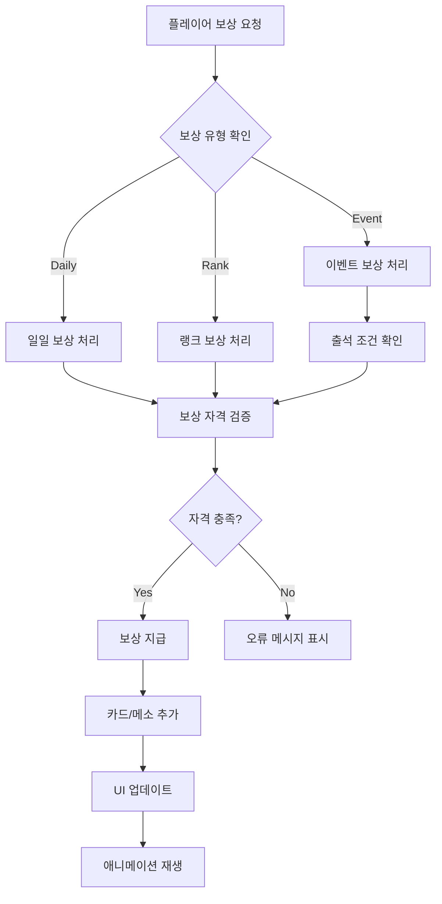

# 보상 시스템

## 개요

메이플 듀얼의 보상 시스템은 플레이어 참여를 유도하고 지속적인 게임 플레이를 장려하는 다층적인 보상 구조입니다. 일일 보상, 랭크 보상, 특별 이벤트 보상을 포함하며, 메소 및 카드팩을 통해 플레이어에게 가치를 제공합니다.

## 핵심 컴포넌트

### RewardModule.mlua
보상 시스템의 메인 UI 컴포넌트로, 일일 보상과 랭크 보상을 관리합니다.

**주요 기능:**
- 일일/랭크 보상 탭 전환
- 보상 슬롯 페이지네이션 (5개씩 표시)
- 랭크별 메소 보상 계산
- 보상 수령 UI 관리

```lua
@Component
script RewardModule extends Component

property boolean isOpen = false
property string mode = ""           -- "Daily" or "Rank"
property integer pageIndex = 0      -- 현재 페이지
property table mesoArray = {}       -- 랭크별 메소 보상 테이블
property table dailyRewardSlotArray = {}  -- 일일 보상 슬롯
property table rankRewardSlotArray = {}   -- 랭크 보상 슬롯
```

### EventModule.mlua
특별 이벤트 및 출석 보상을 관리하는 컴포넌트입니다.

**주요 기능:**
- 특별 이벤트 기간 관리
- 출석 체크 시스템
- 이벤트별 보상 지급
- 실시간 이벤트 타이머

```lua
@Component  
script EventModule extends Component

property boolean isSpecialEventPeriod = false    -- 특별 이벤트 기간 여부
property table attendanceSlotArray = {}          -- 출석 슬롯 배열
property integer specialEventTimer = 0           -- 이벤트 타이머
```

## 보상 유형별 시스템

### 일일 보상 시스템

**일일 보상 슬롯 구성:**
```lua
self.dailyRewardSlotArray = {
    self.dailyMenuEntity:GetChildByName("RewardSlot_1").RewardSlot,
    self.dailyMenuEntity:GetChildByName("RewardSlot_2").RewardSlot,
    self.dailyMenuEntity:GetChildByName("RewardSlot_3").RewardSlot,
    self.dailyMenuEntity:GetChildByName("RewardSlot_4").RewardSlot,
    self.dailyMenuEntity:GetChildByName("RewardSlot_5").RewardSlot,
}
```

**일일 보상 표시:**
```lua
@ExecSpace("ClientOnly")
method void ShowDailyRewards()
    for _, rewardSlot in ipairs(self.dailyRewardSlotArray) do
        rewardSlot:SetDailyReward()
    end
end
```

### 랭크 보상 시스템

**메소 보상 구조:**
```lua
-- 20단계 랭크별 메소 보상 테이블
self.mesoArray = {
    500, 500, 500, 3000,     -- 1-4단계
    500, 500, 500, 5000,     -- 5-8단계  
    1000, 1000, 1000, 10000, -- 9-12단계
    1000, 1000, 1000, 20000, -- 13-16단계
    3000, 3000, 3000, 40000  -- 17-20단계
}
```

**랭크 보상 표시 (페이지네이션):**
```lua
@ExecSpace("ClientOnly")
method void ShowRankRewards(integer pageIndex)
    self.pageIndex = pageIndex
    
    -- 기존 슬롯 초기화
    for _, rewardSlot in ipairs(self.rankRewardSlotArray) do
        rewardSlot.Entity.Enable = false
    end
    
    -- 현재 페이지의 보상 계산
    local start = 1 + (pageIndex - 1) * #self.rankRewardSlotArray
    local finish = math.min(pageIndex * #self.rankRewardSlotArray, #self.mesoArray)
    
    -- 각 슬롯에 보상 정보 설정
    for i = start, finish do
        local rewardSlot = self.rankRewardSlotArray[(i - 1) % #self.rankRewardSlotArray + 1]
        local meso = self.mesoArray[i]
        
        rewardSlot.Entity.Enable = true
        rewardSlot:SetRankReward(500 + i * 100, meso)  -- (필요 랭크포인트, 메소 보상)
    end
    
    -- 페이지 번호 업데이트
    self.pageNumberText.Text = string.format("%d/%d", 
        pageIndex, math.max(1, math.ceil(#self.mesoArray / #self.rankRewardSlotArray)))
end
```

### 특별 이벤트 보상 시스템

**출석 이벤트 관리:**
```lua
-- 출석 슬롯 초기화
self.attendanceSlotArray = self.Entity:GetChildComponentsByTypeName("AttendanceSlot", true)

for i, attendanceSlot in ipairs(self.attendanceSlotArray) do
    attendanceSlot.receiveButton.Entity:ConnectEvent(ButtonClickEvent, function()
        if _Server:IsRequesting() then return end
        
        _SoundService:PlaySound(self.resourceManager:GetResource("UI").buttonClickRawSound, 1)
        _Server:Request(character, "ReceiveCardPacksBySpecialEvent", {i})
    end)
end
```

**이벤트 기간 확인:**
```lua
@ExecSpace("ClientOnly")
method void Open()
    -- 이벤트 기간 동적 확인 (2025년 6월 11일까지)
    self.isSpecialEventPeriod = _DateTime:KtcNow() < DateTime(2025, 6, 11)
    
    if self.isSpecialEventPeriod then
        self:SetMode("SpecialEvent")
    else
        -- 이벤트 종료시 버튼 비활성화
        local resource = self.resourceManager:GetResource("EventModule")
        self.specialEventButton.Entity.SpriteGUIRendererComponent.ImageRUID = resource.disabledMode
        self:SetMode("HotTimeEvent")
    end
end
```

**실시간 이벤트 타이머:**
```lua
-- 이벤트 종료까지 남은 시간 실시간 표시
self.specialEventTimer = _TimerService:SetTimerRepeat(function()
    local timeSpan = _DateTime:KtcNow() < DateTime(2025, 6, 11) and 
                     DateTime(2025, 6, 11) - _DateTime:KtcNow() or TimeSpan.Zero
    self.specialEventEndTimeText.Text = _LocalizationService:GetTextFormat(
        "SpecialEventEndTime", timeSpan.Days, timeSpan:ToFormattedString("hh':'mm':'ss"))
    self.specialEventUpdateTimeText.Text = _LocalizationService:GetTextFormat(
        "SpecialEventUpdateTime", timeSpan:ToFormattedString("hh':'mm':'ss"))
end, 0.01)
```

## 서버 측 보상 지급 (Character.mlua)

### 특별 이벤트 카드팩 지급

```lua
@ExecSpace("ServerOnly") 
method void ReceiveCardPacksBySpecialEvent(integer index)
    if not self.isLoaded then return end
    
    -- 출석 조건 확인
    local canReceive = self.temp.specialEventAttendanceCount ~= nil and 
                      index <= self.temp.specialEventAttendanceCount and
                      not (self.temp.specialEventReceiveTable ~= nil and 
                          self.temp.specialEventReceiveTable[string.format("Day%d", index)])
    
    if not canReceive then
        self:ReceiveCardPacksBySpecialEventInOwner(cardPackName, count, index, false, {}, self.Entity.Name)
        return
    end
    
    -- 출석 일수별 보상 카드팩 결정
    local cardPackName, count
    if index <= 5 then
        cardPackName, count = "ClassicGoldEpic", 1
    elseif index <= 10 then  
        cardPackName, count = "ClassicGoldUnique", 1
    elseif index <= 15 then
        cardPackName, count = "NautilusGoldEpic", 1
    else
        cardPackName, count = "NautilusGoldLegendary", 2
    end
    
    -- 카드팩 뽑기 및 지급
    local infos = {}
    for i = 1, count do
        local cardName = self.cardPackManager:GetRandomCard(cardPackName)
        local skinIndex = self.cardManager:GetRandomSkinIndex(cardName)
        
        local infoArray = {
            cardName = cardName,
            skinIndex = skinIndex,
            index = i,
        }
        table.insert(infos, infoArray)
        
        local cardInfo = {name = cardName, skinIndex = skinIndex}
        table.insert(self.cardArray, cardInfo)
    end
    
    if self:IsUser() then
        self:ReceiveCardPacksBySpecialEventInOwner(cardPackName, count, index, true, infos, self.Entity.Name)
    end
end
```

### 클라이언트 측 보상 수령 처리

```lua
@ExecSpace("Client")
method void ReceiveCardPacksBySpecialEventInOwner(string cardPackName, integer count, integer index, boolean success, table infos)
    if not success then return end
    
    -- 수령 상태 기록
    if self.temp.specialEventReceiveTable == nil then
        self.temp.specialEventReceiveTable = {}
    end
    self.temp.specialEventReceiveTable[string.format("Day%d", index)] = true
    
    -- 카드 획득 처리
    for _, infoArray in ipairs(infos) do
        self:GainCards(infoArray, nil)
    end
    
    -- 카드팩 열기 애니메이션
    self.uiManager.CardPackModule:Open(cardPackName, count)
    self.uiManager.EventModule:ReceiveCardPacksBySpecialEvent(index)
end
```

## UI 상태 관리

### 모드 전환 시스템

```lua
@ExecSpace("ClientOnly")
method void SetMode(string mode)
    if self.mode == mode then return end
    self.mode = mode
    
    local resource = self.resourceManager:GetResource("RewardModule")
    if self.mode == "Daily" then
        -- 일일 보상 모드
        self.dailyButton.Entity.SpriteGUIRendererComponent.ImageRUID = resource.selectedMode
        self.rankButton.Entity.SpriteGUIRendererComponent.ImageRUID = resource.unselectedMode
        self.dailyMenuEntity.Enable = true
        self.rankMenuEntity.Enable = false
        self:ShowDailyRewards()
    elseif self.mode == "Rank" then
        -- 랭크 보상 모드
        self.dailyButton.Entity.SpriteGUIRendererComponent.ImageRUID = resource.unselectedMode
        self.rankButton.Entity.SpriteGUIRendererComponent.ImageRUID = resource.selectedMode
        self.dailyMenuEntity.Enable = false
        self.rankMenuEntity.Enable = true
        self:ShowRankRewards(1)
    end
end
```

### 버튼 활성화 제어

```lua
@ExecSpace("ClientOnly") 
method void SetPanelButtonsEnable(boolean enable)
    local character = _UserService.LocalPlayer.Character
    
    for i, attendanceSlot in ipairs(self.attendanceSlotArray) do
        -- 출석 보상 수령 가능 여부 확인
        local slotEnable = enable and 
                          (not (character.temp.specialEventReceiveTable ~= nil and 
                                character.temp.specialEventReceiveTable[string.format("Day%d", i)])) and
                          (character.temp.specialEventAttendanceCount ~= nil and 
                           i <= character.temp.specialEventAttendanceCount)
        
        attendanceSlot.receiveButton.Enable = slotEnable
        attendanceSlot.receiveButton.Entity.SpriteGUIRendererComponent.RaycastTarget = slotEnable
        
        -- 시각적 피드백
        if slotEnable then
            attendanceSlot.receiveButtonText.FontColor = Color.white
        else
            attendanceSlot.receiveButtonText.FontColor = Color.FromHexCode("#a0a0a0")
        end
    end
end
```

## 메소 시스템 연동

### 캐릭터 메소 속성

```lua
-- Character.mlua
property integer meso = nil                    -- 기본 메소
property integer dailyRankedWinMeso = nil      -- 일일 랭크전 승리 메소
property integer dailyRankedWinMesoKey = nil   -- 승리 메소 키
property integer dailyPlayMeso = nil           -- 일일 플레이 메소
property integer dailyPlayMesoKey = nil        -- 플레이 메소 키
property integer dailyRankedPlayCount = 0     -- 일일 랭크전 플레이 횟수
```

## 보상 아키텍처

### 보상 시스템 플로우



## 이벤트 시스템 특징

### 다중 이벤트 지원
- **Special Event**: 특별 출석 이벤트
- **Hot Time Event**: 핫타임 이벤트
- **Original World Event**: 오리지널 월드 이벤트 (한국어 전용)

### 지역별 이벤트
```lua
-- 한국어 지역 및 이벤트 승자에게만 제공
if _LocalizationService.CurrentLocaleId == "ko" and self.isOriginalWorldEventWinner then
    -- 오리지널 월드 이벤트 활성화
end
```

### 동적 UI 조정
```lua
-- 이벤트 기간에 따른 버튼 위치 동적 조정
if self.isSpecialEventPeriod then
    self:SetMode("SpecialEvent")
else
    self.specialEventButton.Entity.Parent.TransformComponent.Position.y = -1.13
    self.hotTimeEventButton.Entity.Parent.TransformComponent.Position.y = 0.03
    self.originalWorldEventButton.Entity.Parent.TransformComponent.Position.y = -0.555
end
```

이 보상 시스템은 다양한 참여 동기를 제공하며, 단계적인 보상 구조와 특별 이벤트를 통해 플레이어의 지속적인 게임 참여를 유도합니다.
