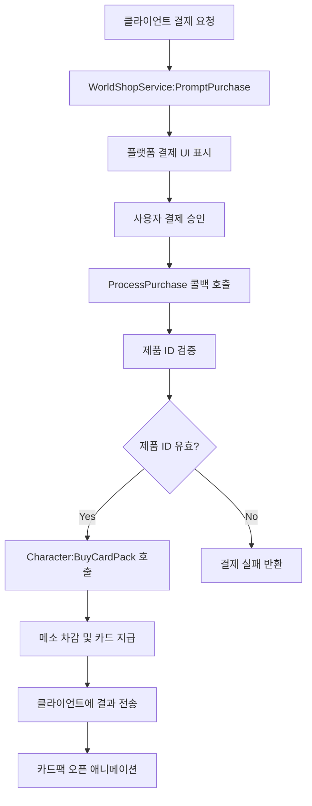

# 상점 시스템

## 개요

메이플 듀얼의 상점 시스템은 MapleStory Worlds 플랫폼의 `_WorldShopService`를 활용한 인앱 결제 시스템입니다. 플레이어는 실제 화폐로 카드팩을 구매할 수 있으며, 단일 카드팩과 다중 카드팩 구매를 지원합니다.

## 핵심 컴포넌트

### Shop.mlua
상점 시스템의 핵심 로직으로, 제품 ID 매핑과 결제 처리를 담당합니다.

**주요 기능:**
- 제품 ID와 카드팩 이름 매핑 관리
- 결제 요청 처리 및 검증
- WorldShopService와의 통합

```lua
@Logic
script Shop extends Logic

property table singleIdTable = {}    -- 단일 카드팩 제품 ID 매핑
property table multipleIdTable = {}  -- 다중 카드팩 제품 ID 매핑
property table singleNameTable = {}  -- ID -> 이름 역매핑
property table multipleNameTable = {} -- ID -> 이름 역매핑
```

### 제품 ID 매핑 시스템

상점 시스템은 내부 카드팩 이름과 플랫폼 제품 ID를 매핑합니다.

**단일 카드팩 제품 ID:**
```lua
self.singleIdTable = {
    ClassicGoldEpic = "9K0PY7KKI",
    ClassicGoldUnique = "NUZ61P7S5", 
    ClassicGoldLegendary = "3KNE8K0MA",
    NautilusGoldEpic = "CMNO76NHT",
    NautilusGoldUnique = "EXTS8C437",
    NautilusGoldLegendary = "FN11GG4PL",
}
```

**다중 카드팩 제품 ID:**
```lua
self.multipleIdTable = {
    ClassicGoldEpic = "K4UYFYLK0",
    ClassicGoldUnique = "IT5E1WLA3",
    ClassicGoldLegendary = "VVCT7DWFZ", 
    NautilusGoldEpic = "1KJJFMUDL",
    NautilusGoldUnique = "PDSFLZA0D",
    NautilusGoldLegendary = "QH8AIQ134",
}
```

### 결제 처리 시스템

#### 서버 측 결제 처리

```lua
@ExecSpace("ServerOnly")
method boolean ProcessPurchase(any purchaseInfo)
    local userEntity = _UserService:GetUserEntityByUserId(purchaseInfo.UserId)
    if not isvalid(userEntity) then
        return false
    end
    
    local character = userEntity.Character
    while not character.isLoaded do
        wait(0.01)  -- 캐릭터 로딩 대기
    end
    
    -- 안전한 결제 처리를 위한 pcall 사용
    local success, result = pcall(function()
        local productId = purchaseInfo.ProductId
        if self.singleNameTable[productId] then
            return character:BuySingleCardPack(self.singleNameTable[productId])
        elseif self.multipleNameTable[productId] then
            return character:BuyMultipleCardPacks(self.multipleNameTable[productId])
        end
    end)
    
    if not success then
        return false  -- 결제 실패
    else
        return result  -- 결제 성공 여부 반환
    end
end
```

#### 클라이언트 측 결제 요청

```lua
@ExecSpace("ClientOnly")
method void PromptSinglePurchase(string cardPackName)
    _WorldShopService:PromptPurchase(self.singleIdTable[cardPackName])
end

@ExecSpace("ClientOnly") 
method void PromptMultiplePurchase(string cardPackName)
    _WorldShopService:PromptPurchase(self.multipleIdTable[cardPackName])
end
```

## 카드팩 구매 시스템 (Character.mlua)

### 단일 카드팩 구매

```lua
@ExecSpace("ServerOnly")
method boolean BuySingleCardPack(string cardPackName)
    if not self.isLoaded then return false end
    if _Server:IsRequesting() then
        if self ~= _Server.sender then return false end
    end
    
    _Server.sender = nil
    
    -- 카드팩 비용 확인
    local currency = self.cardPackManager:GetCurrency(cardPackName)
    local price = self.cardPackManager:GetSinglePrice(cardPackName)
    local success = false
    
    if currency == "Meso" and self.meso >= price then
        self.meso -= price
        success = true
    end
    
    local infoArray = {}
    if success then
        -- 카드 뽑기 로직
        local cardName = self.cardPackManager:GetRandomCard(cardPackName)
        local skinIndex = self.cardManager:GetRandomSkinIndex(cardName)
        
        infoArray = {
            cardName = cardName,
            skinIndex = skinIndex,
            index = 1,
        }
        
        -- 카드 추가
        local cardInfo = {name = cardName, skinIndex = skinIndex}
        table.insert(self.cardArray, cardInfo)
    end
    
    if self:IsUser() then
        self:BuySingleCardPackInOwner(cardPackName, success, infoArray, self.Entity.Name)
    end
    
    return success
end
```

### 다중 카드팩 구매

```lua
@ExecSpace("ServerOnly")
method boolean BuyMultipleCardPacks(string cardPackName)
    if not self.isLoaded then return false end
    
    local currency = self.cardPackManager:GetCurrency(cardPackName)
    local price = self.cardPackManager:GetMultiplePrice(cardPackName)
    local success = false
    
    if currency == "Meso" and self.meso >= price then
        self.meso -= price
        success = true
    end
    
    local infos = {}
    if success then
        -- 11장의 카드 뽑기 (다중 카드팩)
        for i = 1, 11 do
            local cardName = self.cardPackManager:GetRandomCard(cardPackName)
            local skinIndex = self.cardManager:GetRandomSkinIndex(cardName)
            
            local infoArray = {
                cardName = cardName,
                skinIndex = skinIndex, 
                index = i,
            }
            table.insert(infos, infoArray)
            
            local cardInfo = {name = cardName, skinIndex = skinIndex}
            table.insert(self.cardArray, cardInfo)
        end
    end
    
    if self:IsUser() then
        self:BuyMultipleCardPacksInOwner(cardPackName, success, infos, self.Entity.Name)
    end
    
    return success
end
```

### 클라이언트 측 구매 결과 처리

**단일 카드팩 구매 결과:**
```lua
@ExecSpace("Client")
method void BuySingleCardPackInOwner(string cardPackName, boolean success, table infoArray)
    if not success then
        self.uiManager.PopupModule:Open("NotEnoughMeso", true, nil, nil)
        return
    end
    
    self:GainCards(infoArray, nil)
    self.uiManager.CardPackModule:Open(cardPackName, 1)
end
```

**다중 카드팩 구매 결과:**
```lua
@ExecSpace("Client")
method void BuyMultipleCardPacksInOwner(string cardPackName, boolean success, table infos)
    local currency = self.cardPackManager:GetCurrency(cardPackName)
    local price = self.cardPackManager:GetMultiplePrice(cardPackName)
    
    if not success then
        if currency == "Meso" then
            self.uiManager.PopupModule:Open("NotEnoughMeso", true, nil, nil)
        end
        return
    end
    
    for _, infoArray in ipairs(infos) do
        self:GainCards(infoArray, nil)
    end
    self.uiManager.CardPackModule:Open(cardPackName, 11)
end
```

## WorldShopService 통합

### 결제 콜백 등록

```lua
method void OnBeginPlay()
    _WorldShopService:SetProcessPurchaseCallback(self.ProcessPurchase)
    -- 제품 ID 테이블 초기화
end
```

### 결제 처리 플로우



## 카드팩 유형 및 가격

### 지원하는 카드팩 테마
- **ClassicGold**: 클래식 골드 카드팩
- **NautilusGold**: 노틸러스 골드 카드팩

### 카드팩 등급별 제품
- **Epic**: 에픽 등급 보장
- **Unique**: 유니크 등급 보장  
- **Legendary**: 레전더리 등급 보장

### 구매 옵션
- **단일 구매**: 1장 카드팩
- **다중 구매**: 11장 카드팩 (할인 적용)

## 통화 시스템

### 메소 (Meso) 시스템
게임 내 주화폐로 카드팩 구매에 사용됩니다.

**메소 관련 속성:**
```lua
property integer meso = nil  -- 현재 메소 보유량
```

**메소 부족 처리:**
```lua
if currency == "Meso" and self.meso >= price then
    self.meso -= price
    success = true
end
-- 메소 부족시 "NotEnoughMeso" 메시지 표시
```

## 보안 및 검증

### 서버 측 검증
- 사용자 존재 여부 확인
- 캐릭터 로딩 완료 대기
- 제품 ID 유효성 검사
- 통화 보유량 검증

### 오류 처리
- `pcall`을 사용한 안전한 함수 실행
- 결제 실패 시 적절한 오류 메시지 표시
- 중복 결제 방지

### 동기화
- 서버-클라이언트 간 결제 상태 동기화
- 카드 지급 후 UI 업데이트

## 특별 기능

### 이벤트 카드팩
```lua
method void BuySingleCardPackByOpenEvent(string cardPackName)
    -- 이벤트 기간에만 구매 가능한 특별 카드팩
    -- 별도의 조건 검증 로직 포함
end
```

### 카드팩 열기 애니메이션
카드팩 구매 완료 후 `CardPackModule:Open()`을 통해 카드 공개 애니메이션이 재생됩니다.

이 상점 시스템은 플랫폼의 안전한 결제 시스템과 통합되어 플레이어에게 신뢰할 수 있는 구매 경험을 제공하며, 다양한 카드팩 옵션과 할인 혜택을 통해 게임의 수익성을 높입니다.
