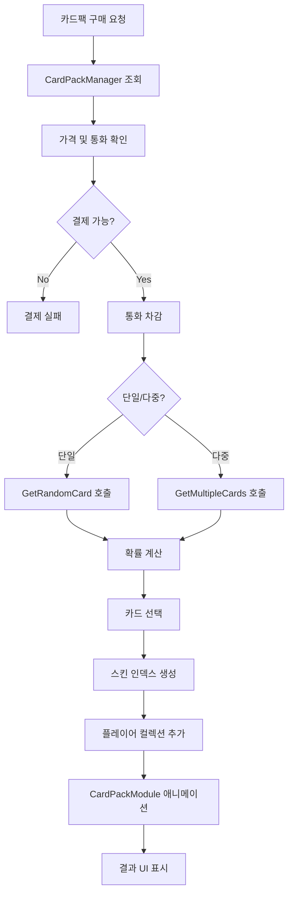

# 카드팩 시스템

## 개요

메이플 듀얼의 카드팩 시스템은 확률 기반 카드 뽑기를 통해 플레이어가 새로운 카드를 획득할 수 있는 핵심 경제 시스템입니다. CSV 데이터 기반의 카드팩 정보 관리, 확률 계산, 카드 뽑기 로직, 시각적 애니메이션을 통합적으로 제공합니다.

## 핵심 컴포넌트

### CardPackManager.mlua
카드팩 시스템의 핵심 매니저로, 카드팩 데이터 관리와 카드 뽑기 로직을 담당합니다.

**주요 역할:**
- 카드팩 데이터 로딩 및 관리
- 테마별 카드팩 분류
- 확률 기반 카드 뽑기 알고리즘
- 가격 및 통화 정보 제공

```lua
@Component
script CardPackManager extends Component

property any dataSet = nil                    -- CardPack.csv 데이터
property table cardPackNameTable = {}         -- 테마별 카드팩 이름 테이블
property CardManager cardManager = nil        -- 카드 매니저 참조

method void OnBeginPlay()
    self.dataSet = _DataService:GetTable("CardPack")
    
    -- 테마별 카드팩 분류
    for _, name in ipairs(self.dataSet:GetColumn("name")) do
        local theme = self:GetTheme(name)
        self.cardPackNameTable[theme] = self.cardPackNameTable[theme] or {}
        table.insert(self.cardPackNameTable[theme], name)
    end
end
```

## 카드팩 데이터 구조

### CardPack.csv 스키마
카드팩의 모든 정보는 CSV 파일로 관리됩니다.

**주요 컬럼:**
- `name`: 카드팩 고유 이름
- `theme`: 카드팩 테마 (Classic, Nautilus 등)
- `currency`: 구매 통화 (Meso, Cash 등)
- `singlePrice`: 단일 구매 가격
- `multiplePrice`: 다중 구매 가격 (할인 적용)
- `rarity`: 보장 등급 (Common, Rare, Epic, Unique, Legendary)
- `cards`: 포함된 카드 목록

```lua
-- 데이터 접근 예시
method string GetTheme(string cardPackName)
    return self.dataSet:FindRow("name", cardPackName):GetDataByName("theme")
end

method string GetCurrency(string cardPackName)
    return self.dataSet:FindRow("name", cardPackName):GetDataByName("currency")
end

method integer GetSinglePrice(string cardPackName)
    return self.dataSet:FindRow("name", cardPackName):GetDataByName("singlePrice")
end
```

## 확률 기반 카드 뽑기 시스템

### 기본 뽑기 로직

```lua
method string GetRandomCard(string cardPackName)
    local cardPackRow = self.dataSet:FindRow("name", cardPackName)
    local cardNameArray = cardPackRow:GetDataByName("cards")
    
    -- 확률 가중치 계산
    local totalWeight = 0
    local weightArray = {}
    
    for _, cardName in ipairs(cardNameArray) do
        local rarity = self.cardManager:GetRarity(cardName)
        local weight = self:GetRarityWeight(rarity)
        
        table.insert(weightArray, weight)
        totalWeight += weight
    end
    
    -- 확률적 선택
    local randomValue = _UserService:GetRandom() * totalWeight
    local currentWeight = 0
    
    for i, weight in ipairs(weightArray) do
        currentWeight += weight
        if randomValue <= currentWeight then
            return cardNameArray[i]
        end
    end
    
    -- 폴백: 마지막 카드 반환
    return cardNameArray[#cardNameArray]
end
```

### 등급별 확률 가중치

```lua
method number GetRarityWeight(string rarity)
    local weights = {
        Common = 45,      -- 45%
        Rare = 30,        -- 30%
        Epic = 15,        -- 15%
        Unique = 8,       -- 8%
        Legendary = 2,    -- 2%
    }
    return weights[rarity] or 1
end
```

## 카드팩 유형 시스템

### 테마별 카드팩

**Classic 테마:**
- ClassicGoldCommon
- ClassicGoldRare
- ClassicGoldEpic
- ClassicGoldUnique
- ClassicGoldLegendary

**Nautilus 테마:**
- NautilusGoldCommon
- NautilusGoldRare
- NautilusGoldEpic
- NautilusGoldUnique
- NautilusGoldLegendary

### 등급 보장 시스템

```lua
method string GetGuaranteedCard(string cardPackName)
    local cardPackRow = self.dataSet:FindRow("name", cardPackName)
    local guaranteedRarity = cardPackRow:GetDataByName("rarity")
    local cardNameArray = cardPackRow:GetDataByName("cards")
    
    -- 보장 등급 이상의 카드만 필터링
    local eligibleCards = {}
    for _, cardName in ipairs(cardNameArray) do
        local cardRarity = self.cardManager:GetRarity(cardName)
        if self:IsRarityEqualOrHigher(cardRarity, guaranteedRarity) then
            table.insert(eligibleCards, cardName)
        end
    end
    
    -- 보장 등급 카드 중 랜덤 선택
    return eligibleCards[_UserService:GetRandom(1, #eligibleCards)]
end

method boolean IsRarityEqualOrHigher(string cardRarity, string baseRarity)
    local rarityOrder = {Common = 1, Rare = 2, Epic = 3, Unique = 4, Legendary = 5}
    return rarityOrder[cardRarity] >= rarityOrder[baseRarity]
end
```

## 다중 카드팩 시스템

### 11장 팩 로직

```lua
method table GetMultipleCards(string cardPackName, integer count)
    count = count or 11  -- 기본 11장
    local cardArray = {}
    
    for i = 1, count do
        local cardName
        if i == count then
            -- 마지막 카드는 보장 등급 적용
            cardName = self:GetGuaranteedCard(cardPackName)
        else
            -- 일반 확률 뽑기
            cardName = self:GetRandomCard(cardPackName)
        end
        
        table.insert(cardArray, {
            name = cardName,
            skinIndex = self.cardManager:GetRandomSkinIndex(cardName),
            index = i
        })
    end
    
    return cardArray
end
```

### 할인 가격 시스템

```lua
method integer GetMultiplePrice(string cardPackName)
    local singlePrice = self:GetSinglePrice(cardPackName)
    local multiplePrice = self.dataSet:FindRow("name", cardPackName):GetDataByName("multiplePrice")
    
    -- 다중 구매시 할인 적용
    return multiplePrice or (singlePrice * 10)  -- 11장 가격으로 10장 분량
end

method number GetDiscountRate(string cardPackName)
    local singlePrice = self:GetSinglePrice(cardPackName)
    local multiplePrice = self:GetMultiplePrice(cardPackName)
    
    return (singlePrice * 11 - multiplePrice) / (singlePrice * 11) * 100
end
```

## 카드팩 시각화 시스템

### CardPackModule.mlua 연동

카드팩을 뜯는 시각적 경험을 제공하는 UI 시스템과 통합됩니다.

```lua
-- 카드팩 오픈 애니메이션 호출
self.uiManager.CardPackModule:Open(cardPackName, count)
```

### 오브젝트 풀링

```lua
-- 카드팩 애니메이션을 위한 오브젝트 풀링
property table cardPackPool = {}
property table cardPool = {}

method Entity GetPooledCardPack(string cardPackName)
    if self.cardPackPool[cardPackName] and #self.cardPackPool[cardPackName] > 0 then
        return table.remove(self.cardPackPool[cardPackName])
    else
        return _SpawnService:SpawnByModelId(self:GetCardPackModelId(cardPackName))
    end
end

method void ReturnToPool(Entity cardPackEntity, string cardPackName)
    self.cardPackPool[cardPackName] = self.cardPackPool[cardPackName] or {}
    table.insert(self.cardPackPool[cardPackName], cardPackEntity)
    cardPackEntity.Enable = false
end
```

## 경제성 밸런싱

### 가격 대비 가치 계산

```lua
method number GetExpectedValue(string cardPackName)
    local cardPackRow = self.dataSet:FindRow("name", cardPackName)
    local cardNameArray = cardPackRow:GetDataByName("cards")
    local totalValue = 0
    local totalWeight = 0
    
    for _, cardName in ipairs(cardNameArray) do
        local rarity = self.cardManager:GetRarity(cardName)
        local weight = self:GetRarityWeight(rarity)
        local value = self:GetCardValue(cardName)
        
        totalValue += value * weight
        totalWeight += weight
    end
    
    return totalValue / totalWeight
end

method integer GetCardValue(string cardName)
    local rarity = self.cardManager:GetRarity(cardName)
    local values = {
        Common = 10,
        Rare = 25,
        Epic = 100,
        Unique = 500,
        Legendary = 2500,
    }
    return values[rarity] or 10
end
```

## 특별 카드팩 시스템

### 이벤트 카드팩

```lua
method table GetEventCards(string eventName, integer day)
    local eventPacks = {
        SpecialEvent = {
            [1] = "ClassicGoldEpic",
            [2] = "ClassicGoldEpic", 
            [3] = "ClassicGoldEpic",
            [4] = "ClassicGoldEpic",
            [5] = "ClassicGoldEpic",
            [6] = "ClassicGoldUnique",
            [7] = "ClassicGoldUnique",
            [8] = "ClassicGoldUnique",
            [9] = "ClassicGoldUnique",
            [10] = "ClassicGoldUnique",
            [11] = "NautilusGoldEpic",
            [12] = "NautilusGoldEpic",
            [13] = "NautilusGoldEpic",
            [14] = "NautilusGoldEpic",
            [15] = "NautilusGoldEpic",
            [16] = "NautilusGoldLegendary",
            [17] = "NautilusGoldLegendary",
            [18] = "NautilusGoldLegendary",
            [19] = "NautilusGoldLegendary",
            [20] = "NautilusGoldLegendary",
        }
    }
    
    return eventPacks[eventName] and eventPacks[eventName][day] or "ClassicGoldCommon"
end
```

### 제한된 시간 카드팩

```lua
method boolean IsCardPackAvailable(string cardPackName)
    local cardPackRow = self.dataSet:FindRow("name", cardPackName)
    local startDate = cardPackRow:GetDataByName("startDate")
    local endDate = cardPackRow:GetDataByName("endDate")
    
    if startDate and endDate then
        local now = _DateTime:KtcNow()
        return now >= DateTime(startDate) and now <= DateTime(endDate)
    end
    
    return true  -- 기간 제한 없음
end
```

## 통계 및 분석

### 뽑기 결과 추적

```lua
property table packOpenStats = {}

method void RecordPackOpen(string cardPackName, table results)
    self.packOpenStats[cardPackName] = self.packOpenStats[cardPackName] or {}
    
    for _, cardResult in ipairs(results) do
        local rarity = self.cardManager:GetRarity(cardResult.name)
        self.packOpenStats[cardPackName][rarity] = 
            (self.packOpenStats[cardPackName][rarity] or 0) + 1
    end
end

method table GetPackStats(string cardPackName)
    return self.packOpenStats[cardPackName] or {}
end
```

### 확률 검증

```lua
method boolean ValidateProbabilities(string cardPackName, integer testCount)
    testCount = testCount or 10000
    local results = {}
    
    -- 대량 시뮬레이션
    for i = 1, testCount do
        local cardName = self:GetRandomCard(cardPackName)
        local rarity = self.cardManager:GetRarity(cardName)
        results[rarity] = (results[rarity] or 0) + 1
    end
    
    -- 실제 확률과 비교
    for rarity, count in pairs(results) do
        local actualRate = count / testCount * 100
        local expectedRate = self:GetRarityWeight(rarity) / 100 * 100
        local deviation = math.abs(actualRate - expectedRate)
        
        if deviation > 5 then  -- 5% 이상 편차
            return false
        end
    end
    
    return true
end
```

## 카드팩 시스템 플로우



## 성능 최적화

### 확률 테이블 캐싱

```lua
property table probabilityCache = {}

method table GetCachedProbabilities(string cardPackName)
    if not self.probabilityCache[cardPackName] then
        self.probabilityCache[cardPackName] = self:CalculateProbabilities(cardPackName)
    end
    return self.probabilityCache[cardPackName]
end
```

### 메모리 관리

```lua
method void CleanupUnusedPacks()
    local currentTime = _DateTime:KtcNow()
    
    for cardPackName, pool in pairs(self.cardPackPool) do
        -- 사용하지 않는 풀 정리
        if #pool > 10 then  -- 최대 10개까지만 보관
            for i = 11, #pool do
                if isvalid(pool[i]) then
                    pool[i]:Destroy()
                end
            end
            
            -- 배열 크기 조정
            for i = #pool, 11, -1 do
                pool[i] = nil
            end
        end
    end
end
```

이 카드팩 시스템은 확률의 공정성을 보장하면서도 흥미진진한 뽑기 경험을 제공하며, 게임의 핵심 수익 모델과 플레이어 참여도를 동시에 지원하는 중요한 경제 시스템입니다.
