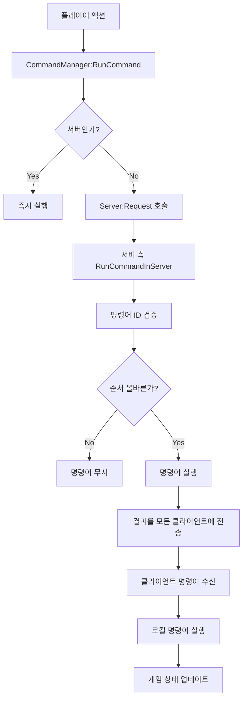

# 명령어 처리 시스템

## 개요

메이플 듀얼의 명령어 처리 시스템은 `CommandManager.mlua`를 중심으로 클라이언트-서버 간 게임 상태 동기화를 담당하는 핵심 네트워크 시스템입니다. 턴 기반 게임의 특성상 모든 플레이어가 동일한 게임 상태를 유지해야 하며, 이를 위해 명령어 큐, 랜덤 시드 공유, 패키지 시스템을 통한 동기화를 구현합니다.

## 핵심 컴포넌트

### CommandManager.mlua
게임의 모든 액션을 명령어로 변환하여 순차적으로 처리하는 매니저입니다.

**주요 역할:**
- 클라이언트 명령어 서버 전송
- 서버 측 명령어 검증 및 실행
- 모든 플레이어 간 동일한 랜덤 시드 공유
- 게임 상태 일관성 보장

```lua
@Component
script CommandManager extends Component

property Duel duel = nil                    -- 듀얼 참조
property table commandQueue = {}            -- 명령어 큐
property integer randomSeed = 0             -- 랜덤 시드
property table packageQueue = {}            -- 패키지 큐
property boolean isProcessing = false       -- 처리 중 상태
```

## 명령어 실행 시스템

### 클라이언트 명령어 전송

```lua
method void RunCommand(string commandName, table publicArgs, table privateArgs)
    if self:IsServer() then
        -- 서버에서 직접 실행
        self:RunCommandInServer(commandName, publicArgs, privateArgs, self.duel.commandId)
    else
        -- 클라이언트에서 서버로 전송
        _Server:Request(self, "RunCommandInServer", {commandName, publicArgs, privateArgs, self.duel.commandId})
    end
end
```

### 서버 측 명령어 처리

```lua
@ExecSpace("ServerOnly")
method void RunCommandInServer(string commandName, table publicArgs, table privateArgs, integer commandId)
    -- 명령어 ID 검증 (순서 보장)
    if commandId ~= self.duel.commandId then
        return -- 잘못된 명령어 순서
    end
    
    -- 명령어 실행
    local args = publicArgs or {}
    if privateArgs then
        for key, value in pairs(privateArgs) do
            args[key] = value
        end
    end
    
    -- 실제 명령어 메서드 호출
    local success, result = pcall(_Util.Call, _Util, self, commandName, args)
    if not success then
        log("Command execution failed: " .. commandName .. " - " .. tostring(result))
        return
    end
    
    -- 명령어 ID 증가
    self.duel.commandId += 1
    
    -- 모든 클라이언트에 실행 결과 전송
    self:RunCommandInClients(commandName, publicArgs, commandId, self.duel.Entity.Name)
end
```

### 클라이언트 명령어 수신

```lua
@ExecSpace("Client")
method void RunCommandInClients(string commandName, table publicArgs, integer commandId)
    -- 명령어 ID 동기화 확인
    if commandId ~= self.duel.commandId then
        -- 순서 불일치 시 큐에 저장
        table.insert(self.commandQueue, {
            commandName = commandName,
            publicArgs = publicArgs,
            commandId = commandId
        })
        return
    end
    
    -- 명령어 실행
    _Util:Call(self, commandName, publicArgs or {})
    self.duel.commandId += 1
    
    -- 큐에 대기 중인 명령어 처리
    self:ProcessQueuedCommands()
end
```

## 랜덤 시드 동기화

### 시드 생성 및 공유

```lua
@ExecSpace("ServerOnly")
method void InitializeRandomSeed()
    -- 서버에서 시드 생성
    self.randomSeed = _UserService:GetRandom(1, 2147483647)
    
    -- 모든 클라이언트에 시드 전송
    self:SyncRandomSeed(self.randomSeed, self.duel.Entity.Name)
end

@ExecSpace("Client")
method void SyncRandomSeed(integer seed)
    self.randomSeed = seed
    _UserService:SetRandomSeed(seed)
end
```

### 동기화된 랜덤 사용

```lua
method integer GetSyncedRandom(integer min, integer max)
    -- 모든 클라이언트가 동일한 랜덤 값 생성
    local value = _UserService:GetRandom(min or 1, max or 100)
    
    -- 시드 상태 업데이트 (다음 랜덤을 위해)
    self.randomSeed = _UserService:GetCurrentSeed()
    
    return value
end

method string GetRandomCardFromDeck()
    local deckSize = #self.duel.player1.deck.cardArray
    if deckSize == 0 then return nil end
    
    -- 동기화된 랜덤으로 카드 선택
    local randomIndex = self:GetSyncedRandom(1, deckSize)
    return self.duel.player1.deck.cardArray[randomIndex]
end
```

## 패키지 시스템

### 명령어 패키지화

게임의 복잡한 액션은 여러 개의 명령어로 분할되어 패키지로 관리됩니다.

```lua
method void StartPackage(string packageName)
    self.currentPackage = {
        name = packageName,
        commands = {},
        startTime = _TimerService:GetCurrentTime()
    }
end

method void AddCommandToPackage(string commandName, table args)
    if not self.currentPackage then
        -- 패키지가 없으면 즉시 실행
        self:RunCommand(commandName, args)
        return
    end
    
    table.insert(self.currentPackage.commands, {
        commandName = commandName,
        args = args
    })
end

method void ExecutePackage()
    if not self.currentPackage then return end
    
    -- 패키지 내 모든 명령어 순차 실행
    for _, command in ipairs(self.currentPackage.commands) do
        self:RunCommand(command.commandName, command.args)
    end
    
    self.currentPackage = nil
end
```

### 복합 액션 처리 예시

```lua
method void PlayCard(Card card, Unit target)
    self:StartPackage("PlayCard")
    
    -- 1. 카드 사용 검증
    self:AddCommandToPackage("ValidateCardPlay", {
        cardId = card.id,
        targetId = target and target.id or nil
    })
    
    -- 2. 마나 소모
    self:AddCommandToPackage("ConsumeMana", {
        amount = card:GetCost()
    })
    
    -- 3. 카드 효과 실행
    self:AddCommandToPackage("ExecuteCardEffect", {
        cardId = card.id,
        targetId = target and target.id or nil
    })
    
    -- 4. 카드를 덤프로 이동
    self:AddCommandToPackage("MoveCardToDump", {
        cardId = card.id
    })
    
    -- 패키지 실행
    self:ExecutePackage()
end
```

## 입력 상태 관리

### 플레이어 입력 제어

```lua
property boolean acceptInput = false
property table inputQueue = {}

method void EnableInput()
    self.acceptInput = true
    self:ProcessQueuedInput()
end

method void DisableInput()
    self.acceptInput = false
end

method boolean ProcessPlayerInput(string inputType, table inputData)
    if not self.acceptInput then
        -- 입력 불가 시 큐에 저장
        table.insert(self.inputQueue, {
            type = inputType,
            data = inputData,
            timestamp = _TimerService:GetCurrentTime()
        })
        return false
    end
    
    -- 입력 유형별 처리
    if inputType == "CardPlay" then
        return self:HandleCardPlay(inputData)
    elseif inputType == "EndTurn" then
        return self:HandleEndTurn(inputData)
    elseif inputType == "TargetSelect" then
        return self:HandleTargetSelect(inputData)
    end
    
    return false
end
```

### 턴 기반 입력 동기화

```lua
method void StartPlayerTurn(Player player)
    -- 해당 플레이어만 입력 활성화
    if _UserService.LocalPlayer.Character.player == player then
        self:EnableInput()
        self.duel.taskManager:SetActivePlayer(player)
    else
        self:DisableInput()
    end
    
    -- 턴 타이머 시작
    self:StartTurnTimer(30) -- 30초 제한
end

method void EndPlayerTurn(Player player)
    -- 모든 플레이어 입력 비활성화
    self:DisableInput()
    
    -- 입력 큐 정리
    self.inputQueue = {}
    
    -- 턴 타이머 중지
    self:StopTurnTimer()
end
```

## 네트워크 최적화

### 명령어 압축

```lua
method table CompressCommand(string commandName, table args)
    -- 자주 사용되는 명령어는 짧은 ID로 압축
    local commandMap = {
        PlayCard = "PC",
        EndTurn = "ET", 
        AttackTarget = "AT",
        UseSkill = "US"
    }
    
    local compressedCommand = {
        id = commandMap[commandName] or commandName,
        args = self:CompressArgs(args)
    }
    
    return compressedCommand
end

method table CompressArgs(table args)
    -- 객체 참조를 ID로 변환
    local compressed = {}
    for key, value in pairs(args) do
        if type(value) == "userdata" and value.id then
            compressed[key] = value.id
        else
            compressed[key] = value
        end
    end
    return compressed
end
```

### 배치 처리

```lua
property table commandBatch = {}
property integer batchTimer = 0

method void BatchCommand(string commandName, table args)
    table.insert(self.commandBatch, {
        commandName = commandName,
        args = args
    })
    
    -- 배치 타이머 설정 (16ms = 60FPS)
    if self.batchTimer == 0 then
        self.batchTimer = _TimerService:SetTimer(function()
            self:FlushCommandBatch()
        end, 0.016)
    end
end

method void FlushCommandBatch()
    if #self.commandBatch == 0 then return end
    
    -- 배치로 서버에 전송
    _Server:Request(self, "RunCommandBatch", {self.commandBatch})
    
    self.commandBatch = {}
    self.batchTimer = 0
end
```

## 오류 처리 및 복구

### 명령어 검증

```lua
method boolean ValidateCommand(string commandName, table args, Player sender)
    -- 기본 검증
    if not commandName or not args then return false end
    
    -- 플레이어 검증
    if not isvalid(sender) or sender.duel ~= self.duel then return false end
    
    -- 턴 검증
    if not self.duel.taskManager:IsPlayerTurn(sender) then return false end
    
    -- 명령어별 세부 검증
    if commandName == "PlayCard" then
        return self:ValidateCardPlay(args, sender)
    elseif commandName == "EndTurn" then
        return self:ValidateEndTurn(args, sender)
    end
    
    return true
end
```

### 동기화 실패 복구

```lua
method void HandleSyncFailure(string reason)
    log("Sync failure: " .. reason)
    
    -- 게임 상태 재동기화 요청
    if not self:IsServer() then
        _Server:Request(self, "RequestFullSync", {})
    else
        -- 서버에서 전체 상태 재전송
        self:BroadcastFullGameState()
    end
end

@ExecSpace("ServerOnly")
method void RequestFullSync()
    -- 현재 게임 상태를 모든 클라이언트에 전송
    local gameState = {
        commandId = self.duel.commandId,
        randomSeed = self.randomSeed,
        player1State = self.duel.player1:GetState(),
        player2State = self.duel.player2:GetState(),
        fieldState = self.duel.field:GetState()
    }
    
    self:SyncFullGameState(gameState, self.duel.Entity.Name)
end
```

## 성능 모니터링

### 명령어 처리 통계

```lua
property table commandStats = {}

method void RecordCommandPerformance(string commandName, number executionTime)
    if not self.commandStats[commandName] then
        self.commandStats[commandName] = {
            count = 0,
            totalTime = 0,
            maxTime = 0,
            minTime = math.huge
        }
    end
    
    local stats = self.commandStats[commandName]
    stats.count += 1
    stats.totalTime += executionTime
    stats.maxTime = math.max(stats.maxTime, executionTime)
    stats.minTime = math.min(stats.minTime, executionTime)
end

method table GetPerformanceReport()
    local report = {}
    for commandName, stats in pairs(self.commandStats) do
        report[commandName] = {
            averageTime = stats.totalTime / stats.count,
            maxTime = stats.maxTime,
            minTime = stats.minTime,
            executionCount = stats.count
        }
    end
    return report
end
```

## 명령어 시스템 플로우



이 명령어 처리 시스템은 메이플 듀얼의 턴 기반 멀티플레이어 게임플레이에서 모든 플레이어가 동일한 게임 경험을 할 수 있도록 보장하는 핵심 인프라입니다.
