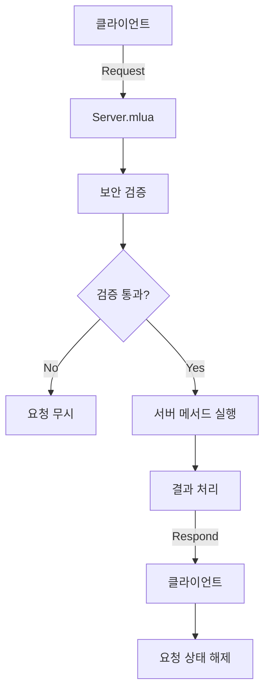

# 서버 통신 시스템

## 개요

메이플 듀얼의 서버 통신 시스템은 `Server.mlua`를 통해 클라이언트-서버 간 안전하고 신뢰성 있는 통신을 제공합니다. 요청 상태 관리, 메서드 보안 검증, 예외 처리, 중복 요청 방지 등의 기능을 통해 멀티플레이어 게임의 네트워크 안정성을 보장합니다.

## 핵심 컴포넌트

### Server.mlua
클라이언트와 서버 간 모든 통신을 중앙에서 관리하는 로직 컴포넌트입니다.

**주요 역할:**
- 클라이언트 요청 수신 및 라우팅
- 서버 측 메서드 안전한 실행
- 요청-응답 상태 관리
- 보안 검증 및 예외 처리

```lua
@Logic
script Server extends Logic

property boolean isRequesting = false  -- 클라이언트 요청 상태
property Character sender = nil        -- 현재 요청 송신자
```

## 통신 아키텍처

### 요청-응답 패턴

메이플 듀얼은 명확한 요청-응답 패턴을 통해 클라이언트와 서버 간 통신을 구조화합니다.



### 클라이언트 요청 시스템

```lua
@ExecSpace("ClientOnly")
method void Request(Component component, string methodName, table args)
    -- 중복 요청 방지
    self.isRequesting = true
    
    -- 서버로 요청 전송
    self:Send(_UserService.LocalPlayer.Character, component, methodName, args)
end
```

**특징:**
- 요청 시작 시 `isRequesting` 플래그 설정
- 중복 요청 자동 방지
- 모든 요청은 현재 플레이어 캐릭터를 통해 전송

### 서버 요청 처리

```lua
@ExecSpace("Server")
method void Send(Character sender, Component component, string methodName, table args)
    -- 송신자 유효성 검증
    if not isvalid(sender) or sender.Entity.Name ~= senderUserId then
        return
    end
    
    -- 메서드 접근 권한 검증
    if not _Util:HasAttribute(component, methodName, "Server") then
        return
    end
    
    -- 송신자 설정 (처리 중 참조용)
    self.sender = sender
    
    -- 안전한 메서드 실행
    local success, result = pcall(_Util.Call, _Util, component, methodName, args)
    if not success then
        log(result)  -- 오류 로깅
    end
    
    -- 송신자 해제
    self.sender = nil
    
    -- 응답 전송
    if isvalid(sender) then
        self:Respond(senderUserId)
    end
end
```

### 클라이언트 응답 처리

```lua
@ExecSpace("Client")
method void Respond()
    -- 요청 상태 해제
    self.isRequesting = false
end
```

## 보안 및 검증 시스템

### 송신자 인증

```lua
-- 송신자 유효성 검증
if not isvalid(sender) or sender.Entity.Name ~= senderUserId then
    return  -- 잘못된 송신자는 요청 무시
end
```

**검증 요소:**
- 송신자 객체 유효성 (`isvalid(sender)`)
- 송신자 ID와 실제 사용자 ID 일치성 (`sender.Entity.Name == senderUserId`)

### 메서드 접근 권한 검증

```lua
-- 서버 속성 확인
if not _Util:HasAttribute(component, methodName, "Server") then
    return  -- 서버 접근 권한이 없는 메서드는 실행 거부
end
```

**서버 속성 예시:**
```lua
-- Character.mlua 예시
method void BuySingleCardPackServerAttribute()
    -- 서버 접근 권한 정의
end

@ExecSpace("ServerOnly")
method boolean BuySingleCardPack(string cardPackName)
    -- 실제 서버 로직
end
```

## 요청 상태 관리

### 중복 요청 방지

```lua
method boolean IsRequesting()
    if self:IsServer() then
        -- 서버에서는 처리 중인 요청이 있는지 확인
        return isvalid(self.sender)
    else
        -- 클라이언트에서는 요청 상태 플래그 확인
        return self.isRequesting
    end
end
```

### 요청 상태 확인 사용 예시

```lua
-- UI에서 중복 클릭 방지
self.buyButton.Entity:ConnectEvent(ButtonClickEvent, function()
    if _Server:IsRequesting() then
        return  -- 이미 요청 처리 중이면 무시
    end
    
    _Server:Request(character, "BuySingleCardPack", {"ClassicGoldEpic"})
end)
```

## 예외 처리 시스템

### 안전한 메서드 실행

```lua
-- pcall을 통한 예외 처리
local success, result = pcall(_Util.Call, _Util, component, methodName, args)
if not success then
    log(result)  -- 오류 상세 내용 로깅
    -- 오류 발생 시에도 응답은 전송하여 클라이언트 대기 상태 해제
end
```

**장점:**
- 서버 메서드에서 오류가 발생해도 시스템 전체가 중단되지 않음
- 클라이언트가 무한 대기 상태에 빠지지 않음
- 디버깅을 위한 상세 오류 정보 보존

### 오류 복구 메커니즘

```lua
-- 송신자가 유효하지 않을 경우에도 안전하게 처리
if isvalid(sender) then
    self:Respond(senderUserId)
else
    log("Sender invalid during response")
    -- 클라이언트 연결이 끊어진 경우 처리
end
```

## 성능 최적화

### 요청 큐잉 시스템

```lua
-- 확장 가능한 요청 큐잉 (예시)
property table requestQueue = {}
property boolean processingQueue = false

method void QueueRequest(Component component, string methodName, table args)
    if not self.processingQueue then
        -- 즉시 처리
        self:Request(component, methodName, args)
    else
        -- 큐에 추가
        table.insert(self.requestQueue, {
            component = component,
            methodName = methodName,
            args = args,
            timestamp = _TimerService:GetCurrentTime()
        })
    end
end
```

### 타임아웃 처리

```lua
property table requestTimers = {}

method void RequestWithTimeout(Component component, string methodName, table args, number timeout)
    timeout = timeout or 30  -- 기본 30초 타임아웃
    
    -- 요청 전송
    self:Request(component, methodName, args)
    
    -- 타임아웃 타이머 설정
    local timerId = _TimerService:SetTimer(function()
        if self.isRequesting then
            log("Request timeout: " .. methodName)
            self.isRequesting = false
            -- 타임아웃 시 UI 피드백
            _UIManager:ShowTimeoutMessage()
        end
    end, timeout)
    
    self.requestTimers[methodName] = timerId
end
```

## 통신 패턴 별 사용 사례

### 게임 액션 요청

```lua
-- 카드 플레이 요청
_Server:Request(character.player, "PlayCard", {
    cardName = "PowerStrike",
    targetId = enemy.id
})
```

### 상점 구매 요청

```lua
-- 카드팩 구매 요청
_Server:Request(character, "BuySingleCardPack", {
    cardPackName = "ClassicGoldEpic"
})
```

### 친구 시스템 요청

```lua
-- 친구 신청 요청
_Server:Request(character, "SendFriendRequest", {
    targetCharacter = otherCharacter
})
```

### 매칭 시스템 요청

```lua
-- 랭크 매치 시작 요청
_Server:Request(character, "StartRankedMatch", {})
```

## 디버깅 및 모니터링

### 요청 로깅 시스템

```lua
property table requestLog = {}

method void LogRequest(string methodName, table args, Character sender)
    table.insert(self.requestLog, {
        methodName = methodName,
        args = args,
        sender = sender.Entity.Name,
        timestamp = _DateTime:KtcNow():ToString(),
        success = nil  -- 나중에 업데이트
    })
    
    -- 로그 크기 제한 (최근 1000개만 보관)
    if #self.requestLog > 1000 then
        table.remove(self.requestLog, 1)
    end
end
```

### 성능 메트릭

```lua
property table performanceMetrics = {
    totalRequests = 0,
    successfulRequests = 0,
    failedRequests = 0,
    averageResponseTime = 0
}

method void UpdateMetrics(boolean success, number responseTime)
    self.performanceMetrics.totalRequests += 1
    
    if success then
        self.performanceMetrics.successfulRequests += 1
    else
        self.performanceMetrics.failedRequests += 1
    end
    
    -- 이동 평균 계산
    local total = self.performanceMetrics.totalRequests
    self.performanceMetrics.averageResponseTime = 
        (self.performanceMetrics.averageResponseTime * (total - 1) + responseTime) / total
end
```

## 네트워크 안정성

### 연결 상태 확인

```lua
method boolean IsConnectionStable()
    -- 최근 요청들의 성공률 확인
    local recentRequests = self:GetRecentRequests(10)
    local successCount = 0
    
    for _, request in ipairs(recentRequests) do
        if request.success then
            successCount += 1
        end
    end
    
    return successCount / #recentRequests >= 0.8  -- 80% 이상 성공률
end
```

### 자동 재시도 메커니즘

```lua
method void RequestWithRetry(Component component, string methodName, table args, integer maxRetries)
    maxRetries = maxRetries or 3
    local retryCount = 0
    
    local function attemptRequest()
        self:Request(component, methodName, args)
        
        -- 응답 확인을 위한 타이머
        _TimerService:SetTimer(function()
            if self.isRequesting and retryCount < maxRetries then
                retryCount += 1
                log("Retrying request: " .. methodName .. " (attempt " .. retryCount .. ")")
                attemptRequest()
            elseif self.isRequesting then
                log("Max retries exceeded for: " .. methodName)
                self.isRequesting = false
            end
        end, 5)  -- 5초 후 재시도
    end
    
    attemptRequest()
end
```

## 보안 강화

### 요청 빈도 제한

```lua
property table rateLimiter = {}

method boolean CheckRateLimit(string userId, string methodName)
    local key = userId .. ":" .. methodName
    local now = _TimerService:GetCurrentTime()
    
    if not self.rateLimiter[key] then
        self.rateLimiter[key] = {
            count = 0,
            windowStart = now
        }
    end
    
    local limiter = self.rateLimiter[key]
    
    -- 시간 윈도우 리셋 (1분)
    if now - limiter.windowStart > 60 then
        limiter.count = 0
        limiter.windowStart = now
    end
    
    -- 요청 한도 확인 (분당 최대 60회)
    if limiter.count >= 60 then
        return false
    end
    
    limiter.count += 1
    return true
end
```

## 서버 통신 시스템의 특장점

### 신뢰성
- 모든 요청에 대한 명확한 응답 보장
- 중복 요청 자동 방지
- 예외 상황에서도 안정적인 동작

### 보안성
- 송신자 인증 및 권한 검증
- 서버 속성 기반 메서드 접근 제어
- 요청 빈도 제한 및 남용 방지

### 확장성
- 컴포넌트 기반 요청 라우팅
- 다양한 요청 패턴 지원
- 모듈화된 구조로 쉬운 확장

### 디버깅 지원
- 상세한 오류 로깅
- 요청 추적 및 모니터링
- 성능 메트릭 수집

이 서버 통신 시스템은 메이플 듀얼의 모든 클라이언트-서버 상호작용을 안전하고 효율적으로 처리하여, 안정적인 멀티플레이어 게임 경험을 제공하는 핵심 인프라입니다.
