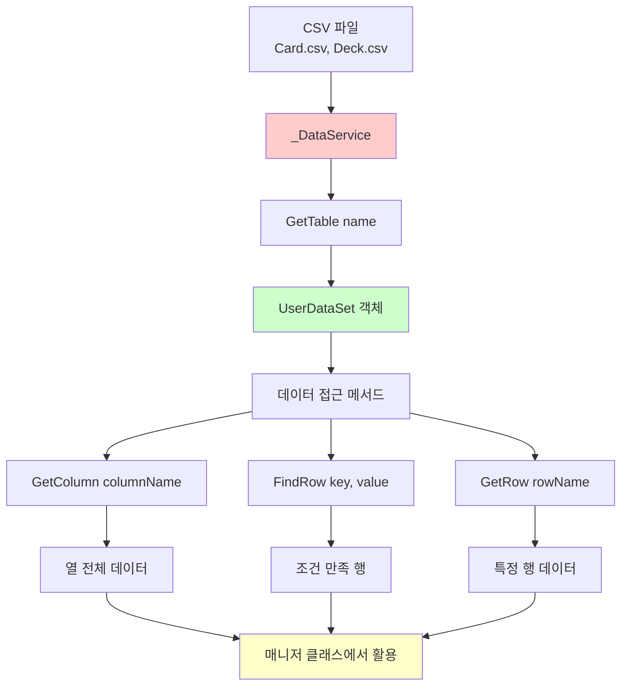
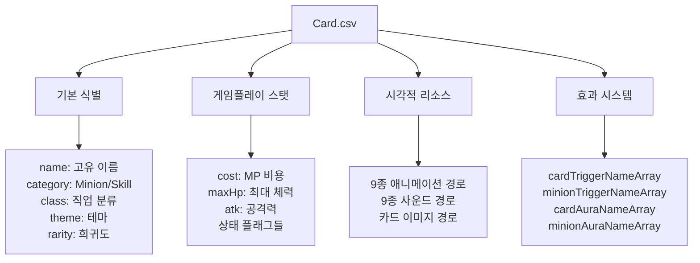
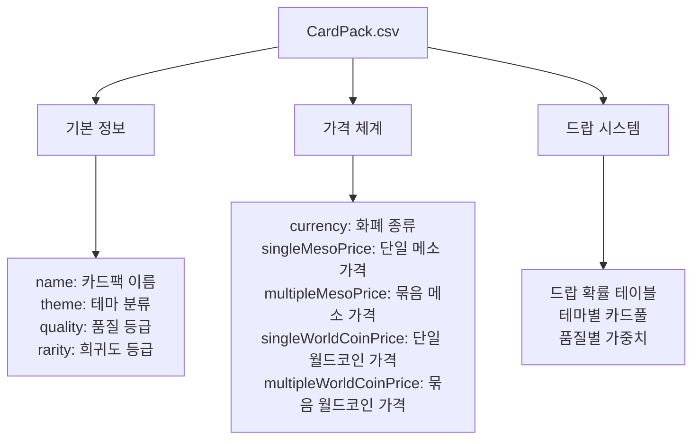
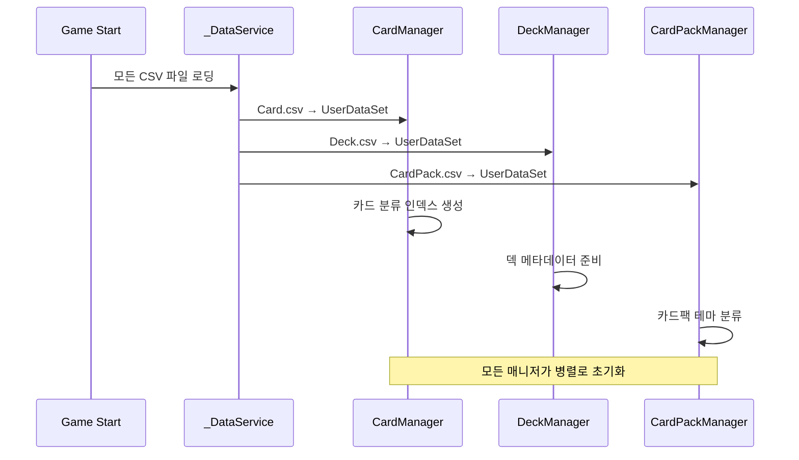

# 데이터셋 구조

## 📋 개요

메이플 듀얼은 CSV 기반의 강력한 데이터 관리 시스템을 통해 카드, 덱, 카드팩 등의 복잡한 게임 데이터를 효율적으로 관리합니다. _DataService는 MapleStory Worlds 플랫폼의 내장 서비스로, CSV 파일을 UserDataSet 객체로 로딩하여 구조화된 데이터 접근을 제공합니다. 이 시스템을 통해 266개의 카드와 50여 개의 속성, 다양한 카드팩과 덱 구성 데이터를 체계적으로 관리하며, 런타임에서 빠른 데이터 조회와 필터링을 가능하게 합니다.

**관련 파일**:
- `Environment/NativeScripts/Service/DataService.d.mlua` - _DataService API 정의
- `RootDesk/MyDesk/DataSets/Card.csv` - 카드 마스터 데이터
- `RootDesk/MyDesk/DataSets/Deck.csv` - 덱 관련 데이터
- `RootDesk/MyDesk/DataSets/CardPack.csv` - 카드팩 시스템 데이터

## 🏗️ 데이터서비스 아키텍처

### _DataService 기본 구조



## 🔌 1. _DataService API 활용

### 핵심 메서드 구조

#### 기본 데이터 접근
```lua
-- DataService API 정의 (Environment/NativeScripts/Service/DataService.d.mlua)
@Service
script DataService extends Service
    -- CSV 파일을 UserDataSet으로 로딩
    method UserDataSet GetTable(string name) end
    
    -- 특정 셀 데이터 조회 (행/열 인덱스)
    method string GetCell(string name, int32 row, int32 col) end
    
    -- 특정 셀 데이터 조회 (행 인덱스/열 이름)
    method string GetCell(string name, int32 row, string columnName) end
    
    -- 데이터셋의 총 행 수
    method int32 GetRowCount(string name) end
end
```

#### 실제 사용 예시
```lua
-- CardManager에서 Card.csv 로딩
method void OnBeginPlay()
    self.dataSet = _DataService:GetTable("Card")  -- Card.csv 로딩
    self.allCardNameArray = self.dataSet:GetColumn("name")  -- name 열 전체 조회
    
    -- 카드별 분류 테이블 생성
    for _, name in ipairs(self.allCardNameArray) do
        local class = self.dataSet:GetRow(name).class
        local category = self.dataSet:GetRow(name).category
        
        -- 직업별 분류
        self.classCardNameTable[class] = self.classCardNameTable[class] or {}
        table.insert(self.classCardNameTable[class], name)
    end
end
```

### UserDataSet 객체 활용

#### 데이터셋 탐색 메서드
```lua
-- 전체 열 데이터 조회
local allCardNames = dataSet:GetColumn("name")
local allClasses = dataSet:GetColumn("class")
local allRarities = dataSet:GetColumn("rarity")

-- 특정 행 데이터 조회
local cardRow = dataSet:GetRow("AirStrike")
local cost = cardRow.cost
local category = cardRow.category

-- 조건부 행 검색
local foundRow = dataSet:FindRow("name", "AirStrike")
local theme = foundRow:GetItem("theme")
```

## 🎴 2. Card.csv 데이터 구조

### 카드 마스터 데이터 스키마

#### 기본 식별 정보


#### 카드 데이터 접근 패턴
```lua
-- CardManager의 카드 정보 접근자들
method string GetClass(string name)
    return self.dataSet:GetRow(name).class
end

method integer GetCost(string name)  
    return tonumber(self.dataSet:GetRow(name).cost)
end

method boolean IsToken(string name)
    return self.dataSet:GetRow(name).isToken == "TRUE"
end

method table GetTags(string name)
    local tagString = self.dataSet:GetRow(name).tagArray
    return tagString and _String:Split(tagString, ",") or {}
end

-- 리소스 경로 조회
method string GetSkillAnimation_1(string name)
    return self.dataSet:GetRow(name).skillAnimation_1
end

method string GetSkillSound_1(string name)
    return self.dataSet:GetRow(name).skillSound_1  
end
```

### 카드 분류 시스템

#### 다차원 인덱싱
```lua
-- CardManager에서 분류별 인덱스 테이블 생성
method void OnBeginPlay()
    -- 직업별 분류
    self.classCardNameTable = {}
    self.classMinionNameTable = {}
    self.classSkillNameTable = {}
    
    -- 비용별 분류
    self.costCardNameTable = {}
    self.costMinionNameTable = {}
    self.costSkillNameTable = {}
    
    -- 태그별 분류
    self.tagCardNameTable = {}
    self.tagMinionNameTable = {}
    self.tagSkillNameTable = {}
    
    -- 모든 카드를 순회하며 분류
    for _, name in ipairs(self.allCardNameArray) do
        local class = self:GetClass(name)
        local category = self:GetCategory(name) 
        local cost = self:GetCost(name)
        local tags = self:GetTags(name)
        
        -- 각 분류에 카드 추가
        self:InsertToClassification(name, class, category, cost, tags)
    end
end
```

## 📚 3. Deck.csv 데이터 구조

### 덱 관련 메타데이터

#### 덱 구성 지원 데이터
```lua
-- DeckManager에서 Deck.csv 활용
method void OnBeginPlay()
    self.dataSet = _DataService:GetTable("Deck")
    
    -- 덱 이름용 형용사 배열 로딩
    self.adjectiveArray = self.dataSet:GetColumn("adjective")
end

-- 덱 이름 자동 생성
method table GetNewDeck(string class, string localeId)
    local adjective = self.adjectiveArray[_UtilLogic:RandomIntegerRange(1, #self.adjectiveArray)]
    local name = _LocalizationService:GetText(adjective) .. " " .. _LocalizationService:GetText(class)
    
    return {
        class = class,
        name = name,
        cardTable = {}
    }
end
```

**Deck.csv 구조**:
- **adjective**: 덱 이름 생성용 형용사들 ("Mighty", "Swift", "Wise" 등)
- **다국어 지원**: 로컬라이제이션 키로 각 언어별 번역 제공
- **랜덤 생성**: 플레이어가 새 덱 생성 시 자동으로 흥미로운 이름 부여

## 💰 4. CardPack.csv 데이터 구조

### 카드팩 경제 시스템 데이터

#### 카드팩 마스터 데이터
```lua
-- CardPackManager에서 CardPack.csv 활용
method void OnBeginPlay()
    self.dataSet = _DataService:GetTable("CardPack")
    
    -- 테마별 카드팩 분류
    for _, name in ipairs(self.dataSet:GetColumn("name")) do
        local theme = self:GetTheme(name)
        self.cardPackNameTable[theme] = self.cardPackNameTable[theme] or {}
        table.insert(self.cardPackNameTable[theme], name)
    end
end

-- 카드팩 속성 접근자들
method string GetTheme(string name)
    return self.dataSet:FindRow("name", name):GetItem("theme")
end

method string GetCurrency(string name)
    return self.dataSet:FindRow("name", name):GetItem("currency")  -- "Meso" or "WorldCoin"
end

method integer GetSingleMesoPrice(string name)
    return tonumber(self.dataSet:FindRow("name", name):GetItem("singleMesoPrice"))
end

method integer GetMultipleMesoPrice(string name)
    return tonumber(self.dataSet:FindRow("name", name):GetItem("multipleMesoPrice"))  
end
```

#### 카드팩 경제 모델


### 카드팩 드랍 시스템

#### 확률 기반 카드 생성
```lua
@ExecSpace("ServerOnly")
method table GetInfos(string cardPackName)
    local cardPackTheme = self:GetTheme(cardPackName)
    local cardPackQuality = self:GetQuality(cardPackName)
    local cardPackRarity = self:GetRarity(cardPackName)
    
    local infoArray = {}
    for i = 1, 5 do  -- 각 팩마다 5장 카드
        local name, variant, quality
        local value = _UtilLogic:RandomDouble()
        
        -- CSV 데이터 기반 확률 계산
        -- cardPackQuality와 cardPackRarity를 활용한 드랍률 조정
        -- cardPackTheme에 해당하는 카드풀에서 선택
        
        table.insert(infoArray, {
            name = name,
            variant = variant, 
            quality = quality
        })
    end
    
    return infoArray
end
```

## 🔍 5. 고급 데이터 활용 패턴

### 동적 쿼리 시스템

#### 복합 조건 검색
```lua
-- 특정 조건을 만족하는 카드들 검색
method table FindCardsByCondition(function predicate)
    local results = {}
    
    for _, name in ipairs(self.allCardNameArray) do
        local cardRow = self.dataSet:GetRow(name)
        if predicate(cardRow) then
            table.insert(results, name)
        end
    end
    
    return results
end

-- 사용 예시: 3코스트 이하 전사 미니언 검색
local affordableWarriorMinions = cardManager:FindCardsByCondition(function(row)
    return row.class == "Warrior" 
       and row.category == "Minion" 
       and tonumber(row.cost) <= 3
end)
```

#### 집계 및 통계
```lua
-- 직업별 카드 통계
method table GetClassStatistics()
    local stats = {}
    
    for _, name in ipairs(self.allCardNameArray) do
        local class = self:GetClass(name)
        local category = self:GetCategory(name)
        
        stats[class] = stats[class] or {minions = 0, skills = 0, total = 0}
        stats[class][category == "Minion" and "minions" or "skills"] += 1
        stats[class].total += 1
    end
    
    return stats
end
```

### 메모리 효율성 최적화

#### 지연 로딩 패턴
```lua
-- 모든 카드 정보를 미리 메모리에 로딩하지 않고 필요시에만 조회
method table GetCardInfo(string name)
    if not self.cardInfoCache[name] then
        local row = self.dataSet:GetRow(name)
        self.cardInfoCache[name] = {
            cost = tonumber(row.cost),
            maxHp = tonumber(row.maxHp),
            atk = tonumber(row.atk),
            -- 기타 자주 사용되는 속성들만 캐싱
        }
    end
    
    return self.cardInfoCache[name]
end
```

#### 인덱싱을 통한 빠른 검색
```lua
-- 게임 시작 시 자주 사용되는 검색 패턴들을 미리 인덱싱
method void BuildSearchIndices()
    -- 비용별 인덱스
    for cost = 0, 14 do
        self.costIndex[cost] = self:FindCardsByCondition(function(row)
            return tonumber(row.cost) == cost
        end)
    end
    
    -- 희귀도별 인덱스
    for _, rarity in ipairs({"Normal", "Rare", "Epic", "Unique", "Legendary"}) do
        self.rarityIndex[rarity] = self:FindCardsByCondition(function(row)
            return row.rarity == rarity
        end)
    end
end
```

## 🚀 6. 성능 최적화 전략

### 데이터 로딩 최적화

#### 단계별 초기화


### 메모리 사용량 최적화

#### 선택적 데이터 로딩
```lua
-- 클라이언트에서는 시각적 리소스만, 서버에서는 게임 로직 데이터만 로딩
method void OnBeginPlay()
    self.dataSet = _DataService:GetTable("Card")
    
    if self:IsServer() then
        -- 서버는 게임 로직 데이터만
        self:LoadGameplayData()
    else
        -- 클라이언트는 시각적 리소스도
        self:LoadGameplayData()
        self:LoadVisualResources()
    end
end
```

## 💡 코드 참조

데이터셋 시스템 핵심 로직:
- `CardManager.mlua :: OnBeginPlay()` — Card.csv 로딩 및 분류 인덱스 생성
- `DeckManager.mlua :: OnBeginPlay()` — Deck.csv 메타데이터 로딩
- `CardPackManager.mlua :: GetInfos()` — 서버 측 카드팩 드랍 로직
- `DataService.d.mlua :: GetTable()` — CSV 파일을 UserDataSet으로 변환
- `EntryManager.mlua :: OnBeginPlay()` — 게임 객체 기본값 매핑

데이터셋 구조는 메이플 듀얼의 복잡한 카드 게임 데이터를 효율적으로 관리하는 핵심 시스템으로, CSV 기반의 구조화된 데이터와 _DataService의 강력한 쿼리 기능을 통해 개발 생산성과 런타임 성능을 동시에 달성합니다.
