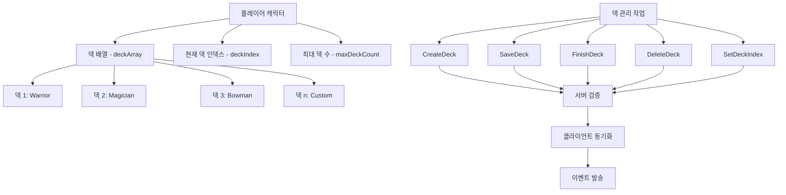
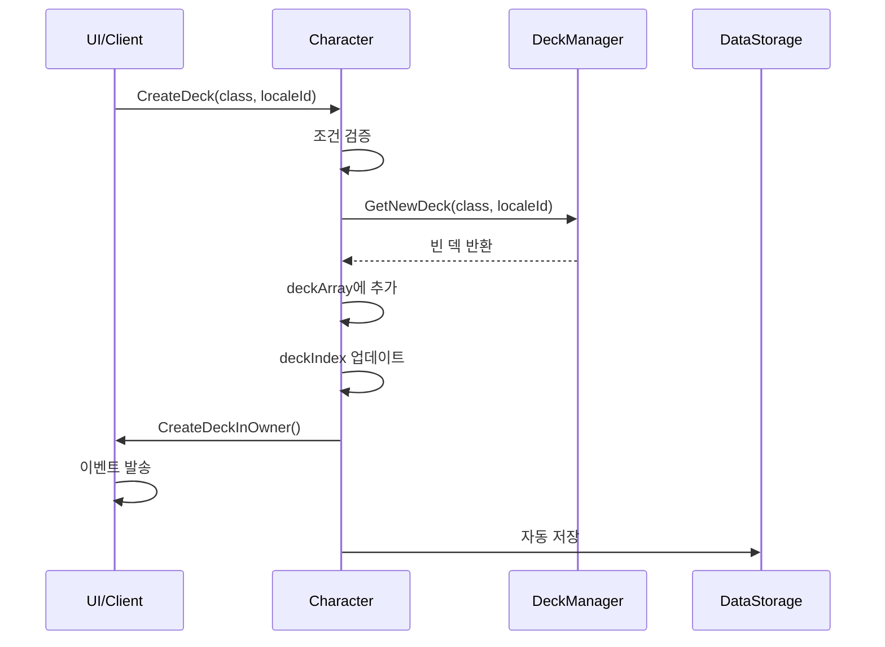
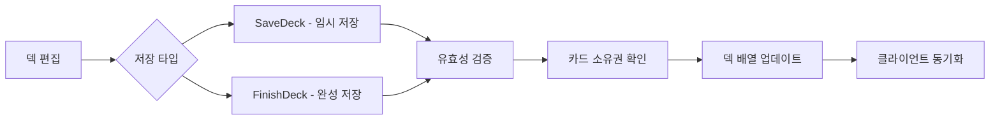
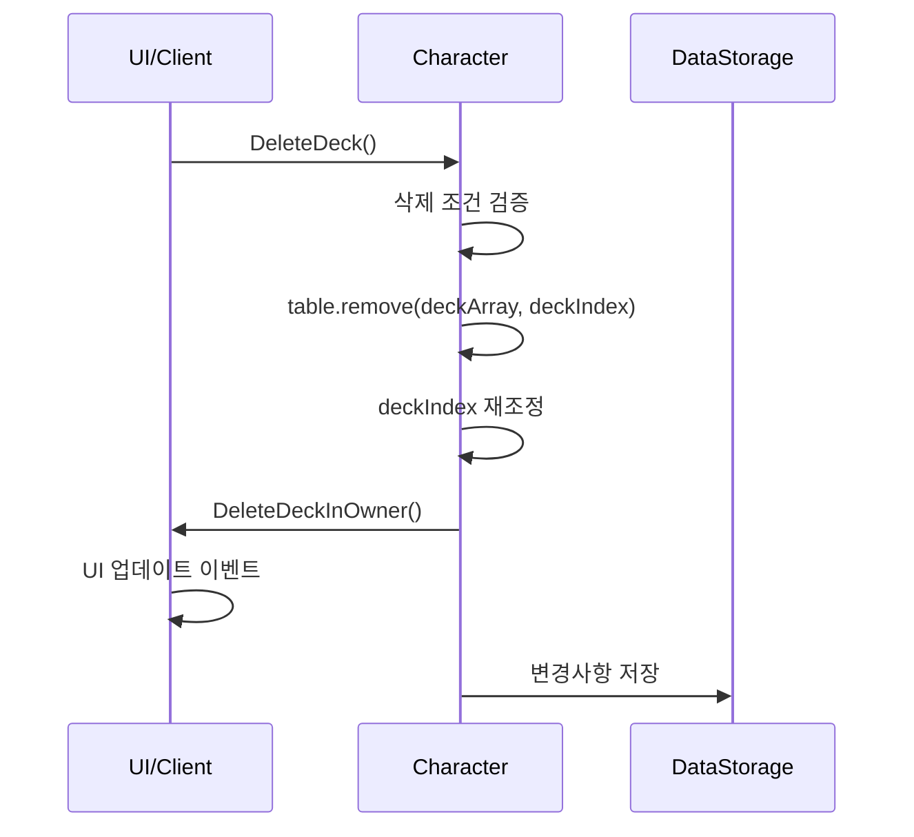
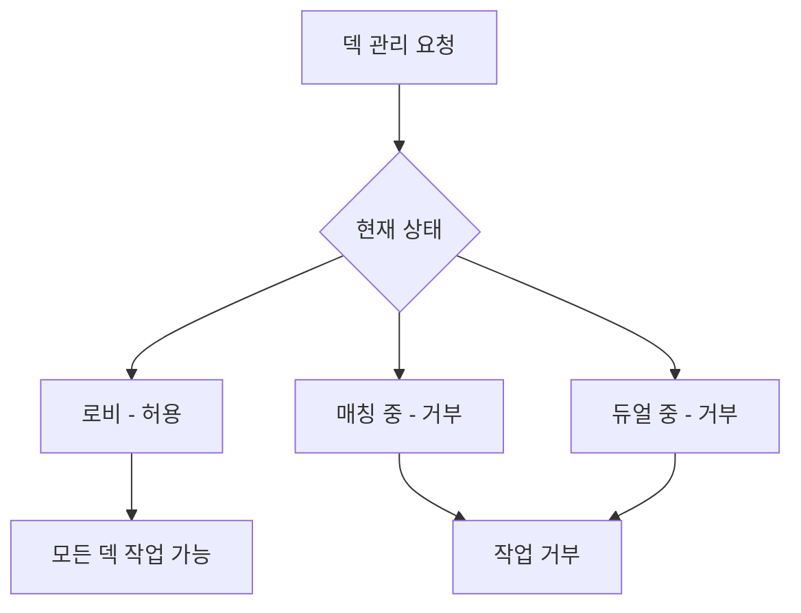

# 덱 관리 시스템

## 📋 개요

덱 관리 시스템은 플레이어가 소유한 여러 덱들을 생성, 편집, 저장, 삭제하는 전체적인 관리 기능을 제공합니다. 각 플레이어는 최대 10개의 덱을 보유할 수 있으며, 현재 선택된 덱으로 게임에 참가하게 됩니다.

**관련 파일**: 
- `RootDesk/MyDesk/Components/Character.mlua`
- `RootDesk/MyDesk/Components/Managers/DeckManager.mlua`
- `RootDesk/MyDesk/Events/CreateDeck.mlua`, `SaveDeck.mlua`, `DeleteDeck.mlua`

## 🏗️ 덱 관리 아키텍처

### 시스템 구조



### 핵심 구성 요소

#### 플레이어별 덱 저장소
- `deckArray`: 플레이어가 소유한 모든 덱들의 배열
- `maxDeckCount = 10`: 최대 보유 가능한 덱 수량
- `deckIndex`: 현재 선택되어 사용 중인 덱의 인덱스

#### 덱 데이터 구조
```lua
deck = {
    class = "Warrior",           -- 덱의 직업
    name = "My Warrior Deck",    -- 사용자 지정 덱 이름
    cardTable = {                -- 카드 구성
        CardName = {
            Variant = {
                Quality = count
            }
        }
    }
}
```

## 🎮 덱 관리 작업 시스템

### 1. 덱 생성 (CreateDeck)

#### 생성 과정


**생성 조건 검증**:
1. `isLoaded == true` - 플레이어 데이터 로딩 완료
2. 유효한 직업 선택 (Warrior/Magician/Bowman/Thief/Pirate)
3. `#deckArray < maxDeckCount` - 최대 덱 수량 미만
4. `!isvalid(player) && !isMatching` - 게임 중이 아닌 상태
5. 서버 요청 검증 통과

#### 새 덱 생성
- `DeckManager:GetNewDeck(class, localeId)` 호출
- 선택한 직업에 맞는 빈 덱 템플릿 생성
- 다국어 지원되는 기본 덱 이름 설정
- `deckIndex`를 새로 생성된 덱으로 자동 설정

### 2. 덱 저장 (SaveDeck)

#### 임시 저장 vs 완성 저장



**SaveDeck() - 임시 저장**:
- 편집 중인 덱의 중간 상태 저장
- 20장 미만의 미완성 덱도 허용
- 실시간 편집 내용 반영

**FinishDeck() - 완성 저장**:
- 덱 편집 완료 시 최종 저장
- 완전한 덱 구성 요구 (20장)
- 게임 참가 가능한 상태로 설정

#### 저장 검증 과정
1. **기본 유효성**: `DeckManager:IsDeckValid()` 통과
2. **카드 소유권 확인**:
   ```lua
   for name, variant, quality, count in deck.cardTable do
       if self:GetCardCount({name, variant, quality}) < count then
           return -- 소유하지 않은 카드 사용 시 실패
       end
   end
   ```
3. **게임 상태 확인**: 매칭 중이거나 듀얼 중이 아님
4. **서버 권한 검증**: 요청자 본인 확인

### 3. 덱 삭제 (DeleteDeck)

#### 삭제 과정


**삭제 조건**:
- 현재 덱이 존재함 (`!_Table:IsEmpty(GetDeck())`)
- 게임 중이 아닌 상태
- 서버 권한 검증 통과

**인덱스 재조정**:
```lua
self.deckIndex = math.min(self.deckIndex, #self.deckArray)
```
- 삭제 후 유효한 인덱스 범위로 자동 조정
- 마지막 덱 삭제 시 이전 덱으로 자동 이동

### 4. 덱 선택 (SetDeckIndex)

#### 덱 전환 시스템
현재 사용할 덱을 선택하는 기능입니다:

**전환 조건 검증**:
1. 유효한 인덱스 범위 (`1 <= deckIndex <= #deckArray`)
2. 빈 덱 배열의 경우 인덱스 1만 허용
3. 게임 중이 아닌 상태
4. 현재 인덱스와 다른 값

**전환 효과**:
- `deckIndex` 업데이트
- 매칭 시스템에서 새 덱 사용
- UI에서 선택된 덱 강조 표시

## 🔐 보안 및 검증 시스템

### 서버 권한 관리

#### 요청 검증 시스템
```lua
if _Server:IsRequesting() then
    if self ~= _Server.sender then
        return -- 요청자가 본인이 아니면 거부
    end
end
_Server.sender = nil -- 요청 처리 후 초기화
```

**보안 기능**:
- **요청자 확인**: 본인의 덱만 관리 가능
- **중복 요청 방지**: 처리 중인 요청의 중복 실행 방지
- **세션 무효화**: 처리 완료 후 세션 정리

### 카드 소유권 검증

#### 실시간 소유권 확인
덱에 포함된 모든 카드에 대해 플레이어가 실제로 소유하고 있는지 확인:

```lua
-- 카드별 세부 검증
if self:GetCardCount({
    name = name,
    variant = variant, 
    quality = quality
}) < count then
    return false -- 소유 수량보다 많이 사용하려 할 때 거부
end
```

**검증 수준**:
- **이름별**: 동일 카드명의 총 소유량 확인
- **변형별**: 특정 variant의 소유량 확인  
- **품질별**: 정확한 quality의 소유량 확인

### 상태 기반 제한

#### 게임 상태 제약


**제한 조건**:
- `isvalid(self.player)`: 듀얼 참가 중
- `self.isMatching`: 매칭 대기 중
- 게임 진행에 영향을 주지 않도록 보호

## 💾 데이터 지속성

### 자동 저장 시스템

#### 실시간 데이터 동기화
모든 덱 관리 작업은 자동으로 데이터베이스에 저장됩니다:

**저장 데이터**:
- `deckArray`: 전체 덱 배열
- `deckIndex`: 현재 선택된 덱 인덱스
- 사용자 데이터 스토리지에 MSON 형태로 저장

**저장 시점**:
- 덱 생성/삭제 직후
- 덱 저장/완성 시
- 덱 인덱스 변경 시
- 플레이어 로그아웃 시

### 로딩 및 초기화

#### 신규 플레이어 처리
```lua
-- 기본 스타터 덱 제공
deckArray = {
    deckManager:GetWarriorStarterDeck(localeId),
    deckManager:GetMagicianStarterDeck(localeId),
    deckManager:GetBowmanStarterDeck(localeId),
    deckManager:GetThiefStarterDeck(localeId),
    deckManager:GetPirateStarterDeck(localeId)
}
deckIndex = 1 -- 첫 번째 덱 선택
```

#### 기존 플레이어 복원
- 저장된 덱 배열 로딩
- 마지막 선택 덱 인덱스 복원
- 카드 소유권 재검증 및 덱 수정

## 🎨 사용자 인터페이스 연동

### 이벤트 시스템

#### 덱 관리 이벤트들
각 덱 관리 작업은 해당하는 이벤트를 발송합니다:

- `CreateDeck()`: 새 덱 생성 완료
- `SaveDeck()`: 덱 저장 완료  
- `FinishDeck()`: 덱 완성 완료
- `DeleteDeck()`: 덱 삭제 완료
- `SetDeckIndex()`: 덱 선택 변경

#### UI 반응성


**UI 업데이트 내용**:
- 덱 목록 갱신
- 선택된 덱 하이라이트
- 덱 편집 모드 전환
- 상태 메시지 표시

## 💡 코드 참조

핵심 덱 관리 로직:
- `Character.mlua :: CreateDeck()` — 새 덱 생성
- `Character.mlua :: SaveDeck()` — 덱 임시 저장
- `Character.mlua :: FinishDeck()` — 덱 완성 저장  
- `Character.mlua :: DeleteDeck()` — 덱 삭제
- `Character.mlua :: SetDeckIndex()` — 덱 선택 변경
- `Character.mlua :: GetDeck()` — 현재 덱 조회
- `DeckManager.mlua :: GetNewDeck()` — 새 덱 템플릿 생성

덱 관리 시스템은 플레이어의 전략적 선택을 지원하며, 안전하고 직관적인 덱 관리 경험을 제공하는 핵심 시스템입니다.
