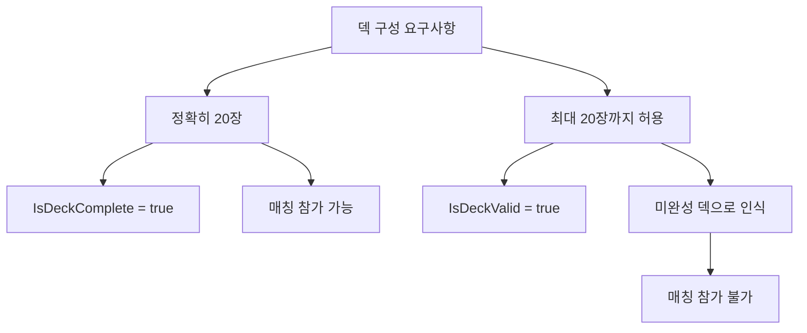
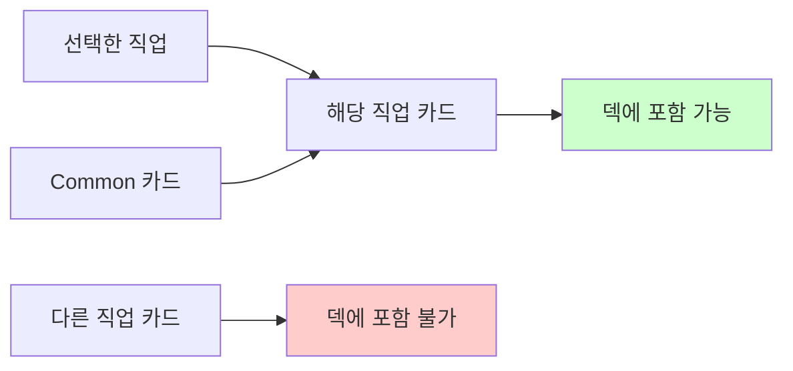
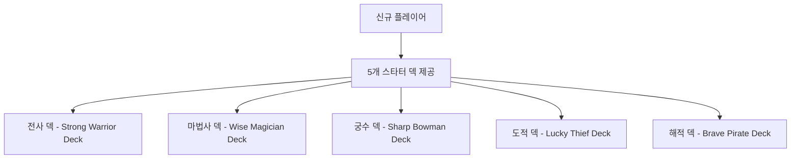
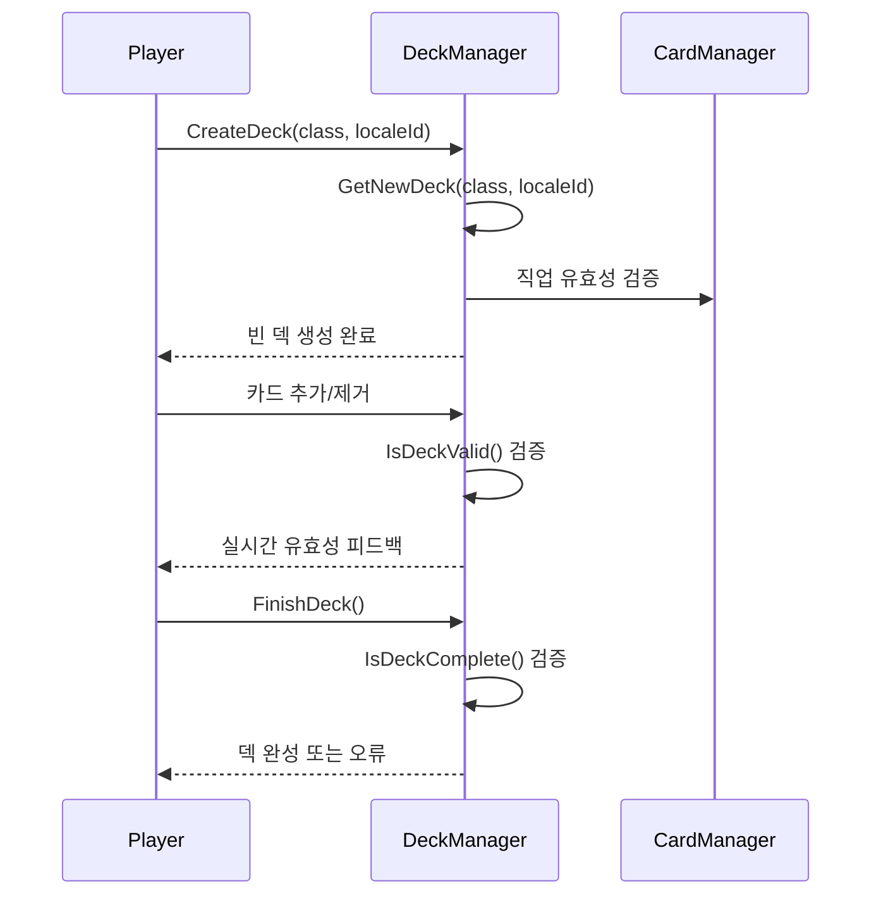

# 덱 구성 규칙

## 📋 개요

메이플 듀얼의 덱 시스템은 전략적 깊이와 균형을 위해 엄격한 구성 규칙을 가지고 있습니다. 모든 덱은 정확히 20장으로 구성되어야 하며, 직업별 제한과 카드 수량 제한을 통해 게임의 밸런스를 유지합니다.

**관련 파일**: 
- `RootDesk/MyDesk/Components/Managers/DeckManager.mlua`
- `RootDesk/MyDesk/Components/Character.mlua`

## 🎯 핵심 덱 구성 규칙

### 1. 덱 크기 제한



**규칙 세부사항**:
- **필수 크기**: 정확히 20장 (`IsDeckComplete()`)
- **최대 허용**: 20장 이하 (`IsDeckValid()`)
- **매칭 조건**: 완성된 덱(20장)만 랭크 매치 참가 가능

### 2. 직업 제한 시스템



**허용되는 직업 조합**:
| 선택 직업 | 사용 가능한 카드 |
|-----------|------------------|
| **Warrior** | Common + Warrior |
| **Magician** | Common + Magician |
| **Bowman** | Common + Bowman |
| **Thief** | Common + Thief |
| **Pirate** | Common + Pirate |

### 3. 카드 수량 제한

**동일 카드 제한**:
- 각 카드는 **최대 2장**까지만 덱에 포함 가능
- 변형(variant)과 품질(quality)이 달라도 동일 카드로 간주
- 예: "OrangeMushroom" Default Silver 1장 + "OrangeMushroom" Default Gold 1장 = 총 2장

### 4. 토큰 카드 제외

**제외 대상**:
- `isToken = TRUE`인 카드들
- 수집 불가능한 특수 카드
- 다른 효과로만 생성 가능한 카드

## 🔍 덱 검증 시스템

### DeckManager의 검증 메서드

#### `IsDeckValid(table deck)` - 기본 유효성 검증
```lua
-- 검증 조건:
1. 덱이 존재하고 비어있지 않음
2. 유효한 직업 선택 (Warrior/Magician/Bowman/Thief/Pirate)
3. 덱 이름이 존재함
4. 덱 크기가 20장 이하
5. 모든 카드가 허용된 직업 (Common + 선택 직업)
6. 동일 카드가 2장 이하
```

#### `IsDeckComplete(table deck)` - 완성도 검증
```lua
-- 완성 조건:
1. IsDeckValid() == true
2. 덱 크기가 정확히 20장
```

### 카드 수량 계산 메서드

#### `GetDeckSize(table deck)` - 전체 카드 수
모든 변형과 품질을 포함한 총 카드 수를 계산합니다.

#### `GetCardCountByName(string name)` - 이름별 카드 수
특정 카드 이름의 모든 변형/품질 포함 총 수량을 계산합니다.

#### `GetCardCountByInfo(table info)` - 정확한 카드 수
특정 변형과 품질의 정확한 카드 수량을 계산합니다.

## 🎮 스타터 덱 시스템

### 직업별 기본 덱

각 플레이어는 게임 시작 시 5개의 스타터 덱을 받습니다:



### 스타터 덱 구성 예시

#### Warrior 스타터 덱
- **덱 이름**: "Strong Warrior Deck" (다국어 지원)
- **핵심 카드**:
  - PowerStrike x2 (전사 기본 공격 스킬)
  - Common 미니언들 (OrangeMushroom, Stump 등)
  - 범용 유틸리티 카드들

#### Magician 스타터 덱  
- **덱 이름**: "Wise Magician Deck"
- **핵심 카드**:
  - FireArrow x2 (마법사 기본 공격 스킬)
  - EvilEye x2 (마법사 미니언)
  - Explosion x2 (강력한 AOE 스킬)

### 스타터 덱 특징

**균형잡힌 구성**:
- 각 덱은 해당 직업의 특색을 보여주는 구성
- 초보자도 쉽게 이해할 수 있는 단순한 카드들
- 미니언과 스킬의 적절한 비율

**품질 통일**:
- 모든 스타터 덱 카드는 Silver 품질
- 일관된 성능으로 공정한 시작점 제공

## 🛠️ 덱 편집 시스템

### 덱 생성 과정



### 실시간 검증

덱 편집 중에 실시간으로 다음을 검증합니다:

**카드 추가 시**:
1. 직업 제한 확인
2. 수량 제한 확인 (2장 초과 방지)
3. 덱 크기 제한 확인 (20장 초과 방지)

**카드 제거 시**:
1. 덱 크기 업데이트
2. 완성도 상태 변경

## 📊 덱 관리 시스템

### 다중 덱 지원

**플레이어별 덱 관리**:
- 최대 **10개 덱** 보유 가능 (`maxDeckCount = 10`)
- 각 덱은 독립적인 직업과 구성
- 현재 선택된 덱 인덱스 추적 (`deckIndex`)

### 덱 저장 시스템

**저장 메서드**:
- `SaveDeck()` - 임시 저장 (편집 중)
- `FinishDeck()` - 최종 완성 저장
- `DeleteDeck()` - 덱 삭제

**데이터 구조**:
```lua
deck = {
    class = "Warrior",
    name = "My Custom Deck",
    cardTable = {
        CardName = {
            Variant = {
                Quality = count
            }
        }
    }
}
```

## 🎯 전략적 고려사항

### 메타게임과 덱 구성

**직업별 특성 활용**:
- 각 직업의 시너지 카드들 조합
- 상대 직업을 의식한 카운터 픽
- 비용 곡선을 고려한 카드 선택

**리소스 관리**:
- MP 비용 분포의 균형
- 초반/중반/후반 게임 밸런스
- 미니언과 스킬의 적절한 비율

### 컬렉션 기반 제약

**카드 보유량 제한**:
- 플레이어가 보유한 카드만 덱에 포함 가능
- 희귀 카드의 제한적 수량
- 덱 간 카드 공유 (동일 카드를 여러 덱에서 사용 가능)

## 💡 코드 참조

핵심 덱 관리 로직:
- `DeckManager.mlua :: IsDeckValid()` — 덱 유효성 검증
- `DeckManager.mlua :: IsDeckComplete()` — 덱 완성도 확인
- `DeckManager.mlua :: GetDeckSize()` — 덱 크기 계산
- `DeckManager.mlua :: GetCardCountByName()` — 카드별 수량 계산
- `Character.mlua :: SetDecks()` — 플레이어 덱 목록 설정
- `Character.mlua :: CreateDeck()` — 새 덱 생성

이러한 덱 구성 규칙은 게임의 전략적 깊이를 제공하면서도 공정한 경쟁 환경을 보장하며, 플레이어가 자신만의 독특한 덱을 구성할 수 있는 자유도를 제공합니다.
