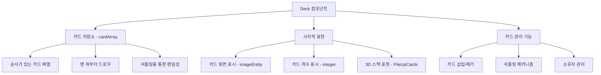
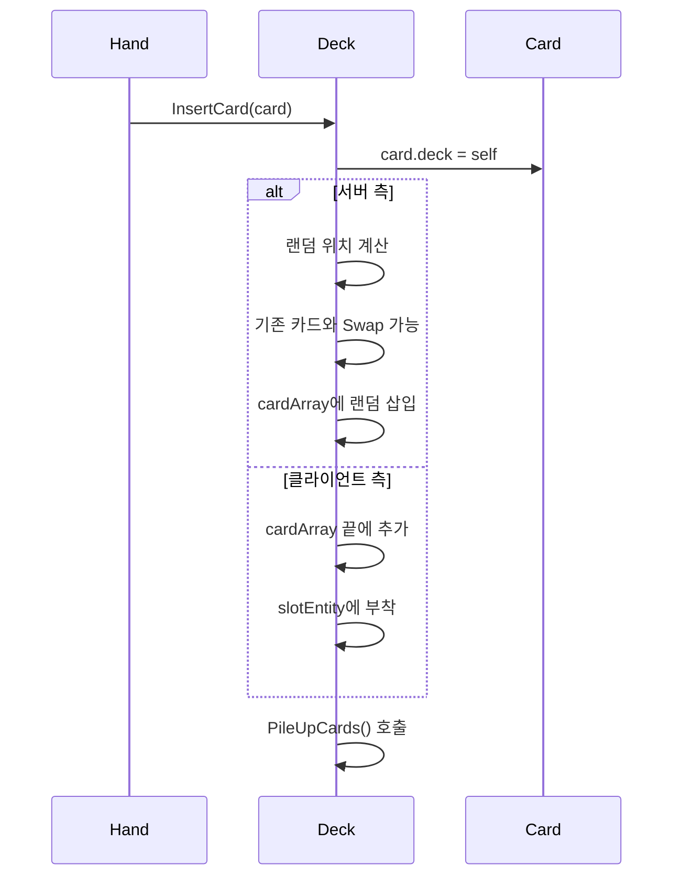
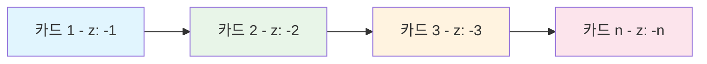
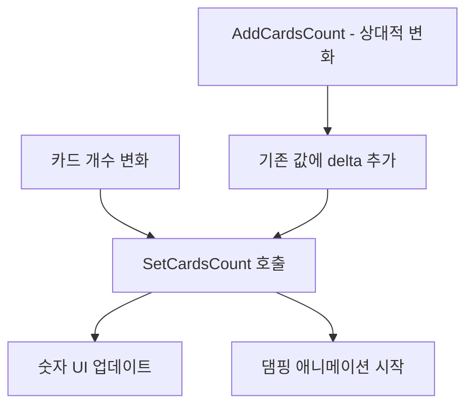
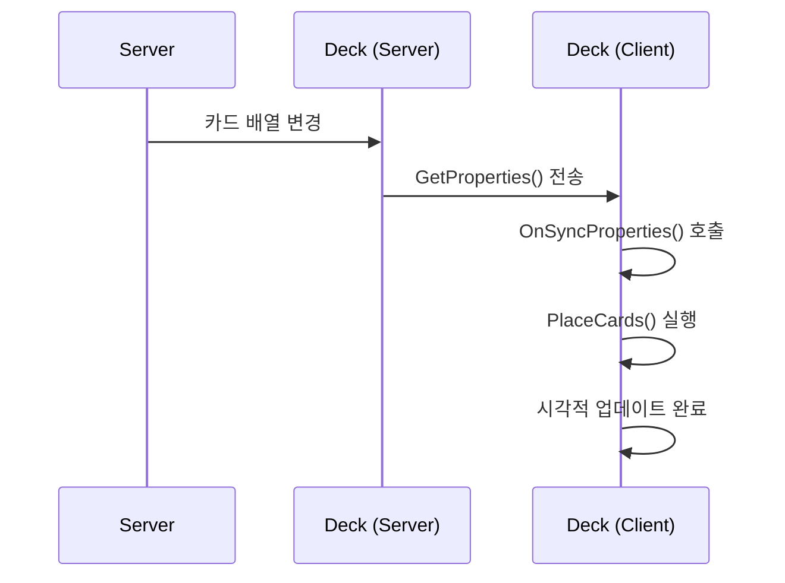

# 덱 컴포넌트 (Deck.mlua)

## 📋 개요

`Deck.mlua`는 게임 내 덱의 물리적 구현체로, 카드들을 저장하고 관리하는 컨테이너 역할을 합니다. 덱에서 손패로의 카드 드로우, 셔플링, 시각적 표현 등 덱과 관련된 모든 게임플레이 기능을 담당합니다.

**관련 파일**: 
- `RootDesk/MyDesk/Components/Objects/Deck.mlua`

## 🏗️ 덱 컴포넌트 아키텍처

### 컴포넌트 구조

### 핵심 프로퍼티

#### 카드 관리
- `cardArray`: 덱에 있는 카드들의 순서 배열
- `player`: 덱을 소유한 플레이어
- `isOurs`: 우리 편 덱인지 상대편 덱인지 구분

#### 시각적 요소
- `propEntity`: 덱 UI 프로퍼티 엔티티
- `slotEntity`: 카드들이 배치될 슬롯 엔티티
- `imageEntity`: 카드 뒷면을 표시하는 이미지 엔티티
- `integer`: 카드 개수를 표시하는 숫자 UI

#### 애니메이션
- `imageTweener`: 이미지 애니메이션 처리
- `integerTweener`: 숫자 애니메이션 처리
- `integerTimer`: 숫자 표시 지연 타이머

## 🎮 주요 기능 시스템

### 1. 카드 저장 및 관리

#### 카드 삽입 시스템

**주요 메서드**:
- `InsertCard(Card card)` — 단일 카드 삽입 (셔플링 포함)
- `InsertCards(table cardArray)` — 다중 카드 삽입
- `InsertCardsWithoutShuffle(table cardArray)` — 셔플링 없이 삽입

#### 카드 제거 시스템
- `RemoveCard(Card card)` — 특정 카드 제거
- `RemoveCards(table cardArray)` — 다중 카드 제거
- 제거 시 카드의 `deck` 참조 제거 및 시각적 분리

### 2. 셔플링 메커니즘

#### 동적 셔플링 시스템
덱은 카드가 추가될 때마다 자동으로 섞입니다:

셔플링 로직은 `Deck.mlua :: InsertCard()` 내부에서 랜덤 인덱스 계산과 카드 ID 교환을 통해 구현됩니다.

**특징**:
- **연속 셔플링**: 매 카드 삽입마다 위치 랜덤화
- **카드 ID 교환**: `card:Swap(victim)`을 통한 식별자 교환
- **서버 권한**: 셔플링은 서버에서만 실행하여 동기화 보장

### 3. 시각적 표현 시스템

#### 3D 스택 표현

**PileUpCards() 메커니즘**:
- 각 카드의 Z 위치를 -1, -2, -3... 순으로 설정
- 시각적으로 카드들이 쌓인 모습 구현
- 맨 위 카드가 가장 앞에 표시

#### 카드백 시스템
- `imageEntity`: 플레이어가 선택한 카드백 디자인 표시
- `SpawnAndSetImageEntity()`: 카드백 모델 동적 생성
- 개인화된 시각적 표현 제공

### 4. 카드 개수 표시

#### 실시간 개수 업데이트

**메서드**:
- `SetCardsCount(integer count)` — 절대적 개수 설정
- `AddCardsCount(integer delta)` — 상대적 개수 변화
- 부드러운 댐핑 애니메이션으로 변화 표현

### 5. 상세 정보 표시

#### 덱 상세 보기
게임 중 덱을 클릭하면 상세 정보를 표시합니다:

**ShowDetails() 기능**:
- 카드백 이미지 확대 애니메이션
- 카드 개수 표시 (0.25초 지연)
- 스케일 트위닝으로 부드러운 등장

**HideDetails() 기능**:
- UI 요소 비활성화
- 자원 정리 및 최적화

## 🔄 클라이언트-서버 동기화

### 프로퍼티 동기화

**동기화 데이터**:
- `cardArray`: 현재 덱에 있는 모든 카드 정보
- 서버에서 클라이언트로 일방향 동기화

**OnSyncProperties() 처리**:
- 받은 카드 배열 정보로 시각적 재구성
- `PlaceCards()`를 통한 카드 배치 업데이트

### 위치 설정 시스템

#### SetSide() 메서드
위치 설정은 `Deck.mlua :: SetSide()` 메서드에서 `layout:GetTransform()`을 통해 처리됩니다.

- 게임 레이아웃에 따른 덱 위치 자동 설정
- 우리 편 덱과 상대편 덱의 구분된 배치

## 🎯 게임플레이와의 연동

### 턴 시작 시 카드 드로우
덱은 다른 시스템과 연동하여 게임 진행을 지원합니다:

- **TaskManager와 연동**: 턴 시작 시 자동 드로우
- **Hand 시스템과 연동**: 드로우된 카드를 손패로 이동
- **Player 시스템과 연동**: 소유권 관리

### 덱 고갈 처리
- 덱이 비었을 때의 게임 규칙 적용
- 더 이상 드로우할 수 없는 상황 처리
- 게임 종료 조건과의 연계

## 🎨 최적화 및 성능

### 메모리 관리
- **카드 참조 관리**: `card.deck` 순환 참조 방지
- **동적 생성/제거**: 필요에 따른 UI 요소 생성
- **타이머 정리**: 사용하지 않는 타이머 자동 해제

### 애니메이션 최적화
- **트위너 재사용**: 기존 애니메이션 중단 후 새 애니메이션 시작
- **지연 실행**: UI 업데이트의 적절한 타이밍 조절
- **시각적 피드백**: 사용자 경험을 위한 부드러운 전환

## 💡 코드 참조

핵심 덱 관리 로직:
- `Deck.mlua :: InsertCard()` — 카드 삽입 및 셔플링
- `Deck.mlua :: RemoveCard()` — 카드 제거
- `Deck.mlua :: PileUpCards()` — 시각적 스택 구성
- `Deck.mlua :: SetCardsCount()` — 개수 표시 업데이트
- `Deck.mlua :: OnSyncProperties()` — 클라이언트 동기화

덱 컴포넌트는 카드 게임의 핵심 메커니즘인 덱 관리를 담당하며, 게임의 랜덤성과 전략적 요소를 제공하는 중요한 컴포넌트입니다.
