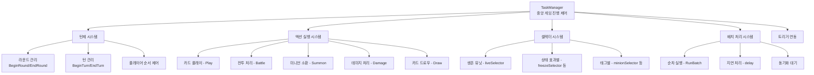
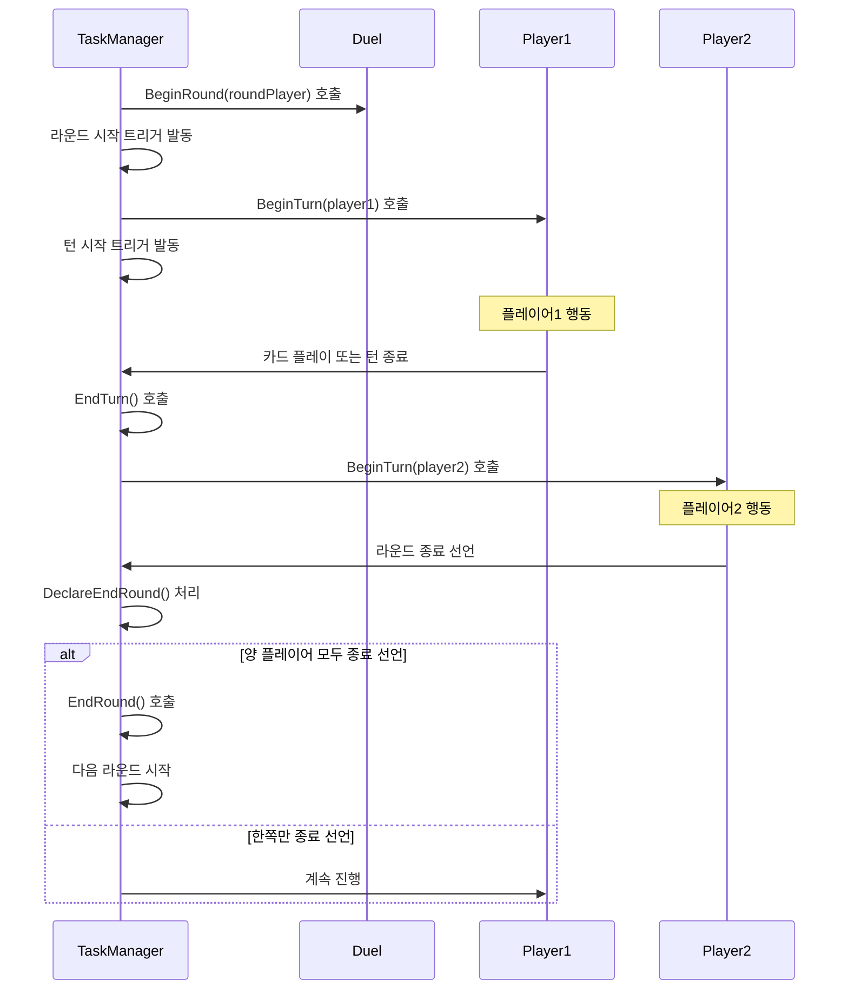
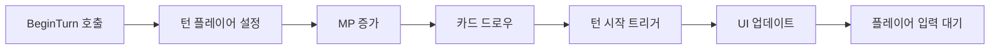
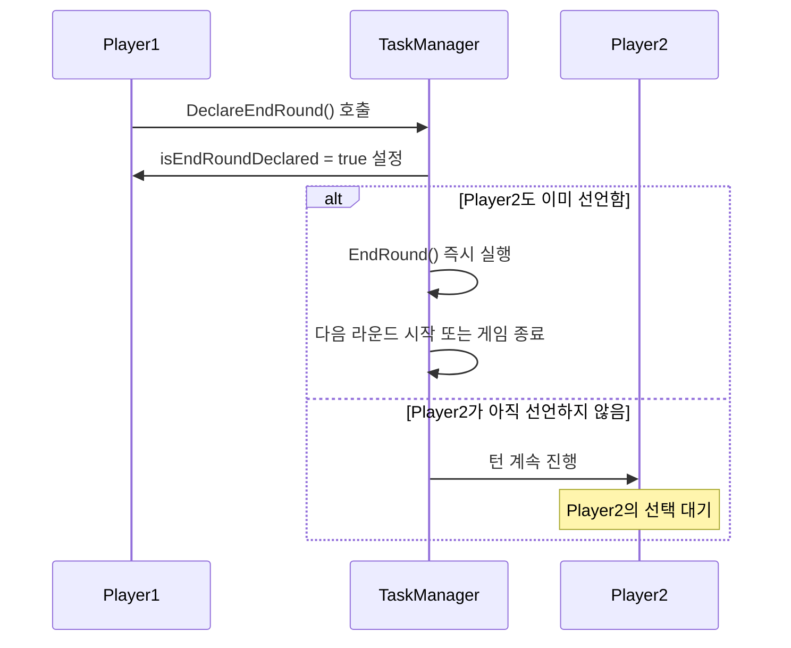
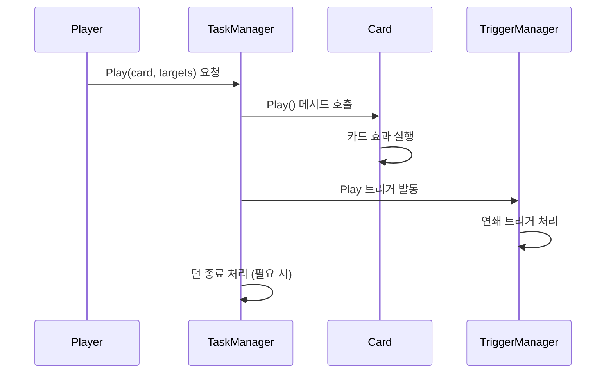
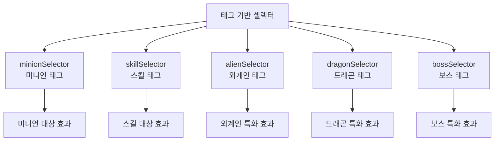
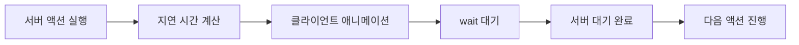
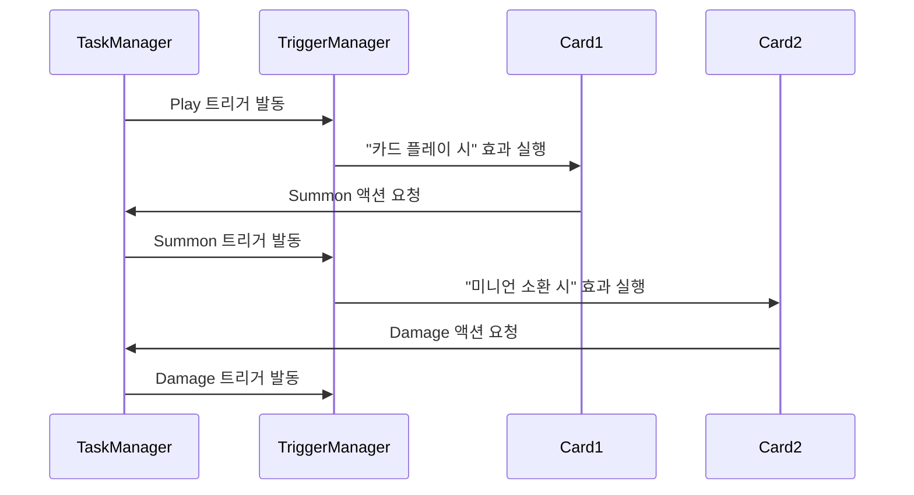

# 게임 진행 제어 (TaskManager.mlua)

## 📋 개요

`TaskManager.mlua`는 메이플 듀얼에서 게임의 전체 진행 흐름을 제어하는 중앙 관리자입니다. 턴제 시스템의 라운드와 턴 관리, 게임 액션의 순차 실행, 트리거 시스템 연동, 그리고 다양한 게임플레이 작업(카드 플레이, 전투, 소환 등)의 조율을 담당합니다. 모든 게임 진행은 TaskManager를 통해 체계적으로 관리되며, 이를 통해 복잡한 카드 효과와 상호작용이 올바른 순서로 실행됩니다.

**관련 파일**: 
- `RootDesk/MyDesk/Components/Managers/TaskManager.mlua`

## 🏗️ 게임 진행 제어 아키텍처

### 시스템 구조



### 핵심 프로퍼티

#### 매니저 연동
- `duel`: 듀얼 컴포넌트 참조
- `actionManager`: 액션 실행 관리자
- `commandManager`: 명령 동기화 관리자
- `triggerManager`: 트리거 시스템 관리자
- `history`: 게임 히스토리 기록

#### 실행 제어
- `delay`: 현재 누적된 지연 시간
- `coreDelayTable`: 핵심 지연 시간 테이블

#### 셀렉터 시스템
- `validSelector`: 유효한 객체 판별
- `liveSelector`: 생존 유닛 판별
- `openSelector`: 공개된 카드 판별
- 다양한 상태별/태그별 셀렉터들

## 🎮 1. 턴제 시스템 제어

### 게임 진행 흐름



### 라운드 관리 시스템

#### BeginRound() 메커니즘
```lua
method void BeginRound(Player roundPlayer)
    local taskName = "BeginRound"
    local args = {}
    local objectArray = {roundPlayer}
    
    -- 듀얼 컴포넌트에 라운드 시작 알림
    self.duel:BeginRound(roundPlayer)
    
    -- 트리거 시스템에 라운드 시작 이벤트 전파
    self.triggerManager:InvokeTriggers(objectArray, receiverArray, "BeginRound", args, nil, nil)
    
    -- 첫 번째 턴 시작
    self:BeginTurn(roundPlayer)
end
```

**라운드 시작 처리**:
- 라운드 플레이어 설정 및 UI 업데이트
- 라운드별 트리거 효과 발동
- 첫 번째 턴 자동 시작

#### EndRound() 메커니즘
```lua
method void EndRound(boolean isTimeout)
    local taskName = "EndRound"
    local args = {isTimeout}
    
    -- 현재 턴 강제 종료
    self:EndTurn(isTimeout)
    
    -- 듀얼 컴포넌트에 라운드 종료 알림
    self.duel:EndRound(isTimeout)
    
    -- 라운드 종료 트리거 발동
    self.triggerManager:InvokeTriggers(objectArray, receiverArray, "EndRound", args, nil, nil)
end
```

### 턴 관리 시스템

#### BeginTurn() 세부 처리


```lua
method void BeginTurn(Player turnPlayer)
    local taskName = "BeginTurn"
    local args = {}
    local objectArray = {turnPlayer}
    
    -- 듀얼에 턴 플레이어 설정
    self.duel.turnPlayer = turnPlayer
    
    -- 트리거 시스템에 턴 시작 알림
    self.triggerManager:InvokeTriggers(objectArray, receiverArray, "BeginTurn", args, nil, nil)
    
    -- 자동 처리 (MP 증가, 카드 드로우 등)
    -- 이 부분은 트리거를 통해 처리됨
end
```

#### 라운드 종료 선언 시스템


## ⚔️ 2. 게임 액션 실행 시스템

### 배치 처리 시스템 (RunBatch)

#### 순차 실행 메커니즘
```lua
method void RunBatch(table objectArray, string taskName, table args, table eachArgs, string actionName, number interval)
    if _Table:IsEmpty(objectArray) then
        return
    end
    
    -- 각 객체에 대해 순차적으로 작업 실행
    for i, object in ipairs(objectArray) do
        -- 개별 인수가 있는 경우 사용
        local currentArgs = eachArgs and eachArgs[i] or args
        
        -- 메서드 호출
        _Util:Call(object, taskName, currentArgs)
        
        -- 액션 애니메이션 (클라이언트 측)
        if actionName and self:IsClient() then
            object:Animate(actionName)
        end
        
        -- 간격 대기 (마지막 객체 제외)
        if interval and i < #objectArray then
            if self:IsClient() then
                wait(interval)
            end
            self:AddDelay(interval)
        end
    end
end
```

**배치 처리의 장점**:
- **일관성**: 동일한 패턴으로 모든 게임 액션 처리
- **동기화**: 서버-클라이언트 간 정확한 타이밍 보장
- **시각적 피드백**: 애니메이션과 지연 시간을 통한 자연스러운 연출

### 주요 게임 액션들

#### 카드 플레이 (Play)


#### 전투 처리 (Battle)
```lua
method void Battle(table attackerArray, table targetArray)
    local taskName = "Battle"
    local args = {}
    
    -- 공격자와 대상을 매칭하여 전투 처리
    for i, attacker in ipairs(attackerArray) do
        local target = targetArray[i] or targetArray[1]  -- 대상 매칭
        
        if isvalid(target) and not target.isDead then
            -- 실제 전투 로직 실행
            local battleResult = target:Damage(attacker, attacker:GetFinalAtk())
            
            -- 전투 결과에 따른 추가 처리
            if battleResult.damage > 0 then
                self.history:AddThisGameDamage(attacker.player, battleResult.damage)
            end
        end
    end
    
    -- 전투 트리거 발동
    self.triggerManager:InvokeTriggers(attackerArray, receiverArray, "Battle", args, nil, nil)
end
```

#### 미니언 소환 (Summon)
```lua
method void Summon(table blueprintTable, Minion pivot, boolean isPlaying)
    local minionTable = {}
    
    -- 각 플레이어별로 미니언 생성
    for player, blueprintArray in pairs(blueprintTable) do
        local availableSpace = player.field.capacity - #player.field.minionArray
        local minionArray = self.duel:ShareAcquiredMinions(
            math.min(#blueprintArray, availableSpace))
        
        -- 설계도를 바탕으로 미니언 설정
        for i, minion in ipairs(minionArray) do
            local blueprint = blueprintArray[i]
            minion:SetPlayer(player)
            minion:SetBlueprint(blueprint)
        end
        
        -- 필드에 배치
        player.field:InsertMinions(minionArray, pivot)
    end
    
    -- 소환 트리거 발동
    self.triggerManager:InvokeTriggers(objectArray, receiverArray, "Summon", args, nil, nil)
end
```

## 🎯 3. 셀렉터 시스템

### 조건부 객체 선택

TaskManager는 다양한 상황에서 특정 조건을 만족하는 객체들을 선택하기 위한 셀렉터 함수들을 제공합니다.

#### 기본 셀렉터들
```lua
-- 생존 유닛 선택
self.liveSelector = function(unit)
    return not unit.isDead
end

-- 공개된 카드 선택
self.openSelector = function(card)
    return not _Table:IsEmpty(card.info)
end

-- 손상된 미니언 선택
self.damagedSelector = function(minion)
    return minion:IsDamaged()
end

-- 동결된 미니언 선택
self.freezeSelector = function(minion)
    return minion.isFreeze
end
```

#### 태그 기반 셀렉터들


### 셀렉터 활용 예시
```lua
-- 상대방 필드의 생존 미니언들에게 데미지
local targets = _Table:Select(
    player.opponent.field:GetMinions(), 
    self.liveSelector
)

-- 자신의 손패에서 미니언 카드들 선택
local minionCards = _Table:Select(
    player.hand:GetCards(), 
    function(card) 
        return self.minionSelector(card) and self.openSelector(card) 
    end
)
```

## ⏰ 4. 지연 시스템과 동기화

### 지연 시간 관리

#### AddDelay() 누적 시스템
```lua
method void AddDelay(number delay)
    self.delay = self.delay + delay
    
    -- 핵심 지연 시간 기록
    table.insert(self.coreDelayTable, delay)
end
```

게임의 모든 시각적 효과와 애니메이션에는 적절한 지연 시간이 적용되어 자연스러운 게임 진행을 보장합니다.

#### 동기화 대기 시스템


**서버-클라이언트 동기화**:
- 서버는 `AddDelay()`로 지연 시간 누적
- 클라이언트는 `wait()`로 실제 대기
- 모든 액션이 동일한 타이밍에 완료되도록 보장

## 🔗 5. 트리거 시스템 연동

### 이벤트 기반 게임 진행

#### 트리거 발동 패턴
```lua
-- 모든 주요 액션에서 트리거 발동
self.triggerManager:InvokeTriggers(
    objectArray,        -- 이벤트를 발생시킨 객체들
    receiverArray,      -- 이벤트를 받을 수 있는 모든 객체들
    "EventName",        -- 이벤트 이름
    args,              -- 이벤트 인수들
    nil, nil           -- 추가 매개변수들
)
```

#### 주요 게임 이벤트들
- **BeginRound** / **EndRound**: 라운드 시작/종료
- **BeginTurn** / **EndTurn**: 턴 시작/종료  
- **Play**: 카드 플레이
- **Battle**: 전투 발생
- **Summon**: 미니언 소환
- **Damage**: 데미지 입음
- **Death**: 유닛 사망
- **Draw**: 카드 드로우
- **Discard**: 카드 버리기

### 트리거 연쇄 처리

#### 복잡한 상호작용 해결


TaskManager는 복잡한 카드 효과들의 연쇄 반응을 체계적으로 관리합니다.

## 🎮 6. 게임 상태 확인

### 게임 종료 조건 체크

#### 승부 결정 로직
TaskManager는 각 액션 후 게임 종료 조건을 확인합니다:
- 플레이어 체력이 0 이하인지
- 덱이 비어있는지  
- 특수한 승리 조건이 달성되었는지

```lua
-- 액션 완료 후 게임 상태 확인
if self:ShouldEndGame() then
    local winner = self:DetermineWinner()
    self.duel:EndMatch(winner)
end
```

## 💡 코드 참조

핵심 게임 진행 제어 로직:
- `TaskManager.mlua :: BeginRound()` — 라운드 시작 제어
- `TaskManager.mlua :: BeginTurn()` — 턴 시작 제어
- `TaskManager.mlua :: DeclareEndRound()` — 라운드 종료 선언 처리
- `TaskManager.mlua :: RunBatch()` — 배치 처리 시스템
- `TaskManager.mlua :: Play()` — 카드 플레이 처리
- `TaskManager.mlua :: Battle()` — 전투 처리
- `TaskManager.mlua :: Summon()` — 미니언 소환 처리

TaskManager는 메이플 듀얼의 복잡한 게임 진행을 체계적으로 관리하며, 모든 게임 요소들이 올바른 순서와 타이밍으로 실행되도록 보장하는 핵심 시스템입니다.
