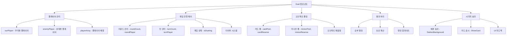
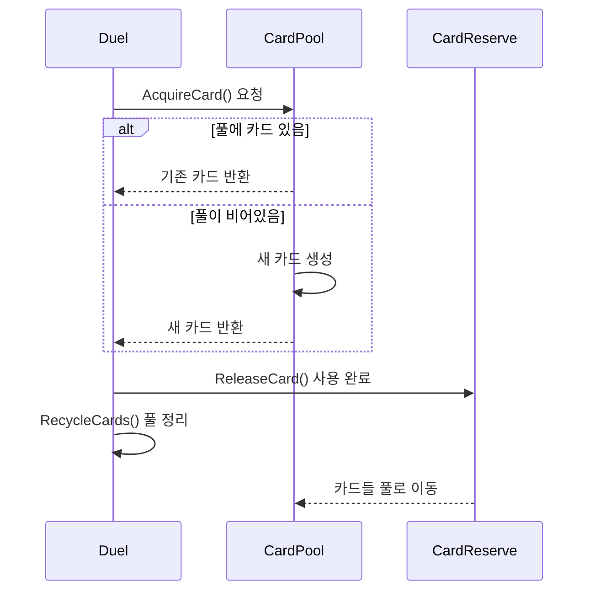
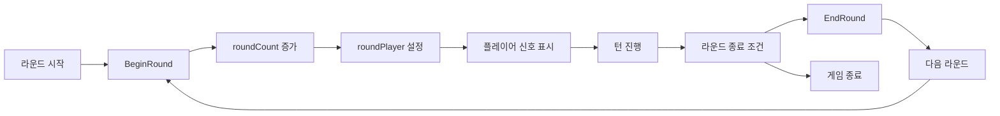
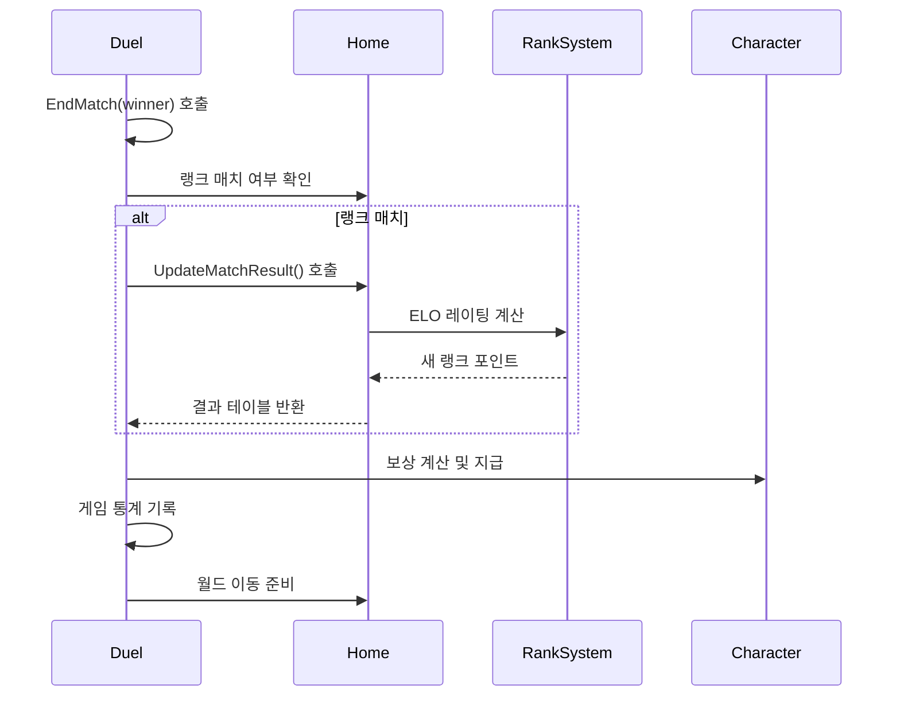
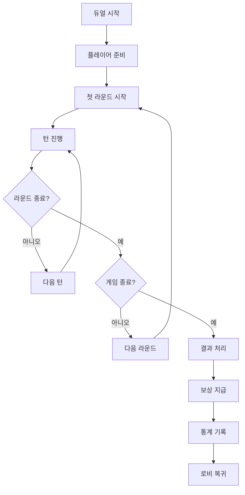

# 듀얼 컴포넌트 (Duel.mlua)

## 📋 개요

`Duel.mlua`는 메이플 듀얼 게임의 핵심 컴포넌트로, 두 플레이어 간의 전체 대전 과정을 관리하고 제어합니다. 게임 시작부터 종료까지의 모든 진행 상황, 턴 관리, 오브젝트 풀링, 결과 처리 등을 담당하는 중앙 컨트롤러 역할을 합니다.

**관련 파일**: 
- `RootDesk/MyDesk/Components/Objects/Duel.mlua`

## 🏗️ 듀얼 컴포넌트 아키텍처

### 시스템 구조



### 핵심 프로퍼티

#### 게임 상태 관리
- `isDueling`: 현재 듀얼 진행 중인지 여부
- `roundCount`: 현재 라운드 번호
- `turnCount`: 현재 턴 번호
- `startDate`: 게임 시작 시간

#### 플레이어 관리
- `playerArray`: 두 명의 플레이어 배열
- `ourPlayer`: 현재 클라이언트의 플레이어
- `enemyPlayer`: 상대방 플레이어
- `roundPlayer`: 현재 라운드의 주도권자
- `turnPlayer`: 현재 턴의 진행자

#### 타이머 시스템
- `beginDuelTimer`: 듀얼 시작 지연 타이머
- `turnTimer`: 턴 제한 시간 타이머
- `countdownTimer`: 카운트다운 타이머
- `turnTime`: 남은 턴 시간
- `countdownTime`: 카운트다운 시간

## 🎮 주요 기능 시스템

### 1. 오브젝트 풀링 시스템

#### 카드 풀링


**카드 풀링 메서드**:
- `ShareAcquiredCards(count)` — 여러 카드 동시 획득
- `ShareAcquiredCard()` — 단일 카드 획득 (서버-클라이언트 동기화)
- `AcquireCard()` — 서버 전용 카드 획득
- `ReleaseCard(card)` — 사용 완료된 카드 반환
- `RecycleCards()` — 풀 정리 및 재활용

#### 미니언 풀링
동일한 패턴으로 미니언 객체들을 관리합니다:
- `minionPool`: 사용 가능한 미니언 풀
- `minionReserve`: 사용 완료 대기 미니언들
- 카드와 같은 생명주기 관리 적용

**최적화 효과**:
- **메모리 효율성**: 객체 재사용으로 GC 압박 감소
- **성능 향상**: 빈번한 생성/삭제 비용 절약
- **동기화 보장**: 서버-클라이언트 간 객체 ID 일관성

### 2. 게임 진행 제어

#### 라운드 시스템


**BeginRound(Player roundPlayer) 기능**:
- 라운드 번호 증가 (`roundCount++`)
- 라운드 주도권자 설정
- 시각적 라운드 시작 신호
- 각 플레이어의 상태 초기화

**EndRound(boolean isTimeout) 기능**:
- 모든 플레이어의 라운드 종료 선언 해제
- 라운드 관련 UI 숨김 처리
- 손패 카드들 휴식 위치로 이동
- 다음 라운드 준비

#### 턴 관리 시스템
각 라운드는 여러 턴으로 구성되며, 플레이어가 번갈아 행동합니다:

- `turnPlayer`: 현재 행동할 플레이어
- `turnTime`: 턴 제한 시간 (초 단위)
- `turnTimer`: 시간 경과 추적 타이머
- `isWaitingExtraTime`: 추가 시간 대기 상태

### 3. 시각적 피드백 시스템

#### 배경 효과 제어
게임 상황에 따른 몰입감 있는 배경 효과:

**DarkenBackground() 기능**:
- 게임 시작 시 배경을 어둡게 변경
- 0.25초 동안 부드러운 전환
- 집중도 향상을 위한 시각적 효과

**LightenBackground() 기능**:
- 게임 종료 시 배경을 밝게 복원
- 동일한 전환 시간으로 자연스러운 복구

#### 카드 강조 표시
**ShowCard 시스템**:
- `showingCard`: 현재 강조 표시 중인 카드
- `showCardTimer`: 카드 표시 지속 시간
- `showCardTweener`: 카드 애니메이션 처리

**placingMinion 시스템**:
- 미니언 배치 시 시각적 미리보기
- 배치 위치 하이라이트
- 배치 확정 전 취소 가능

### 4. 게임 종료 및 결과 처리

#### 승부 결정 시스템


**EndMatch(Player winner) 처리**:
1. **승자 결정**: `winner` 매개변수로 승부 결과 확정
2. **매치 타입 확인**: 랭크 매치 vs 친선전 구분
3. **랭킹 업데이트**: ELO 시스템을 통한 레이팅 변경
4. **보상 지급**: 메소, 경험치, 랭크 포인트 등
5. **통계 기록**: 게임 히스토리 저장
6. **월드 이동**: 6초 후 로비로 자동 이동

#### 보상 시스템
다양한 종류의 보상을 시각적으로 표시합니다:

**보상 종류**:
- **PlayMeso**: 게임 참여 기본 보상
- **RankedWinMeso**: 랭크 승리 추가 보상  
- **RankedPlayMeso**: 랭크 참여 일일 보상
- **RankMeso**: 랭크 상승 보너스
- **RankPoint**: 레이팅 포인트 변화

**시각적 표현**:
- 각 보상을 개별 UI로 순차 표시
- 스케일 애니메이션으로 등장/퇴장 효과
- 5초간 표시 후 자동 사라짐
- 화면 좌측에 세로로 배열

### 5. 통합 명령 시스템 연동

#### CommandManager와 협업
Duel은 `commandManager`와 밀접하게 연동됩니다:

**동기화 패키지**:
- `commandManager:PushPackage(object)` — 서버에서 객체 전송
- `commandManager:PopPackage()` — 클라이언트에서 객체 수신
- 카드/미니언 생성 시 ID 동기화 보장

**명령 실행 제어**:
- 모든 게임 액션은 CommandManager를 통해 처리
- 서버 권한 검증 및 클라이언트 동기화
- 패키지 시스템으로 복잡한 객체 전달

### 6. 상태 관리 및 동기화

#### 프로퍼티 동기화
```lua
method table GetProperties()
    return {
        commandId = self.commandId,
        objectId = self.objectId,
        objectArray = self.objectArray,
        isDueling = self.isDueling,
        roundCount = self.roundCount,
        roundPlayer = self.roundPlayer,
        turnCount = self.turnCount,
        turnPlayer = self.turnPlayer,
        tutorial = self.tutorial,
    }
end
```

**동기화 데이터**:
- 게임 진행 상태 (라운드, 턴, 듀얼 여부)
- 현재 활성 플레이어 정보
- 오브젝트 배열 및 식별자
- 튜토리얼 상태

## 🎯 게임 흐름 통합

### 전체 듀얼 라이프사이클


### 다른 시스템과의 연동
- **TaskManager**: 게임 로직 실행 순서 제어
- **Player**: 개별 플레이어 상태 관리
- **Field/Hand**: 카드 배치 영역 관리
- **TriggerManager**: 카드 효과 발동 처리
- **UI 시스템**: 게임 상태 시각화

## ⚡ 성능 최적화

### 메모리 관리
- **오브젝트 풀링**: 카드/미니언 재사용으로 GC 압박 최소화
- **타이머 관리**: 사용하지 않는 타이머 자동 해제
- **리소스 정리**: 게임 종료 시 모든 임시 객체 정리

### 네트워크 최적화
- **패키지 시스템**: 복잡한 데이터의 효율적 전송
- **상태 동기화**: 필수 정보만 선별적 동기화
- **지연 처리**: 시각적 효과의 적절한 타이밍 조절

## 💡 코드 참조

핵심 듀얼 관리 로직:
- `Duel.mlua :: BeginRound()` — 라운드 시작 처리
- `Duel.mlua :: EndRound()` — 라운드 종료 처리  
- `Duel.mlua :: EndMatch()` — 게임 종료 및 결과 처리
- `Duel.mlua :: ShareAcquiredCard()` — 카드 풀링 관리
- `Duel.mlua :: DarkenBackground()` — 시각적 효과 제어
- `Duel.mlua :: GetProperties()` — 상태 동기화

듀얼 컴포넌트는 게임의 모든 진행을 총괄하는 중앙 허브 역할을 하며, 플레이어들에게 완성도 높은 대전 경험을 제공하는 핵심 시스템입니다.
