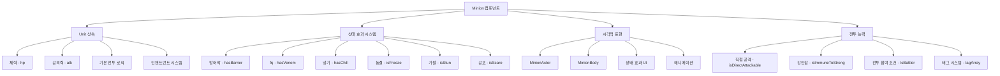
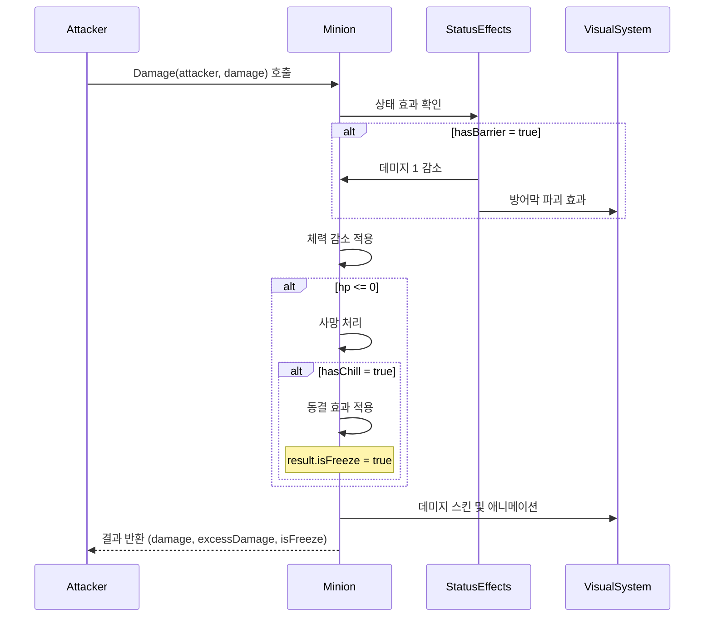
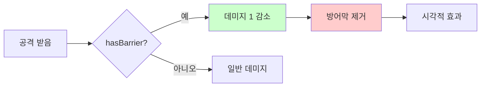
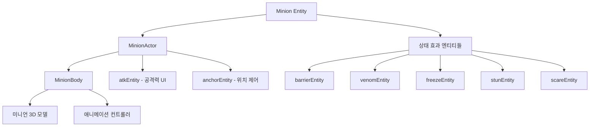
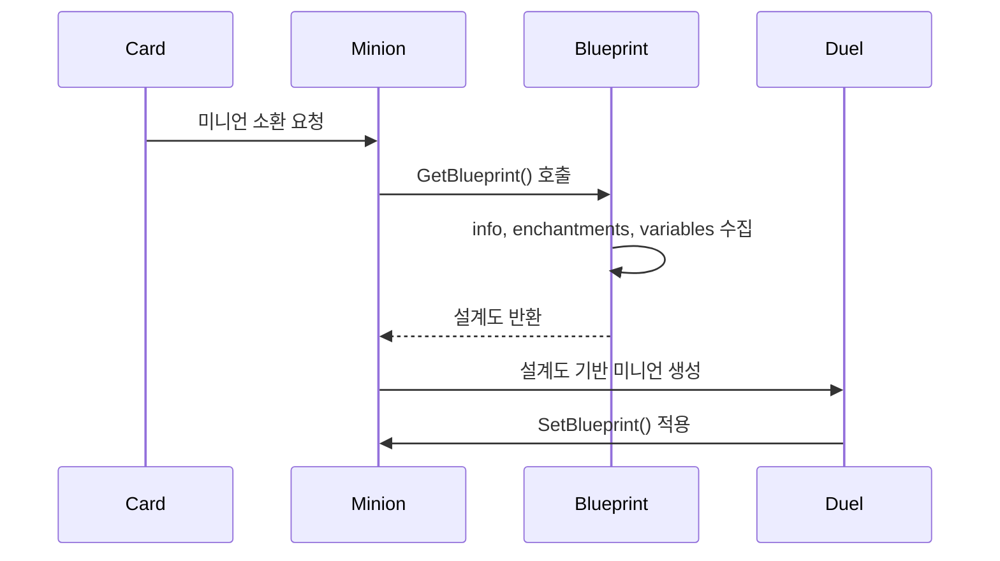

# 미니언 시스템 (Minion.mlua)

## 📋 개요

`Minion.mlua`는 메이플 듀얼에서 필드에 배치되어 지속적으로 활동하는 유닛 카드들을 구현하는 핵심 컴포넌트입니다. `Unit`을 상속받아 기본적인 전투 유닛 기능을 가지며, 추가로 다양한 상태 효과, 특수 능력, 시각적 표현 등을 담당합니다. 미니언들은 필드에서 서로 전투하고, 플레이어를 공격하며, 다양한 카드 효과의 대상이 되는 게임의 핵심 전투 단위입니다.

**관련 파일**: 
- `RootDesk/MyDesk/Components/Objects/Minion.mlua`

## 🏗️ 미니언 시스템 아키텍처

### 상속 구조와 컴포넌트 관계



### 핵심 프로퍼티

#### 기본 속성
- `player`: 미니언을 소유한 플레이어
- `field`: 미니언이 배치된 필드
- `atk`: 현재 공격력 (Unit의 기본 atk와 별도)
- `info`: 카드 정보 (name, variant, quality)

#### 상태 효과
- `hasBarrier`: 방어막 보유 여부
- `hasVenom`: 독 보유 여부 
- `hasChill`: 냉기 보유 여부
- `isFreeze`: 동결 상태 여부
- `isStun`: 기절 상태 여부
- `isScare`: 공포 상태 여부

#### 특수 능력
- `isDirectAttackable`: 상대 플레이어 직접 공격 가능 여부
- `isImmuneToStrong`: 강인함 (특정 효과 면역)
- `isPivotable`: 위치 변경 가능 여부
- `tagArray`: 미니언의 태그 배열 (효과 적용 조건)

#### 시각적 요소
- `minionEntity`: 미니언 시각적 모델
- `barrierEntity`: 방어막 시각적 효과
- `venomEntity`: 독 시각적 효과
- `freezeEntity`: 동결 시각적 효과
- `stunEntity`: 기절 시각적 효과
- `scareEntity`: 공포 시각적 효과

## ⚔️ 1. 전투 시스템

### 전투 참여 조건

#### IsBattler() 메커니즘
```lua
method boolean IsBattler()
    return not self.isFreeze
end
```

미니언이 전투에 참여할 수 있는지 판단하는 핵심 메서드입니다. 동결 상태가 아닐 때만 전투 가능합니다.

#### IsDirectAttacker() 메커니즘
```lua
method boolean IsDirectAttacker()  
    return self:IsBattler() and self.isDirectAttackable
end
```

상대 플레이어를 직접 공격할 수 있는 미니언을 구분합니다.

### 데미지 처리 시스템

#### 고급 데미지 계산


**데미지 처리 특징**:
- **방어막 적용**: `hasBarrier`가 있으면 데미지 1 감소 후 방어막 제거
- **초과 데미지**: 체력을 초과한 데미지는 `excessDamage`로 반환
- **냉기 동결**: 사망 시 `hasChill`이 있으면 동결 상태로 전환
- **시각적 피드백**: 데미지 스킨, 애니메이션, 사운드 동시 처리

### 공격력 시스템

#### SetAtk() 메커니즘
```lua
method void SetAtk(integer atk)
    atk = math.max(0, atk)
    if self.atk == atk then
        return
    end
    
    self.atk = atk
    -- 시각적 UI 업데이트 로직
end
```

미니언의 공격력은 동적으로 변경 가능하며, 변경 시 즉시 UI에 반영됩니다.

## 🛡️ 2. 상태 효과 시스템

### 방어막 시스템 (Barrier)

#### 방어막 메커니즘


**SetBarrier() 기능**:
- 방어막 상태 설정/해제
- 시각적 방어막 엔티티 생성/제거
- 하나의 공격만 막는 1회성 효과

### 독 시스템 (Venom)

#### 독 효과
`hasVenom` 상태는 상대방에게 지속적인 데미지나 특수 효과를 주는 능력을 나타냅니다.

**SetVenom() 기능**:
- 독 보유 상태 설정
- 시각적 독 효과 표시
- 인챈트먼트를 통한 독 효과 적용 가능

### 동결 시스템 (Freeze)

#### 동결 메커니즘
```lua
method void SetFreeze(boolean isFreeze)
    if self.isFreeze == isFreeze then return end
    
    self.isFreeze = isFreeze
    
    if self:IsClient() then
        if isFreeze then
            -- 동결 시각적 효과 적용
            self.freezeEntity.Enable = true
        else
            -- 동결 해제
            self.freezeEntity.Enable = false
        end
    end
end
```

**동결 효과**:
- `IsBattler() = false` — 전투 참여 불가
- 시각적 얼음 효과 표시
- 냉기(`hasChill`)를 가진 미니언이 사망 시 동결 상태로 전환

### 기절 시스템 (Stun)

#### 기절 vs 동결
- **기절 (`isStun`)**: 공격 시 Miss 처리
- **동결 (`isFreeze`)**: 전투 참여 자체가 불가

**SetStun() 특징**:
- 기절 상태 시각적 표시
- Player의 Damage 처리에서 Miss 로직과 연동

### 공포 시스템 (Scare)

**공포 효과**:
- 50% 확률로 공격 Miss
- Player의 데미지 처리에서 랜덤 판정
- 기절보다는 약하지만 지속적인 방해 효과

## 🎨 3. 시각적 표현 시스템

### 액터와 바디 시스템

#### 미니언 시각적 구조


#### SpawnAndSetBody() 시스템
```lua
method void SpawnAndSetBody()
    local bodyModelName = string.format("%s%s%sMinionBody", 
        self.name, self.variant, self.quality)
    local bodyModelId = _EntryService:GetModelIdByName(bodyModelName)
    
    self:SetBody(_SpawnService:SpawnByModelId(
        bodyModelId, bodyModelName, Vector3.zero, self.actor.Entity).MinionBody)
end
```

**동적 모델 로딩**:
- **이름 기반**: 카드명 + 변형 + 품질로 모델 결정
- **품질별 차별화**: Normal, Gold 등 품질에 따른 다른 외형
- **변형 시스템**: 같은 카드의 다양한 스킨 버전 지원

### 상태 효과 시각화

#### 상태 효과 엔티티 관리
각 상태 효과는 독립적인 시각적 엔티티를 가지며, 상태 변경 시 즉시 반영됩니다.

```lua
-- 예시: 방어막 시각화
if hasBarrier then
    self.barrierEntity.Enable = true
    -- 방어막 시각적 효과 활성화
else
    self.barrierEntity.Enable = false
    -- 방어막 효과 비활성화
end
```

## 🔧 4. 설계도 시스템 (Blueprint)

### 미니언 복제 및 생성

#### GetBlueprint() / SetBlueprint() 시스템


**설계도 구성**:
```lua
method table GetBlueprint()
    return {
        info = self.info,                           -- 카드 기본 정보
        enchantmentArray = _Table:DeepCopy(self.enchantmentArray), -- 인챈트먼트
        independentVariableTable = self:GetIndependentVariables()  -- 독립 변수들
    }
end
```

**독립 변수들**:
- `hasBarrier`: 방어막 상태
- `isFreeze`: 동결 상태  
- `isStun`: 기절 상태
- `isScare`: 공포 상태

### 미니언 정보 시스템

#### SetInfo() 메커니즘
```lua
method void SetInfo(table info)
    self.info = info or {}
    self.name = info.name or ""
    self.variant = info.variant or ""
    self.quality = info.quality or ""
    
    -- 카드 매니저에서 기본 스탯 로딩
    self:SetBarrier(self.cardManager:HasBarrier(self.name))
    self:SetFreeze(false)
end
```

카드 데이터로부터 미니언의 기본 특성을 설정합니다.

## 🎯 5. 소환 및 애니메이션

### 소환 코루틴 시스템

#### SummonCoroutine() 메커니즘
```lua
method void SummonCoroutine()
    self.summonCoroutine = self.duel.actionManager:SummonCoroutine(self)
end
```

미니언이 필드에 등장할 때의 화려한 소환 애니메이션을 ActionManager와 연동하여 처리합니다.

### 애니메이션 상태 관리

#### 애니메이션 상태 전환
- `animationState`: 현재 애니메이션 상태 추적
- Unit의 `Animate()` 메서드 상속으로 다양한 애니메이션 재생
- 공격, 피격, 사망 등의 상황별 애니메이션

## 🔄 6. 동기화 및 상태 관리

### 프로퍼티 동기화

#### GetProperties() 동기화 데이터
```lua
method table GetProperties()
    return {
        id = self.id,
        enchantmentArray = self.enchantmentArray,
        auraEnchantmentArray = self.auraEnchantmentArray,
        player = self.player,
        field = self.field,
        info = self.info,
        -- Unit에서 상속받은 추가 변수들
    }
end
```

**실시간 동기화 요소**:
- **소유권 정보**: 플레이어와 필드 참조
- **카드 정보**: 이름, 변형, 품질
- **상태 효과**: 독립 변수로 관리되는 상태들
- **인챈트먼트**: 임시 효과들

### GetIndependentVariables() 시스템

독립적으로 관리되어야 하는 변수들을 별도로 분류:

```lua
method table GetIndependentVariables()
    return {
        hasBarrier = self.hasBarrier,
        isFreeze = self.isFreeze,
        isStun = self.isStun,
        isScare = self.isScare,
    }
end
```

이 변수들은 서버-클라이언트 동기화와 설계도 시스템에서 중요한 역할을 합니다.

## 🎮 7. 게임플레이 연동

### 태그 시스템

#### tagArray 활용
미니언의 `tagArray`는 다양한 카드 효과의 조건부 적용에 사용됩니다:
- 특정 태그를 가진 미니언에게만 효과 적용
- 태그 기반 데미지 보정 (Player의 `taggedSkillDamageTable`)
- 선택적 효과 대상 지정

### 입력 상태 관리

#### GetInputState() 상호작용 제어
```lua
method table GetInputState(Character character)
    -- 미니언과의 상호작용 가능 여부 판단
    -- 타겟팅, 효과 적용 등에 사용
end
```

플레이어의 카드 효과나 능력 사용 시 대상 선택 가능 여부를 제어합니다.

## 💡 코드 참조

핵심 미니언 시스템 로직:
- `Minion.mlua :: SetBlueprint()` — 설계도 기반 미니언 생성
- `Minion.mlua :: Damage()` — 고급 데미지 처리 시스템
- `Minion.mlua :: IsBattler()` — 전투 참여 가능 여부
- `Minion.mlua :: SetBarrier()` — 방어막 상태 관리
- `Minion.mlua :: SetFreeze()` — 동결 상태 관리
- `Minion.mlua :: SpawnAndSetBody()` — 시각적 모델 생성
- `Minion.mlua :: GetIndependentVariables()` — 독립 변수 관리

미니언 시스템은 메이플 듀얼의 전투 시스템 핵심을 담당하며, 다양한 상태 효과와 전술적 요소를 통해 게임의 전략적 깊이를 제공하는 중요한 시스템입니다.
