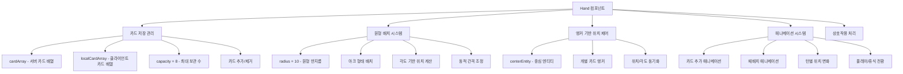
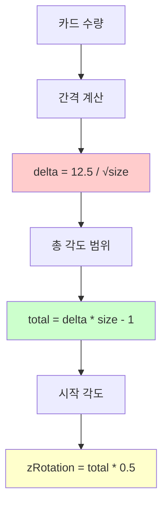
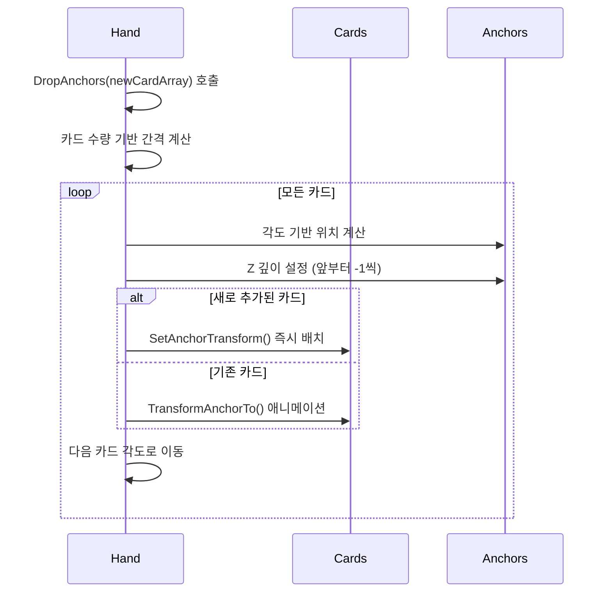
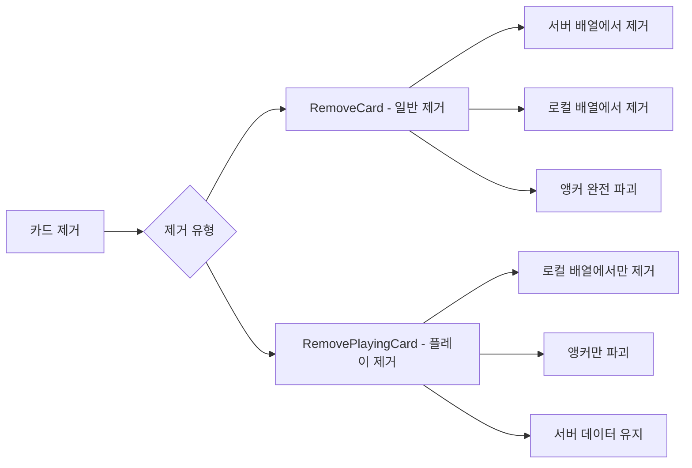
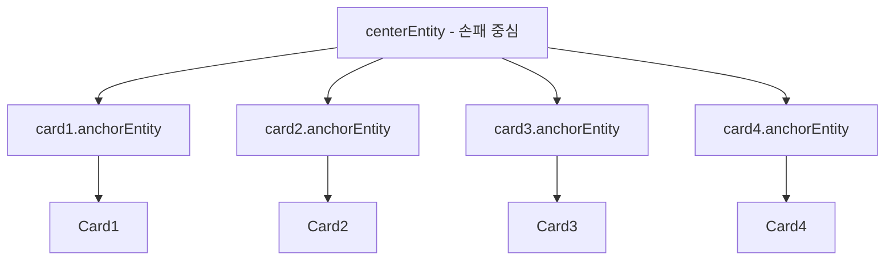
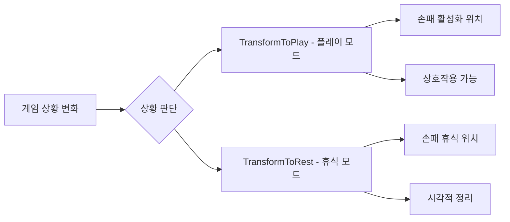
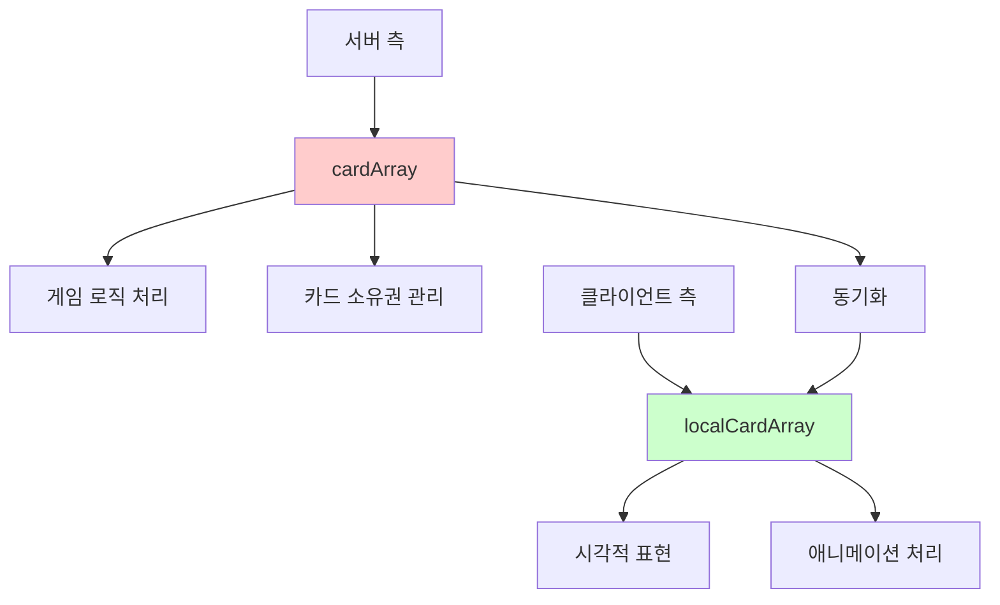

# 손패 시스템 (Hand.mlua)

## 📋 개요

`Hand.mlua`는 메이플 듀얼에서 플레이어의 손에 있는 카드들을 관리하는 핵심 컴포넌트입니다. 각 플레이어는 최대 8장의 카드를 손패에 보관할 수 있으며, 이들 카드의 시각적 배치, 애니메이션, 플레이어 상호작용 등을 담당합니다. 원형 아크 형태의 독특한 레이아웃과 물리적인 카드 조작감을 제공하여 직관적인 카드 게임 경험을 구현합니다.

**관련 파일**: 
- `RootDesk/MyDesk/Components/Objects/Hand.mlua`

## 🏗️ 손패 시스템 아키텍처

### 시스템 구조



### 핵심 프로퍼티

#### 카드 관리
- `cardArray`: 서버에서 관리하는 실제 카드 배열
- `localCardArray`: 클라이언트 시각적 표현용 로컬 배열
- `capacity = 8`: 손패 최대 보관 가능 카드 수
- `player`: 손패를 소유한 플레이어

#### 배치 시스템  
- `radius = 10`: 원형 배치의 반지름
- `centerEntity`: 손패 중심점 엔티티
- `isOurs`: 우리편/상대편 구분

#### 애니메이션
- `tweener`: 손패 전체 애니메이션 처리기

## 🎮 1. 원형 배치 시스템

### 수학적 위치 계산

#### GetAnchorPosition() 메커니즘
```lua
method Vector2 GetAnchorPosition(number radius, number zRotation)
    local angle = math.rad(zRotation + 90)
    return Vector2(radius * math.cos(angle), radius * math.sin(angle))
end
```

손패의 카드들은 원형 아크를 따라 배치되며, 각 카드의 위치는 삼각함수로 정확히 계산됩니다.

#### 동적 간격 시스템


**간격 계산 공식**:
- **기본 간격**: `delta = 12.5 / √size` — 카드 수에 반비례하여 간격 조정
- **총 범위**: `total = delta * (size - 1)` — 전체 아크의 각도 범위
- **중심 정렬**: 전체 범위의 절반부터 시작하여 중심 대칭 배치

### DropAnchors() 배치 시스템

#### 실시간 위치 재계산


**배치 특징**:
- **실시간 계산**: 카드 수 변화 시 즉시 재배치
- **부드러운 전환**: 기존 카드들은 애니메이션으로 이동
- **깊이 관리**: Z 위치로 카드 겹침 순서 제어
- **즉시 배치**: 새 카드는 애니메이션 없이 바로 배치

## 🎯 2. 카드 관리 시스템

### 카드 추가 시스템

#### InsertCards() 메커니즘
```lua
method void InsertCards(table cardArray)
    for _, card in ipairs(cardArray) do
        self:InsertCard(card)                -- 서버 배열에 추가
        table.insert(self.localCardArray, card)  -- 로컬 배열에 추가  
        self:SpawnAndAttachToAnchor(card)    -- 앵커 생성 및 연결
    end
    
    self:DropAnchors(cardArray)              -- 위치 재계산
end
```

**추가 과정**:
1. **서버 등록**: `card.hand = self` 참조 설정
2. **로컬 동기화**: 클라이언트 시각적 배열에 추가
3. **앵커 생성**: 개별 카드의 위치 제어점 생성
4. **위치 재계산**: 전체 손패 레이아웃 업데이트

### 카드 제거 시스템

#### 일반 제거 vs 플레이 제거


**RemoveCards() - 완전 제거**:
- 덱으로 되돌리기, 버리기 등에 사용
- 서버와 클라이언트 모두에서 제거

**RemovePlayingCard() - 플레이 제거**:
- 카드 플레이 시 시각적으로만 제거
- 서버 데이터는 유지 (다른 시스템에서 처리)

## 🎨 3. 시각적 표현 시스템

### 앵커 기반 위치 제어

#### 개별 카드 앵커 시스템
각 카드는 독립적인 앵커 엔티티를 가지며, 이를 통해 정밀한 위치와 회전 제어가 가능합니다.



#### 앵커 생명주기 관리
```lua
-- 앵커 생성
method void SpawnAnchor(Card card)
    card.anchorEntity = _SpawnService:SpawnByModelId(
        _EntryService:GetModelIdByName("Anchor"), "Anchor", 
        card.actor.Entity.TransformComponent.WorldPosition, 
        self.centerEntity)  -- 중심 엔티티에 부착
end

-- 앵커 정리
method void DestroyAnchor(Card card)
    card:DestroyTweener()
    card:DestroyAnchorTweener()
    card.actor.Entity:Detach()
    card.anchorEntity:Destroy()
    card.anchorEntity = nil
end
```

### 턴별 위치 변화

#### OnSyncProperties() 턴 반응
```lua
method void OnSyncProperties()
    local transform = self.centerEntity.TransformComponent
    if self.player.isEndRoundDeclared then
        transform.Position.y = -0.4      -- 라운드 종료 선언 시 아래로
    elseif self.player:IsOurTurn() then
        transform.Position.y = 0.6       -- 우리 턴일 때 위로
    end
end
```

**위치 변화 의미**:
- **턴 활성화**: 우리 턴일 때 손패가 위로 올라와서 접근성 향상
- **라운드 종료**: 더 이상 플레이하지 않음을 시각적으로 표현
- **부드러운 전환**: 턴 변화 시 자연스러운 위치 이동

### 애니메이션 시스템

#### TransformToPlay() / TransformToRest() 시스템
Plan.json에 따르면 이 메서드들이 존재하며, 게임 상황에 따른 손패 위치 전환을 담당합니다.



## 🔄 4. 동기화 및 상태 관리

### 이중 배열 시스템

#### 서버-클라이언트 분리 관리


**분리 관리의 장점**:
- **서버 권한**: 실제 카드 소유권은 서버가 관리
- **클라이언트 최적화**: 시각적 표현은 로컬에서 빠르게 처리
- **동기화 보장**: 서버 변경 시 클라이언트 자동 업데이트

### SetSide() 위치 설정

#### 플레이어별 손패 위치
```lua
method void SetSide(boolean isOurs)
    self.isOurs = isOurs
    
    local transform = self.layout:GetTransform(
        isOurs and "OurHand" or "EnemyHand")
    self.Entity.TransformComponent.WorldPosition = transform.WorldPosition:Clone()
    self.Entity.TransformComponent.WorldZRotation = transform.WorldZRotation
end
```

**위치 특성**:
- **우리편 손패**: 화면 하단, 카드가 위쪽을 향함
- **상대편 손패**: 화면 상단, 카드가 뒤집어져 있음
- **레이아웃 연동**: Layout 시스템에서 정의된 위치 사용

## 🎯 5. 카드 선택 및 상호작용

### 랜덤 선택 시스템

#### ShareRandomCards() 메커니즘
```lua
method table ShareRandomCards(integer count, any selector)
    return self.commandManager:ShareRandomPermutationInArray(
        self:GetCards(selector), count)
end
```

**랜덤 선택 특징**:
- **서버 동기화**: CommandManager를 통한 결정적 랜덤성
- **선택적 필터**: selector로 특정 조건의 카드만 선택 가능
- **카드 효과 지원**: 다양한 카드 효과에서 활용

#### ShareRandomBlueprints() 설계도 시스템
```lua
method table ShareRandomBlueprints(integer count, any selector)
    if self:IsServer() then
        blueprintArray = {}
        local cardArray = _Table:GetRandomPermutation(self:GetCards(selector), count)
        for i, card in ipairs(cardArray) do
            blueprintArray[i] = card:GetBlueprint()  -- 카드 설계도만 추출
        end
        self.commandManager:PushPackage(blueprintArray)
    else
        blueprintArray = self.commandManager:PopPackage()
    end
end
```

상대방에게 카드 정보를 보여줘야 하는 효과에서 사용되는 시스템입니다.

## 🎮 6. 게임플레이 연동

### 용량 관리

#### 손패 한계 시스템
- `IsFull()` — 8장 가득 찬 상태 확인
- `IsEmpty()` — 빈 손패 상태 확인
- 카드 드로우 시 용량 초과 방지

### 카드 플레이 지원

#### 플레이 가능 카드 필터링
```lua
method table GetCards(any selector)
    local cardArray = _Table:ShallowCopy(self.cardArray)
    return selector and _Table:Select(cardArray, selector) or cardArray
end
```

다양한 조건으로 카드를 필터링하여 게임 상황에 맞는 카드들만 선택 가능합니다.

## 💡 코드 참조

핵심 손패 관리 로직:
- `Hand.mlua :: InsertCards()` — 카드 손패 추가
- `Hand.mlua :: RemoveCards()` — 카드 손패 제거
- `Hand.mlua :: DropAnchors()` — 원형 배치 위치 계산
- `Hand.mlua :: GetAnchorPosition()` — 수학적 위치 계산
- `Hand.mlua :: ShareRandomCards()` — 랜덤 카드 선택
- `Hand.mlua :: OnSyncProperties()` — 턴별 위치 동기화

손패 시스템은 직관적이고 아름다운 카드 관리 인터페이스를 제공하며, 플레이어가 자연스럽게 카드를 조작할 수 있는 핵심 시스템입니다.
