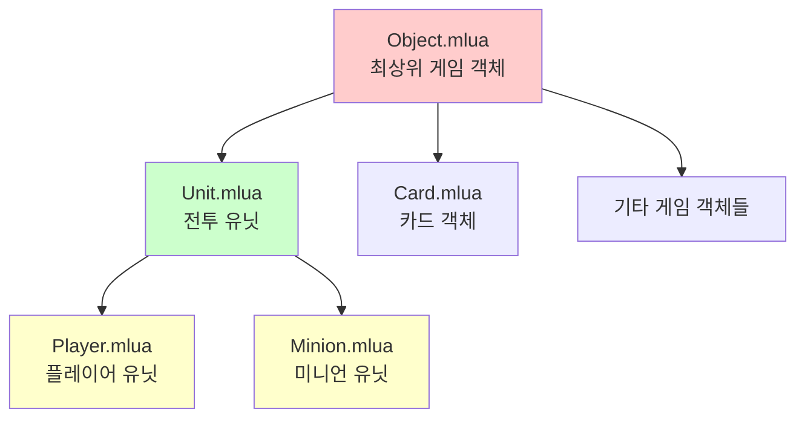
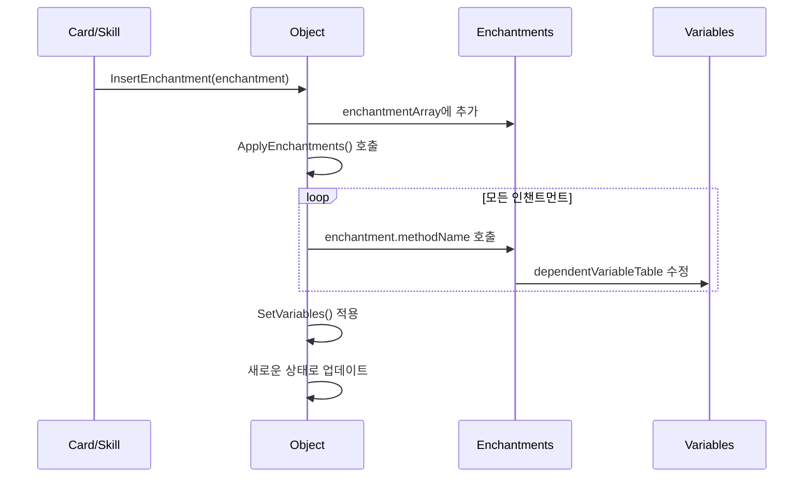
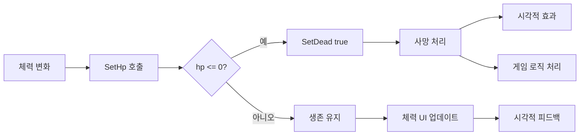
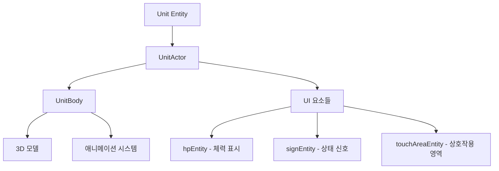
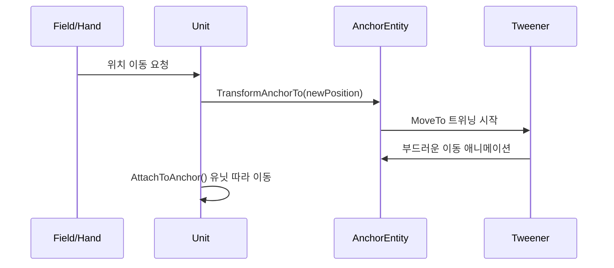
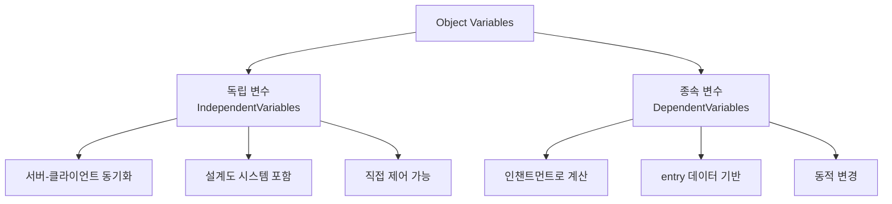
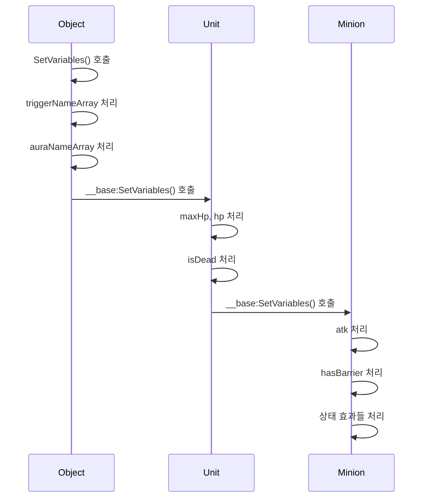

# 유닛 기본 시스템 (Unit.mlua & Object.mlua)

## 📋 개요

메이플 듀얼의 유닛 기본 시스템은 게임 내 모든 상호작용 가능한 객체들의 공통 기반을 제공하는 핵심 아키텍처입니다. `Object.mlua`는 모든 게임 객체의 최상위 기본 클래스로서 매니저 시스템과의 연동, 인챈트먼트 관리, 타입 체크 등의 기본 기능을 제공하며, `Unit.mlua`는 Object를 상속받아 체력, 전투, 애니메이션 등 전투 유닛으로서의 공통 기능을 추가합니다.

**관련 파일**: 
- `RootDesk/MyDesk/Components/Objects/Object.mlua` (최상위 기본 클래스)
- `RootDesk/MyDesk/Components/Objects/Unit.mlua` (전투 유닛 기본 클래스)

## 🏗️ 시스템 아키텍처

### 상속 구조도



### Object.mlua - 최상위 기본 클래스

#### 핵심 책임
- **매니저 시스템 연동**: 모든 게임 매니저에 대한 참조 관리
- **인챈트먼트 시스템**: 임시 효과 및 버프/디버프 관리
- **타입 체크**: 객체 종류 판별 시스템
- **설계도 시스템**: 객체 복제 및 생성 지원
- **동기화 기반**: 서버-클라이언트 프로퍼티 동기화

#### 핵심 프로퍼티
```lua
-- 매니저 시스템 참조들
property Duel duel = nil
property ActionManager actionManager = nil
property AuraManager auraManager = nil
property CommandManager commandManager = nil
-- ... 기타 매니저들

-- 기본 객체 정보
property number id = 0
property string name = ""
property table entry = {}

-- 인챈트먼트 시스템
property table enchantmentArray = {}
property table auraEnchantmentArray = {}
property table dependentVariableTable = {}
```

### Unit.mlua - 전투 유닛 기본 클래스

#### 핵심 책임
- **전투 시스템**: 체력, 생존, 사망 관리
- **시각적 표현**: 액터, 바디, 애니메이션 시스템 
- **위치 제어**: 앵커 기반 위치 및 이동 시스템
- **상호작용**: 터치 영역, 타겟팅 시스템
- **상태 관리**: 생존 상태 및 전투 상태

#### 핵심 프로퍼티
```lua
-- 시각적 표현
property UnitActor actor = nil
property UnitBody body = nil
property Entity signEntity = nil

-- 체력 시스템
property integer maxHp = nil
property integer hp = nil
property boolean isDead = nil

-- 위치 및 애니메이션
property Entity anchorEntity = nil
property any tweener = nil
property any anchorTweener = nil
```

## 🎯 1. Object.mlua 핵심 기능

### 매니저 시스템 연동

#### OnBeginPlay() 자동 연결
```lua
method void OnBeginPlay()
    local duel = self.Entity.CurrentMap.Map.duel
    if isvalid(duel) then
        self.duel = duel
        self.history = duel.history
        self.layout = duel.layout
        self.actionManager = duel.actionManager
        self.auraManager = duel.auraManager
        self.commandManager = duel.commandManager
        -- ... 모든 매니저 자동 연결
    end
end
```

**자동 연결 이점**:
- **편의성**: 모든 Object 하위 클래스가 자동으로 매니저 접근 가능
- **일관성**: 게임 전반에 걸친 통일된 매니저 접근 방식
- **확장성**: 새로운 매니저 추가 시 한 곳에서만 수정

### 타입 체크 시스템

#### 동적 타입 판별
```lua
method boolean IsUnit()
    return isvalid(self.Entity.Unit)
end

method boolean IsMinion()
    return isvalid(self.Entity.Minion)
end

method boolean IsPlayer()
    return isvalid(self.Entity.Player)
end

method boolean IsCard()
    return isvalid(self.Entity.Card)
end
```

**활용 사례**:
- **조건부 효과**: 특정 타입에만 효과 적용
- **스킬 타겟팅**: 미니언에게만 적용되는 스킬
- **데미지 계산**: 플레이어와 미니언에 대한 다른 처리

### 인챈트먼트 시스템

#### 동적 효과 적용 시스템


**인챈트먼트 구조**:
```lua
enchantment = {
    methodName = "SetMaxHpEnchantment",  -- 적용할 메서드명
    args = {5},                          -- 메서드 인수들
    remover = {                          -- 제거 조건
        eventName = "TurnEnd",
        args = {}
    }
}
```

**적용 예시**:
- **임시 체력 증가**: "이 턴 동안 체력 +3"
- **공격력 버프**: "이 게임 동안 공격력 +2"
- **특수 능력 부여**: "방어막을 획득합니다"

### 설계도 시스템

#### GetBlueprint() / SetBlueprint() 패턴
```lua
-- 기본 설계도 생성
method table GetBlueprint()
    return {
        info = self.info,
        enchantmentArray = _Table:DeepCopy(self.enchantmentArray),
        independentVariableTable = self:GetIndependentVariables()
    }
end

-- 설계도로부터 객체 구성
method void SetBlueprint(table blueprint)
    self:SetInfo(blueprint.info)
    self:SetEnchantments(blueprint.enchantmentArray)
    self:SetVariables(blueprint.independentVariableTable)
end
```

**설계도 활용**:
- **카드 소환**: 카드로부터 미니언 생성
- **복제 효과**: "미니언을 복제합니다"
- **변형 효과**: 다른 미니언으로 변환

## ⚔️ 2. Unit.mlua 핵심 기능

### 체력 관리 시스템

#### 생존 상태 관리


**SetHp() 메커니즘**:
```lua
method void SetHp(integer hp)
    hp = math.max(0, math.min(hp, self.maxHp))
    if self.hp == hp then
        return
    end
    
    self.hp = hp
    
    if self.hp <= 0 then
        self:SetDead(true)
    end
    
    -- 시각적 업데이트
    if self:IsClient() then
        self.hpInteger:SetInteger(self.hp)
        -- 애니메이션 효과 적용
    end
end
```

### 액터 시스템

#### 시각적 표현 계층 구조


**SetActor() / ClearActor() 관리**:
```lua
method void SetActor(any actor)
    self.actor = actor
    actor.object = self  -- 양방향 참조
end

method void ClearActor()
    if isvalid(self.actor) then
        self.actor.object = nil
        self.actor = nil
    end
end
```

### 앵커 기반 위치 시스템

#### 정밀한 위치 제어
유닛들은 앵커 엔티티를 통해 정확한 위치 제어와 부드러운 애니메이션을 구현합니다.



**앵커 시스템 메서드들**:
- `TransformAnchorTo()` — 앵커를 새 위치로 이동 (애니메이션)
- `TransformToAnchor()` — 유닛을 앵커 위치로 이동
- `AttachToAnchor()` — 유닛을 앵커에 부착

### 터치 및 상호작용 시스템

#### IsInTouchArea() 정밀 판정
```lua
method boolean IsInTouchArea(Vector2 point)
    local transform = self.actor.Entity.TransformComponent
    local position = transform.WorldPosition
    local angle = math.rad(transform.ZRotation)
    
    -- 회전 변환 적용
    local localX = math.cos(angle) * (point.x - position.x) + math.sin(angle) * (point.y - position.y)
    local localY = -math.sin(angle) * (point.x - position.x) + math.cos(angle) * (point.y - position.y)
    
    local touchAreaHalfX = 0.92 * 0.5
    local touchAreaHalfY = 0.92 * 0.5
    
    return math.abs(localX) < touchAreaHalfX and math.abs(localY) < touchAreaHalfY
end
```

**정밀 판정 특징**:
- **회전 고려**: 유닛의 회전 각도를 고려한 정확한 영역 판정
- **표준 크기**: 0.92 × 0.92 표준 터치 영역
- **효율성**: 빠른 수학 연산으로 실시간 판정

### 애니메이션 시스템

#### Animate() 추상 메서드
```lua
method void Animate(string toAnimationState)
    -- 하위 클래스에서 구체적 구현
    -- Player: 직업별 스킬 애니메이션
    -- Minion: 미니언별 고유 애니메이션
end
```

Unit은 애니메이션의 기본 틀을 제공하고, Player와 Minion에서 각각의 특성에 맞는 애니메이션을 구현합니다.

## 🔄 3. 동기화 및 상태 관리

### 변수 시스템

#### 종속/독립 변수 분리


**독립 변수 (IndependentVariables)**:
- Object: `temp` (임시 데이터)
- Unit: `isDead`, `hp` (생존 상태)
- Minion: `hasBarrier`, `isFreeze` 등 (상태 효과)

**종속 변수 (DependentVariables)**:
- Entry 데이터 + 인챈트먼트 적용 결과
- 동적으로 계산되는 최종 스탯들

### SetVariables() 연쇄 시스템

#### 상속 계층별 변수 적용


각 계층은 자신이 담당하는 변수들만 처리하고, 상위 계층의 처리를 호출하는 체계적인 구조입니다.

## 🎮 4. 게임플레이 연동

### 타겟팅 시스템

#### IsTargetable() 확장 가능 시스템
```lua
-- Object 기본 구현
method boolean IsTargetable(Player player)
    return true
end

-- Unit에서 확장
method boolean IsTargetable(Player player)  
    return __base:IsTargetable(player)
end

-- Minion에서 구체적 구현
method boolean IsTargetable(Player player)
    return not self.isDead and self.field.player ~= player
end
```

각 객체 타입에 따라 타겟팅 가능 조건을 다르게 구현할 수 있습니다.

### 시그널 시스템

#### commandManager.signableArray 등록
```lua
method void OnBeginPlay()
    if self:IsClient() then
        table.insert(self.commandManager.signableArray, self)
    end
end
```

유닛들은 자동으로 CommandManager의 시그널 시스템에 등록되어 게임 상태 변화에 반응할 수 있습니다.

## 🛠️ 5. 확장성과 재사용성

### 템플릿 메서드 패턴

#### 공통 로직과 특화 로직 분리
Object와 Unit은 템플릿 메서드 패턴을 활용하여 공통 로직은 기본 클래스에서 제공하고, 특화된 로직은 하위 클래스에서 구현합니다.

**공통 로직 예시**:
- 매니저 시스템 연동
- 인챈트먼트 적용
- 프로퍼티 동기화
- 설계도 시스템

**특화 로직 예시**:
- Player: MP 시스템, 스킬 애니메이션
- Minion: 상태 효과, 전투 능력
- Card: 카드 효과, 플레이 조건

### 인터페이스 통일성

#### 일관된 메서드 시그니처
모든 게임 객체가 Object를 상속받음으로써 일관된 인터페이스를 제공합니다:
- `GetProperties()` / `SetProperties()`
- `GetBlueprint()` / `SetBlueprint()`
- `IsTargetable()` / `IsUnit()` 등

## 💡 코드 참조

Object.mlua 핵심 로직:
- `Object.mlua :: OnBeginPlay()` — 매니저 시스템 자동 연결
- `Object.mlua :: ApplyEnchantments()` — 인챈트먼트 시스템 핵심
- `Object.mlua :: IsMinion()` / `IsPlayer()` 등 — 타입 체크 시스템
- `Object.mlua :: GetBlueprint()` — 설계도 생성

Unit.mlua 핵심 로직:
- `Unit.mlua :: SetHp()` — 체력 및 생존 상태 관리
- `Unit.mlua :: TransformAnchorTo()` — 앵커 기반 위치 제어
- `Unit.mlua :: IsInTouchArea()` — 정밀한 터치 영역 판정
- `Unit.mlua :: SetVariables()` — 계층적 변수 시스템

유닛 기본 시스템은 메이플 듀얼의 모든 게임 객체에 대한 견고한 기반을 제공하며, 확장 가능하고 재사용 가능한 아키텍처를 통해 복잡한 게임 로직을 체계적으로 관리합니다.
