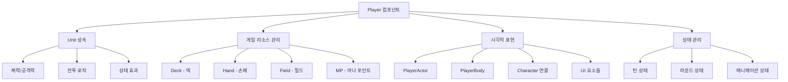
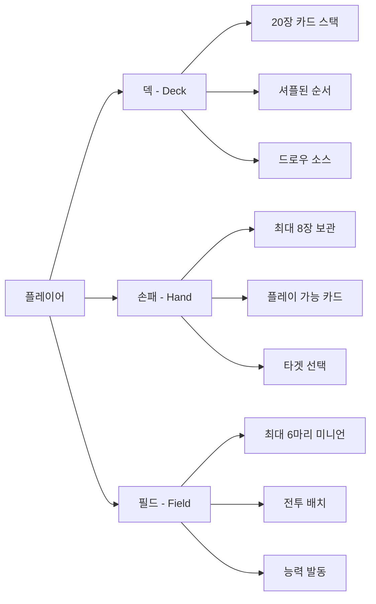
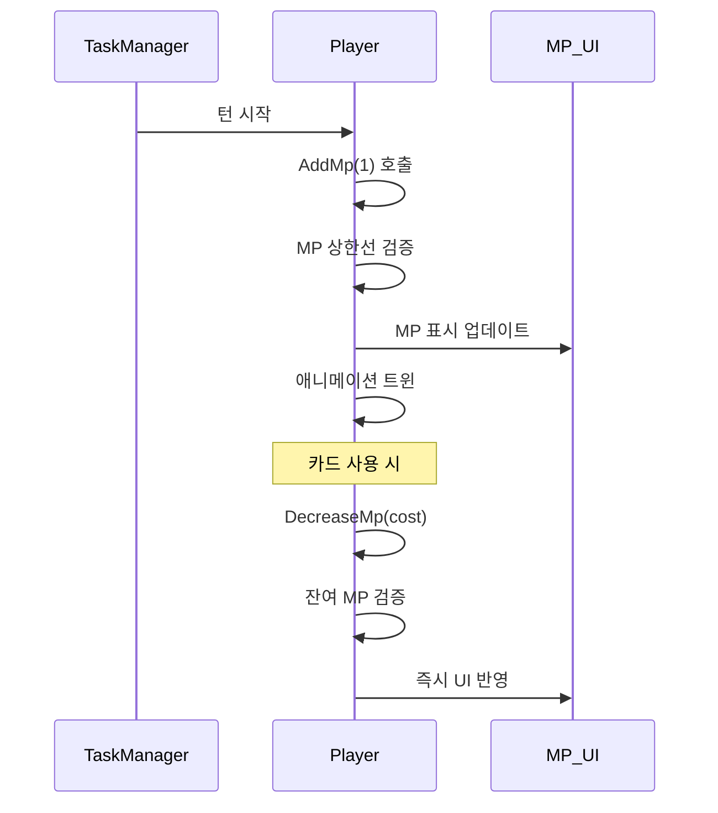
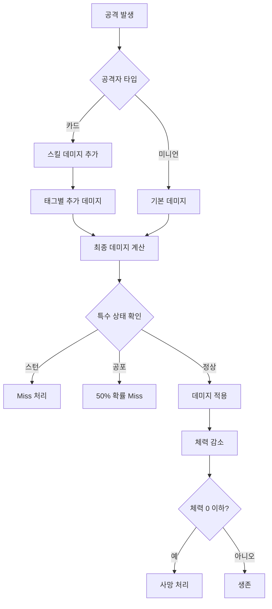
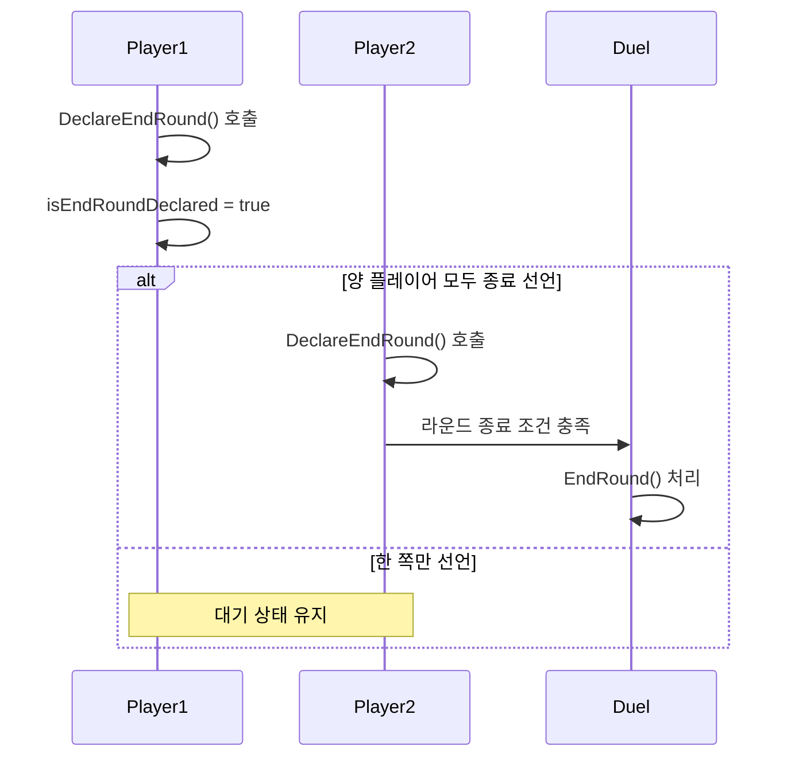
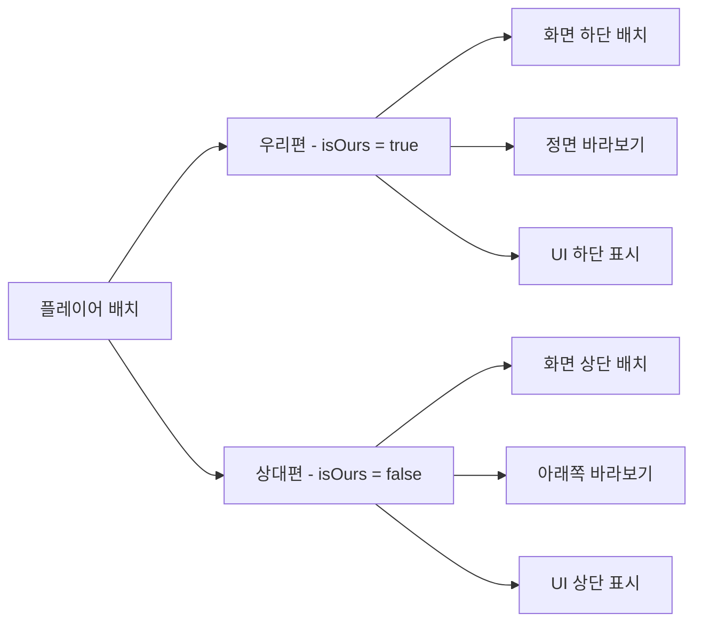
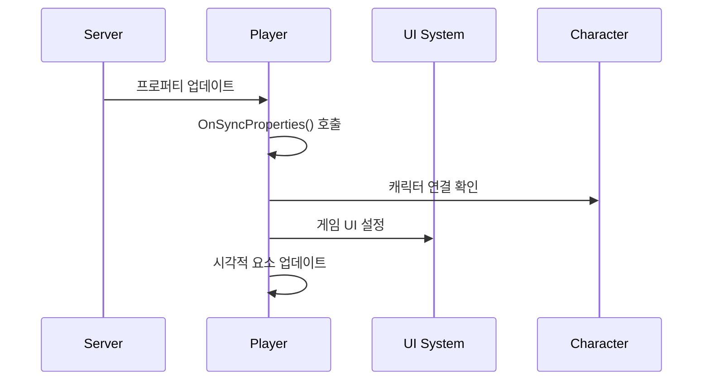

# 플레이어 시스템 (Player.mlua)

## 📋 개요

`Player.mlua`는 메이플 듀얼에서 개별 플레이어를 나타내는 핵심 컴포넌트입니다. `Unit`을 상속받아 전투 유닛으로서의 기본 기능을 가지며, 동시에 카드 게임의 플레이어로서 덱, 손패, 필드, MP 관리 등의 모든 기능을 담당합니다. 게임 중에는 두 개의 Player 인스턴스가 생성되어 대전을 진행하며, 각각 독립적인 게임 리소스와 상태를 관리합니다.

**관련 파일**: 
- `RootDesk/MyDesk/Components/Objects/Player.mlua`

## 🏗️ 플레이어 시스템 아키텍처

### 계층구조 및 관계



### 핵심 프로퍼티

#### 게임 리소스
- `deck`: 플레이어의 덱 컴포넌트
- `hand`: 손패 관리 컴포넌트
- `field`: 필드 (미니언 배치 영역) 컴포넌트
- `opponent`: 상대방 플레이어 참조

#### MP 시스템
- `mp`: 현재 마나 포인트 (카드 사용 리소스)
- `maxMp`: 최대 마나 포인트 한계
- `mpInteger`: MP 표시 UI 컴포넌트
- `mpTweener`: MP 변화 애니메이션 처리

#### 캐릭터 연결
- `character`: 연결된 Character 컴포넌트 (플레이어 데이터)
- `cardBack`: 선택된 카드 뒷면 디자인
- `class`: 덱의 직업 (Warrior, Magician 등)

#### 게임 상태
- `isReady`: 게임 준비 완료 상태
- `isServing`: 게임 진행 중인지 여부
- `isOurs`: 우리편/상대편 구분
- `isEndRoundDeclared`: 라운드 종료 선언 여부
- `isPlaying`: 현재 플레이 중인지 여부

## 🎮 1. 게임 리소스 관리

### 플레이어별 게임 영역

각 플레이어는 독립적인 게임 영역을 가지며, 이를 통해 카드 게임을 진행합니다.



### MP (마나 포인트) 시스템

#### MP 관리 메커니즘


**MP 관련 메서드들**:
- `SetMp(integer mp)` — 절대적 MP 설정
- `AddMp(integer delta)` — MP 증가 (턴 시작 시)
- `DecreaseMp(integer delta)` — MP 감소 (카드 사용 시)
- MP 변화 시 자동 애니메이션 및 UI 업데이트

**MP 시스템 특징**:
- **턴마다 증가**: 매 턴 시작 시 1씩 증가
- **상한선 제한**: `maxMp`를 초과할 수 없음
- **즉시 반영**: 카드 사용 시 실시간 차감
- **시각적 피드백**: 트위닝 애니메이션으로 변화 표시

### 캐릭터 연동 시스템

#### Ready 시스템
```lua
@ExecSpace("ServerOnly")
method void Ready(Character character)
    -- 준비 조건 검증
    if not character:IsAbleToReady() then return end
    
    -- 캐릭터 연결
    self.character = character
    character.player = self
    
    -- 게임 데이터 설정
    self.cardBack = character.cardBack
    self.class = character:GetDeck().class
    
    -- 준비 완료 처리
    self.isReady = true
    self.isServing = true
end
```

**Ready 과정**:
1. **조건 검증**: 캐릭터의 게임 참여 가능 여부 확인
2. **상호 연결**: Player ↔ Character 양방향 참조 설정
3. **데이터 동기화**: 카드백, 직업, 덱 정보 복사
4. **상태 전환**: 게임 준비 완료 상태로 변경

## 🎯 2. 전투 시스템

### 데미지 처리 시스템

#### 복합 데미지 계산


**Damage 메서드의 고급 처리**:
1. **스킬 데미지 보정**: `skillDamage + taggedSkillDamageTable[tag]`
2. **상태 효과 적용**: 스턴, 공포 등의 회피 메커니즘
3. **시각적 피드백**: 데미지 스킨, 애니메이션, 사운드
4. **결과 반환**: 실제 가한 데미지와 상태 변화

### 애니메이션 시스템

#### 직업별 특화 애니메이션
Player는 다양한 스킬별 애니메이션을 지원합니다:

**전사 애니메이션**:
- "PowerStrike" — 강력한 검 휘두르기 (swingP1)
- "Brandish" — 연속 베기 (swingP2)
- "Rage" — 분노 상태 전환

**마법사 애니메이션**:  
- "FireArrow" — 마법 화살 시전 (shoot1)
- "ThunderBolt" — 번개 마법 (magic1)
- "Heal" — 치유 마법 (heal)

**애니메이션 처리 특징**:
- **타이밍 정확성**: 각 스킬별 정확한 프레임 타이밍
- **사운드 연동**: 애니메이션과 동기화된 효과음
- **자동 복구**: 애니메이션 완료 후 Idle 상태로 자동 전환

## 🎮 3. 턴 및 라운드 관리

### 턴 확인 시스템

#### IsOurTurn() 메커니즘
```lua
method boolean IsOurTurn()
    return self.duel.turnPlayer == self
end
```

플레이어별 턴 확인을 통해 UI와 입력 시스템이 적절히 반응합니다.

### 라운드 종료 시스템

#### DeclareEndRound 메커니즘  


**라운드 종료 처리**:
- `DeclareEndRound(boolean isTimeout)` — 라운드 종료 선언
- 타임아웃과 자발적 선언 구분 처리
- 양 플레이어 동의 시에만 라운드 종료

## 🎨 4. 시각적 표현 시스템

### 위치 및 방향 관리

#### 시각적 배치 시스템


**방향 제어 메서드들**:
- `LookLeft()` — 왼쪽 바라보기
- `LookRight()` — 오른쪽 바라보기  
- `LookNothing()` — 기본 위치 (우리편/상대편 구분)

### UI 표시 시스템

#### 상세 정보 표시
게임 중에는 다양한 플레이어 정보가 표시됩니다:

**ShowDetails() 기능**:
- MP 게이지 표시
- 클래스 태그 표시  
- 라운드 플레이어 표시
- 친구 요청 버튼 (해당 시)

**HideDetails() 기능**:
- 게임 종료 시 UI 정리
- 불필요한 표시 요소 숨김

### 친구 시스템 연동

#### 친구 요청 기능
```lua
method void ShowFriendRequestButton()
    if self:ShouldShowFriendRequestButton() then
        -- 친구 요청 버튼 표시 및 애니메이션
        local tweener = _Tween:ScaleTo(button.Entity, Vector2.one, 0.25)
    end
end
```

게임 중 상대방과의 소셜 상호작용을 지원합니다.

## 🔄 5. 상태 동기화

### 프로퍼티 동기화

#### 동기화되는 핵심 정보
```lua
method table GetProperties()
    return {
        isServing = not self.duel.isDueling or self.isServing,
        character = self.character,
        cardBack = self.cardBack, 
        class = self.class,
        -- Unit에서 상속받은 체력, 상태 등
    }
end
```

**실시간 동기화 데이터**:
- **게임 참여 상태**: `isServing`
- **캐릭터 정보**: 연결된 Character 컴포넌트
- **시각적 설정**: 카드백, 직업 표시
- **Unit 상태**: 체력, 공격력, 상태 효과 등

### 클라이언트 업데이트

#### OnSyncProperties 처리


## 💡 코드 참조

핵심 플레이어 시스템 로직:
- `Player.mlua :: Ready()` — 플레이어 게임 준비
- `Player.mlua :: SetMp()` — MP 시스템 관리
- `Player.mlua :: Damage()` — 전투 데미지 처리
- `Player.mlua :: DeclareEndRound()` — 라운드 종료 선언
- `Player.mlua :: Animate()` — 스킬 애니메이션 재생
- `Player.mlua :: IsOurTurn()` — 턴 확인

Player 시스템은 게임의 핵심 플레이어 로직을 담당하며, 캐릭터 시스템과 듀얼 시스템을 연결하는 중요한 브릿지 역할을 수행합니다.