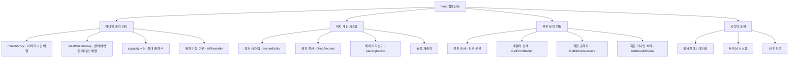
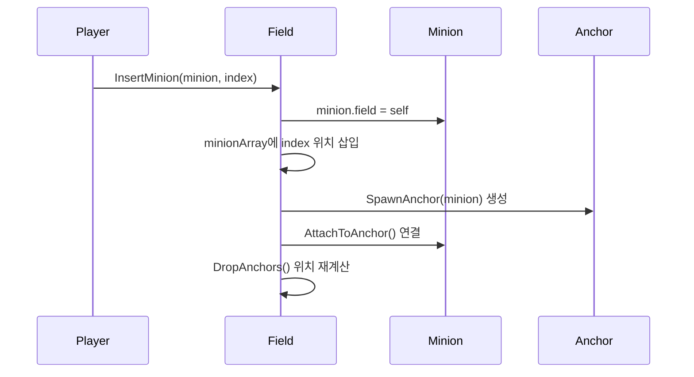
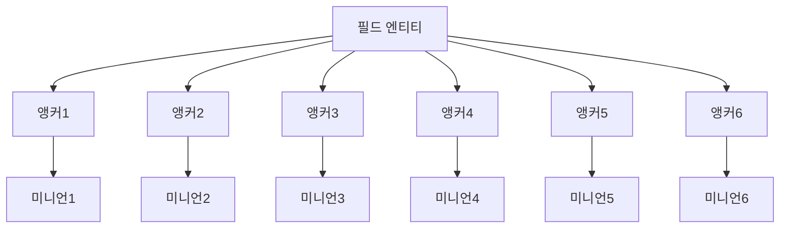
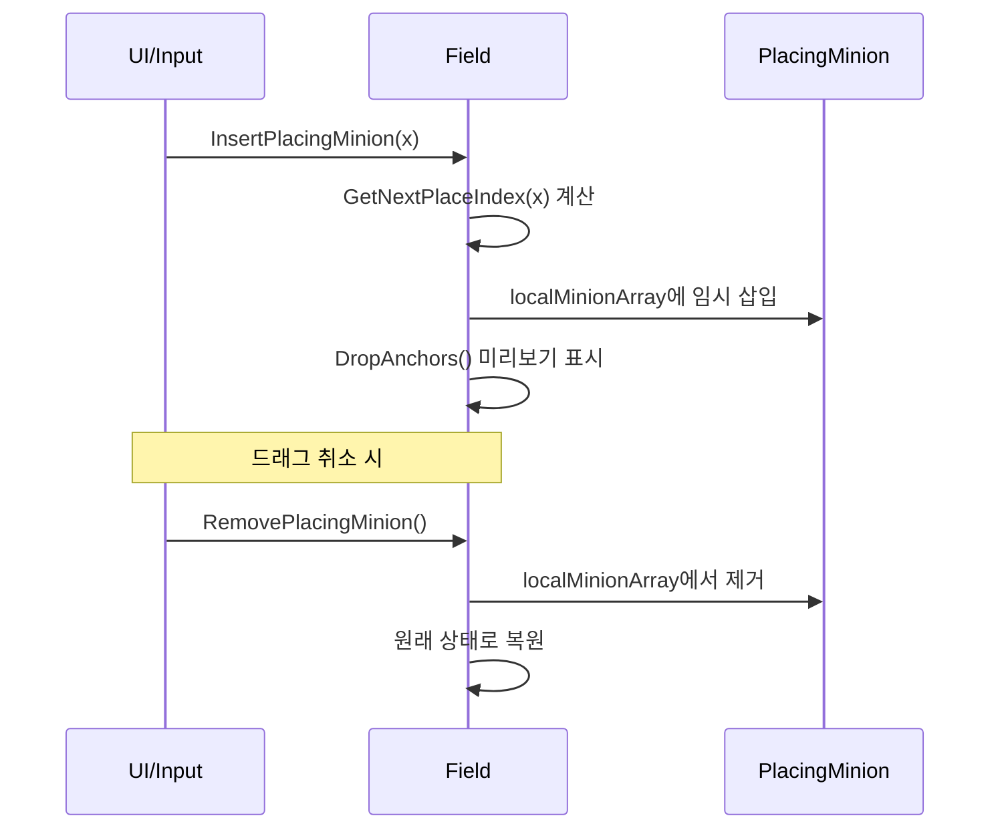
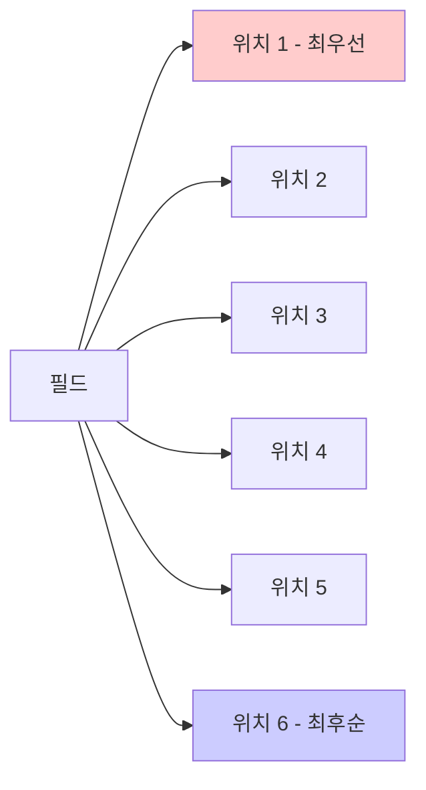
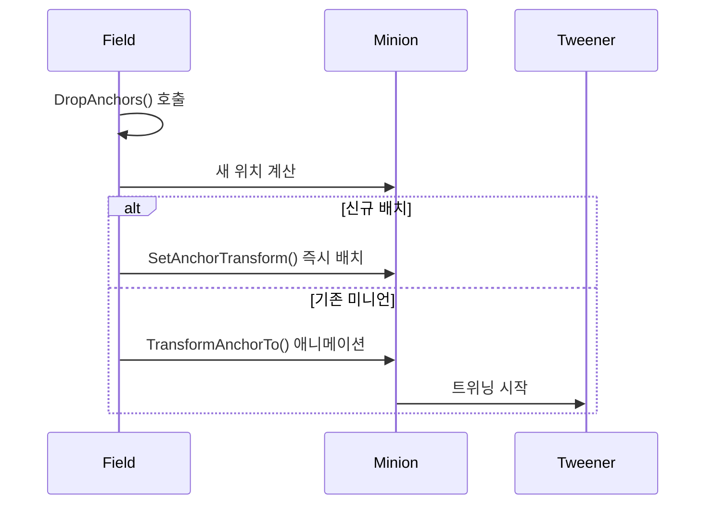
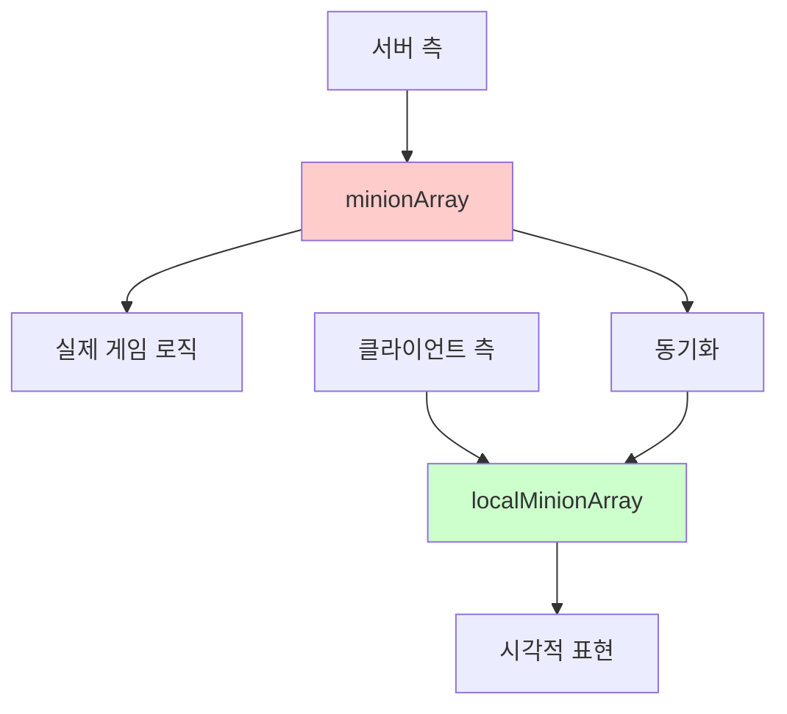

# 필드 시스템 (Field.mlua)

## 📋 개요

`Field.mlua`는 메이플 듀얼에서 미니언들이 배치되고 전투가 이루어지는 전투 필드를 관리하는 핵심 컴포넌트입니다. 각 플레이어는 최대 6마리의 미니언을 필드에 배치할 수 있으며, 이들의 위치, 전투 순서, 상태 관리 등을 담당합니다. 실시간 미니언 배치, 앵커 기반 위치 관리, 전투 로직 연동 등의 복합적인 기능을 제공합니다.

**관련 파일**: 
- `RootDesk/MyDesk/Components/Objects/Field.mlua`

## 🏗️ 필드 시스템 아키텍처

### 시스템 구조



### 핵심 프로퍼티

#### 미니언 관리
- `minionArray`: 서버에서 관리하는 실제 미니언 배열
- `localMinionArray`: 클라이언트에서 시각적 표현을 위한 로컬 배열
- `capacity = 6`: 필드에 배치 가능한 최대 미니언 수
- `player`: 필드를 소유한 플레이어

#### 상태 관리
- `isOurs`: 우리편/상대편 필드 구분
- `isPlaceable`: 현재 미니언 배치 가능 여부

## 🎮 1. 미니언 배치 시스템

### 배치 조건 시스템

#### GetInputState() 메커니즘
```lua
method table GetInputState(Character character)
    local isPlaceable = character.player == self.player 
                       and self.player:IsOurTurn() 
                       and not self:IsFull()
    return {isPlaceable = isPlaceable}
end
```

**배치 조건**:
1. **소유권 확인**: 자신의 필드에만 배치 가능
2. **턴 확인**: 자신의 턴일 때만 배치 가능  
3. **용량 확인**: 6마리 미만일 때만 배치 가능

### 미니언 삽입 시스템

#### 단일 미니언 삽입


#### 다중 미니언 삽입  
```lua
method void InsertMinions(table minionArray, Minion pivot)
    -- pivot 기준으로 삽입 위치 계산
    local index = (_Table:Find(self.minionArray, pivot) or 0) + 1
    
    -- 각 미니언을 순차적으로 삽입
    for i = #minionArray, 1, -1 do
        local minion = minionArray[i]
        self:InsertMinion(minion, index)
        self:SpawnAndAttachToAnchor(minion)
    end
    
    -- 위치 재계산 및 애니메이션
    self:DropAnchors(newMinionArray)
end
```

**삽입 특징**:
- **피벗 기반**: 기존 미니언을 기준으로 상대적 위치 결정
- **역순 삽입**: 배열 끝부터 삽입하여 순서 유지
- **즉시 반영**: 삽입과 동시에 시각적 표현 업데이트

### 미니언 제거 시스템

#### 제거 과정


**제거 후 처리**:
- `minion.field = nil` — 필드 참조 해제
- `DestroyAnchor(minion)` — 앵커 엔티티 파괴
- `DropAnchors({})` — 남은 미니언들 위치 재정렬

## 🎯 2. 위치 관리 시스템

### 앵커 시스템 

#### 앵커 기반 위치 관리
각 미니언은 독립적인 앵커 엔티티를 가지며, 이를 통해 정확한 위치 제어가 이루어집니다.



#### 위치 계산 공식
```lua
-- DropAnchors 메서드의 핵심 계산
local size = #self.localMinionArray
for i, minion in ipairs(self.localMinionArray) do
    local position = Vector2((-0.5 * size + i - 0.5) * 1.2, 0)
    minion:SetAnchorTransform(position)
end
```

**위치 공식의 특징**:
- **중심 정렬**: 미니언들이 필드 중앙에 균등 배치
- **1.2 간격**: 미니언 간 1.2 유닛 거리 유지
- **동적 조정**: 미니언 수에 따른 자동 간격 조정

### 실시간 배치 미리보기

#### placingMinion 시스템
카드를 드래그할 때 배치 위치를 미리 보여주는 기능입니다.



**미리보기 특징**:
- **실시간 피드백**: 마우스 위치에 따른 즉시 반영
- **임시 배치**: 실제 배치 전 시각적 미리보기만 제공
- **취소 가능**: 드래그 취소 시 원래 상태로 복원

## ⚔️ 3. 전투 시스템 연동

### 전투 순서 결정

#### 위치 기반 전투 우선순위
필드의 미니언들은 배치 순서(좌측부터)에 따라 전투 우선순위가 결정됩니다.



#### 전투 관련 메서드들
```lua
-- 전투 가능한 첫 번째 미니언 
method Minion GetFrontBattler()
    if self.duel.isRandomBattle then
        return self.commandManager:ShareRandomElementInArray(self:GetBattlers())
    end
    
    for _, minion in ipairs(self.minionArray) do
        if minion:IsBattler() then
            return minion
        end
    end
end

-- 위치별 미니언 접근
method Minion GetLeftmostMinion()  -- 가장 좌측 (첫 번째)
method Minion GetRightmostMinion() -- 가장 우측 (마지막)
method Minion GetFrontMinion()     -- 전투 최우선
```

### 미니언 상태 분류

#### 전투 상태별 그룹화
필드는 미니언들을 상태에 따라 효율적으로 분류합니다.

**전투 관련 분류**:
- `GetBattlers()` — 전투 가능한 미니언들
- `GetDirectAttackers()` — 직접 공격 가능한 미니언들  
- `HasBattler()` — 전투 가능한 미니언 존재 여부

**생존 상태 분류**:
- `GetDeadMinions()` — 죽은 미니언들
- `HasDeadMinion()` — 죽은 미니언 존재 여부

**랜덤 선택 지원**:
```lua
method table ShareRandomMinions(integer count, any selector)
    return self.commandManager:ShareRandomPermutationInArray(
        _Table:Select(self:GetMinions(selector), self.taskManager.liveSelector), count)
end
```

## 🎨 4. 시각적 표현 시스템

### 애니메이션 시스템

#### 앵커 이동 애니메이션
미니언 배치 변화 시 부드러운 애니메이션을 제공합니다.



#### 트위닝 관리
```lua
-- 미니언의 앵커 애니메이션
method void TransformAnchorTo(Vector2 position)
    if isvalid(self.anchorTweener) then
        self.anchorTweener:Destroy()
    end
    
    self.anchorTweener = _Tween:MoveTo(
        self.anchorEntity, position, 0.3, EaseType.CubicEaseOut)
end
```

### 필드 배치 시스템

#### SetSide() 메서드
```lua
method void SetSide(boolean isOurs)
    self.isOurs = isOurs
    
    local transform = self.layout:GetTransform(
        isOurs and "OurField" or "EnemyField")
    self.Entity.TransformComponent.WorldPosition = transform.WorldPosition:Clone()
end
```

**필드 위치**:
- **우리편 필드**: 화면 하단 배치
- **상대편 필드**: 화면 상단 배치  
- **레이아웃 연동**: Layout 시스템에서 정의된 위치 사용

## 🔄 5. 동기화 시스템

### 서버-클라이언트 동기화

#### 이중 배열 시스템


#### OnSyncProperties() 처리
```lua
method void OnSyncProperties()
    -- 서버 데이터를 로컬 배열로 복사
    self.localMinionArray = _Table:ShallowCopy(self.minionArray)
    
    -- 시각적 표현 업데이트
    self:PlaceMinions()
end
```

**동기화 특징**:
- **서버 권한**: `minionArray`는 서버에서만 수정
- **클라이언트 표현**: `localMinionArray`로 시각적 표현
- **실시간 반영**: 서버 변경 시 즉시 클라이언트 업데이트

### 입력 상태 관리

#### 클라이언트별 입력 제어
```lua
method void SetInputState(table inputState)
    if _Table:IsEmpty(inputState) then
        self.isPlaceable = false
    else
        self.isPlaceable = inputState.isPlaceable
    end
end
```

각 클라이언트는 자신의 턴과 필드 상태에 따라 서로 다른 입력 권한을 가집니다.

## 🎯 6. 최적화 및 성능

### 메모리 관리

#### 앵커 생명주기 관리
```lua
-- 앵커 생성
method void SpawnAnchor(Minion minion)
    if isvalid(minion.anchorEntity) then return end
    
    minion.anchorEntity = _SpawnService:SpawnByModelId(
        _EntryService:GetModelIdByName("Anchor"), "Anchor", 
        position, self.Entity)
end

-- 앵커 정리
method void DestroyAnchor(Minion minion)
    minion:DestroyTweener()
    minion:DestroyAnchorTweener()
    minion.anchorEntity:Destroy()
    minion.anchorEntity = nil
end
```

**최적화 포인트**:
- **필요 시 생성**: 미니언 배치 시에만 앵커 생성
- **즉시 정리**: 미니언 제거 시 관련 리소스 완전 해제
- **트위너 관리**: 애니메이션 완료 후 트위너 객체 정리

## 💡 코드 참조

핵심 필드 관리 로직:
- `Field.mlua :: InsertMinion()` — 미니언 필드 배치
- `Field.mlua :: RemoveMinion()` — 미니언 필드 제거  
- `Field.mlua :: DropAnchors()` — 위치 계산 및 애니메이션
- `Field.mlua :: GetFrontBattler()` — 전투 우선순위 미니언 선택
- `Field.mlua :: PlaceMinions()` — 클라이언트 시각적 배치
- `Field.mlua :: GetInputState()` — 배치 가능 여부 판단

필드 시스템은 카드 게임의 핵심 전투 무대를 제공하며, 직관적인 미니언 배치와 전략적 위치 선택을 통해 게임의 전술적 깊이를 더하는 중요한 시스템입니다.
