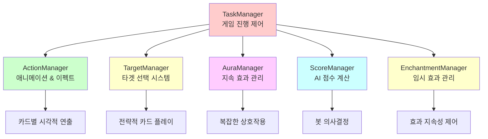
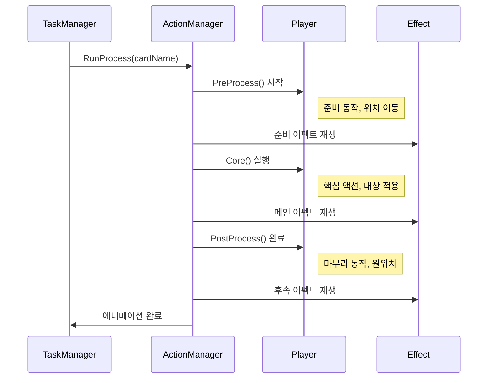
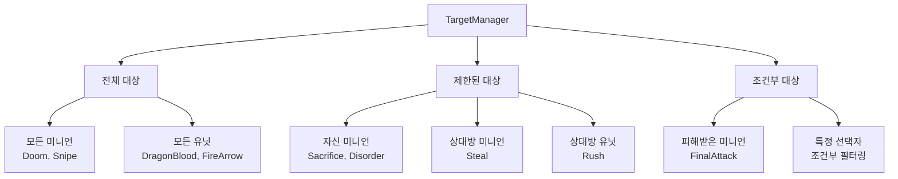
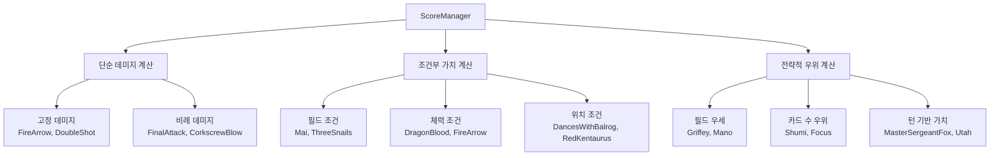
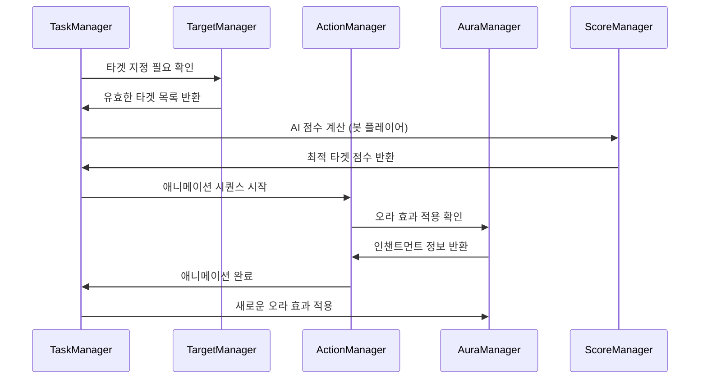

# 게임플레이 매니저

## 📋 개요

게임플레이 매니저들은 메이플 듀얼의 실제 게임 플레이 경험을 구성하는 핵심 시스템들입니다. ActionManager는 200여 개의 카드별 애니메이션과 이펙트 시퀀스를 정밀하게 관리하고, AuraManager는 복잡한 지속 효과를 실시간으로 적용하며, TargetManager는 직관적인 타겟팅 시스템을 제공합니다. ScoreManager는 봇 AI의 의사결정을 위한 정교한 평가 시스템을 구축하고, EnchantmentManager는 임시 효과들의 생명주기를 제어합니다. 이들은 TaskManager와 긴밀히 협력하여 매끄럽고 전략적인 게임플레이 경험을 제공합니다.

**관련 파일**:
- `RootDesk/MyDesk/Components/Managers/ActionManager.mlua`
- `RootDesk/MyDesk/Components/Managers/AuraManager.mlua`
- `RootDesk/MyDesk/Components/Managers/EnchantmentManager.mlua`
- `RootDesk/MyDesk/Components/Managers/TargetManager.mlua`
- `RootDesk/MyDesk/Components/Managers/ScoreManager.mlua`

## 🏗️ 게임플레이 매니저 아키텍처

### 매니저 연동 시스템



## 🎬 1. ActionManager - 애니메이션 & 이펙트 관리자

### 카드별 시각적 연출 시스템

#### 프로세스 딜레이 시스템
```lua
method void OnBeginPlay()
    self.processDelayTable = {
        AirStrike = 3.96,
        ArmorCrash = 1.52,
        ArrowBomb = 1,
        ArrowRain = 3.28,
        AthenaPierce = 1,
        Avenger = 2.32,
        -- ... 200여 개의 카드별 딜레이 시간
    }
    
    self.coreDelayTable = {
        ArrowBlow = 0.25,
        ArrowBomb = 0.15,
        ArrowRain = 0.25,
        Assaulter = 0.33,
        -- ... 핵심 액션별 딜레이
    }
end
```

**정밀한 타이밍 제어**:
- **카드별 맞춤 딜레이**: 각 카드의 시각적 특성에 맞는 타이밍
- **프로세스 구분**: PreProcess, Core, PostProcess 단계별 관리
- **일관성 보장**: 모든 플레이어가 동일한 시각적 경험

#### 복잡한 애니메이션 시퀀스

##### Genesis 카드 예시 - 대규모 스킬 연출
```lua
@ExecSpace("ClientOnly")
method void PreProcessGenesis()
    local player = self.triggerManager.receiver.player
    local resource = self.resourceManager:GetResource("Genesis")
    
    -- 1. 플레이어 전면 배치
    player:PlaceFront()
    _Tween:MoveTo(player.actor.Entity, Vector2.zero, 0.25, EaseType.CubicEaseOut, true)
    wait(0.25)
    
    -- 2. 스킬 준비 동작
    player:Animate("Alert")
    _Effect:PlaySkillEffectAttached(resource.skillAnimation_1, player, 0.001 * Vector3.back, nil)
    _Effect:PlaySkillEffectAttached(resource.skillAnimation_2, player, Vector3.zero, nil)
    _SoundService:PlaySound(resource.skillSound_1, 1)
    
    -- 3. 다중 이펙트 생성
    local animationArray = {resource.extraAnimation_1, resource.extraAnimation_2, resource.extraAnimation_3}
    local effectPosition = Vector3(0, 0, 900)
    _TimerService:SetTimerOnce(function()
        for i = 1, 3 do
            for j = 1, 5 do
                effectPosition.x = _UtilLogic:RandomDouble() * 10 - 5
                effectPosition.y = _UtilLogic:RandomDouble() * 2 - 2
                _Effect:PlayEffect(_Table:GetRandomElement(animationArray), effectPosition, nil, _Effect:GetUnitLayerOptions(nil))
                effectPosition.z -= 0.001
            end
            wait(0.05)
        end
    end, 0)
end
```

**고급 연출 기법**:
- **다단계 애니메이션**: 준비 → 실행 → 마무리
- **동적 이펙트 생성**: 랜덤 위치의 다중 이펙트
- **타이밍 동기화**: 정밀한 시간 제어로 몰입감 극대화

### 액션 단계별 처리

#### 3단계 애니메이션 파이프라인


#### 이펙트 종류별 특화 처리

**스킬 이펙트**:
```lua
-- 대상형 스킬 (Flamethrower)
_Effect:PlayHitEffect(resource.hitAnimation_1, minion, Vector3.zero, player, nil)

-- 범위 스킬 (Genesis)  
_Effect:PlaySkillEffect(resource.skillAnimation_1, player, Vector3.zero, {FadeOut = true})

-- 부착형 이펙트 (강화 효과)
_Effect:PlaySkillEffectAttached(resource.skillAnimation_1, player, Vector3(0.42, 0.28, 0), nil)
```

## 🌟 2. AuraManager - 지속 효과 관리자

### 오라 효과 시스템

#### 카드별 오라 정의
```lua
-- 비용 감소 오라 (Shumi)
method table ShumiEnchantments()
    return {
        {methodName = "AddCostEnchantment", args = {-1}}
    }
end

method table ShumiTargets(Minion minion)
    return minion.player.hand:GetCards(self.taskManager.minionSelector)
end

-- 조건부 공격력 증가 (Chicken)
method table ChickenEnchantments()
    return {
        {methodName = "AddAtkEnchantment", args = {3}}
    }
end

method table ChickenTargets(Minion minion)
    if minion:IsDamaged() then
        return {minion}
    end
end
```

**오라 시스템 특징**:
- **동적 대상 선택**: 조건에 따른 적용 대상 변경
- **다양한 인챈트먼트**: 비용, 공격력, 스킬 데미지 등 수정
- **실시간 적용**: 게임 상황 변화에 즉시 반응

#### 복잡한 조건부 오라

##### Panda - 조건부 비용 감소
```lua
method table PandaEnchantments(Card card)
    return {
        {methodName = "AddCostEnchantment", args = {-self.history:GetThisRoundMinionCountByTag(card.player, "Pet")}}
    }
end

method table PandaTargets(Card card)
    return {card}
end
```

**고급 조건 처리**:
- **동적 값 계산**: 게임 상태 기반 효과 크기 결정
- **태그 기반 계산**: 특정 태그 미니언 수에 따른 효과
- **라운드별 추적**: History 매니저와 연동

### 오라 적용 및 해제

#### 대상 검증 시스템
```lua
method table GetTargets(any object, string auraName)
    -- 미니언은 필드에 있어야 함
    if object:IsMinion() then
        if not isvalid(object.field) then
            return {}
        end
    -- 카드는 손패나 덱에 있어야 함
    elseif object:IsCard() then
        if not isvalid(object.hand) and not isvalid(object.deck) then
            return {}
        end
    end
    
    return _Util:Call(self, auraName .. "Targets", {object}) or {}
end
```

## 🎯 3. TargetManager - 타겟 선택 관리자

### 타겟팅 시스템

#### 카드별 타겟 범위 정의
```lua
-- 모든 미니언 대상 (일반적인 단일 대상 스킬)
method table Doom(Card card)
    return self.duel:GetMinions(nil)
end

-- 모든 유닛 대상 (플레이어 포함)
method table DragonBlood(Card card)
    return self.duel:GetUnits()
end

-- 제한된 대상 (자신의 미니언만)
method table Sacrifice(Card card)
    return card.player.field:GetMinions(nil)
end

-- 조건부 대상 (피해받은 미니언만)
method table FinalAttack(Card card)
    return self.duel:GetMinions(self.taskManager.damagedSelector)
end
```

#### 동적 타겟 검증
```lua
@ExecSpace("ServerOnly")
method table GetCardTargetables(Card card)
    local targetableArray = _Util:Call(self, card.name, {card})
    if targetableArray then
        local ret = {}
        for _, targetable in ipairs(targetableArray) do
            if targetable:IsTargetable(card.player) then
                table.insert(ret, targetable)
            end
        end
        return ret
    else
        return {}
    end
end
```

**서버 측 검증**:
- **이중 검증**: 기본 대상 풀 + 실제 타겟팅 가능성 확인
- **치팅 방지**: 서버에서만 최종 타겟 검증
- **실시간 업데이트**: 게임 상황 변화에 따른 대상 목록 갱신

### 타겟팅 패턴 분류

#### 타겟 범위별 분류


## 🤖 4. ScoreManager - AI 점수 계산 시스템

### 봇 의사결정 지원

#### 카드별 점수 계산
```lua
-- 기본 점수 계산
method number GetScore(Card card, Unit target, Minion pivot)
    return _Util:Call(self, card.name, {card, target, pivot}) or 1
end

-- PowerStrike 점수 계산 - 복잡한 데미지 계산
method number PowerStrike(Card card, Minion target, Minion pivot)
    local sign = target.player == card.player and -1 or 1 
    local damage = 5 + card.player.skillDamage
    local value
    
    if 3 <= target.hp and target.hp <= damage then
        value = 2  -- 확실한 처치
    elseif target.hp > damage then
        value = 1  -- 데미지만
    else
        value = 0  -- 과잉 데미지
    end
    
    return sign * value - 1
end
```

#### 전략적 점수 계산

##### 상황 인식 AI
```lua
-- 조건부 점수 계산 (Mai)
method number Mai(Card card, Unit target, Minion pivot)
    return #card.player.field:GetMinions(nil) >= 1 and 1 or -1
end

-- 필드 우세 계산 (Griffey)
method number Griffey(Card card, Unit target, Minion pivot)
    return #card.player.opponent.field:GetMinions(nil) - #card.player.field:GetMinions(nil)
end

-- 위치 기반 계산 (DancesWithBalrog)
method number DancesWithBalrog(Card card, Unit target, Minion pivot)
    return card.player.field:GetRightmostMinion() == pivot and 1 or 0
end
```

**AI 계산 요소**:
- **상대/아군 구분**: sign 변수로 적/아군 가치 반전
- **효율성 평가**: 데미지 대비 체력 비율 계산
- **전략적 가치**: 필드 상황, 위치, 조건 종합 평가
- **리스크 관리**: 과잉 투자나 낭비 방지

### 점수 시스템 패턴

#### 점수 계산 분류


## ⚡ 5. EnchantmentManager - 임시 효과 관리자

### 인챈트먼트 생명주기 관리

#### 제거 조건 시스템
```lua
-- 라운드 종료 시 제거 (Focus)
method boolean Focus(Player player, table remover, table objectArray, string taskName, table args, table eachArgs)
    if taskName == "EndRound" then
        return true  -- 제거 조건 만족
    end
    
    return false
end

-- 특정 액션 시 제거 (Reindeer)
method boolean Reindeer(Player player, table remover, table objectArray, string taskName, table args, table eachArgs)
    if taskName == "Play" then
        local card = objectArray[1]
        if card.player == player and card.category == "Minion" then
            return true  -- 미니언 플레이 시 제거
        end
    end
    
    return false
end
```

**제거 조건 패턴**:
- **시간 기반**: 라운드/턴 종료 시점
- **액션 기반**: 특정 카드 플레이, 공격 등
- **상태 기반**: 체력 변화, 위치 이동 등

## 🔄 6. 매니저 간 협업 시스템

### 게임플레이 플로우 통합

#### 카드 플레이 시 매니저 연동


### 성능 최적화

#### 지연 평가 시스템
```lua
-- 필요할 때만 계산하는 오라 타겟
method table GetTargets(any object, string auraName)
    if not self:IsObjectValid(object) then
        return {}  -- 빠른 실패
    end
    
    return _Util:Call(self, auraName .. "Targets", {object}) or {}
end

-- 조건부 점수 계산 캐싱
local scoreCache = {}
method number GetScore(Card card, Unit target, Minion pivot)
    local cacheKey = self:GenerateCacheKey(card, target, pivot)
    if scoreCache[cacheKey] then
        return scoreCache[cacheKey]
    end
    
    local score = _Util:Call(self, card.name, {card, target, pivot}) or 1
    scoreCache[cacheKey] = score
    return score
end
```

## 💡 코드 참조

게임플레이 매니저 핵심 로직:
- `ActionManager.mlua :: PreProcessGenesis()` — 대규모 스킬 애니메이션 시퀀스
- `AuraManager.mlua :: GetTargets()` — 동적 오라 대상 선택
- `TargetManager.mlua :: GetCardTargetables()` — 서버 측 타겟 검증
- `ScoreManager.mlua :: PowerStrike()` — 복잡한 AI 점수 계산
- `EnchantmentManager.mlua :: Reindeer()` — 조건부 효과 제거

게임플레이 매니저들은 메이플 듀얼의 전략성과 시각적 매력을 구현하는 핵심 시스템으로, 각각의 전문 영역에서 최적화된 기능을 제공하며 서로 유기적으로 연동되어 풍부하고 몰입감 있는 게임 경험을 만들어냅니다.
