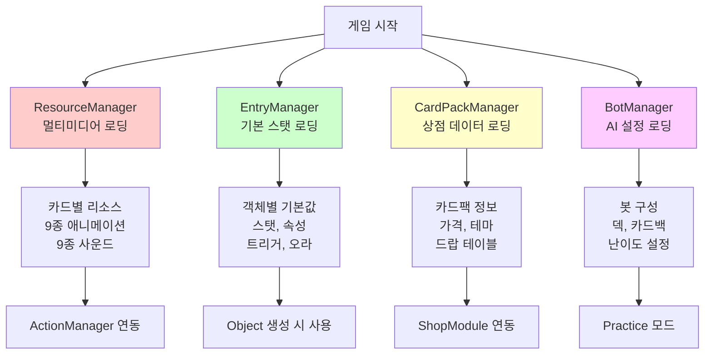
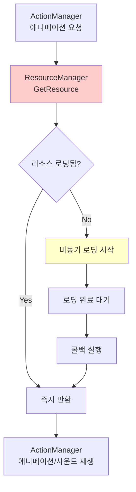
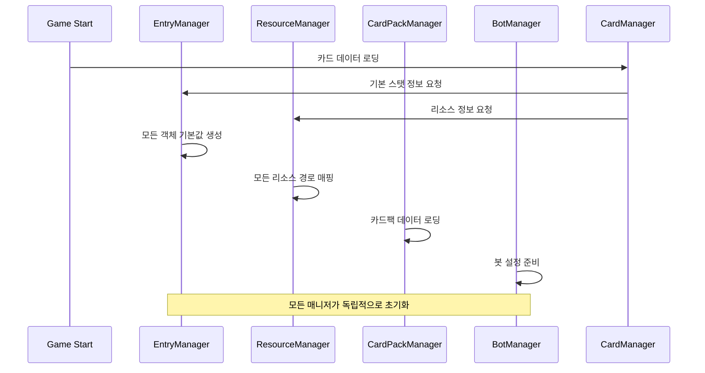
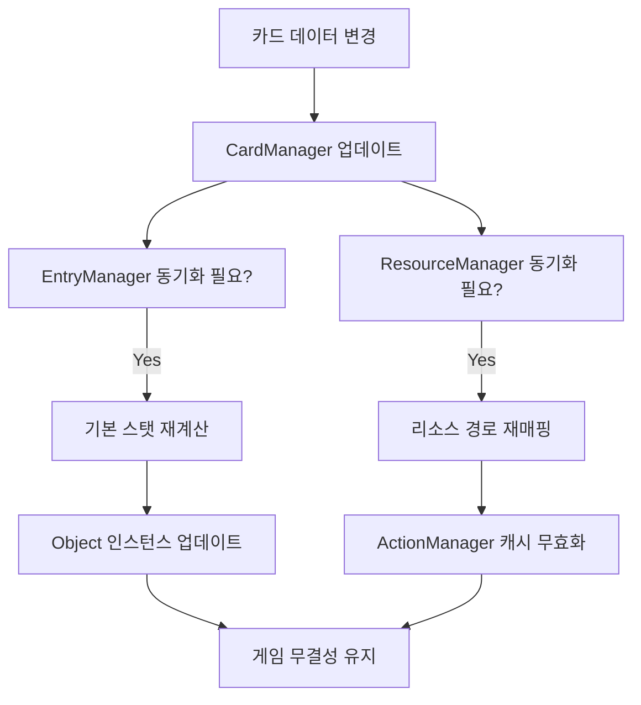

# 리소스 매니저

## 📋 개요

리소스 매니저 시스템은 메이플 듀얼의 모든 외부 자원과 메타 데이터를 체계적으로 관리하는 지원 시스템들입니다. ResourceManager는 200여 개 카드의 애니메이션과 사운드를 포함한 1000여 개의 리소스를 실시간으로 로딩하고 관리하며, EntryManager는 모든 게임 객체의 기본 스탯과 속성을 중앙 집중화합니다. CardPackManager는 복잡한 카드팩 시스템과 경제 구조를 관리하고, BotManager는 AI 대전 상대의 데이터와 행동을 정의합니다. 이들은 함께 작동하여 게임의 모든 외부 의존성을 안정적으로 처리하고 개발 효율성을 극대화합니다.

**관련 파일**:
- `RootDesk/MyDesk/Components/Managers/ResourceManager.mlua` - 멀티미디어 리소스 관리
- `RootDesk/MyDesk/Components/Managers/EntryManager.mlua` - 게임 객체 기본 데이터
- `RootDesk/MyDesk/Components/Managers/CardPackManager.mlua` - 카드팩 시스템 관리
- `RootDesk/MyDesk/Components/Managers/BotManager.mlua` - AI 봇 데이터 관리

## 🏗️ 리소스 관리 아키텍처

### 통합 리소스 시스템



## 🎨 1. ResourceManager - 멀티미디어 리소스 관리자

### 포괄적 리소스 로딩 시스템

#### 리소스 카테고리별 관리
```lua
@ExecSpace("ClientOnly")
method void OnBeginPlay()
    local resourceNameArray = {
        -- UI 시스템 리소스
        "UI", "GuideModule", "RoomChannelModule", "DeckEditPanel", "CardPanel",
        "CardPackModule", "ShopModule", "RewardModule", "InteractionModule",
        
        -- 글로벌 게임 요소
        "Input", "Emote", "Rank", "Border", "Background", "CardPack", "Deck",
        "Digit", "Notice", "Countdown", "Scope", "Player", "NameTag", "Thumbnail",
        
        -- 게임플레이 태스크
        "BeginDuel", "EndDuel", "DeclareEndRound", "Battle", "DirectAttack",
        "Damage", "Summon", "Dead", "Transform", "Kick", "Overdraw", "Discard",
    }
    
    -- 시스템 리소스 로딩
    for _, name in ipairs(resourceNameArray) do
        self.resourceTable[name] = self[name](self)
        self:LoadResource(name, nil)
    end
end
```

#### 카드별 리소스 자동 생성
```lua
-- 모든 카드에 대해 9종 애니메이션, 9종 사운드 자동 매핑
for _, name in ipairs(self.cardManager:GetAllCardNames()) do
    self.resourceTable[name] = {
        -- 스킬 애니메이션 (3종)
        skillAnimation_1 = self.cardManager:GetSkillAnimation_1(name),
        skillAnimation_2 = self.cardManager:GetSkillAnimation_2(name), 
        skillAnimation_3 = self.cardManager:GetSkillAnimation_3(name),
        
        -- 발사체 애니메이션 (3종)
        ballAnimation_1 = self.cardManager:GetBallAnimation_1(name),
        ballAnimation_2 = self.cardManager:GetBallAnimation_2(name),
        ballAnimation_3 = self.cardManager:GetBallAnimation_3(name),
        
        -- 타격 애니메이션 (3종)
        hitAnimation_1 = self.cardManager:GetHitAnimation_1(name),
        hitAnimation_2 = self.cardManager:GetHitAnimation_2(name),
        hitAnimation_3 = self.cardManager:GetHitAnimation_3(name),
        
        -- 특수 애니메이션 (3종)
        extraAnimation_1 = self.cardManager:GetExtraAnimation_1(name),
        extraAnimation_2 = self.cardManager:GetExtraAnimation_2(name),
        extraAnimation_3 = self.cardManager:GetExtraAnimation_3(name),
        
        -- 사운드 리소스 (9종)
        damageSound = self.cardManager:GetDamageSound(name),
        dieSound = self.cardManager:GetDieSound(name),
        skillSound_1 = self.cardManager:GetSkillSound_1(name),
        skillSound_2 = self.cardManager:GetSkillSound_2(name),
        skillSound_3 = self.cardManager:GetSkillSound_3(name),
        hitSound_1 = self.cardManager:GetHitSound_1(name),
        hitSound_2 = self.cardManager:GetHitSound_2(name),
        hitSound_3 = self.cardManager:GetHitSound_3(name),
        extraSound_1 = self.cardManager:GetExtraSound_1(name),
        extraSound_2 = self.cardManager:GetExtraSound_2(name),
        extraSound_3 = self.cardManager:GetExtraSound_3(name),
    }
end
```

**리소스 슬롯 시스템**:
- **체계적 분류**: 용도별로 명확히 구분된 리소스 슬롯
- **확장성**: 각 카드마다 최대 9개 애니메이션, 9개 사운드 지원
- **일관성**: 모든 카드가 동일한 리소스 구조를 가짐
- **효율성**: 필요한 리소스만 실제로 정의하고 사용

### 동적 리소스 로딩

#### 지연 로딩 시스템
```lua
@ExecSpace("ClientOnly")
method table GetResource(string name)
    return self.resourceTable[name]
end

@ExecSpace("ClientOnly")
method void LoadResource(string name, any callback)
    local resource = self.resourceTable[name]
    if resource then
        -- 리소스 존재 시 비동기 로딩
        -- 콜백을 통한 로딩 완료 알림
    end
end
```

#### 리소스 사용 패턴


## 📊 2. EntryManager - 기본 데이터 관리자

### 게임 객체 기본 설정

#### 시스템 객체 기본값
```lua
method table Player()
    return {
        maxHp = 20,          -- 기본 체력
        atk = 0,             -- 기본 공격력 (플레이어는 직접 공격 불가)
        maxMp = 14,          -- 최대 MP
        skillDamage = 0,     -- 기본 스킬 데미지 보정
        isImmuneToDirectAttack = false,  -- 직접 공격 면역 여부
        taggedSkillDamageTable = {},     -- 태그별 스킬 데미지 보정
        triggerNameArray = {},           -- 플레이어 트리거들
        auraNameArray = {}              -- 플레이어 오라들
    }
end

method table Duel()
    return {
        isRandomBattle = false,  -- 랜덤 배틀 모드 여부
        triggerNameArray = {},   -- 게임 전체 트리거들
        auraNameArray = {},      -- 게임 전체 오라들
    }
end
```

#### 컨테이너 객체 설정
```lua
method table Deck()
    return {
        triggerNameArray = {},  -- 덱 레벨 트리거
        auraNameArray = {}      -- 덱 레벨 오라
    }
end

method table Hand()
    return {
        triggerNameArray = {},  -- 손패 레벨 트리거  
        auraNameArray = {}      -- 손패 레벨 오라
    }
end

method table Field()
    return {
        triggerNameArray = {},  -- 필드 레벨 트리거
        auraNameArray = {}      -- 필드 레벨 오라
    }
end
```

### 카드별 기본 데이터 매핑

#### 카드 기본 정보
```lua
for _, name in ipairs(self.cardManager:GetAllCardNames()) do
    self.entryTable[name] = {
        cost = self.cardManager:GetCost(name),                    -- MP 비용
        maxHp = self.cardManager:GetMaxHp(name),                  -- 최대 체력
        atk = self.cardManager:GetAtk(name),                      -- 공격력
        triggerNameArray = self.cardManager:GetCardTriggerNames(name), -- 카드 트리거
        auraNameArray = self.cardManager:GetCardAuraNames(name)        -- 카드 오라
    }
end
```

#### 미니언별 추가 데이터
```lua
local category = self.cardManager:GetCategory(name)
if category == "Minion" then
    self.entryTable[name .. "Minion"] = {
        maxHp = self.cardManager:GetMaxHp(name),
        atk = self.cardManager:GetAtk(name),
        hasVenom = self.cardManager:HasVenom(name),               -- 독 보유 여부
        hasChill = self.cardManager:HasChill(name),               -- 빙결 보유 여부  
        isDirectAttackable = self.cardManager:IsDirectAttackable(name), -- 직접 공격 가능
        isImmuneToStrong = self.cardManager:IsImmuneToStrong(name),     -- 강공격 면역
        triggerNameArray = self.cardManager:GetMinionTriggerNames(name), -- 미니언 트리거
        auraNameArray = self.cardManager:GetMinionAuraNames(name)        -- 미니언 오라
    }
end
```

**이중 데이터 구조**:
- **카드 형태**: 손패에 있을 때의 기본 스탯과 속성
- **미니언 형태**: 필드에 소환된 후의 추가 속성과 능력
- **데이터 상속**: 카드 → 미니언으로 기본값 상속 후 특화

## 💰 3. CardPackManager - 카드팩 경제 시스템

### 카드팩 데이터 구조

#### 테마별 카드팩 분류
```lua
method void OnBeginPlay()
    self.dataSet = _DataService:GetTable("CardPack")
    
    -- 테마별 카드팩 그룹핑
    for _, name in ipairs(self.dataSet:GetColumn("name")) do
        local theme = self:GetTheme(name)
        self.cardPackNameTable[theme] = self.cardPackNameTable[theme] or {}
        table.insert(self.cardPackNameTable[theme], name)
    end
    
    -- 카드 배치 위치 사전 정의
    self.positionArray = {
        Vector2(0, 2.5),      -- 중앙
        Vector2(-1, 2.2),     -- 좌측 상단
        Vector2(-0.5, 1.1),   -- 좌측 하단  
        Vector2(0.5, 1.1),    -- 우측 하단
        Vector2(1, 2.2)       -- 우측 상단
    }
end
```

#### 가격 체계 관리
```lua
-- 화폐별 가격 조회
method integer GetSinglePrice(string name)
    local currency = self:GetCurrency(name)
    if currency == "Meso" then
        return self:GetSingleMesoPrice(name)
    elseif currency == "WorldCoin" then
        return self:GetSingleWorldCoinPrice(name)
    end
end

method integer GetMultiplePrice(string name)
    local currency = self:GetCurrency(name)
    if currency == "Meso" then
        return self:GetMultipleMesoPrice(name)
    elseif currency == "WorldCoin" then
        return self:GetMultipleWorldCoinPrice(name)
    end
end
```

### 카드팩 생성 시스템

#### 확률 기반 카드 생성
```lua
@ExecSpace("ServerOnly")
method table GetInfos(string cardPackName)
    local cardPackTheme = self:GetTheme(cardPackName)
    local cardPackQuality = self:GetQuality(cardPackName)  
    local cardPackRarity = self:GetRarity(cardPackName)
    
    local infoArray = {}
    for i = 1, 5 do  -- 5장 카드 생성
        local name
        local variant  
        local quality
        
        -- 복잡한 확률 계산 로직
        local value = _UtilLogic:RandomDouble()
        
        -- 희귀도별 확률 분기
        -- 테마별 카드풀 선택
        -- 품질별 변형 결정
        
        table.insert(infoArray, {
            name = name,
            variant = variant,
            quality = quality
        })
    end
    
    return infoArray
end
```

**카드팩 경제 모델**:
- **이중 화폐**: Meso(게임 내 재화) vs WorldCoin(프리미엄 재화)  
- **대량 구매 할인**: 단일 vs 다중 구매 가격 차등
- **테마 분류**: 특정 테마 카드만 나오는 전용 팩
- **품질 시스템**: Normal, Rare, Epic, Unique, Legendary 등급

### 시각적 카드팩 시스템

#### 카드 배치 및 연출
```lua
-- 카드팩 열기 시 카드 위치 사전 정의
self.positionArray = {Vector2(0, 2.5), Vector2(-1, 2.2), Vector2(-0.5, 1.1), Vector2(0.5, 1.1), Vector2(1, 2.2)}

-- 3D 레이어링을 위한 Z 위치 관리
property number zPosition = 3000

-- 풀링을 통한 성능 최적화
property table cardPackPool = {}
property table thumbnailPool = {}
```

## 🤖 4. BotManager - AI 봇 관리 시스템

### 직업별 연습 봇

#### 스타터 덱 기반 봇 구성
```lua
method table PracticeWarriorBot()
    return {
        cardBack = "OrangeMushroom",  -- 봇 전용 카드 뒷면
        deckArray = {self.deckManager:GetWarriorStarterDeck(nil)},
        deckIndex = 1,
    }
end

method table PracticeMagicianBot()
    return {
        cardBack = "Yeti",
        deckArray = {self.deckManager:GetMagicianStarterDeck(nil)},
        deckIndex = 1,
    }
end

method table PracticeBowmanBot()
    return {
        cardBack = "StoneSpirit", 
        deckArray = {self.deckManager:GetBowmanStarterDeck(nil)},
        deckIndex = 1,
    }
end
```

#### 특수 목적 봇
```lua
method table TutorialBot()
    return {
        cardBack = "Yeti",
        deckArray = {},  -- 빈 덱 - 튜토리얼에서 동적 구성
        deckIndex = 1,
    }
end
```

**봇 설계 원칙**:
- **교육적 목적**: 플레이어가 각 직업의 특성을 학습할 수 있는 대표 덱
- **균등한 난이도**: 모든 직업 봇이 비슷한 수준의 도전 제공
- **시각적 구분**: 봇별로 고유한 카드백으로 식별성 제공
- **확장 가능성**: 새로운 봇 유형 쉽게 추가 가능

### 동적 봇 데이터 접근

#### 런타임 봇 데이터 조회
```lua
method table GetData(string botName)
    return _Util:Call(self, botName, {})
end
```

**유연한 봇 시스템**:
- **문자열 기반 접근**: 봇 이름으로 동적 메서드 호출
- **런타임 확장**: 새 봇 타입을 코드 변경 없이 추가 가능
- **데이터 캡슐화**: 각 봇의 설정이 독립적으로 관리됨

## 🔄 5. 매니저 간 연동 시스템

### 리소스 관리 워크플로우

#### 게임 시작 시 초기화 순서


#### 런타임 연동 패턴
```lua
-- Object 생성 시 EntryManager 연동
method void SetName(string name)
    self.name = name
    self.entry = self.entryManager:GetEntry(self.name)  -- 기본값 로딩
    self.resourceManager:LoadResource(self.name, nil)   -- 리소스 로딩
end

-- ActionManager에서 ResourceManager 연동  
method void PreProcessAirStrike()
    local resource = self.resourceManager:GetResource("AirStrike")  -- 리소스 조회
    _SoundService:PlaySound(resource.skillSound_1, 1)
    _Effect:PlaySkillEffectAttached(resource.skillAnimation_1, player, Vector3.zero, nil)
end
```

### 데이터 무결성 보장

#### 참조 무결성 검사


## ⚡ 6. 성능 최적화

### 메모리 효율성

#### 리소스 풀링 시스템
```lua
-- CardPackManager의 오브젝트 풀링
property table cardPackPool = {}
property table thumbnailPool = {}

-- 재사용 가능한 UI 컴포넌트들을 풀에서 관리
-- 카드팩 열기/닫기 시 객체 생성/삭제 비용 최소화
```

#### 지연 초기화
```lua
-- EntryManager - 모든 카드 정보를 게임 시작시 한번에 생성
-- ResourceManager - 실제 사용 시점에 비동기 로딩
-- CardPackManager - 카드팩 데이터만 미리 로딩, 실제 카드는 열 때 생성
```

### 데이터 접근 최적화

#### 해시 기반 빠른 조회
```lua
-- EntryManager 
property table entryTable = {}  -- name -> entry 매핑
method table GetEntry(string name)
    return self.entryTable[name]  -- O(1) 조회
end

-- ResourceManager
property table resourceTable = {}  -- name -> resource 매핑  
method table GetResource(string name)
    return self.resourceTable[name]  -- O(1) 조회
end
```

## 💡 코드 참조

리소스 매니저 핵심 로직:
- `ResourceManager.mlua :: OnBeginPlay()` — 전체 리소스 시스템 초기화
- `EntryManager.mlua :: GetEntry()` — 게임 객체 기본 데이터 조회
- `CardPackManager.mlua :: GetInfos()` — 서버 측 카드팩 생성 로직
- `BotManager.mlua :: GetData()` — 동적 봇 데이터 접근
- `ResourceManager.mlua :: GetResource()` — 멀티미디어 리소스 조회

리소스 매니저들은 메이플 듀얼의 모든 외부 자원을 체계적으로 관리하여 게임의 안정성과 확장성을 보장하며, 개발자들이 게임 로직에 집중할 수 있도록 복잡한 리소스 관리를 자동화하고 추상화합니다.
