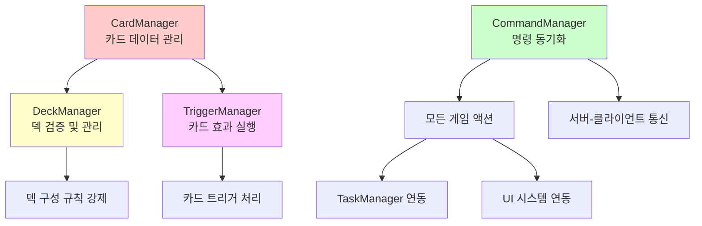
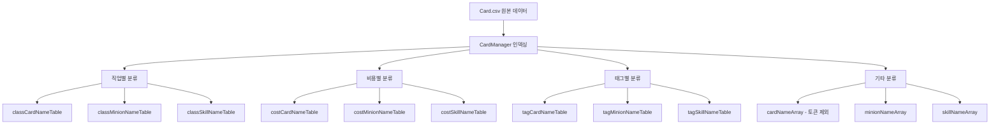
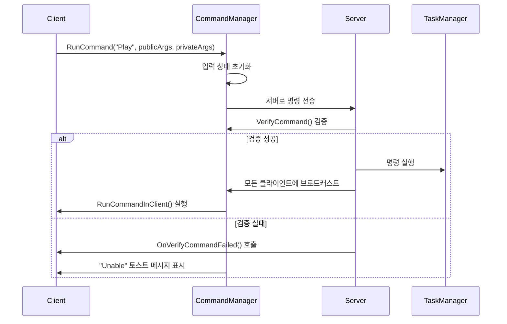
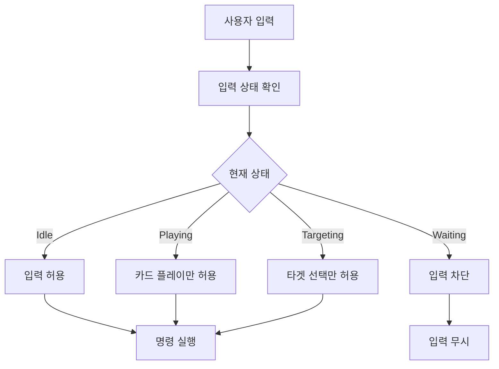
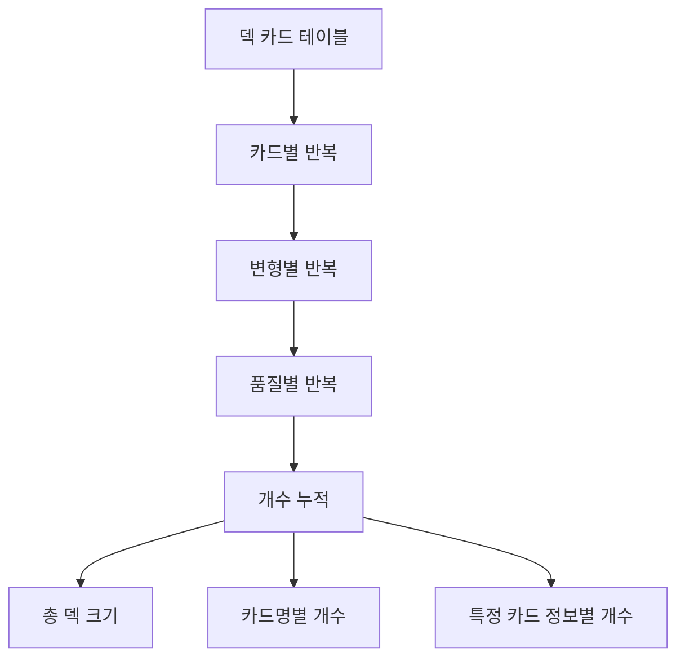
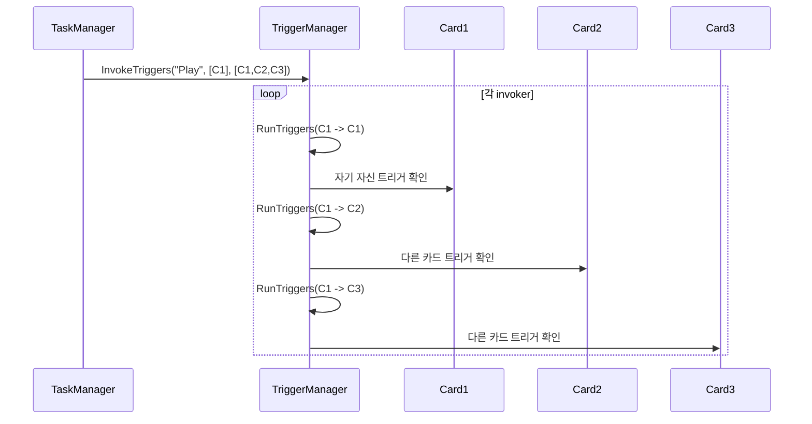
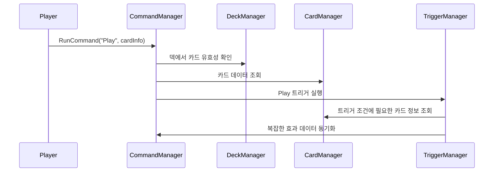

# 핵심 매니저

## 📋 개요

메이플 듀얼의 핵심 매니저 시스템은 게임의 모든 주요 데이터와 로직을 중앙집중식으로 관리하는 아키텍처의 핵심입니다. CardManager는 266개의 카드 데이터를 효율적으로 관리하고, CommandManager는 서버-클라이언트 간 모든 게임 명령을 동기화하며, DeckManager는 덱 구성 규칙을 강제하고, TriggerManager는 복잡한 카드 효과의 연쇄 실행을 조율합니다. 이들은 서로 유기적으로 연동되어 게임의 일관성과 안정성을 보장합니다.

**관련 파일**: 
- `RootDesk/MyDesk/Components/Managers/CardManager.mlua`
- `RootDesk/MyDesk/Components/Managers/CommandManager.mlua`
- `RootDesk/MyDesk/Components/Managers/DeckManager.mlua`
- `RootDesk/MyDesk/Components/Managers/TriggerManager.mlua`

## 🏗️ 핵심 매니저 아키텍처

### 매니저 간 상호관계



## 🎴 1. CardManager - 카드 데이터 관리자

### 카드 데이터 통합 관리

#### CSV 기반 데이터 로딩
```lua
method void OnBeginPlay()
    self.dataSet = _DataService:GetTable("Card")
    self.allCardNameArray = self.dataSet:GetColumn("name")
    
    -- 비용순 정렬
    _Table:StableSort(self.allCardNameArray, function(left, right) 
        return self:GetCost(left) < self:GetCost(right) 
    end)
end
```

CardManager는 시작 시 Card.csv의 모든 데이터를 메모리로 로딩하고 다양한 인덱싱 테이블을 생성합니다.

#### 다차원 인덱싱 시스템


### 카드 정보 접근자

#### 핵심 카드 데이터 메서드들
```lua
-- 카드 기본 정보
method string GetCategory(string name)    -- "Minion" 또는 "Skill"
method string GetClass(string name)       -- "Warrior", "Magician" 등
method string GetTheme(string name)       -- 테마 정보
method string GetRarity(string name)      -- "Normal", "Rare" 등
method integer GetCost(string name)       -- MP 비용
method boolean IsToken(string name)       -- 토큰 카드 여부

-- 미니언 전용 정보
method integer GetMaxHp(string name)      -- 최대 체력
method integer GetAtk(string name)        -- 공격력
method boolean HasBarrier(string name)    -- 방어막 보유 여부

-- 스킬 전용 정보  
method integer GetDamage(string name)     -- 스킬 데미지
method integer GetHeal(string name)       -- 회복량

-- 태그 시스템
method table GetTags(string name)         -- 카드의 모든 태그 배열
```

### 카드 분류 및 필터링

#### 효율적인 카드 검색
```lua
-- 특정 조건의 카드 찾기
local warriorMinions = self.classMinionNameTable["Warrior"]  -- 전사 미니언들
local cost3Cards = self.costCardNameTable[3]                -- 3코스트 카드들
local dragonCards = self.tagCardNameTable["Dragon"]         -- 드래곤 태그 카드들
```

**검색 최적화**:
- **사전 인덱싱**: 게임 시작 시 모든 분류 테이블 생성
- **O(1) 접근**: 해시 테이블 기반 즉시 검색
- **메모리 트레이드오프**: 빠른 검색을 위한 메모리 사용

## 🎯 2. CommandManager - 명령 동기화 관리자

### 클라이언트-서버 명령 시스템

#### 명령 실행 흐름


#### 명령 검증 시스템
```lua
@ExecSpace("ServerOnly")
method boolean VerifyCommand(string commandName, table args, integer commandId)
    -- 명령 ID 검증 (동기화 보장)
    if self.duel.commandId ~= commandId then
        return false
    end
    
    -- 개별 명령 검증 실행
    return _Util:Call(self, "Verify" .. commandName, args)
end
```

**보안 검증 단계**:
1. **명령 ID 동기화**: 게임 상태 일치 확인
2. **개별 검증**: 각 명령별 조건 확인
3. **권한 검증**: 명령 실행 권한 확인
4. **상태 검증**: 게임 상황에 맞는 명령인지 확인

### 패키지 시스템

#### 복잡한 데이터 동기화
```lua
-- 서버에서 데이터 전송
if self:IsServer() then
    local complexData = self:CalculateComplexData()
    self.commandManager:PushPackage(complexData)
else
    -- 클라이언트에서 데이터 수신
    local complexData = self.commandManager:PopPackage()
end
```

**패키지 시스템 특징**:
- **동기화 보장**: 서버-클라이언트 간 동일한 데이터
- **복잡한 객체**: 카드, 미니언 등의 전체 정보 전송
- **순서 보장**: FIFO 방식의 안전한 데이터 전달

### 입력 상태 관리

#### 상황별 입력 제어


## 📚 3. DeckManager - 덱 관리자

### 덱 검증 시스템

#### 포괄적 덱 유효성 검사
```lua
method boolean IsDeckValid(table deck)
    -- 기본 구조 검증
    if _Table:IsEmpty(deck) then return false end
    
    -- 직업 유효성 검증
    if not (deck.class == "Warrior" or deck.class == "Magician" or 
            deck.class == "Bowman" or deck.class == "Thief" or 
            deck.class == "Pirate") then
        return false
    end
    
    -- 덱 이름 검증
    if _UtilLogic:IsNilorEmptyString(deck.name) then return false end
    
    -- 카드 구성 검증
    if deck.cardTable ~= nil then
        if self:GetDeckSize(deck) > 20 then return false end
        
        for name, _ in pairs(deck.cardTable) do
            local class = self.cardManager:GetClass(name)
            -- 직업 제한 검증
            if not (class == "Common" or class == deck.class) then
                return false
            end
            
            -- 카드 수량 제한 검증  
            if self:GetCardCountByName(deck, name) > 2 then
                return false
            end
        end
    end
    
    return true
end
```

#### 덱 완성도 검사
```lua
method boolean IsDeckComplete(table deck)
    if not self:IsDeckValid(deck) then return false end
    return self:GetDeckSize(deck) == 20
end
```

### 덱 크기 및 카드 계산

#### 정밀한 카드 개수 관리


**카드 계산 메서드들**:
- `GetDeckSize(deck)` — 덱의 총 카드 수
- `GetCardCountByName(deck, name)` — 특정 카드명의 총 개수
- `GetCardCountByInfo(deck, info)` — 정확한 카드 정보의 개수

### 덱 생성 및 관리

#### 새 덱 생성 시스템
```lua
method table GetNewDeck(string class, string localeId)
    local adjective = self.adjectiveArray[_UtilLogic:RandomIntegerRange(1, #self.adjectiveArray)]
    local name = _LocalizationService:GetText(adjective) .. " " .. _LocalizationService:GetText(class)
    
    return {
        class = class,
        name = name,
        cardTable = {}  -- 빈 카드 테이블
    }
end
```

**자동 이름 생성**:
- Deck.csv에서 형용사 목록 로딩
- 랜덤 형용사 + 직업명 조합
- 다국어 지원 (`ko`, `en` 등)

## 🎭 4. TriggerManager - 트리거 시스템 관리자

### 트리거 실행 엔진

#### 계층적 트리거 처리


#### 트리거 조건 검사
```lua
method boolean IsTriggerCondition(string triggerKey, string triggerName, Object invoker, Object receiver, table args, table result)
    return _Util:Call(self, triggerName .. "Condition", {triggerKey, invoker, receiver, result, _Table:Unpack(args)})
end
```

**조건부 트리거 실행**:
- **트리거 키 매칭**: "Play", "Death", "Summon" 등
- **발동자/수신자 관계**: 상대방/아군 구분
- **추가 조건**: 체력, 상태, 위치 등 확인

### 카드 효과 구현

#### 트리거 메서드 예시
```lua
method void AirStrike(Card invoker, Card receiver)
    self.taskManager:RunProcess(function()
        local damage = 2
        -- 상대방 손패가 비어있으면 추가 데미지
        if #receiver.player.hand.cardArray == 0 then
            damage += 4
        end
        
        -- 상대방 플레이어에게 데미지
        receiver.player:Damage(invoker, damage)
    end)
end

-- AirStrike 발동 조건
method boolean AirStrikeCondition(string triggerKey, Object invoker, Object receiver, table result)
    return triggerKey == "Play" and 
           invoker:IsCard() and 
           receiver:IsPlayer() and 
           receiver ~= invoker.player
end
```

### 카드 공개 시스템

#### 트리거 기반 카드 공개
```lua
method table ShareOpenCards(table invokerArray, table receiverArray, string triggerKey, table args, table eachArgs, table resultTable)
    if self:IsServer() then
        local cardSet = {}
        for _, receiver in ipairs(receiverArray) do
            if receiver:IsCard() and receiver.triggerNameArray then
                for _, triggerName in ipairs(receiver.triggerNameArray) do
                    if self:IsTriggerCondition(triggerKey, triggerName, invoker, receiver, args, result) and
                       _Util:HasAttribute(self, triggerName, "Open") then
                        cardSet[receiver] = true
                    end
                end
            end
        end
        cardArray = table.keys(cardSet)
        self.commandManager:PushPackage(cardArray)
    else
        cardArray = self.commandManager:PopPackage()
    end
    
    return cardArray
end
```

**자동 카드 공개**:
- **조건부 공개**: 트리거 발동 시에만 공개
- **동기화**: 서버-클라이언트 동일한 카드 공개
- **시각적 효과**: 공개된 카드 앞면으로 전환

## 🔄 5. 매니저 간 연동

### 통합 워크플로우

#### 카드 플레이 시 매니저 협업


### 데이터 일관성 보장

#### 매니저별 책임 분리
- **CardManager**: 카드 원본 데이터의 읽기 전용 접근
- **DeckManager**: 덱 구성 규칙의 엄격한 검증  
- **CommandManager**: 모든 변경사항의 동기화
- **TriggerManager**: 복잡한 상호작용의 순차 실행

## 🎯 6. 성능 최적화

### 메모리 관리

#### 효율적인 데이터 구조
```lua
-- 사전 계산된 인덱싱 테이블들
property table classCardNameTable = {}    -- 직업별 카드 리스트
property table costCardNameTable = {}     -- 비용별 카드 리스트  
property table tagCardNameTable = {}      -- 태그별 카드 리스트
```

**메모리 vs 성능 트레이드오프**:
- **메모리 사용량 증가**: 다양한 인덱싱 테이블 유지
- **검색 성능 극대화**: O(1) 시간 복잡도 달성
- **게임 시작 시 로딩**: 모든 계산을 초기에 완료

### 명령 처리 최적화

#### 비동기 명령 큐
```lua
-- 클라이언트의 명령 큐 처리
while true do
    while _Queue:Front(self.commandQueue) do
        local command = _Queue:Pop(self.commandQueue)
        self:RunCommandInClient(command)
    end
    wait(0.01)  -- 프레임별 처리
end
```

## 💡 코드 참조

핵심 매니저 시스템 로직:
- `CardManager.mlua :: OnBeginPlay()` — 카드 데이터 초기화 및 인덱싱
- `CommandManager.mlua :: RunCommand()` — 명령 실행 및 동기화
- `DeckManager.mlua :: IsDeckValid()` — 덱 유효성 검증
- `TriggerManager.mlua :: InvokeTriggers()` — 트리거 시스템 실행
- `TriggerManager.mlua :: ShareOpenCards()` — 카드 공개 동기화

핵심 매니저 시스템은 메이플 듀얼의 모든 데이터와 로직을 체계적으로 관리하며, 복잡한 카드 게임의 규칙과 상호작용을 정확하고 효율적으로 처리하는 게임의 두뇌역할을 담당합니다.
