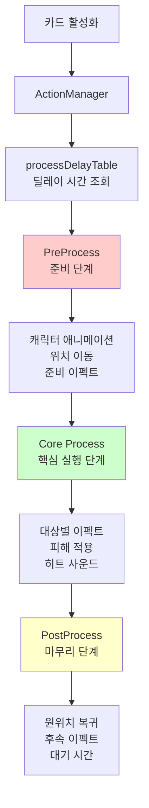
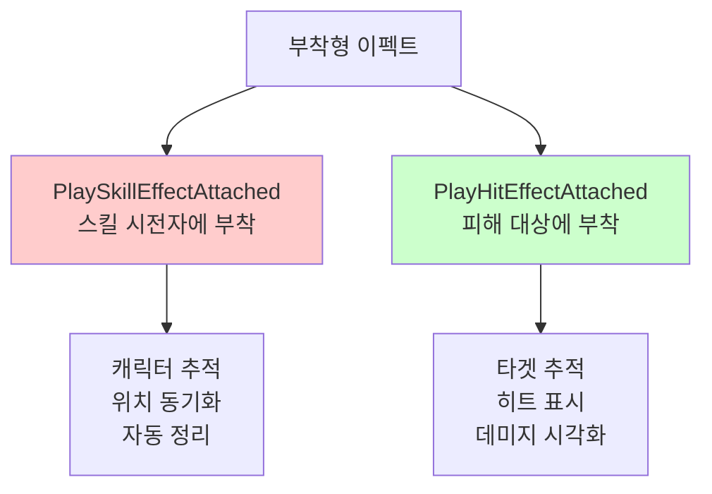

# 액션 시스템

## 📋 개요

액션 시스템은 메이플 듀얼의 모든 시각적 연출과 애니메이션을 정밀하게 관리하는 핵심 시스템입니다. ActionManager는 200여 개의 서로 다른 카드에 대해 각각 최적화된 애니메이션 시퀀스를 제공하며, 3단계 프로세스(PreProcess → Core → PostProcess)를 통해 몰입감 있는 전투 연출을 구현합니다. 각 카드는 고유한 타이밍과 이펙트를 가지며, 복잡한 트위닝, 사운드 동기화, 다중 이펙트를 통해 전략적 카드 게임을 시각적 스펙터클로 변환합니다.

**관련 파일**:
- `RootDesk/MyDesk/Components/Managers/ActionManager.mlua` - 모든 카드 액션 시퀀스 정의
- `RootDesk/MyDesk/Components/Managers/ResourceManager.mlua` - 사운드, 이펙트 리소스 관리
- `RootDesk/MyDesk/Components/Managers/TriggerManager.mlua` - 액션 트리거 및 컨텍스트 제공

## 🏗️ 액션 시스템 아키텍처

### 3단계 액션 파이프라인



## ⏱️ 1. 정밀한 타이밍 시스템

### 카드별 프로세스 딜레이

#### 프로세스 딜레이 테이블
```lua
method void OnBeginPlay()
    self.processDelayTable = {
        AirStrike = 3.96,    -- 대규모 스킬: 긴 연출
        ArmorCrash = 1.52,   -- 중간 스킬: 적당한 연출
        ArrowBomb = 1,       -- 단순 스킬: 짧은 연출
        Genesis = 3.64,      -- 궁극기급: 매우 긴 연출
        BlueMushroom = 0.48, -- 기본 미니언: 최소 연출
        -- ... 200여 개 카드별 최적화된 딜레이
    }
    
    self.coreDelayTable = {
        ArrowBlow = 0.25,    -- 핵심 액션 지속 시간
        ArrowBomb = 0.15,
        Assaulter = 0.33,
        -- ... 실제 데미지 적용 타이밍
    }
end
```

**딜레이 설계 원칙**:
- **게임플레이 영향**: 강력한 효과일수록 긴 연출
- **시각적 일관성**: 유사한 카테고리는 비슷한 연출 길이
- **플레이어 경험**: 너무 길지도 짧지도 않은 최적 균형점

#### 동적 딜레이 조회
```lua
method number GetProcessDelay(string name)
    return self.processDelayTable[name] or 1  -- 기본값 1초
end

method number GetCoreDelay(string name)
    return self.coreDelayTable[name] or 0.25  -- 기본값 0.25초
end
```

## 🎬 2. PreProcess - 준비 단계 연출

### 플레이어 애니메이션 및 위치 조정

#### AirStrike - 대규모 원거리 스킬 준비
```lua
@ExecSpace("ClientOnly")
method void PreProcessAirStrike()
    local player = self.triggerManager.receiver.player
    local resource = self.resourceManager:GetResource("AirStrike")
    
    -- 1단계: 플레이어 액션 애니메이션
    player:Animate("AirStrike")
    _Effect:PlaySkillEffectAttached(resource.skillAnimation_1, player, Vector3.zero, nil)
    
    wait(0.6)  -- 준비 시간
    
    -- 2단계: 하늘에서 공격 준비 이펙트
    _Effect:PlayEffect(resource.skillAnimation_2, Vector3(0, -2, 900), nil, _Effect:GetUnitLayerOptions(nil))
    _Effect:PlayEffect(resource.skillAnimation_3, Vector3(0, -2, 899.999), nil, _Effect:GetUnitLayerOptions(nil))
    _SoundService:PlaySound(resource.skillSound_1, 1)
    
    wait(1.8)  -- 공격 지연 시간
end
```

#### Genesis - 궁극기급 다단계 준비
```lua
@ExecSpace("ClientOnly")
method void PreProcessGenesis()
    local player = self.triggerManager.receiver.player
    local resource = self.resourceManager:GetResource("Genesis")
    
    -- 1단계: 플레이어 전면 배치
    player:PlaceFront()
    _Tween:MoveTo(player.actor.Entity, Vector2.zero, 0.25, EaseType.CubicEaseOut, true)
    wait(0.25)
    
    -- 2단계: 스킬 충전 애니메이션
    player:Animate("Alert")
    _Effect:PlaySkillEffectAttached(resource.skillAnimation_1, player, 0.001 * Vector3.back, nil)
    _Effect:PlaySkillEffectAttached(resource.skillAnimation_2, player, Vector3.zero, nil)
    _SoundService:PlaySound(resource.skillSound_1, 1)
    
    -- 3단계: 다중 이펙트 생성
    local animationArray = {resource.extraAnimation_1, resource.extraAnimation_2, resource.extraAnimation_3}
    local effectPosition = Vector3(0, 0, 900)
    _TimerService:SetTimerOnce(function()
        for i = 1, 3 do
            for j = 1, 5 do
                effectPosition.x = _UtilLogic:RandomDouble() * 10 - 5
                effectPosition.y = _UtilLogic:RandomDouble() * 2 - 2
                _Effect:PlayEffect(_Table:GetRandomElement(animationArray), effectPosition, nil, _Effect:GetUnitLayerOptions(nil))
                effectPosition.z -= 0.001
            end
            wait(0.05)
        end
    end, 0)
end
```

### 미니언 액션 준비

#### 간단한 미니언 스킬 준비
```lua
@ExecSpace("ClientOnly")
method void PreProcessBlackSheep()
    local receiver = self.triggerManager.receiver
    local resource = self.resourceManager:GetResource("BlackSheep")
    
    receiver:Animate("Skill")
    _SoundService:PlaySound(resource.skillSound_1, 1)
    
    wait(0.6)  -- 준비 시간
end
```

**PreProcess 패턴**:
- **애니메이션 상태 변경**: Idle → Attack/Skill/Alert
- **준비 이펙트**: 스킬 충전, 무기 준비 등의 시각적 신호
- **위치 조정**: 전면 배치, 타겟 방향 회전
- **사운드 시작**: 스킬 준비 효과음

## 💥 3. Core Process - 핵심 실행 단계

### 대상별 핵심 액션 처리

#### 단일 대상 공격 (AirStrike Core)
```lua
@ExecSpace("ClientOnly")
method void PreCoreAirStrike(Minion minion)
    local player = self.triggerManager.receiver.player
    local resource = self.resourceManager:GetResource("AirStrike")
    
    -- 개별 미니언에게 공격 이펙트
    _Effect:PlayHitEffectAttached(resource.hitAnimation_1, minion, Vector3.zero, player, nil)
    _SoundService:PlaySound(resource.hitSound_1, 1)
end
```

#### 근접 전투 액션 (RibbonPig)
```lua
@ExecSpace("ClientOnly")
method void PreCoreRibbonPig(Unit unit, Minion attacker)
    local receiver = self.triggerManager.receiver
    local resource = self.resourceManager:GetResource("RibbonPig")
    
    local offset = receiver.actor.Entity.TransformComponent.Position:ToVector2()
    
    -- 1단계: 대상으로 이동
    _Tween:Lerp(receiver.actor.Entity, receiver.anchorEntity, unit.actor.Entity, 0, 1, 0.3, EaseType.CubicEaseIn, offset, nil)
    wait(0.2)
    
    _SoundService:PlaySound(resource.skillSound_1, 0.5)
    wait(0.1)
    
    -- 2단계: 공격 이펙트 및 원위치 복귀
    _Effect:PlayHitEffect(resource.hitAnimation_1, unit, Vector3.zero, receiver, nil)
    _Tween:Lerp(receiver.actor.Entity, receiver.anchorEntity, unit.actor.Entity, 1, 0, 0.5, EaseType.CubicEaseOut, offset, nil)
end
```

#### 복잡한 타겟팅 액션 (Flamethrower)
```lua
@ExecSpace("ClientOnly")
method void PreCoreFlamethrower(Minion minion)
    local player = self.triggerManager.receiver.player
    local resource = self.resourceManager:GetResource("Flamethrower")
    
    -- 1단계: 플레이어 위치 조정
    player:PlaceFront()
    local playerPosition = player:GetOffsettedPosition(minion, 2 * Vector2.right, false)
    _Tween:MoveTo(player.actor.Entity, playerPosition, 0.25, EaseType.CubicEaseOut, true)
    wait(0.25)
    
    -- 2단계: 화염방사 액션
    player:Animate("Flamethrower")
    _Effect:PlaySkillEffectAttached(resource.skillAnimation_1, player, Vector3(0.42, 0.28, 0), nil)
    _SoundService:PlaySound(resource.skillSound_1, 1)
    wait(0.51)
    
    -- 3단계: 대상 히트 이펙트
    _Effect:PlayHitEffect(resource.hitAnimation_1, minion, Vector3.zero, player, nil)
    _SoundService:PlaySound(resource.hitSound_1, 1)
end
```

**Core 단계 특징**:
- **실제 피해 적용**: 게임 로직과 동기화된 피해 타이밍
- **개별 대상 처리**: 각 타겟마다 별도의 Core 메서드 호출
- **히트 이펙트**: 명확한 타격감을 위한 시각/청각 피드백
- **위치 기반 연출**: 거리감과 몰입도 향상

## 🏁 4. PostProcess - 마무리 단계 연출

### 후속 처리 및 정리

#### 간단한 마무리 (AirStrike)
```lua
@ExecSpace("ClientOnly")  
method void PostProcessAirStrike()
    wait(1.56)  -- 여운 시간
end
```

#### 복잡한 원위치 복귀 (Flamethrower)
```lua
@ExecSpace("ClientOnly")
method void PostCoreFlamethrower(Minion minion)
    local player = self.triggerManager.receiver.player
    
    wait(0.15)  -- 잠시 대기
    
    -- 원래 위치로 복귀
    _Tween:MoveTo(player.actor.Entity, Vector2.zero, 0.5, EaseType.CubicEaseOut, false)
    wait(0.5)
    
    -- 기본 상태로 복원
    player:Animate("Idle")
    player:PlaceBack()
end
```

#### 장시간 여운 효과 (Genesis)
```lua
@ExecSpace("ClientOnly")
method void PostProcessGenesis()
    wait(3.39)  -- 궁극기 여운 시간
end
```

**PostProcess 역할**:
- **상태 복원**: 애니메이션, 위치, 스케일 등을 원상태로 복구
- **여운 시간**: 스킬의 임팩트에 따른 적절한 대기 시간
- **연출 완료**: 다음 액션으로의 자연스러운 전환

## 🎭 5. 특수 액션 시스템

### 미니언 소환 시스템

#### 기본 소환 연출
```lua
@ExecSpace("ClientOnly")
method void Summon(Minion minion)
    local resource = self.resourceManager:GetResource("Summon")
    
    -- 초기 상태: 작은 크기로 시작
    local transform = minion.actor.Entity.TransformComponent
    transform.Position = Vector3.zero
    transform.Scale.x = 0
    transform.Scale.y = 0
    
    -- 1단계: 등장 애니메이션
    minion:PlaceFront()
    _Tween:MoveAndScaleTo(minion.actor.Entity, Vector2(0, 0.8), 1.25 * Vector2.one, 0.375, EaseType.CubicEaseOut, EaseType.CubicEaseOut, false)
    _SoundService:StopSound(resource.sound)
    _SoundService:PlaySound(resource.sound, 1)
    
    -- 2단계: 정상 크기로 조정
    _TimerService:SetTimerOnce(function()
        _Tween:MoveAndScaleTo(minion.actor.Entity, Vector2.zero, Vector2.one, 0.375, EaseType.CubicEaseIn, EaseType.CubicEaseIn, false)
    end, 0.375)
    
    -- 3단계: 소환 이펙트
    _TimerService:SetTimerOnce(function()
        _Effect:PlayEffect(resource.animation, Vector3.zero, minion.actor.Entity, _Effect:GetUnitLayerOptions(nil))
    end, 0.4)
    
    wait(0.75)
    
    minion:PlaceBack()
end
```

#### 카드별 특화 소환 (존재할 경우)
```lua
method string GetSummonActionName(string name)
    local actionName = "Summon" .. name
    return self[actionName] == nil and "Summon" or actionName
end

@ExecSpace("ClientOnly")
method void PlaySummonAction(Minion minion)
    _Util:Call(self, self:GetSummonActionName(minion.name), {minion})
end
```

**소환 시스템 특징**:
- **통일된 기본 연출**: 모든 미니언은 기본 Summon 애니메이션 사용
- **특화 연출 가능**: 특별한 미니언은 전용 소환 애니메이션 정의 가능
- **스케일과 위치 조합**: 임팩트 있는 등장 효과

### 코루틴 기반 액션 시스템

#### 비동기 액션 실행
```lua
@ExecSpace("ClientOnly")
method table SummonCoroutine(Minion minion)
    return _Util:RunCoroutine(self, self:GetSummonActionName(minion.name), {minion})
end
```

**코루틴 활용**:
- **비블로킹 실행**: 다른 시스템을 막지 않는 액션 처리
- **복잡한 타이밍**: 정밀한 시간 제어와 동기화
- **리소스 효율성**: 메모리 사용량 최적화

## 🎨 6. 시각적 효과 시스템

### 이펙트 유형별 분류

#### 부착형 이펙트 (Attached Effects)


#### 독립형 이펙트 (Standalone Effects)
```lua
-- 고정 위치 이펙트
_Effect:PlayEffect(resource.skillAnimation_2, Vector3(0, -2, 900), nil, _Effect:GetUnitLayerOptions(nil))

-- 엔티티 기준 이펙트  
_Effect:PlayEffect(resource.animation, Vector3.zero, minion.actor.Entity, _Effect:GetUnitLayerOptions(nil))
```

#### 다중 이펙트 조합 (Genesis 예시)
```lua
local animationArray = {resource.extraAnimation_1, resource.extraAnimation_2, resource.extraAnimation_3}
local effectPosition = Vector3(0, 0, 900)

for i = 1, 3 do
    for j = 1, 5 do
        effectPosition.x = _UtilLogic:RandomDouble() * 10 - 5
        effectPosition.y = _UtilLogic:RandomDouble() * 2 - 2
        _Effect:PlayEffect(_Table:GetRandomElement(animationArray), effectPosition, nil, _Effect:GetUnitLayerOptions(nil))
        effectPosition.z -= 0.001  -- 레이어 분리
    end
    wait(0.05)
end
```

### 사운드 시스템 연동

#### 사운드 동기화 패턴
```lua
-- 사운드 정리 후 재생
_SoundService:StopSound(resource.sound)
_SoundService:PlaySound(resource.sound, 1)

-- 볼륨 조절된 재생
_SoundService:PlaySound(resource.skillSound_1, 0.5)

-- 다중 사운드 조합
_SoundService:PlaySound(resource.skillSound_1, 1)  -- 준비 사운드
-- ... 액션 수행 ...
_SoundService:PlaySound(resource.hitSound_1, 1)    -- 히트 사운드
```

## ⚡ 7. 성능 최적화

### 클라이언트 사이드 실행

#### ExecSpace 활용
```lua
@ExecSpace("ClientOnly")
method void PreProcessAirStrike()
    -- 모든 액션은 클라이언트에서만 실행
    -- 서버는 게임 로직만 처리, 연출은 클라이언트 담당
end
```

**분리된 실행 공간**:
- **서버**: 게임 로직, 데미지 계산, 검증
- **클라이언트**: 애니메이션, 이펙트, 사운드
- **동기화**: CommandManager를 통한 상태 동기화

### 리소스 관리 최적화

#### 지연 로딩과 캐싱
```lua
method void SetName(string name)
    if not _UtilLogic:IsNilorEmptyString(self.name) then
        return
    end
    
    self.name = name
    self.entry = self.entryManager:GetEntry(self.name)
    self.resourceManager:LoadResource(self.name, nil)  -- 필요시에만 로딩
end
```

#### 메모리 효율성
```lua
-- 타이머 기반 정리
_TimerService:SetTimerOnce(function()
    player:Animate("Idle")
    player:PlaceBack()
end, 0.88)

-- 리소스 재사용
local resource = self.resourceManager:GetResource("AirStrike")
-- 동일한 리소스 객체를 모든 AirStrike 액션에서 공유
```

## 🧪 8. 디버깅 및 개발 도구

### 액션 테스트 시스템

#### 딜레이 시간 조정
```lua
-- 개발 중 딜레이 시간 실시간 조정 가능
self.processDelayTable = {
    -- 테스트용 짧은 딜레이
    AirStrike = _Debug.FastAnimation and 0.5 or 3.96,
    Genesis = _Debug.FastAnimation and 1.0 or 3.64,
}
```

#### 액션 로깅
```lua
@ExecSpace("ClientOnly")
method void PreProcessAirStrike()
    if _Debug.ActionLogging then
        print("AirStrike PreProcess started")
    end
    
    -- ... 액션 실행 ...
    
    if _Debug.ActionLogging then
        print("AirStrike PreProcess completed")
    end
end
```

### 시각적 디버깅

#### 히트박스 표시
```lua
-- 개발 모드에서 타겟팅 범위 시각화
if _Debug.ShowTargetArea then
    _Effect:PlayEffect("DebugTargetArea", target.actor.Entity.Position, nil, nil)
end
```

## 💡 코드 참조

액션 시스템 핵심 로직:
- `ActionManager.mlua :: PreProcessGenesis()` — 복잡한 다단계 액션 시퀀스
- `ActionManager.mlua :: Summon()` — 미니언 소환 기본 연출
- `ActionManager.mlua :: PreCoreFlamethrower()` — 근거리 전투 액션
- `ActionManager.mlua :: GetProcessDelay()` — 카드별 타이밍 조회
- `ActionManager.mlua :: PlaySummonAction()` — 동적 액션 메서드 호출

액션 시스템은 메이플 듀얼의 전략적 카드 게임플레이를 몰입감 넘치는 시각적 경험으로 변환하는 핵심 시스템으로, 정밀한 타이밍 제어와 풍부한 연출을 통해 각 카드의 고유한 특성과 전략적 가치를 시각적으로 표현합니다.
