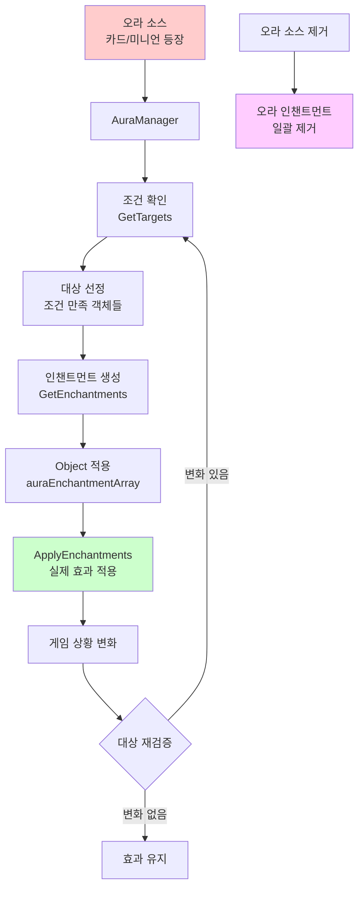
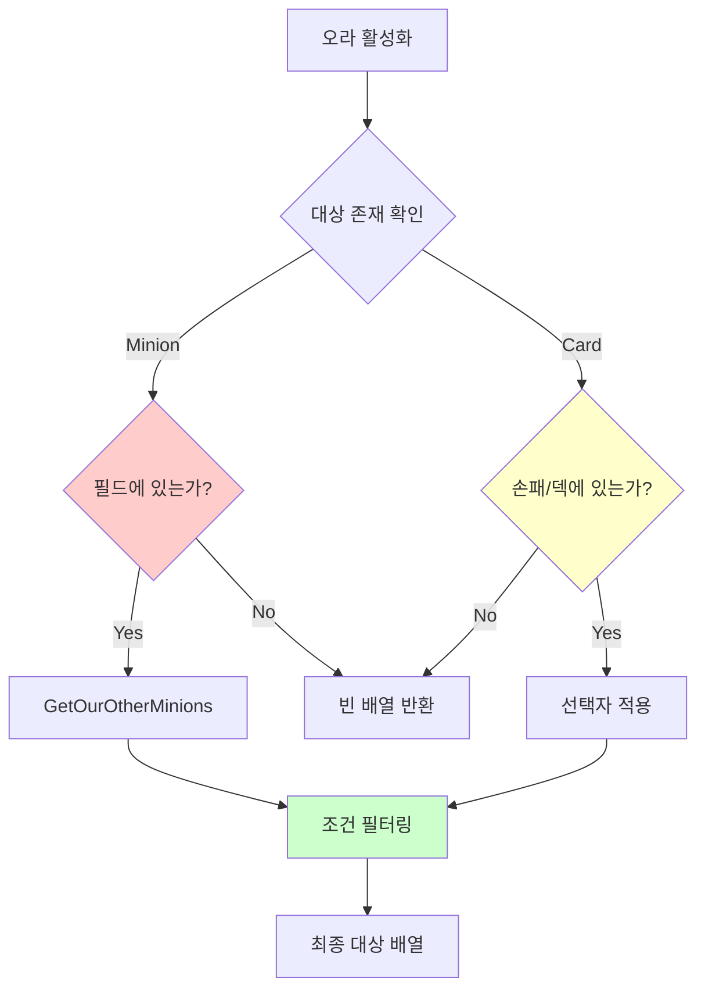
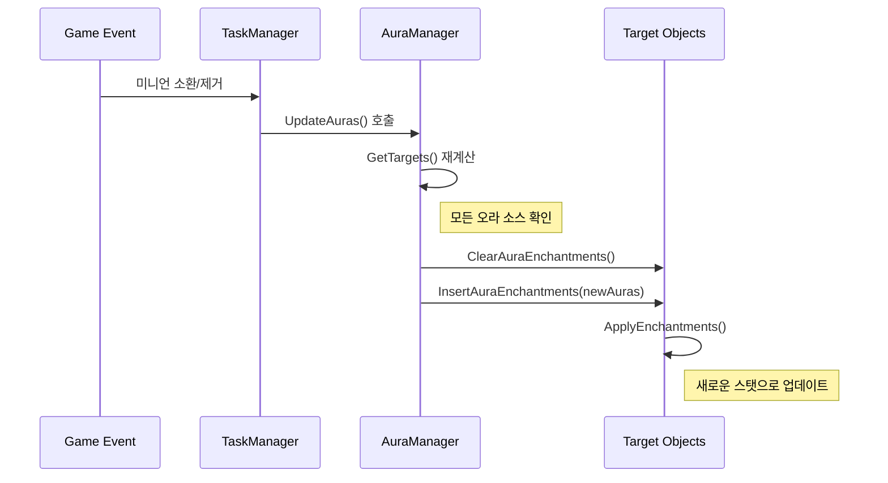

# 오라 시스템

## 📋 개요

오라 시스템은 메이플 듀얼에서 카드나 미니언이 주변 객체들에게 지속적인 영향을 미치는 고급 효과 시스템입니다. AuraManager는 50여 개의 서로 다른 오라 효과를 관리하며, 각 오라는 특정 조건에 따라 동적으로 대상을 선택하고 다양한 인챈트먼트를 적용합니다. 이 시스템은 단순한 버프/디버프를 넘어서 게임 상황에 따라 실시간으로 변화하는 복잡한 상호작용을 가능하게 하며, 전략적 깊이를 크게 증가시킵니다.

**관련 파일**:
- `RootDesk/MyDesk/Components/Managers/AuraManager.mlua` - 오라 효과 정의 및 관리
- `RootDesk/MyDesk/Components/Objects/Object.mlua` - 오라 인챈트먼트 적용 메커니즘
- `RootDesk/MyDesk/Components/Managers/EnchantmentManager.mlua` - 오라 제거 조건

## 🏗️ 오라 시스템 아키텍처

### 오라 생명주기



## 🌟 1. 오라 효과 정의 시스템

### 인챈트먼트와 대상 정의

#### 기본 오라 구조
```lua
-- Shumi 오라 - 미니언 비용 감소
method table ShumiEnchantments()
    return {
        {methodName = "AddCostEnchantment", args = {-1}}
    }
end

method table ShumiTargets(Minion minion)
    return minion.player.hand:GetCards(self.taskManager.minionSelector)
end
```

**오라 정의 패턴**:
- **Enchantments**: 적용할 효과의 메서드명과 인자
- **Targets**: 효과를 받을 대상 객체들의 배열
- **동적 조건**: 게임 상황에 따른 대상 변경

#### 조건부 오라 시스템

##### Chicken - 피해받은 미니언에게 공격력 증가
```lua
method table ChickenEnchantments()
    return {
        {methodName = "AddAtkEnchantment", args = {3}}
    }
end

method table ChickenTargets(Minion minion)
    if minion:IsDamaged() then
        return {minion}  -- 자기 자신이 피해받았을 때만 적용
    end
end
```

##### DancesWithBalrog - 다른 피해받은 미니언에게 공격력 증가
```lua
method table DancesWithBalrogEnchantments()
    return {
        {methodName = "AddAtkEnchantment", args = {2}}
    }
end

method table DancesWithBalrogTargets(Minion minion)
    return minion:GetOurOtherMinions(self.taskManager.damagedSelector)
end
```

### 복잡한 동적 계산 오라

#### GrimPhantomWatch - 덱 크기 기반 비용 증가
```lua
method table GrimPhantomWatchEnchantments(Card card)
    return {
        {methodName = "AddCostEnchantment", args = {#card.player.deck.cardArray}}
    }
end

method table GrimPhantomWatchTargets(Card card)
    return {card}  -- 자기 자신에게 적용
end
```

**동적 계산 특징**:
- **실시간 값 계산**: 덱 카드 수에 따라 비용 변동
- **게임 상태 의존**: 게임 진행에 따른 효과 크기 변화
- **자기 참조**: 오라 소스가 자신에게 영향 미침

#### Panda - 태그 기반 누적 효과
```lua
method table PandaEnchantments(Card card)
    return {
        {methodName = "AddCostEnchantment", args = {-self.history:GetThisRoundMinionCountByTag(card.player, "Pet")}}
    }
end

method table PandaTargets(Card card)
    return {card}
end
```

**고급 계산 요소**:
- **History 매니저 연동**: 라운드별 통계 활용
- **태그 시스템**: 특정 카테고리 카드 수 기반 계산
- **음수 효과**: 비용 감소 (음수 비용 증가)

## 🎯 2. 오라 대상 선정 시스템

### 대상 범위별 분류

#### 플레이어 대상 오라
```lua
-- Focus - 플레이어 손패 스킬 비용 감소
method table FocusTargets(Player player)
    return player.hand:GetCards(self.taskManager.skillSelector)
end

-- ShadowPartner - 플레이어 스킬 데미지 증가
method table ShadowPartnerTargets(Player player)
    return {player}
end
```

#### 필드 기반 오라
```lua
-- DrummingBunny - 아군 다른 미니언들 공격력 증가
method table DrummingBunnyTargets(Minion minion)
    return minion:GetOurOtherMinions(nil)
end

-- Octopus - 모든 미니언 카드 비용 증가
method table OctopusTargets(Minion minion)
    return self.duel:GetCards(self.taskManager.minionSelector)
end
```

#### 게임 전체 영향 오라
```lua
-- MrBouffon - 듀얼 자체에 랜덤 배틀 적용
method table MrBouffonTargets(Minion minion)
    return {self.duel}
end
```

### 조건부 대상 선정

#### 복합 조건 시스템


#### 대상 유효성 검증
```lua
method table GetTargets(any object, string auraName)
    -- 미니언 유효성 검사
    if object:IsMinion() then
        if not isvalid(object.field) then
            return {}  -- 필드에 없으면 오라 무효
        end
    -- 카드 유효성 검사  
    elseif object:IsCard() then
        if not isvalid(object.hand) and not isvalid(object.deck) then
            return {}  -- 손패나 덱에 없으면 오라 무효
        end
    end
    
    return _Util:Call(self, auraName .. "Targets", {object}) or {}
end
```

## 🔧 3. 인챈트먼트 적용 메커니즘

### Object 컴포넌트 통합

#### 오라 인챈트먼트 관리
```lua
-- Object.mlua의 오라 인챈트먼트 배열
property table auraEnchantmentArray = {}

method void InsertAuraEnchantments(table auraEnchantmentArray)
    for _, auraEnchantment in ipairs(auraEnchantmentArray) do
        table.insert(self.auraEnchantmentArray, auraEnchantment)
    end
end

method void ClearAuraEnchantments()
    table.clear(self.auraEnchantmentArray)
end
```

#### 인챈트먼트 적용 프로세스
```lua
method void ApplyEnchantments()
    -- 1. 원본 스탯으로 초기화
    self.dependentVariableTable = _Table:ShallowCopy(self.entry)
    
    -- 2. 일반 인챈트먼트 적용
    for _, enchantment in ipairs(self.enchantmentArray) do
        _Util:Call(self, enchantment.methodName, enchantment.args)
    end
    
    -- 3. 오라 인챈트먼트 적용
    for _, auraEnchantment in ipairs(self.auraEnchantmentArray) do
        _Util:Call(self, auraEnchantment.methodName, auraEnchantment.args)
    end
    
    -- 4. 최종 스탯 적용
    self:SetVariables(self.dependentVariableTable)
end
```

**적용 순서의 중요성**:
- **기본값 → 일반 인챈트먼트 → 오라 인챈트먼트**
- **중복 효과 누적**: 여러 오라가 같은 스탯에 영향 시 누적
- **실시간 재계산**: 게임 상황 변화 시 전체 재적용

### 인챈트먼트 유형별 처리

#### 스탯 수정 인챈트먼트
```lua
-- 비용 수정
method void AddCostEnchantment(integer cost)
    local currentCost = self.dependentVariableTable.cost or self.entry.cost
    self.dependentVariableTable.cost = currentCost + cost
end

-- 공격력 수정  
method void AddAtkEnchantment(integer atk)
    local currentAtk = self.dependentVariableTable.atk or self.entry.atk
    self.dependentVariableTable.atk = currentAtk + atk
end

-- 스킬 데미지 수정
method void AddSkillDamageEnchantment(integer skillDamage)
    local currentDamage = self.dependentVariableTable.skillDamage or 0
    self.dependentVariableTable.skillDamage = currentDamage + skillDamage
end
```

#### 상태 플래그 인챈트먼트
```lua
-- 직접 공격 면역
method void SetImmuneToDirectAttackEnchantment(boolean isImmune)
    self.dependentVariableTable.isImmuneToDirectAttack = isImmune
end

-- 랜덤 배틀 모드
method void SetRandomBattleEnchantment(boolean randomBattle)
    self.dependentVariableTable.randomBattle = randomBattle
end
```

## 🔄 4. 오라 동적 갱신 시스템

### 실시간 오라 관리

#### 게임 이벤트 기반 갱신


#### 조건 변화 감지
```lua
-- 미니언 체력 변화 시 Chicken 오라 재평가
method void OnMinionDamaged(Minion minion)
    local chickenMinions = self.duel:GetMinions(function(m) 
        return m.name == "Chicken" 
    end)
    
    for _, chicken in ipairs(chickenMinions) do
        self:UpdateAuraTargets(chicken, "Chicken")
    end
end
```

**갱신 트리거 이벤트**:
- **미니언 소환/제거**: 필드 상황 변화
- **카드 드로우/플레이**: 손패 구성 변화  
- **체력/상태 변화**: 조건 만족도 변화
- **라운드 진행**: 시간 기반 조건 변화

## 🎲 5. 고급 오라 효과 사례

### 누적 효과 오라

#### Roloduck - 필드 미니언 수 기반 자체 강화
```lua
method table RoloduckEnchantments(Minion minion)
    return {
        {methodName = "AddAtkEnchantment", args = {#minion:GetOurOtherMinions(nil)}}
    }
end

method table RoloduckTargets(Minion minion)
    return {minion}  -- 자기 자신 강화
end
```

**누적 메커니즘**:
- **동적 값 계산**: 아군 미니언 수에 비례하여 공격력 증가
- **실시간 업데이트**: 미니언 추가/제거 시 즉시 반영
- **자기 강화**: 다른 미니언이 많을수록 자신이 강해짐

### 조건부 비용 조작

#### TripleThrow - 상대방 필드 조건부 비용 감소
```lua
method table TripleThrowEnchantments()
    return {
        {methodName = "AddCostEnchantment", args = {-1}}
    }
end

method table TripleThrowTargets(Card card)
    if #card.player.opponent.field:GetMinions(nil) >= 2 then
        return {card}
    end
end
```

**전략적 조건**:
- **상대방 의존**: 상대방의 전략에 따라 효과 활성화
- **임계값 조건**: 특정 수치 이상에서만 효과 발동
- **자기 최적화**: 유리한 상황에서만 비용 절약

### 글로벌 게임 규칙 변경

#### MrBouffon - 랜덤 배틀 모드 활성화
```lua
method table MrBouffonEnchantments()
    return {
        {methodName = "SetRandomBattleEnchantment", args = {true}}
    }
end

method table MrBouffonTargets(Minion minion)
    return {self.duel}  -- 듀얼 전체에 영향
end
```

**게임 룰 수정**:
- **전역 효과**: 모든 전투에 랜덤 요소 추가
- **메타 게임 변경**: 기본 게임 규칙 자체를 수정
- **예측 불가능성**: 전략적 계산을 복잡하게 만듦

## 🔍 6. 성능 최적화

### 지연 평가 시스템

#### 필요 시점 계산
```lua
-- 오라 효과가 필요할 때만 대상 계산
method table GetTargets(any object, string auraName)
    if not self:IsObjectValid(object) then
        return {}  -- 빠른 실패로 불필요한 계산 방지
    end
    
    local targets = _Util:Call(self, auraName .. "Targets", {object})
    return targets or {}
end
```

#### 캐싱 전략
```lua
-- 복잡한 계산 결과 캐싱
local auraCache = {}

method table GetCachedAuraTargets(Object object, string auraName)
    local cacheKey = string.format("%s_%s_%d", object.name, auraName, self.duel.round)
    
    if auraCache[cacheKey] then
        return auraCache[cacheKey]
    end
    
    local targets = self:GetTargets(object, auraName)
    auraCache[cacheKey] = targets
    return targets
end
```

### 배치 업데이트

#### 단일 이벤트로 다중 오라 갱신
```lua
method void UpdateAllAuras()
    local allAuraSources = self.duel:GetObjects(function(obj)
        return not _Table:IsEmpty(obj.auraNameArray)
    end)
    
    -- 모든 대상의 오라 인챈트먼트 초기화
    for _, object in ipairs(self.duel.objectArray) do
        object:ClearAuraEnchantments()
    end
    
    -- 모든 오라 소스에서 새로운 인챈트먼트 생성
    for _, source in ipairs(allAuraSources) do
        for _, auraName in ipairs(source.auraNameArray) do
            local targets = self:GetTargets(source, auraName)
            local enchantments = self:GetEnchantments(source, auraName)
            
            for _, target in ipairs(targets) do
                target:InsertAuraEnchantments(enchantments)
            end
        end
    end
    
    -- 모든 대상에 인챈트먼트 적용
    for _, object in ipairs(self.duel.objectArray) do
        object:ApplyEnchantments()
    end
end
```

## 💡 코드 참조

오라 시스템 핵심 로직:
- `AuraManager.mlua :: GetTargets()` — 동적 오라 대상 선정
- `AuraManager.mlua :: PandaEnchantments()` — 복잡한 동적 계산 오라
- `Object.mlua :: ApplyEnchantments()` — 인챈트먼트 적용 메커니즘
- `Object.mlua :: InsertAuraEnchantments()` — 오라 인챈트먼트 관리
- `AuraManager.mlua :: MrBouffonTargets()` — 글로벌 게임 규칙 변경

오라 시스템은 메이플 듀얼의 전략적 복잡성을 크게 높이는 고급 시스템으로, 정적인 카드 스탯을 동적이고 상황에 맞는 전략적 자원으로 변환하여 매 게임마다 새로운 전략적 가능성을 제공합니다.
