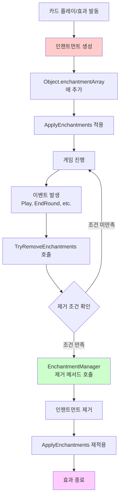
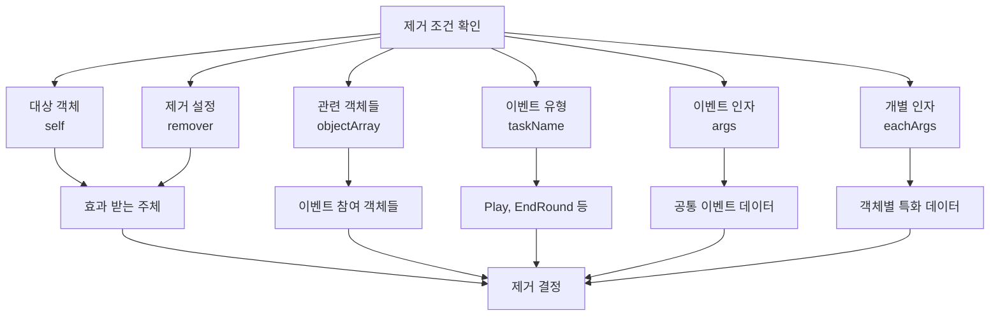
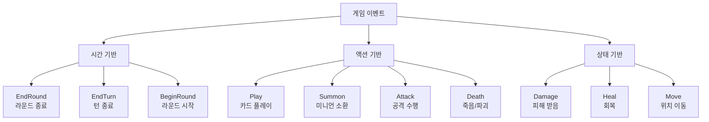

# 인챈트먼트 시스템

## 📋 개요

인챈트먼트 시스템은 메이플 듀얼에서 임시 효과들의 지속 시간과 제거 조건을 정밀하게 관리하는 시스템입니다. EnchantmentManager는 각 인챈트먼트의 생명주기를 추적하고, 특정 게임 이벤트나 조건에 따라 자동으로 효과를 제거합니다. 이 시스템은 Object 컴포넌트의 `TryRemoveEnchantments` 메서드와 긴밀히 연동되어 복잡한 조건부 효과들을 안정적으로 관리하며, 게임의 전략적 깊이와 균형을 유지하는 핵심 역할을 담당합니다.

**관련 파일**:
- `RootDesk/MyDesk/Components/Managers/EnchantmentManager.mlua` - 인챈트먼트 제거 조건 정의
- `RootDesk/MyDesk/Components/Objects/Object.mlua` - 인챈트먼트 적용 및 제거 메커니즘
- `RootDesk/MyDesk/Components/Managers/AuraManager.mlua` - 오라 기반 인챈트먼트 생성

## 🏗️ 인챈트먼트 생명주기 시스템

### 인챈트먼트 생성부터 제거까지



## ⏰ 1. 시간 기반 제거 시스템

### 라운드 종료 시 제거

#### 일반적인 지속 효과들
```lua
-- Focus - 다음 라운드까지 스킬 비용 감소
method boolean Focus(Player player, table remover, table objectArray, string taskName, table args, table eachArgs)
    if taskName == "EndRound" then
        return true  -- 라운드 종료 시 제거
    end
    
    return false
end

-- ShadowPartner - 라운드 종료까지 스킬 데미지 증가
method boolean ShadowPartner(Player player, table remover, table objectArray, string taskName, table args, table eachArgs)
    if taskName == "EndRound" then
        return true
    end
    
    return false
end
```

#### 일시적 강화 효과들
```lua
-- Haste - 라운드 종료까지 비용 감소
method boolean Haste(Card card, table remover, table objectArray, string taskName, table args, table eachArgs)
    if taskName == "EndRound" then
        return true
    end
    
    return false
end

-- PowerStance - 라운드 종료까지 직접 공격 면역
method boolean PowerStance(Player player, table remover, table objectArray, string taskName, table args, table eachArgs)
    if taskName == "EndRound" then
        return true
    end
    
    return false
end
```

**라운드 기반 제거 특징**:
- **일정한 지속 시간**: 모든 라운드 종료 시 자동 제거
- **예측 가능**: 플레이어가 효과 지속 시간을 정확히 알 수 있음
- **전략적 타이밍**: 라운드 내에서만 유효한 전술적 이점

### 턴 종료 시 제거

#### ChunJi - 범위 강화 효과
```lua
method boolean ChunJi(Minion minion, table remover, table objectArray, string taskName, table args, table eachArgs)
    if taskName == "EndRound" then
        return true
    end
    
    return false
end
```

**턴/라운드 구분의 중요성**:
- **EndRound**: 한 플레이어의 모든 행동이 끝난 후
- **EndTurn**: 게임의 턴 단위가 끝난 후
- **전략적 차이**: 지속 시간에 따른 효과의 가치 차별화

## 🎯 2. 액션 기반 제거 시스템

### 특정 행동 시 제거

#### Reindeer - 미니언 소환 시 제거
```lua
method boolean Reindeer(Player player, table remover, table objectArray, string taskName, table args, table eachArgs)
    if taskName == "Play" then
        local card = objectArray[1]
        -- 플레이어가 미니언을 소환했을 때만 제거
        if card.player == player and card.category == "Minion" then
            return true
        end
    end
    
    return false
end
```

**조건부 제거의 전략적 의미**:
- **플레이어 선택**: 효과를 언제 소모할지 플레이어가 결정
- **기회 비용**: 효과 지속 vs 즉시 행동의 트레이드오프
- **상호작용**: 상대방의 행동이 내 효과에 영향 주지 않음

## 🔧 3. 인챈트먼트 제거 메커니즘

### Object 컴포넌트의 제거 시스템

#### 자동 제거 프로세스
```lua
method void TryRemoveEnchantments(table objectArray, string taskName, table args, table eachArgs)
    if _Table:IsEmpty(self.enchantmentArray) then
        return
    end
    
    local indexArray = {}
    for i, enchantment in ipairs(self.enchantmentArray) do
        local remover = enchantment.remover
        if not remover then
            continue  -- 제거 조건 없는 영구 효과
        end
        
        -- EnchantmentManager의 제거 조건 확인
        if _Util:Call(self.enchantmentManager, remover.checkerName, {self, remover, objectArray, taskName, args, eachArgs}) then
            table.insert(indexArray, i)
        end
    end
    
    -- 제거 대상 인챈트먼트들을 역순으로 제거
    if not _Table:IsEmpty(indexArray) then
        for i = #indexArray, 1, -1 do
            table.remove(self.enchantmentArray, indexArray[i])
        end
        self:ApplyEnchantments()  -- 효과 재적용
    end
end
```

#### 인챈트먼트 구조체
```lua
-- 인챈트먼트 예시 구조
enchantment = {
    methodName = "AddCostEnchantment",  -- 적용할 메서드
    args = {-1},                       -- 메서드 인자
    remover = {                        -- 제거 조건 정의
        checkerName = "Focus",         -- EnchantmentManager 메서드명
        -- 추가 제거 조건 데이터
    }
}
```

**제거 프로세스 최적화**:
- **조건 없는 효과 스킵**: 영구 효과는 검사하지 않음
- **역순 제거**: 배열 인덱스 무결성 유지
- **일괄 재적용**: 모든 제거 후 한 번에 효과 재계산

### 제거 조건 매개변수

#### 다양한 컨텍스트 정보


## 🎮 4. 게임 이벤트 연동

### TaskManager와의 협업

#### 이벤트 발생 지점들
```lua
-- TaskManager에서 인챈트먼트 제거 호출 예시
method void EndRound()
    local objectArray = _Table:ShallowCopy(self.duel.objectArray)
    
    -- 모든 객체의 인챈트먼트 제거 조건 확인
    for _, object in ipairs(objectArray) do
        object:TryRemoveEnchantments(objectArray, "EndRound", {}, {})
    end
    
    -- 기타 라운드 종료 처리...
end

method void AfterPlay(Card card)
    local objectArray = _Table:ShallowCopy(self.duel.objectArray)
    
    -- 카드 플레이 후 인챈트먼트 제거 확인
    for _, object in ipairs(objectArray) do
        object:TryRemoveEnchantments(objectArray, "Play", {card}, {})
    end
end
```

### 이벤트 타입별 분류

#### 주요 제거 트리거 이벤트들


## 🧠 5. 전략적 인챈트먼트 관리

### 효과 지속성의 게임 디자인

#### 단기 vs 장기 효과
```lua
-- 단기 효과 - 즉시 소모형 (Reindeer)
method boolean Reindeer(Player player, table remover, table objectArray, string taskName, table args, table eachArgs)
    if taskName == "Play" then
        local card = objectArray[1]
        if card.player == player and card.category == "Minion" then
            return true  -- 미니언 소환 즉시 효과 소모
        end
    end
    return false
end

-- 중기 효과 - 라운드 단위 (Focus)  
method boolean Focus(Player player, table remover, table objectArray, string taskName, table args, table eachArgs)
    if taskName == "EndRound" then
        return true  -- 라운드 내에서만 유효
    end
    return false
end

-- 영구 효과 - 제거 조건 없음 (일부 오라 효과들)
-- EnchantmentManager에 메서드 정의하지 않음
```

**전략적 고려사항**:
- **타이밍 관리**: 언제 효과를 사용할지의 전략적 선택
- **리소스 효율성**: 지속 시간 대비 효과 크기의 밸런스
- **상호작용**: 다른 플레이어의 행동이 내 효과에 미치는 영향

### 조건부 제거의 복잡성

#### 다중 조건 확인
```lua
-- 복잡한 조건의 예시 (가상)
method boolean ComplexEffect(Card card, table remover, table objectArray, string taskName, table args, table eachArgs)
    -- 라운드 종료 시 기본 제거
    if taskName == "EndRound" then
        return true
    end
    
    -- 특정 조건에서 조기 제거
    if taskName == "Play" then
        local playedCard = objectArray[1]
        -- 상대방이 특정 타입 카드를 플레이했을 때
        if playedCard.player ~= card.player and playedCard.category == "Skill" then
            return true
        end
    end
    
    -- 체력 조건 확인
    if taskName == "Damage" then
        local target = args[1]
        if target == card.player and target.hp <= target.maxHp * 0.5 then
            return true  -- 플레이어 체력이 절반 이하가 되면 제거
        end
    end
    
    return false
end
```

## ⚡ 6. 성능 최적화

### 효율적인 제거 검사

#### 조건 없는 효과 필터링
```lua
method void TryRemoveEnchantments(table objectArray, string taskName, table args, table eachArgs)
    if _Table:IsEmpty(self.enchantmentArray) then
        return  -- 빈 배열 즉시 반환
    end
    
    local indexArray = {}
    for i, enchantment in ipairs(self.enchantmentArray) do
        local remover = enchantment.remover
        if not remover then
            continue  -- 영구 효과는 건너뛰기
        end
        
        -- 제거 조건 확인은 필요한 경우만
        if _Util:Call(self.enchantmentManager, remover.checkerName, {self, remover, objectArray, taskName, args, eachArgs}) then
            table.insert(indexArray, i)
        end
    end
    
    -- 제거할 것이 있을 때만 재적용
    if not _Table:IsEmpty(indexArray) then
        for i = #indexArray, 1, -1 do
            table.remove(self.enchantmentArray, indexArray[i])
        end
        self:ApplyEnchantments()
    end
end
```

### 배치 처리 최적화

#### 이벤트별 일괄 처리
```lua
-- TaskManager에서 모든 객체를 일괄 처리
method void ProcessEndRoundEnchantments()
    local objectArray = _Table:ShallowCopy(self.duel.objectArray)
    local objectsToUpdate = {}
    
    -- 1단계: 제거될 인챈트먼트 식별
    for _, object in ipairs(objectArray) do
        local hadEnchantments = not _Table:IsEmpty(object.enchantmentArray)
        object:TryRemoveEnchantments(objectArray, "EndRound", {}, {})
        
        if hadEnchantments then
            table.insert(objectsToUpdate, object)
        end
    end
    
    -- 2단계: 변화된 객체들만 UI 업데이트 등 후속 처리
    for _, object in ipairs(objectsToUpdate) do
        object:UpdateVisualEffects()
    end
end
```

## 🎯 7. 디버깅과 모니터링

### 인챈트먼트 상태 추적

#### 디버그 정보 제공
```lua
-- 개발용 인챈트먼트 상태 확인 메서드
method table GetEnchantmentInfo(Object object)
    local info = {
        totalEnchantments = #object.enchantmentArray,
        permanentEffects = 0,
        temporaryEffects = 0,
        removalConditions = {}
    }
    
    for _, enchantment in ipairs(object.enchantmentArray) do
        if enchantment.remover then
            info.temporaryEffects += 1
            table.insert(info.removalConditions, enchantment.remover.checkerName)
        else
            info.permanentEffects += 1
        end
    end
    
    return info
end
```

### 제거 로그 시스템

#### 효과 제거 추적
```lua
-- 디버그 모드에서 제거 이벤트 로깅
method boolean Focus(Player player, table remover, table objectArray, string taskName, table args, table eachArgs)
    if taskName == "EndRound" then
        if _Debug.EnchantmentLogging then
            print(string.format("Focus enchantment removed from %s at EndRound", player.Entity.Name))
        end
        return true
    end
    
    return false
end
```

## 💡 코드 참조

인챈트먼트 시스템 핵심 로직:
- `EnchantmentManager.mlua :: Focus()` — 라운드 종료 기반 제거
- `EnchantmentManager.mlua :: Reindeer()` — 액션 기반 조건부 제거
- `Object.mlua :: TryRemoveEnchantments()` — 자동 제거 메커니즘
- `Object.mlua :: ApplyEnchantments()` — 제거 후 효과 재적용
- `TaskManager.mlua :: EndRound()` — 이벤트 기반 제거 트리거

인챈트먼트 시스템은 메이플 듀얼의 임시 효과들을 정교하게 관리하여 게임의 전략적 복잡성을 높이면서도 예측 가능한 규칙을 제공하여 플레이어들이 효과의 지속 시간을 고려한 전술적 계획을 세울 수 있게 합니다.
