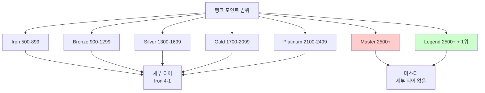
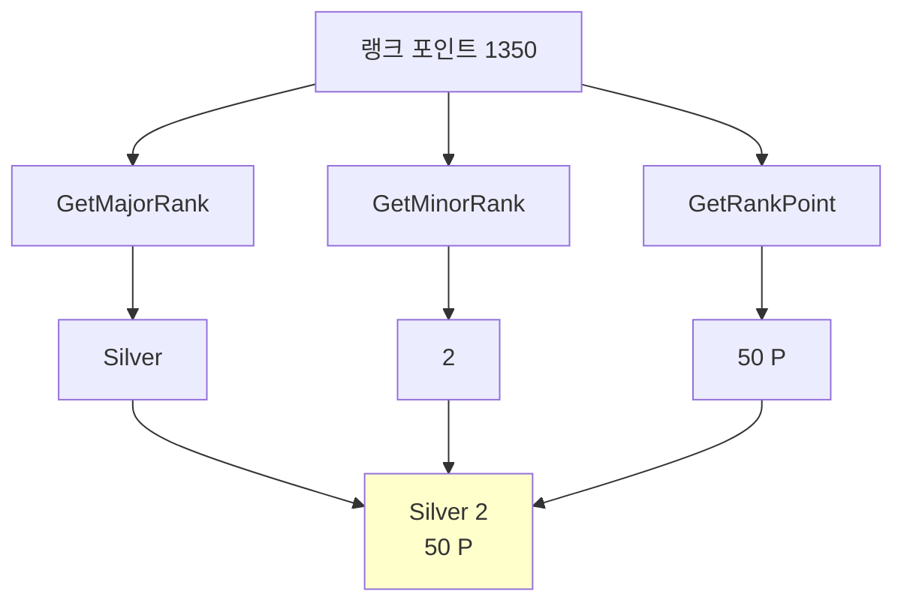
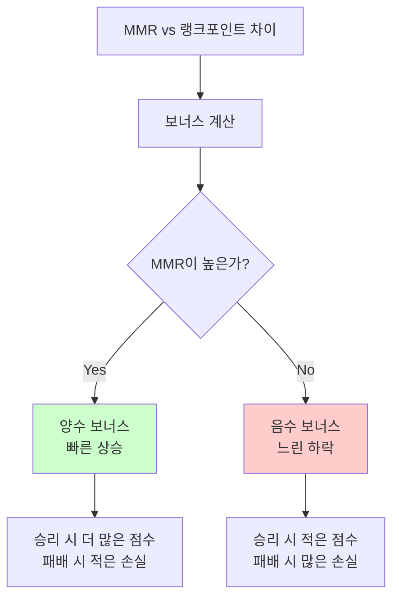
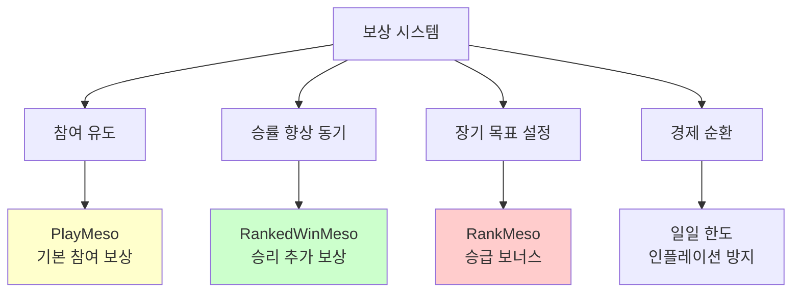
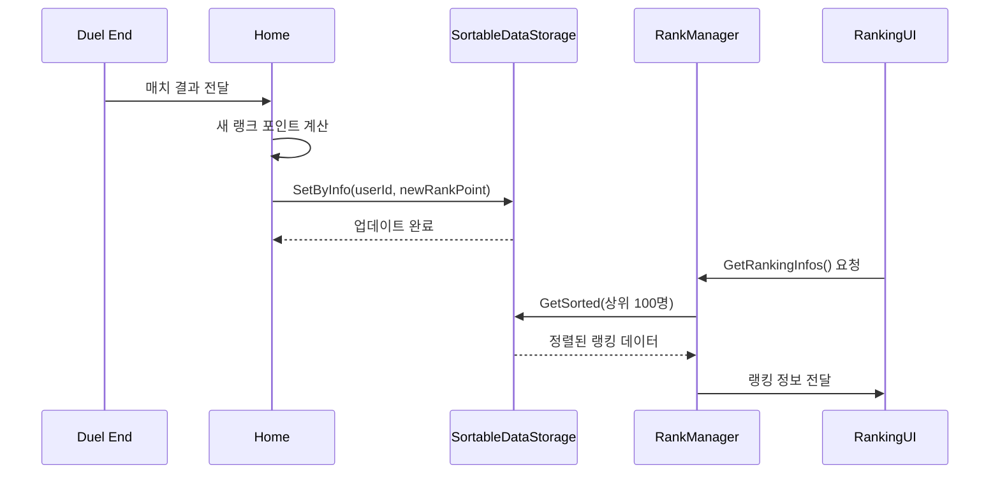

# 랭크 매치 시스템

## 📋 개요

랭크 매치 시스템은 메이플 듀얼의 경쟁적 게임플레이의 핵심으로, ELO 기반 MMR(Match Making Rating) 시스템과 6단계 티어 구조를 통해 공정하고 균형잡힌 매칭 환경을 제공합니다. 이 시스템은 500~2500 랭크 포인트 범위에서 Iron부터 Legend까지의 티어를 운영하며, 승패에 따른 동적 점수 조정, 일일 보상 시스템, 그리고 실시간 리더보드를 통해 플레이어들의 지속적인 경쟁 의욕을 자극합니다.

**관련 파일**:
- `RootDesk/MyDesk/Components/Managers/RankManager.mlua` - 티어 시스템 및 랭크 계산
- `RootDesk/MyDesk/Components/Home.mlua` - ELO 매칭 및 랭크 포인트 업데이트
- `RootDesk/MyDesk/Logics/Matching.mlua` - 리더보드 시스템
- `RootDesk/MyDesk/Components/Objects/Duel.mlua` - 매치 결과 처리

## 🏗️ 랭크 시스템 아키텍처

### 티어 및 랭크 구조



## 🏆 1. 티어 시스템

### 메이저 랭크 계산

#### 6단계 티어 구조
```lua
method string GetMajorRank(integer rankPoint, integer ranking)
    -- Legend: 2500점 이상 + 1위
    if rankPoint >= 2500 and ranking > 0 and ranking == 1 then
        return "Legend"
    end
    
    -- Iron~Master: 400점 구간별 분할
    local majorRankArray = {"Iron", "Bronze", "Silver", "Gold", "Platinum", "Master"}
    return majorRankArray[math.floor((math.min(rankPoint, 2500) - 500) / 400) + 1]
end
```

#### 마이너 랭크 계산 (세부 티어)
```lua
method integer GetMinorRank(integer rankPoint)
    local majorRank = self:GetMajorRank(rankPoint, 0)
    
    -- Master, Legend은 세부 티어 없음
    if majorRank == "Master" or majorRank == "Legend" then
        return
    else
        -- 4-3-2-1 (높을수록 고티어)
        return 4 - math.floor(((rankPoint - 500) % 400) / 100)
    end
end
```

### 티어명 및 포인트 표시

#### 통합 랭크 정보 시스템


#### 랭크 표시 로직
```lua
method string GetRankName(integer rankPoint, integer ranking)
    local majorRank = self:GetMajorRank(rankPoint, ranking)
    
    if majorRank == "Master" or majorRank == "Legend" then
        return _LocalizationService:GetText(majorRank)
    else
        return string.format("%s %d", _LocalizationService:GetText(majorRank), self:GetMinorRank(rankPoint))
    end
end

method string GetRankPoint(integer rankPoint)
    local majorRank = self:GetMajorRank(rankPoint, 0)
    local remainder
    
    if majorRank == "Master" or majorRank == "Legend" then
        remainder = rankPoint - 2500  -- 마스터 이상은 2500 초과분 표시
    else
        remainder = rankPoint % 100   -- 일반 티어는 100단위 나머지
    end
    
    return string.format("%d P", remainder)
end
```

## 📊 2. ELO 기반 매칭 시스템

### MMR 및 랭크 포인트 관계

#### 이중 레이팅 시스템
```lua
-- Home.mlua에서 매치 결과 처리
local befMmr = result.befMmr
local afterMmr
if matchResultInfo == nil then
    afterMmr = befMmr  -- 무효 게임
else
    if userId == matchResultInfo.Home.UserId then
        afterMmr = matchResultInfo.Home.Score
    else
        afterMmr = matchResultInfo.Away.Score
    end
end

-- MMR을 랭크 포인트로 변환
local targetRankPoint = 2 * (afterMmr - 1500) + 1500
local bonus = math.floor((targetRankPoint - befRankPoint) / 40)
```

**이중 시스템의 장점**:
- **MMR**: 실제 실력 기반 매칭 (숨겨진 점수)
- **랭크 포인트**: 플레이어에게 표시되는 점수
- **완충 효과**: 급격한 랭크 변동 방지
- **정확한 매칭**: 실력 차이 최소화

### 동적 점수 조정

#### 승패별 점수 변화 계산
```lua
local delta
if _UtilLogic:IsNilorEmptyString(winnerUserId) then
    delta = 0  -- 무승부
elseif winnerUserId == userId then
    -- 승리: 10~40점 획득 (보너스 포함)
    delta = math.max(math.min(20 + bonus, 40), 10)
else
    -- 패배: -10~-40점 손실 (보너스 포함)
    delta = math.min(math.max(-20 + bonus, -40), -10)
end

local afterRankPoint = math.max(befRankPoint + delta, 500)  -- 최소 500점 보장
```

#### 보너스 시스템


**보너스 시스템의 목적**:
- **빠른 조정**: 실력 대비 잘못된 티어에 있을 때 빠른 수정
- **스머프 방지**: 숙련자가 낮은 티어에 머무르는 것 방지
- **공정성**: 연승 시 빠른 상승, 연패 시 점진적 하락

## 🎁 3. 보상 시스템

### 다층 보상 구조

#### 매치 완료 보상
```lua
-- Duel.mlua에서 보상 계산
local playMesoDelta = 100  -- 기본 참여 보상

local rankedWinMesoDelta
if isRankedMatch and player == winner then
    rankedWinMesoDelta = math.floor(math.min(
        (hotTime and 1.5 or 1) * 450, 
        math.max(0, 4500 - character:GetDailyRankedWinMeso())
    ))
    character:AddDailyRankedWinMeso(rankedWinMesoDelta)
end
```

#### 일일 활동 보상
```lua
local rankedPlayMesoDelta
local dailyRankedPlayCount
if isRankedMatch and self.startDate ~= nil and 
   DateTime.UtcNow - DateTime(self.startDate) > TimeSpan(0, 1, 0) and 
   self.history:GetThisGameMp(player) >= 6 then
    
    character:IncreaseDailyRankedPlayCount()
    dailyRankedPlayCount = character:GetDailyRankedPlayCount()
    
    if dailyRankedPlayCount == 1 then
        rankedPlayMesoDelta = 1000    -- 첫 게임 보너스
    elseif dailyRankedPlayCount == 3 then
        rankedPlayMesoDelta = 2000    -- 3게임 달성
    elseif dailyRankedPlayCount == 6 then
        rankedPlayMesoDelta = 3000    -- 6게임 달성
    end
end
```

### 랭크 상승 보상

#### 단계별 승급 보너스
```lua
local rankMesoDelta
if isRankedMatch then
    local rankPoint = character.rankPoint
    local topRankPoint = character.topRankPoint
    
    -- 100점 단위 승급 보상
    local mesoArray = {500, 500, 500, 3000, 500, 500, 500, 5000, 1000, 1000, 1000, 10000, 1000, 1000, 1000, 20000, 3000, 3000, 3000, 40000}
    for i, meso in ipairs(mesoArray) do
        local hurdle = 500 + i * 100
        if topRankPoint < hurdle and hurdle <= rankPoint then
            rankMesoDelta = rankMesoDelta and rankMesoDelta + meso or meso
        end
    end

    if rankPoint > topRankPoint then
        character:SetTopRankPoint(rankPoint)  -- 최고 랭크 갱신
    end
end
```

### 보상 체계 분석

#### 보상 종류별 목적


## 🏅 4. 리더보드 시스템

### 실시간 랭킹 관리

#### SortableDataStorage 활용
```lua
@ExecSpace("ServerOnly")
method void GetRankingInfos()
    local sortableDataStorage = _DataStorageService:GetSortableDataStorage("Ranking")
    local resultCode, pages = sortableDataStorage:GetSortedAndWait(SortDirection.Descending, 0, 100000)
    
    local rankingInfoArray = {}
    local count = 1
    
    while true do
        local items = pages:GetCurrentPageDatas()
        for _, item in pairs(items) do
            local userId = item.KeyInfo.Key
            local nickname = item.KeyInfo.Tag
            local rankPoint = item.Value
            
            table.insert(rankingInfoArray, {
                nickname = nickname, 
                rankPoint = rankPoint, 
                ranking = count
            })
            
            count += 1
            if count > 100 then break end  -- 상위 100위까지
        end
        
        if count > 100 or pages.IsLastPage then break end
        pages:MoveToNextPageAndWait()
    end
    
    self:GetRankingInfosInSender(rankingInfoArray, senderUserId)
end
```

### 리더보드 데이터 관리

#### 랭킹 업데이트 시스템


## 🔒 5. 매칭 무결성 보장

### 게임 유효성 검사

#### 최소 플레이 조건
```lua
-- 1분 이상 + 6MP 이상 사용한 게임만 인정
if isRankedMatch and self.startDate ~= nil and 
   DateTime.UtcNow - DateTime(self.startDate) > TimeSpan(0, 1, 0) and 
   self.history:GetThisGameMp(player) >= 6 then
    
    -- 유효한 랭크 게임으로 인정
    character:IncreaseDailyRankedPlayCount()
end
```

### 어뷰징 방지

#### 점수 조작 방지 시스템
```lua
-- 최소 랭크 포인트 보장 (500점 이하로 떨어지지 않음)
local afterRankPoint = math.max(befRankPoint + delta, 500)

-- 점수 변화량 제한 (한 게임당 최대 ±40점)
delta = math.max(math.min(20 + bonus, 40), 10)      -- 승리
delta = math.min(math.max(-20 + bonus, -40), -10)   -- 패배
```

## 📈 6. 시즌 시스템 (확장 가능)

### 미래 확장성 고려

#### 시즌 구조 설계
```lua
-- 확장 예시 (미구현)
method void StartNewSeason()
    -- 모든 플레이어 랭크 포인트 리셋
    local resetPoint = math.max(500, currentRankPoint * 0.8)
    
    -- 시즌 보상 지급
    local seasonReward = self:CalculateSeasonReward(finalRank)
    
    -- 새 시즌 시작
    self:InitializeSeasonData(newSeasonId)
end
```

#### 시즌별 메타 변화
- **카드 밸런스**: 시즌마다 카드 효과 조정
- **새 보상**: 시즌 전용 카드백, 타이틀 등
- **특별 이벤트**: 시즌 중 특별 매칭 모드

## 💡 코드 참조

랭크 매치 시스템 핵심 로직:
- `RankManager.mlua :: GetMajorRank()` — 티어 계산 로직
- `Home.mlua :: UpdateMatchResult()` — ELO 기반 랭크 포인트 계산
- `Duel.mlua :: EndMatch()` — 매치 결과 처리 및 보상 지급
- `RankManager.mlua :: GetRankingInfos()` — 실시간 리더보드 관리
- `Matching.mlua :: GetOrCreateLeaderBoard()` — 리더보드 시스템 초기화

랭크 매치 시스템은 메이플 듀얼의 경쟁적 게임플레이를 지원하는 핵심 시스템으로, ELO 기반의 공정한 매칭과 다층적 보상 구조를 통해 플레이어들의 지속적인 참여와 실력 향상을 유도하며, 확장 가능한 설계를 통해 미래의 시즌 시스템이나 추가 기능을 쉽게 통합할 수 있도록 구축되었습니다.
