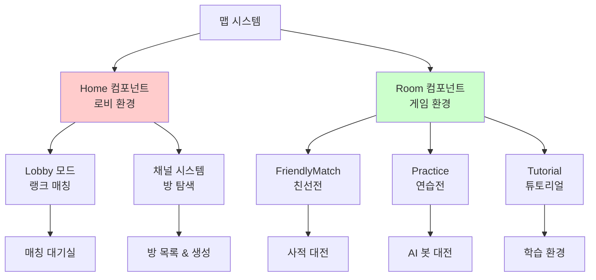
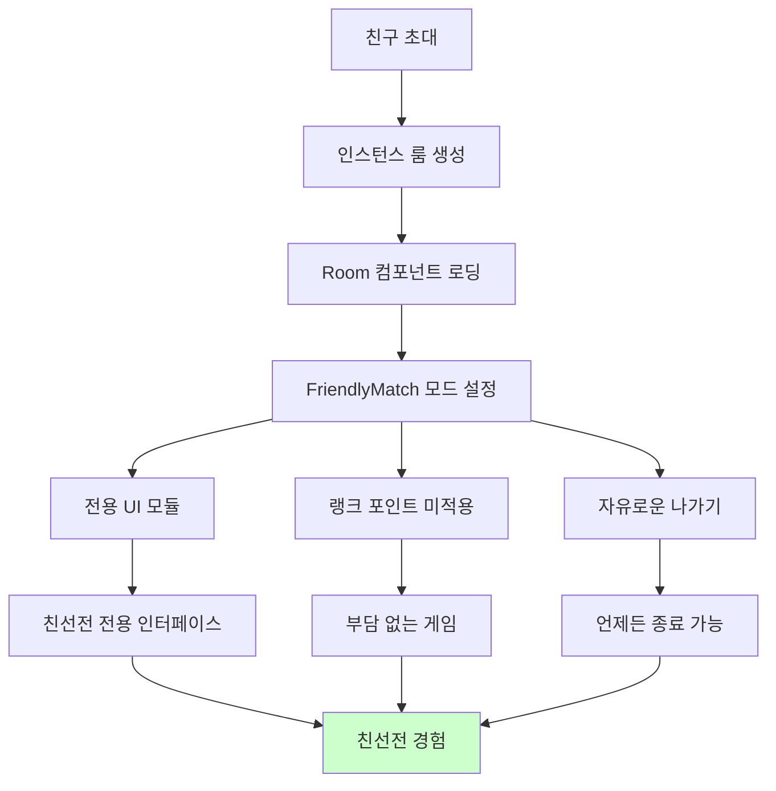
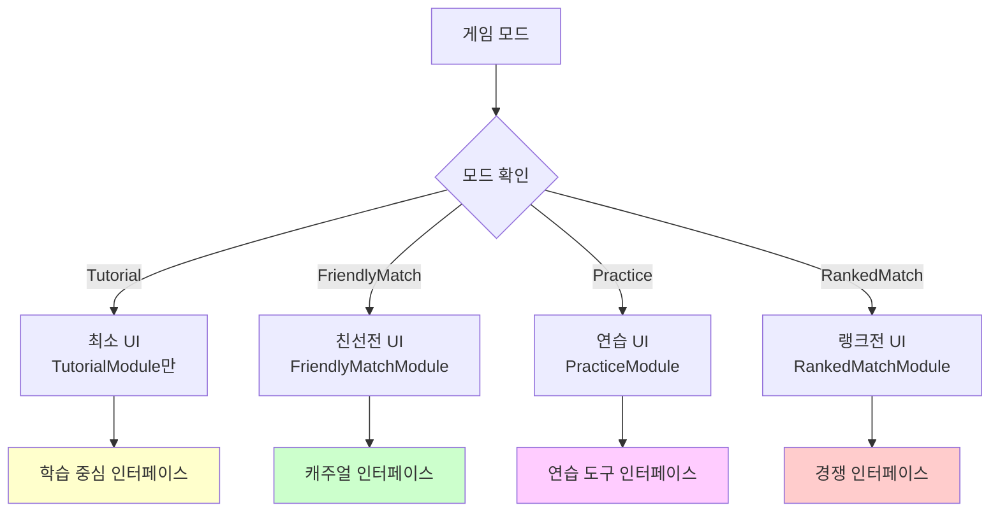

# 방 시스템

## 📋 개요

방 시스템은 메이플 듀얼의 친선전과 다양한 게임 모드를 위한 유연한 인스턴스 관리 시스템입니다. Room과 Home 컴포넌트를 통해 친선전, 연습전, 튜토리얼 등 다양한 게임 모드를 지원하며, 채널별 사용자 관리와 동적 UI 모듈 로딩을 통해 각 모드에 최적화된 환경을 제공합니다. 이 시스템은 MapleStory Worlds의 인스턴스 룸 기능과 연동되어 격리된 게임 환경을 제공하고, 친구 간의 사적인 대전이나 학습 목적의 안전한 환경을 보장합니다.

**관련 파일**:
- `RootDesk/MyDesk/Components/Room.mlua` - 친선전 방 관리
- `RootDesk/MyDesk/Components/Home.mlua` - 로비 및 채널 시스템  
- `RootDesk/MyDesk/Components/UIs/RoomChannelModule.mlua` - 방/채널 UI 관리
- `RootDesk/MyDesk/Components/UIs/FriendlyMatchModule.mlua` - 친선전 전용 UI

## 🏗️ 방 시스템 아키텍처

### 게임 모드별 환경 분리



## 🏠 1. Home 컴포넌트 - 로비 시스템

### 로비 환경 관리

#### 로비 모드 초기화
```lua
@ExecSpace("Client")
method void OnSyncProperties()
    __base:OnSyncProperties()
    
    if _UtilLogic:IsNilorEmptyString(self.mode) then
        return
    end
    
    -- 기본 UI 모듈들
    self.uiManager:SpawnAndSetModule("GalleryModule", self.Entity)
    self.uiManager:SpawnAndSetModule("CardModule", self.Entity)
    self.uiManager:SpawnAndSetModule("ShopModule", self.Entity)
    self.uiManager:SpawnAndSetModule("CardPackModule", self.Entity)
    self.uiManager:SpawnAndSetModule("RoomChannelModule", self.Entity)
    self.uiManager:SpawnAndSetModule("GuideModule", self.Entity)
    
    if self.mode == "Lobby" then
        -- 로비 전용 모듈들
        self.uiManager:SpawnAndSetModule("LobbyModule", self.Entity)
        self.uiManager:SpawnAndSetModule("RankedMatchModule", self.Entity)
        self.uiManager:SpawnAndSetModule("RankingModule", self.Entity)
        self.uiManager:SpawnAndSetModule("NoticeModule", self.Entity)
        self.uiManager:SpawnAndSetModule("RewardModule", self.Entity)
        self.uiManager:SpawnAndSetModule("EventModule", self.Entity)
    end
end
```

### 채널 시스템

#### 채널 기반 방 관리
```lua
property table channel = nil  -- 현재 채널 정보

method table GetProperties()
    local propertyTable = {
        channel = self.channel,
    }
    
    _Table:Assign(__base:GetProperties(), propertyTable)
    
    return propertyTable
end
```

**채널 시스템 특징**:
- **방 탐색**: 채널 내 활성 방 목록 제공
- **사용자 분산**: 채널별 사용자 수 관리
- **성능 최적화**: 채널 단위 부하 분산
- **사회적 기능**: 같은 채널 내 플레이어 간 상호작용

## 🎮 2. Room 컴포넌트 - 게임 환경

### 게임 모드별 UI 구성

#### 동적 모듈 로딩 시스템
```lua
@ExecSpace("Client") 
method void OnSyncProperties()
    __base:OnSyncProperties()
    
    if _UtilLogic:IsNilorEmptyString(self.mode) then
        return
    end
    
    -- 공통 UI 모듈
    self.uiManager:SpawnAndSetModule("GalleryModule", self.Entity)
    
    if self.mode == "Tutorial" then
        -- 튜토리얼 전용 환경
        self.uiManager:SpawnAndSetModule("TutorialModule", self.Entity)
    else
        -- 일반 게임 환경
        self.uiManager:SpawnAndSetModule("NoticeModule", self.Entity)
        self.uiManager:SpawnAndSetModule("RewardModule", self.Entity)
        self.uiManager:SpawnAndSetModule("EventModule", self.Entity)
        
        self.uiManager:SpawnAndSetModule("DuelModule", self.Entity)
        self.uiManager:SpawnAndSetModule("PlayerModule", self.Entity)
        
        self.uiManager:SpawnAndSetModule("CardModule", self.Entity)
        self.uiManager:SpawnAndSetModule("ShopModule", self.Entity)
        self.uiManager:SpawnAndSetModule("CardPackModule", self.Entity)
    end
    
    self.uiManager:SpawnAndSetModule("GuideModule", self.Entity)
    
    -- 모드별 특화 UI
    self:LoadModeSpecificUI()
end
```

#### 모드별 특화 UI 로딩
```lua
method void LoadModeSpecificUI()
    if self.mode == "FriendlyMatch" then
        self.uiManager:SpawnAndSetModule("FriendlyMatchModule", self.Entity)
        self.duel.mainModule = self.uiManager.FriendlyMatchModule
        self.uiManager.LocationModule:SetFriendlyMatch()
        
    elseif self.mode == "Practice" then
        self.uiManager:SpawnAndSetModule("PracticeModule", self.Entity)
        self.duel.mainModule = self.uiManager.PracticeModule
        self.uiManager.LocationModule:SetPractice()
        
    elseif self.mode == "RankedMatch" then
        self.uiManager:SpawnAndSetModule("RankedMatchModule", self.Entity)
        self.duel.mainModule = self.uiManager.RankedMatchModule
        self.uiManager.LocationModule:SetRankedMatch()
    end
end
```

### 방 속성 관리

#### 방 정보 동기화
```lua
property table room = nil  -- 방 관련 정보

method table GetProperties()
    local propertyTable = {
        room = self.room,
    }
    
    _Table:Assign(__base:GetProperties(), propertyTable)
    
    return propertyTable
end
```

## 🤝 3. 친선전 시스템

### 친선전 특화 기능

#### 사적 대전 환경


#### 친선전 모듈 특징
- **비공식 게임**: 랭크 포인트나 공식 기록에 영향 없음
- **친구 전용**: 초대받은 사람만 입장 가능
- **자유로운 환경**: 중간에 나가도 패널티 없음
- **학습 목적**: 새로운 전략 실험이나 친구와의 재미있는 대전

### 방 생성 및 참여

#### 인스턴스 룸 활용
```lua
-- Character.mlua에서 친구 따라가기 기능
local warpRecord = _TeleportService:GetWarpRecord(self.Entity.Name)
if warpRecord ~= nil and not _UtilLogic:IsNilorEmptyString(warpRecord.Data) and not _RoomService:IsInstanceRoom() then
    local friend = _MSON:FastStringToAny(warpRecord.Data)
    local room = friend.location.room
    if _RoomService.InstanceRooms[room.key] then
        _RoomService:MoveUserToInstanceRoom(room.key, self.Entity.Name)
        return
    end
end
```

**인스턴스 룸 장점**:
- **격리된 환경**: 다른 플레이어의 방해 없음
- **개인화**: 방 설정 및 규칙 커스터마이징 가능
- **안정성**: 방 내 연결이 끊어져도 다른 방에 영향 없음
- **확장성**: 향후 토너먼트나 이벤트 모드 지원 가능

## 🤖 4. 연습 시스템

### AI 봇과의 연습 환경

#### 연습 모드 특화
```lua
if self.mode == "Practice" then
    self.uiManager:SpawnAndSetModule("PracticeModule", self.Entity)
    self.duel.mainModule = self.uiManager.PracticeModule
    self.uiManager.LocationModule:SetPractice()
end
```

#### 연습전 특징
- **AI 상대**: 다양한 난이도의 봇과 대전
- **실력 향상**: 랭크 부담 없이 전략 연습
- **직업 학습**: 각 직업별 특성 파악
- **무제한 도전**: 제한 없이 반복 연습 가능

### 튜토리얼 시스템

#### 신규 플레이어 온보딩
```lua
if self.mode == "Tutorial" then
    self.uiManager:SpawnAndSetModule("TutorialModule", self.Entity)
else
    -- 일반 게임 UI 로딩
    self.uiManager:SpawnAndSetModule("NoticeModule", self.Entity)
    // ... 기타 모듈들
end
```

**튜토리얼 환경**:
- **단계별 학습**: 기본 규칙부터 고급 전략까지
- **가이드 시스템**: 상황별 힌트 및 설명 제공  
- **안전한 환경**: 실수해도 부담 없는 학습 공간
- **진행도 저장**: 중단 후 재시작 시 이어서 학습

## 🔧 5. UI 모듈 시스템

### 모드별 UI 최적화

#### 동적 UI 구성


### 공통 모듈과 전용 모듈

#### 효율적 리소스 관리
- **공통 모듈**: GalleryModule, GuideModule 등 모든 모드에서 사용
- **게임 모듈**: CardModule, DuelModule 등 실제 게임 플레이 관련
- **전용 모듈**: 각 모드별 특화 기능만 제공하는 모듈
- **조건부 로딩**: 필요한 모듈만 로딩하여 메모리 효율성 확보

## 🌐 6. 채널 및 방 탐색 시스템

### RoomChannelModule 연동

#### 방 목록 및 생성
```lua
-- Home.mlua에서 RoomChannelModule 활성화
self.uiManager:SpawnAndSetModule("RoomChannelModule", self.Entity)
```

#### 채널 시스템 특징
- **채널 선택**: 플레이어가 원하는 채널로 이동 가능
- **방 탐색**: 현재 채널의 활성 방 목록 확인
- **방 생성**: 새로운 친선전 방 생성 및 초대
- **사용자 관리**: 채널별 접속자 수 및 상태 표시

### 방 상태 관리

#### 실시간 방 정보
```lua
property table matchUserInfos = {}  -- 매치 참여자 정보
property boolean isEndMatch = false  -- 게임 종료 상태
```

**방 상태 정보**:
- **참여자 목록**: 현재 방에 있는 플레이어들
- **게임 진행 상태**: 대기중/진행중/종료됨
- **방 설정**: 모드, 제한시간, 기타 규칙
- **호스트 권한**: 방 설정 변경 및 게임 시작 권한

## 🔒 7. 보안 및 무결성

### 방 접근 제어

#### 인증 및 권한 관리
```lua
-- 친구 초대를 통한 방 접근만 허용
if warpRecord ~= nil and not _UtilLogic:IsNilorEmptyString(warpRecord.Data) then
    local friend = _MSON:FastStringToAny(warpRecord.Data)
    -- 유효한 초대인지 확인 후 입장 처리
end
```

#### 어뷰징 방지
- **초대 전용**: 무작위 입장 불가, 초대받은 사용자만 접근
- **방 정원**: 최대 2명까지만 입장 가능
- **타임아웃**: 비활성 방은 자동으로 정리
- **신고 시스템**: 부적절한 행동 신고 및 처리

### 네트워크 최적화

#### 인스턴스 별 부하 분산
- **독립적 처리**: 각 방은 독립된 인스턴스에서 실행
- **리소스 격리**: 한 방의 문제가 다른 방에 영향 주지 않음
- **동적 할당**: 필요에 따라 인스턴스 생성/제거
- **효율적 동기화**: 방 내 플레이어들에게만 데이터 전송

## 💡 코드 참조

방 시스템 핵심 로직:
- `Room.mlua :: OnSyncProperties()` — 모드별 동적 UI 로딩
- `Home.mlua :: OnSyncProperties()` — 로비 환경 및 채널 시스템  
- `Character.mlua :: Load()` — 인스턴스 룸 접근 처리
- `Room.mlua :: LoadModeSpecificUI()` — 게임 모드별 특화 인터페이스
- `Home.mlua :: GetProperties()` — 채널 정보 동기화

방 시스템은 메이플 듀얼의 다양한 게임 모드를 지원하는 유연한 인프라로, 친선전의 사적이고 자유로운 환경부터 체계적인 학습을 위한 튜토리얼까지 각 목적에 최적화된 게임 환경을 제공하며, 확장 가능한 설계를 통해 미래의 새로운 게임 모드나 기능을 쉽게 통합할 수 있도록 구축되었습니다.
