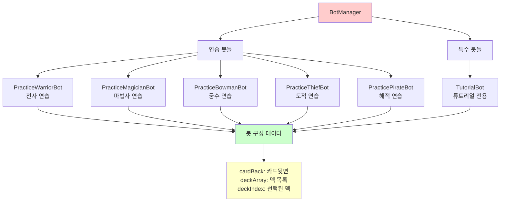
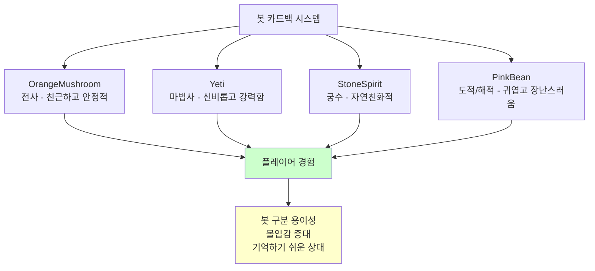
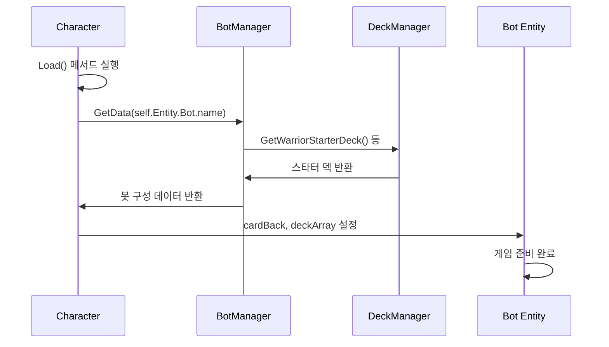
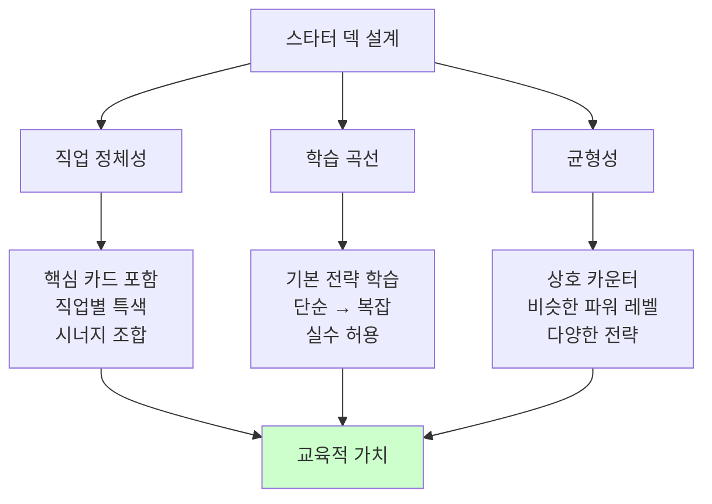
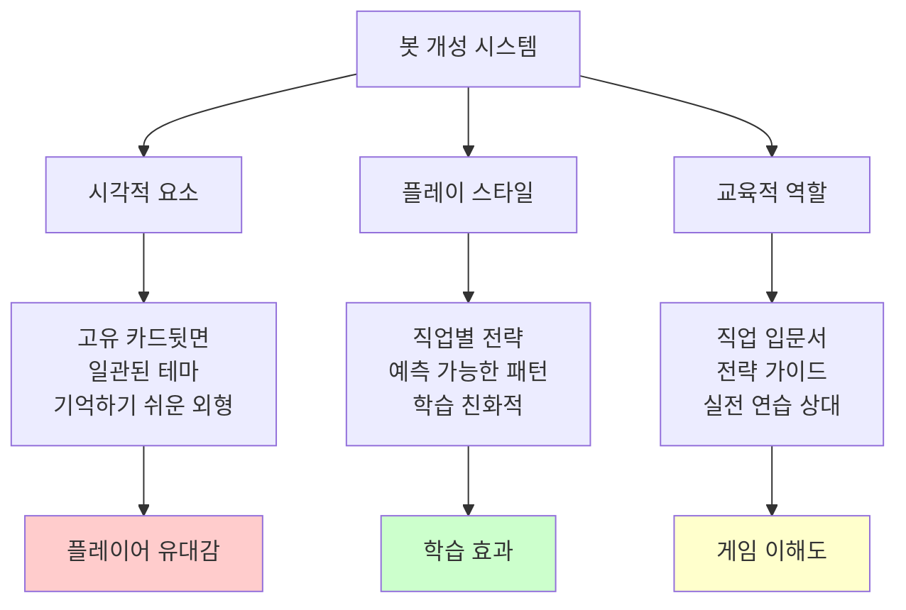

# 봇 데이터 관리

## 📋 개요

봇 데이터 관리 시스템은 메이플 듀얼의 다양한 AI 봇들의 구성과 특성을 정의하고 관리하는 중앙 집중식 시스템입니다. BotManager는 5개 직업별 연습 봇과 특수 목적 봇들의 데이터를 제공하며, 각 봇마다 고유한 덱 구성, 카드백, 난이도 설정을 관리합니다. 이 시스템은 DeckManager와 연동하여 직업별 스타터 덱을 자동으로 구성하고, 동적 봇 데이터 접근을 통해 새로운 봇 유형을 쉽게 추가할 수 있는 확장성을 제공합니다.

**관련 파일**:
- `RootDesk/MyDesk/Components/Managers/BotManager.mlua` - 봇 데이터 정의 및 관리
- `RootDesk/MyDesk/Components/Managers/DeckManager.mlua` - 스타터 덱 제공
- `RootDesk/MyDesk/Components/Character.mlua` - 봇 데이터 로딩 및 적용

## 🏗️ 봇 데이터 아키텍처

### 봇 데이터 구조



## 🎮 1. 직업별 연습 봇 시스템

### 5개 직업 봇 구성

#### 전사 연습 봇
```lua
method table PracticeWarriorBot()
    return {
        cardBack = "OrangeMushroom",  -- 주황버섯 카드뒷면
        deckArray = {self.deckManager:GetWarriorStarterDeck(nil)},
        deckIndex = 1,
    }
end
```

#### 마법사 연습 봇
```lua
method table PracticeMagicianBot()
    return {
        cardBack = "Yeti",  -- 예티 카드뒷면
        deckArray = {self.deckManager:GetMagicianStarterDeck(nil)},
        deckIndex = 1,
    }
end
```

#### 궁수 연습 봇
```lua
method table PracticeBowmanBot()
    return {
        cardBack = "StoneSpirit",  -- 스톤스피릿 카드뒷면
        deckArray = {self.deckManager:GetBowmanStarterDeck(nil)},
        deckIndex = 1,
    }
end
```

#### 도적 연습 봇
```lua
method table PracticeThiefBot()
    return {
        cardBack = "PinkBean",  -- 핑크빈 카드뒷면
        deckArray = {self.deckManager:GetThiefStarterDeck(nil)},
        deckIndex = 1,
    }
end
```

#### 해적 연습 봇
```lua
method table PracticePirateBot()
    return {
        cardBack = "PinkBean",  -- 핑크빈 카드뒷면
        deckArray = {self.deckManager:GetPirateStarterDeck(nil)},
        deckIndex = 1,
    }
end
```

**직업별 봇 특징**:
- **직업 대표성**: 각 직업의 핵심 전략과 카드들로 구성
- **시각적 구분**: 고유한 카드뒷면으로 봇별 식별 가능
- **교육적 목적**: 플레이어가 해당 직업의 특성을 학습
- **균형잡힌 난이도**: 모든 직업 봇이 비슷한 수준의 도전 제공

### 봇별 카드백 시스템

#### 시각적 정체성 부여


## 🎯 2. 특수 목적 봇

### 튜토리얼 봇

#### 교육 전용 설계
```lua
method table TutorialBot()
    return {
        cardBack = "Yeti",
        deckArray = {},  -- 빈 덱 배열
        deckIndex = 1,
    }
end
```

**튜토리얼 봇 특징**:
- **유연한 덱 구성**: 튜토리얼 단계에 맞춰 동적으로 덱 변경
- **제한된 행동**: 특정 상황에서만 특정 카드 플레이
- **교육적 상호작용**: 플레이어 학습을 위한 의도적 플레이
- **단계별 적응**: 튜토리얼 진행도에 따른 점진적 복잡성

### 확장 가능한 봇 시스템

#### 새로운 봇 추가 패턴
```lua
// 새로운 봇 추가 예시 (미구현)
method table ChallengeBoss()
    return {
        cardBack = "DarkLord",
        deckArray = {
            self.deckManager:GetBossDeck("DarkLord"),
            self.deckManager:GetBossDeck("CrimsonBalrog"),
        },
        deckIndex = 1,
        difficulty = "Nightmare",  -- 확장 속성
        specialAbilities = {"ExtraMP", "DoubleDraw"}  -- 특수 능력
    }
end
```

## 🔄 3. 동적 봇 데이터 시스템

### 런타임 데이터 접근

#### 문자열 기반 봇 조회
```lua
method table GetData(string botName)
    return _Util:Call(self, botName, {})
end
```

**동적 접근의 장점**:
- **확장성**: 새 봇을 코드 변경 없이 추가 가능
- **유연성**: 봇 이름을 통한 런타임 선택
- **모듈성**: 각 봇의 설정이 독립적으로 관리
- **디버깅**: 특정 봇만 쉽게 테스트 가능

### Character 컴포넌트와의 연동

#### 봇 데이터 로딩 과정


#### Character에서의 봇 데이터 적용
```lua
@ExecSpace("ServerOnly")
method void Load(string localeId)
    if not self:IsUser() then
        self.isLoaded = true
        
        -- 봇 데이터 로딩
        local data = self.botManager:GetData(self.Entity.Bot.name)
        self.cardBack = data.cardBack
        self.deckArray = data.deckArray
        self.deckIndex = data.deckIndex
        
        return
    end
    // ... 유저 데이터 로딩 로직
end
```

## 📊 4. 스타터 덱 시스템

### DeckManager와의 연동

#### 직업별 스타터 덱 구성
```lua
-- DeckManager에서 제공하는 스타터 덱들
self.deckManager:GetWarriorStarterDeck(nil)     -- 전사 기본 덱
self.deckManager:GetMagicianStarterDeck(nil)    -- 마법사 기본 덱
self.deckManager:GetBowmanStarterDeck(nil)      -- 궁수 기본 덱
self.deckManager:GetThiefStarterDeck(nil)       -- 도적 기본 덱
self.deckManager:GetPirateStarterDeck(nil)      -- 해적 기본 덱
```

#### 스타터 덱 설계 원칙


### 덱 구성 특징

#### 각 직업별 전략 반영
- **전사**: 강력한 미니언과 직접 공격 중심
- **마법사**: 다양한 스킬과 마법 효과 중심  
- **궁수**: 원거리 공격과 정밀한 타겟팅
- **도적**: 빠른 공격과 특수 효과
- **해적**: 균형잡힌 구성과 다양한 옵션

## 🎭 5. 봇 개성 시스템

### 카드뒷면을 통한 캐릭터화

#### 봇별 개성 부여


### 확장 가능한 개성 시스템

#### 미래 확장성 고려
```lua
// 확장 예시 (미구현)
method table AdvancedWarriorBot()
    return {
        cardBack = "DarkKnight",
        deckArray = {self.deckManager:GetAdvancedWarriorDeck()},
        deckIndex = 1,
        personality = {
            aggression = 0.8,    -- 공격성 지수
            patience = 0.3,      -- 인내심 지수  
            riskTaking = 0.7     -- 리스크 감수성
        },
        chatPatterns = {
            "전사답게 정면승부다!",
            "내 검이 승부를 가른다!",
            "방어는 최선의 공격이다!"
        }
    }
end
```

## 🛡️ 6. 봇 관리 보안 및 무결성

### 데이터 검증

#### 봇 설정 유효성 확인
```lua
method boolean ValidateBotData(table botData)
    -- 필수 필드 존재 확인
    if not botData.cardBack or not botData.deckArray or not botData.deckIndex then
        return false
    end
    
    -- 덱 인덱스 유효성 확인
    if botData.deckIndex < 1 or botData.deckIndex > #botData.deckArray then
        return false
    end
    
    -- 카드뒷면 유효성 확인
    if not self.cardBackManager:IsValidCardBack(botData.cardBack) then
        return false
    end
    
    return true
end
```

### 봇 성능 모니터링

#### 봇별 성능 추적
```lua
method void TrackBotPerformance(string botName, table gameResult)
    local stats = self.botStats[botName] or {
        games = 0,
        wins = 0,
        avgGameTime = 0,
        commonMistakes = {}
    }
    
    stats.games += 1
    if gameResult.winner == botName then
        stats.wins += 1
    end
    
    -- 승률 밸런싱을 위한 데이터 수집
    self.botStats[botName] = stats
end
```

## 🔧 7. 개발 도구 및 디버깅

### 봇 테스트 유틸리티

#### 개발용 봇 생성
```lua
method table DebugBot(table customConfig)
    local defaultConfig = {
        cardBack = "TestCardBack",
        deckArray = {self.deckManager:GetTestDeck()},
        deckIndex = 1
    }
    
    return _Table:Merge(defaultConfig, customConfig)
end

method table CreateCustomBot(string deck, string cardBack, string difficulty)
    return {
        cardBack = cardBack,
        deckArray = {deck},
        deckIndex = 1,
        difficulty = difficulty
    }
end
```

### 봇 설정 편집기

#### 런타임 봇 수정
```lua
method void ModifyBotData(string botName, table modifications)
    if _Debug.AllowBotModification then
        local currentData = self:GetData(botName)
        local newData = _Table:Merge(currentData, modifications)
        
        -- 동적 봇 데이터 교체
        self[botName] = function() return newData end
    end
end
```

## 💡 코드 참조

봇 데이터 관리 핵심 로직:
- `BotManager.mlua :: GetData()` — 동적 봇 데이터 접근 시스템
- `BotManager.mlua :: PracticeWarriorBot()` — 전사 봇 구성 예시
- `BotManager.mlua :: TutorialBot()` — 교육용 특수 봇 설계
- `Character.mlua :: Load()` — 봇 데이터 로딩 및 적용
- `DeckManager.mlua :: GetWarriorStarterDeck()` — 직업별 스타터 덱 연동

봇 데이터 관리 시스템은 메이플 듀얼의 AI 봇들이 각각 고유한 개성과 교육적 가치를 가지면서도 일관된 품질의 게임 경험을 제공할 수 있도록 하는 핵심 인프라로, 확장 가능한 설계를 통해 새로운 봇 유형과 특성을 쉽게 추가할 수 있는 유연성을 제공합니다.
