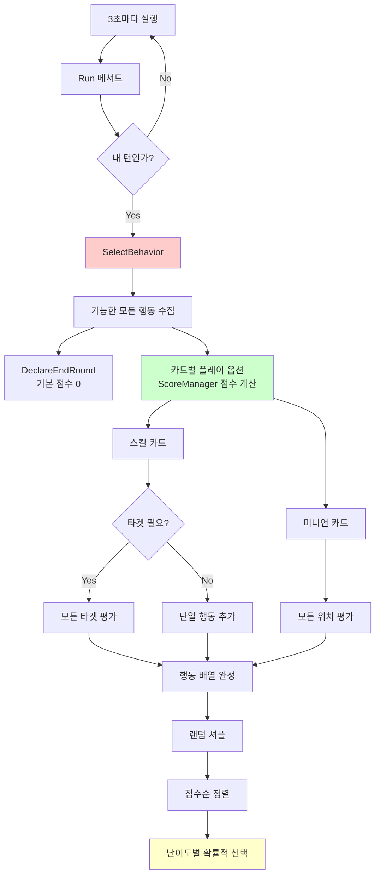
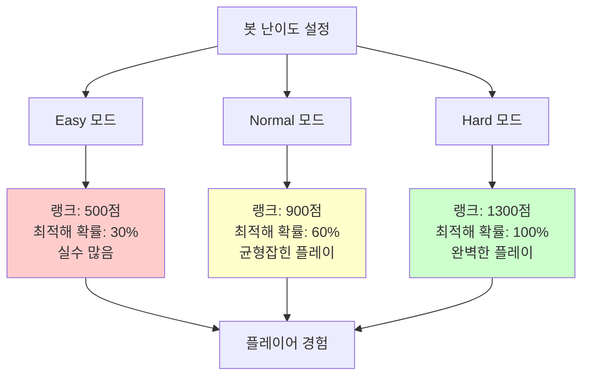
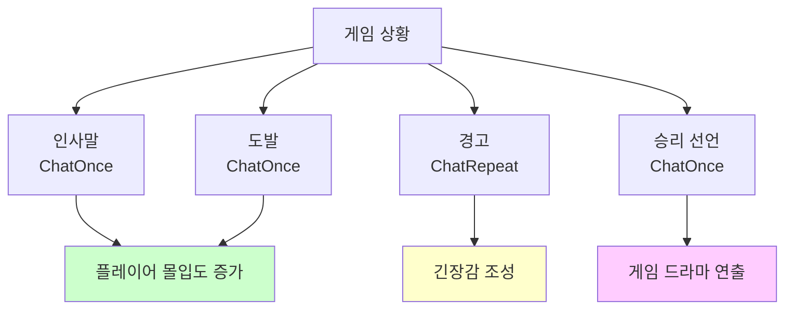
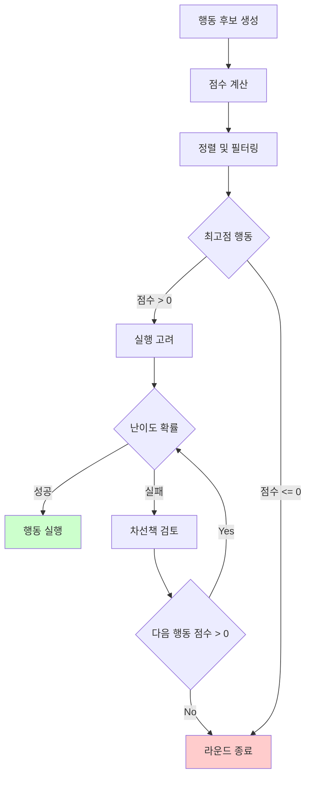

# 봇 컴포넌트

## 📋 개요

Bot 컴포넌트는 메이플 듀얼의 AI 대전 상대를 구현하는 핵심 시스템입니다. 이 컴포넌트는 ScoreManager와 연동하여 200여 개 카드 조합에 대한 복잡한 점수 계산을 수행하고, 3단계 난이도 시스템을 통해 플레이어 수준에 맞는 도전을 제공합니다. 봇은 3초마다 모든 가능한 행동을 평가하여 최적의 선택을 하며, 확률적 의사결정을 통해 예측 불가능하면서도 합리적인 플레이를 구현합니다. 또한 채팅 기능을 통해 플레이어와 상호작용하여 더욱 생동감 있는 게임 경험을 제공합니다.

**관련 파일**:
- `RootDesk/MyDesk/Components/Bot.mlua` - AI 봇 메인 컴포넌트
- `RootDesk/MyDesk/Components/Managers/ScoreManager.mlua` - 점수 계산 시스템
- `RootDesk/MyDesk/Components/Managers/BotManager.mlua` - 봇 데이터 관리

## 🏗️ 봇 AI 아키텍처

### 의사결정 프로세스



## 🎯 1. 행동 선택 시스템

### 포괄적 행동 평가

#### 모든 가능한 행동 수집
```lua
@ExecSpace("ServerOnly")
method table SelectBehavior()
    local player = self.Entity.Character.player
    local behaviorArray = {}
    
    -- 1. 기본 행동: 라운드 종료
    table.insert(behaviorArray, {name = "DeclareEndRound", score = 0})
    
    -- 2. 손패 카드들의 플레이 옵션 평가
    for _, card in ipairs(player.hand.cardArray) do
        local inputState = card:GetInputState(player.character)
        if not inputState.isPlayable then
            continue  -- 플레이 불가능한 카드 스킵
        end
        
        if card.category == "Skill" then
            if card.requiresTarget then
                -- 타겟 지정 스킬: 모든 유효한 타겟 평가
                for _, target in ipairs(card.targetableArray) do
                    local behavior = {
                        name = "Play", 
                        card = card, 
                        target = target, 
                        score = self.scoreManager:GetScore(card, target, nil)
                    }
                    table.insert(behaviorArray, behavior)
                end
            else
                -- 즉시 스킬: 단일 평가
                local behavior = {
                    name = "Play", 
                    card = card, 
                    score = self.scoreManager:GetScore(card, nil, nil)
                }
                table.insert(behaviorArray, behavior)
            end
        elseif card.category == "Minion" then
            -- 미니언: 모든 가능한 배치 위치 평가
            for i = 0, #player.field.minionArray do
                local pivot = player.field.minionArray[i]
                local behavior = {
                    name = "Play", 
                    card = card, 
                    pivot = pivot, 
                    score = self.scoreManager:GetScore(card, nil, pivot)
                }
                table.insert(behaviorArray, behavior)
            end
        end
    end
    
    return self:ApplyDifficultyFilter(behaviorArray)
end
```

### 점수 기반 의사결정

#### 스마트한 행동 선택 로직
```lua
-- 행동 후보들을 점수순으로 정렬
_Table:Shuffle(behaviorArray)  -- 동점 상황에서 랜덤성 보장
table.sort(behaviorArray, self.behaviorComparer)  -- 점수 내림차순

-- 난이도별 확률적 선택
local rate = 0.3
if self.difficulty == "Easy" then
    rate = 0.3    -- 30% 확률로 최적해 선택
elseif self.difficulty == "Normal" then
    rate = 0.6    -- 60% 확률로 최적해 선택  
elseif self.difficulty == "Hard" then
    rate = 1      -- 항상 최적해 선택
end

local behavior
for _, item in ipairs(behaviorArray) do
    if item.score < 0 then
        break  -- 부정적 점수는 선택하지 않음
    end
    
    behavior = item
    
    if _UtilLogic:RandomDouble() < rate then
        break  -- 확률에 따라 선택 확정
    end
end

return behavior
```

**의사결정 특징**:
- **전략적 깊이**: 모든 가능한 행동을 점수로 평가
- **확률적 선택**: 완벽하지 않은 플레이로 자연스러운 게임
- **난이도 조절**: 플레이어 수준에 맞는 도전 제공
- **안전장치**: 부정적 점수 행동은 절대 선택하지 않음

## 🎲 2. 난이도 시스템

### 3단계 난이도 구조

#### 난이도별 특성화


#### 난이도 설정 및 랭크 연동
```lua
@ExecSpace("ServerOnly")
method void SetDifficulty(string difficulty)
    self.difficulty = difficulty
    
    local character = self.Entity.Character
    if difficulty == "Easy" then
        character:SetRank(500, 0)    -- 브론즈 수준
    elseif difficulty == "Normal" then
        character:SetRank(900, 0)    -- 실버 수준
    elseif difficulty == "Hard" then
        character:SetRank(1300, 0)   -- 골드 수준
    end
end
```

**난이도 시스템의 교육적 가치**:
- **학습 곡선**: 초보자부터 숙련자까지 단계별 도전
- **랭크 시뮬레이션**: 실제 경쟁전 환경 모방
- **전략 학습**: 봇의 플레이를 관찰하여 전략 습득 가능

### 확률적 의사결정 모델

#### 인간적인 플레이 패턴
```lua
-- 최적해를 항상 선택하지 않는 자연스러운 AI
local behavior
for _, item in ipairs(behaviorArray) do
    if item.score < 0 then
        break
    end
    
    behavior = item  -- 현재 최고점 행동 저장
    
    -- 확률에 따라 여기서 멈출지 결정
    if _UtilLogic:RandomDouble() < rate then
        break  -- 이 행동 선택
    end
    -- 그렇지 않으면 다음 행동도 고려 (더 나쁜 선택일 수 있음)
end
```

**확률 모델의 장점**:
- **예측 불가능성**: 같은 상황에서도 다른 선택 가능
- **인간적 실수**: 완벽하지 않은 플레이로 재미 증대
- **학습 기회**: 플레이어가 봇의 실수를 활용할 수 있음

## 🎮 3. 실시간 게임 실행

### 자동 플레이 루프

#### 지속적인 의사결정 사이클
```lua
@ExecSpace("ServerOnly")
method void Run()
    self.behaviorComparer = function(left, right) 
        return left.score > right.score 
    end
    
    local behave = function()
        local player = self.Entity.Character.player
        
        -- 행동 조건 확인
        if not isvalid(player) or not player:IsOurTurn() or self.taskManager.delay > 0 then
            return
        end
        
        -- 행동 선택 및 실행
        local behavior = self:SelectBehavior()
        local name = behavior.name
        
        if name == "DeclareEndRound" then
            self:DeclareEndRound()
        elseif name == "Play" then
            -- 카드 상태 재검증
            local inputState = behavior.card:GetInputState(player.character)
            if not inputState.isPlayable then
                return
            end
            
            self:Play(behavior.card, behavior.target, behavior.pivot)
        end
    end
    
    -- 3초마다 행동 평가 및 실행
    _TimerService:SetTimerRepeat(behave, 3)
end
```

#### 안전한 명령 실행
```lua
@ExecSpace("ServerOnly")
method void Play(Card card, Unit target, Minion pivot)
    -- 시각적 피드백: 카드 선택 애니메이션
    card:BeginPlaying()
    wait(1)
    card:EndPlaying()
    
    -- 실제 게임 명령 실행
    self.commandManager:RunCommand("Play", {card, target, pivot}, {})
end

@ExecSpace("ServerOnly")
method void DeclareEndRound()
    local player = self.Entity.Character.player
    self.commandManager:RunCommand("DeclareEndRound", {player, false}, {})
end
```

**실행 시스템 특징**:
- **비동기 실행**: 게임 흐름을 막지 않는 독립적 실행
- **상태 검증**: 실행 직전 카드 상태 재확인
- **시각적 연출**: 플레이어가 봇의 행동을 명확히 인지
- **명령 시스템**: CommandManager를 통한 안전한 게임 상태 변경

## 💬 4. 봇 채팅 시스템

### 감정 표현 및 상호작용

#### 다양한 채팅 모드
```lua
@ExecSpace("ClientOnly")
method void ChatOnce(string message, number duration)
    _TimerService:ClearTimer(self.chatTimer)
    
    local chatBalloon = self.Entity.Character.player.chatBalloon
    
    -- 일반 채팅 스타일
    chatBalloon.AutoShowEnabled = true
    chatBalloon.BalloonScale = 2
    chatBalloon.FontSize = 1
    chatBalloon.FontColor = Color.black
    chatBalloon.Message = message
    
    -- 지정된 시간 후 채팅 숨김
    self.chatTimer = _TimerService:SetTimerOnce(function()
        chatBalloon.AutoShowEnabled = false
    end, duration)
end

@ExecSpace("ClientOnly")
method void ChatRepeat(string message, number showDuration, number hideDuration)
    local chatBalloon = self.Entity.Character.player.chatBalloon
    
    -- 반복 채팅 스타일 (경고용)
    chatBalloon.AutoShowEnabled = true
    chatBalloon.BalloonScale = 2
    chatBalloon.FontSize = 1
    chatBalloon.FontColor = Color.FromHexCode("#AD1E00")  -- 빨간색
    chatBalloon.Message = message
    chatBalloon.ShowDuration = showDuration
    chatBalloon.HideDuration = hideDuration
end
```

#### 채팅 활용 시나리오


**채팅 시스템 가치**:
- **개성 부여**: 각 봇별 고유한 대화 패턴
- **상황 인식**: 게임 상황에 맞는 적절한 반응
- **몰입감**: 상대가 실제 플레이어인 것 같은 느낌
- **교육 효과**: 게임 상황 설명이나 힌트 제공 가능

## 🧠 5. AI 지능 시스템

### ScoreManager 연동

#### 정교한 점수 계산 활용
```lua
-- 각 행동에 대한 점수 계산
local behavior = {
    name = "Play", 
    card = card, 
    target = target, 
    score = self.scoreManager:GetScore(card, target, pivot)
}
```

**점수 계산 요소들**:
- **즉시 효과**: 데미지, 회복, 제거 등의 직접적 가치
- **장기 가치**: 보드 상황, 핸드 어드밴티지, 템포 등
- **위험도 평가**: 상대방 반격 가능성, 리스크 관리
- **시너지 효과**: 다른 카드들과의 조합 가능성

### 전략적 사고 패턴

#### 행동 우선순위 결정


**전략적 특징**:
- **보수적 접근**: 부정적 결과 행동 절대 금지
- **기회주의**: 좋은 기회가 있으면 적극적으로 활용
- **적응성**: 게임 상황에 따른 유연한 전략 변경
- **학습 가능**: ScoreManager 점수 조정으로 성능 개선

## ⚡ 6. 성능 최적화

### 효율적인 행동 평가

#### 계산 복잡도 관리
```lua
-- 플레이 불가능한 카드는 초기에 필터링
local inputState = card:GetInputState(player.character)
if not inputState.isPlayable then
    continue  -- 복잡한 점수 계산 생략
end

-- 행동 재검증은 실행 직전에만
if name == "Play" then
    local inputState = behavior.card:GetInputState(player.character)
    if not inputState.isPlayable then
        return  -- 상황 변화시 행동 취소
    end
end
```

### 메모리 효율성

#### 임시 데이터 관리
```lua
-- 매번 새로운 behaviorArray 생성하여 메모리 누수 방지
method table SelectBehavior()
    local behaviorArray = {}  -- 지역 변수로 생성
    -- ... 행동 수집 ...
    return behavior  -- 선택된 행동만 반환
end

-- 타이머를 통한 자동 정리
_TimerService:ClearTimer(self.chatTimer)  -- 이전 타이머 정리 후 새 타이머 설정
```

## 💡 코드 참조

봇 컴포넌트 핵심 로직:
- `Bot.mlua :: SelectBehavior()` — AI 의사결정 메인 로직
- `Bot.mlua :: Run()` — 자동 플레이 실행 시스템
- `Bot.mlua :: SetDifficulty()` — 난이도 기반 랭크 설정
- `Bot.mlua :: Play()` — 안전한 카드 플레이 실행
- `Bot.mlua :: ChatOnce()` — 봇 채팅 상호작용

봇 컴포넌트는 메이플 듀얼의 단일 플레이어 경험을 풍부하게 만드는 핵심 시스템으로, 정교한 AI 로직과 인간적인 상호작용을 통해 실제 플레이어와 대전하는 것과 유사한 경험을 제공하며, 다양한 난이도를 통해 모든 수준의 플레이어에게 적절한 도전과 학습 기회를 제공합니다.
