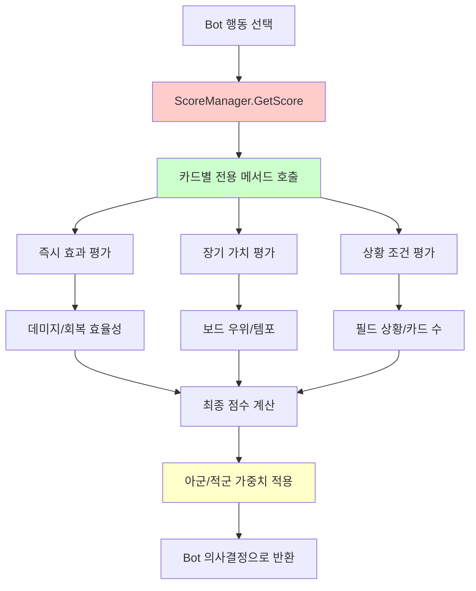
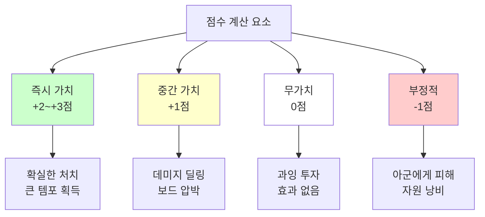
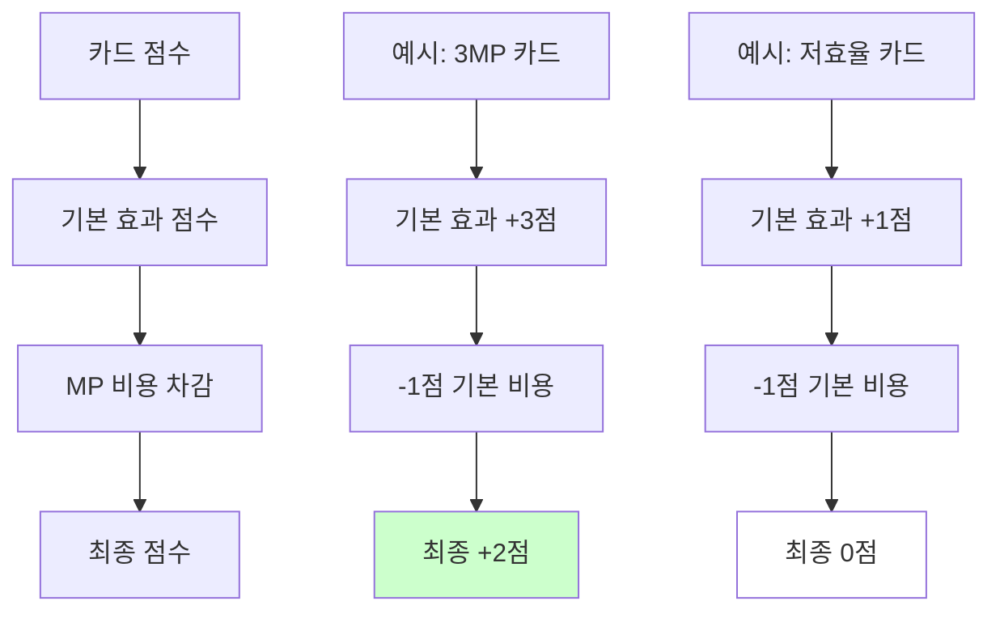
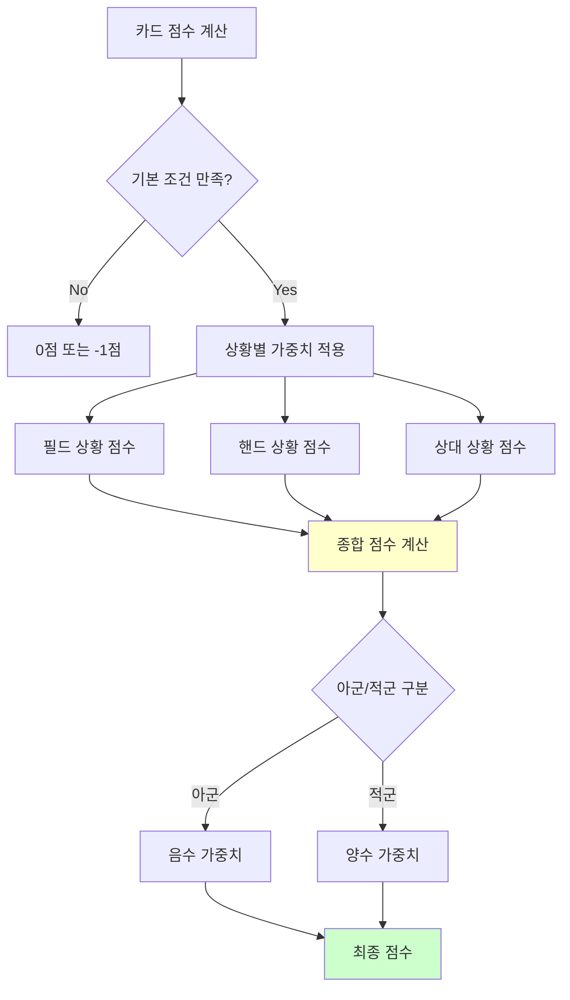

# 점수 계산 시스템

## 📋 개요

점수 계산 시스템은 메이플 듀얼 AI의 두뇌 역할을 하는 핵심 의사결정 엔진입니다. ScoreManager는 200여 개의 카드별로 특화된 점수 계산 알고리즘을 제공하여, 봇이 복잡한 게임 상황에서 최적의 전략적 선택을 할 수 있도록 지원합니다. 이 시스템은 즉시 효과부터 장기적 전략 가치까지 종합적으로 평가하며, 상대/아군 구분, 효율성 계산, 리스크 관리, 필드 상황 분석 등을 통해 인간 플레이어에 준하는 전략적 사고를 구현합니다.

**관련 파일**:
- `RootDesk/MyDesk/Components/Managers/ScoreManager.mlua` - AI 점수 계산 로직
- `RootDesk/MyDesk/Components/Bot.mlua` - 점수 기반 의사결정 실행
- `RootDesk/MyDesk/Components/Objects/History.mlua` - 게임 기록 기반 평가

## 🏗️ 점수 계산 아키텍처

### AI 의사결정 플로우



## 🎯 1. 기본 점수 계산 프레임워크

### 점수 계산 인터페이스

#### 표준 점수 계산 시그니처
```lua
method number GetScore(Card card, Unit target, Minion pivot)
    return _Util:Call(self, card.name, {card, target, pivot}) or 1
end

-- 각 카드별 전용 점수 계산 메서드
method number PowerStrike(Card card, Minion target, Minion pivot)
    local sign = target.player == card.player and -1 or 1  -- 아군/적군 구분
    local damage = 5 + card.player.skillDamage
    local value
    
    if 3 <= target.hp and target.hp <= damage then
        value = 2  -- 확실한 처치 가능
    elseif target.hp > damage then
        value = 1  -- 데미지만 가능
    else
        value = 0  -- 과잉 데미지 (비효율)
    end
    
    return sign * value - 1  -- 기본 비용 차감
end
```

### 점수 체계 설계 원칙

#### 가중치 시스템


## 💥 2. 데미지 기반 점수 계산

### 효율성 중심 평가

#### 타겟 체력 기반 점수 산정
```lua
-- FireArrow - 적응형 데미지 평가
method number FireArrow(Card card, any target, Minion pivot)
    local sign
    if target == card.player or target.player == card.player then
        sign = -1  -- 아군에게 사용하면 부정적
    else
        sign = 1   -- 적군에게 사용하면 긍정적
    end
    
    local damage = 3 + card.player.skillDamage
    local value
    
    if target:IsPlayer() then
        -- 플레이어 타겟: 체력 절반 이하일 때 가치 높음
        if target.hp <= target.maxHp * 0.5 then
            value = 2
        else
            value = 0
        end
    else
        -- 미니언 타겟: 처치 가능성에 따른 가치 차등
        if 2 <= target.hp and target.hp <= damage then
            value = 2  -- 확실한 처치
        elseif target.hp > damage then
            value = 1  -- 데미지만
        else
            value = 0  -- 과잉 데미지
        end
    end
    
    return sign * value - 1
end
```

#### 비례 데미지 시스템
```lua
-- FinalAttack - 상대 체력 비례 점수
method number FinalAttack(Card card, Minion target, Minion pivot)
    local sign = target.player == card.player and -1 or 1
    local value = target.hp * 0.5  -- 체력에 비례한 가치
    return sign * value
end

-- CorkscrewBlow - 현재 체력 기반 평가
method number CorkscrewBlow(Card card, Minion target, Minion pivot)
    local sign = target.player == card.player and -1 or 1
    local value = target.hp * 0.5
    return sign * value - 1
end
```

**데미지 평가의 정교함**:
- **처치 우선순위**: 확실히 처치 가능한 경우 최고점
- **과잉 방지**: 필요 이상의 데미지는 낮은 점수
- **플레이어 vs 미니언**: 각각 다른 평가 기준
- **스킬 데미지 보정**: 플레이어 스킬 데미지 스탯 반영

## 🏟️ 3. 필드 상황 기반 평가

### 보드 우위 계산

#### 미니언 수 기반 전략 점수
```lua
-- Griffey - 미니언 수 차이 기반 평가
method number Griffey(Card card, Unit target, Minion pivot)
    return #card.player.opponent.field:GetMinions(nil) - #card.player.field:GetMinions(nil)
end

-- Mano - 필드 우위 평가
method number Mano(Card card, Unit target, Minion pivot)
    return #card.player.opponent.field:GetMinions(nil) - #card.player.field:GetMinions(nil)
end

-- DragonRoar - 범위 공격의 가치
method number DragonRoar(Card card, Unit target, Minion pivot)
    return #card.player.opponent.field:GetMinions(nil) - #card.player.field:GetMinions(nil) - 1
end
```

#### 필드 공간 관리
```lua
-- ThreeSnails - 소환 공간 확보 필요성
method number ThreeSnails(Card card, Unit target, Minion pivot)
    return card.player.field.capacity - #card.player.field:GetMinions(nil) >= 2 and 1 or 0
end

-- Puppet - 미니언 소환 가치
method number Puppet(Card card, Unit target, Minion pivot)
    return card.player.field.capacity - #card.player.field:GetMinions(nil) >= 1 and 1 or 0
end
```

### 위치 기반 전략

#### 배치 위치의 중요성
```lua
-- DancesWithBalrog - 우측 끝 배치 시너지
method number DancesWithBalrog(Card card, Unit target, Minion pivot)
    return card.player.field:GetRightmostMinion() == pivot and 1 or 0
end

-- RedKentaurus - 우측 끝 특수 효과
method number RedKentaurus(Card card, Unit target, Minion pivot)
    return card.player.field:GetRightmostMinion() == pivot and 1 or 0
end

-- DrummingBunny - 위치 기반 버프 가치
method number DrummingBunny(Card card, Unit target, Minion pivot)
    return card.player.field:GetRightmostMinion() == pivot and 1 or 0
end
```

**필드 관리 전략**:
- **수적 우위**: 상대보다 많은 미니언이 유리
- **공간 효율**: 제한된 필드 공간의 최적 활용
- **위치 시너지**: 특정 위치에서 발동하는 특수 효과
- **템포 관리**: 보드 장악력과 압박감 조성

## 🎴 4. 카드 어드밴티지 평가

### 핸드 기반 점수 계산

#### 카드 수 우위 시스템
```lua
-- Shumi - 손패 미니언 수 기반 가치
method number Shumi(Card card, Unit target, Minion pivot)
    return #card.player.hand:GetCards(self.taskManager.minionSelector) - 1
end

-- Focus - 손패 스킬 활용 조건
method number Focus(Card card, Unit target, Minion pivot)
    if card.player.mp >= 7 and #card.player.hand:GetCards(self.taskManager.skillSelector) >= 2 then
        return 2
    else
        return -1
    end
end
```

#### 상대 핸드 압박
```lua
-- BandOfThieves - 상대 필드 정리
method number BandOfThieves(Card card, Unit target, Minion pivot)
    return #card.player.opponent.field:GetMinions(nil) - 1
end

-- Explosion - 광역 정리 가치
method number Explosion(Card card, Unit target, Minion pivot)
    return #card.player.opponent.field:GetMinions(nil) - 2
end
```

### 리소스 관리 평가

#### MP 효율성 계산


## 📊 5. 상황별 점수 조정

### 조건부 가치 평가

#### 게임 상태 의존적 점수
```lua
-- Mai - 아군 미니언 존재 여부
method number Mai(Card card, Unit target, Minion pivot)
    return #card.player.field:GetMinions(nil) >= 1 and 1 or -1
end

-- Nependeath - 전체 미니언 수 조건
method number Nependeath(Card card, Unit target, Minion pivot)
    return #self.duel:GetMinions(nil) >= 3 and 1 or 0
end

-- FireBoar - 전체 필드 상황
method number FireBoar(Card card, Unit target, Minion pivot)
    return #self.duel:GetMinions(nil) >= 1 and 1 or 0
end
```

#### 히스토리 기반 평가
```lua
-- MasterSergeantFox - 라운드 내 스킬 사용 횟수
method number MasterSergeantFox(Card card, Unit target, Minion pivot)
    return self.history:GetThisRoundSkillCount(card.player) - 1
end

-- Utah - 스킬 사용 빈도 기반 가치
method number Utah(Card card, Unit target, Minion pivot)
    return self.history:GetThisRoundSkillCount(card.player) - 1
end
```

### 상태 기반 점수 수정

#### 미니언 상태별 가치
```lua
-- Fairy - 방어막 없는 아군 미니언 대상
method number Fairy(Card card, Unit target, Minion pivot)
    return #card.player.field:GetMinions(self.taskManager.nonBarrierSelector) >= 1 and 1 or 0
end

-- Bless - 방어막 부여 가치
method number Bless(Card card, Unit target, Minion pivot)
    return #card.player.field:GetMinions(self.taskManager.nonBarrierSelector)
end
```

## 🧠 6. AI 전략적 사고 패턴

### 복합 상황 분석

#### 다중 조건 평가 알고리즘


### 리스크 관리 시스템

#### 안전장치 구현
```lua
-- 모든 점수 계산에서 아군 피해는 부정적
local sign = target.player == card.player and -1 or 1

-- 기본 비용은 항상 차감 (자원 소모 반영)
return sign * value - 1

-- 조건 미충족시 확실한 부정적 점수
return condition and positive_value or -1
```

**리스크 관리 원칙**:
- **자해 방지**: 아군에게 피해주는 행동은 절대 선택하지 않음
- **기회비용**: 모든 행동에는 기본 비용이 있음
- **조건부 실행**: 조건 불충족시 명확한 부정적 신호
- **보수적 접근**: 불확실한 상황에서는 소극적 선택

## 🎯 7. 고급 AI 전략 구현

### 동적 점수 조정

#### 게임 단계별 가중치
```lua
-- 게임 초반: 보드 장악 중시
-- 게임 중반: 카드 어드밴티지 중시  
-- 게임 후반: 직접 데미지 중시

method number ContextualScore(Card card, Unit target, Minion pivot)
    local baseScore = self:GetBaseScore(card, target, pivot)
    local gamePhase = self:GetGamePhase()
    
    if gamePhase == "Early" then
        return baseScore * self:GetBoardControlWeight()
    elseif gamePhase == "Mid" then
        return baseScore * self:GetCardAdvantageWeight()  
    else
        return baseScore * self:GetDamageWeight()
    end
end
```

### 적응형 AI

#### 상대 전략 대응
```lua
-- 상대방 플레이 패턴 분석
method number AdaptiveScore(Card card)
    local opponentStrategy = self.history:GetOpponentStrategy()
    
    if opponentStrategy == "Aggressive" then
        return self:GetDefensiveScore(card)
    elseif opponentStrategy == "Control" then
        return self:GetAggressiveScore(card) 
    else
        return self:GetBalancedScore(card)
    end
end
```

## 💡 코드 참조

점수 계산 시스템 핵심 로직:
- `ScoreManager.mlua :: GetScore()` — 기본 점수 계산 인터페이스
- `ScoreManager.mlua :: PowerStrike()` — 정교한 데미지 효율성 계산
- `ScoreManager.mlua :: Griffey()` — 필드 상황 기반 전략 평가
- `ScoreManager.mlua :: Focus()` — 조건부 카드 어드밴티지 평가
- `ScoreManager.mlua :: MasterSergeantFox()` — 히스토리 기반 점수 계산

점수 계산 시스템은 메이플 듀얼 AI의 핵심 지능으로, 단순한 수치 계산을 넘어서 복잡한 전략적 상황을 종합적으로 분석하고 평가하여 인간 플레이어 수준의 의사결정을 가능하게 하는 정교한 알고리즘 집합체입니다.
