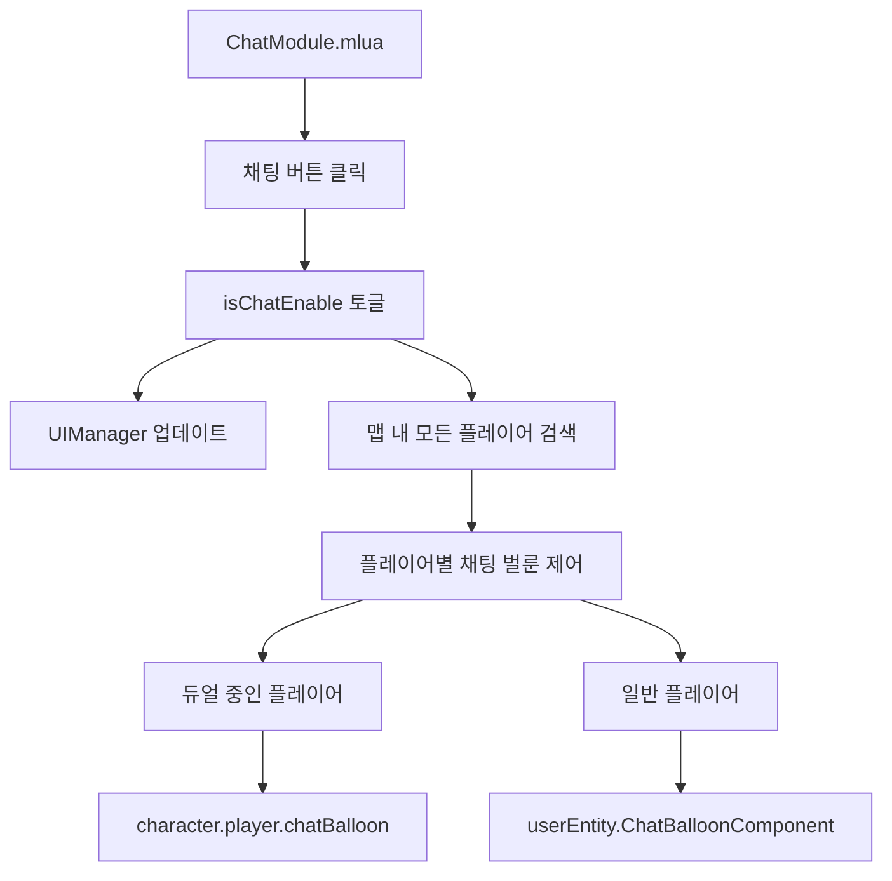

# 채팅 시스템

## 개요

메이플 듀얼의 채팅 시스템은 플레이어 간의 실시간 소통을 지원하는 기능입니다. 채팅 벌룬 표시, 채팅 활성화/비활성화 설정, 개발자 명령어 처리 등을 통해 다양한 커뮤니케이션 요구사항을 만족시킵니다.

## 핵심 컴포넌트

### ChatModule.mlua
채팅 시스템의 메인 UI 컴포넌트로, 채팅 활성화/비활성화 토글 기능을 제공합니다.

**주요 기능:**
- 채팅 활성화/비활성화 토글
- 모든 플레이어의 채팅 벌룬 동시 제어
- 채팅 비활성화 시 시각적 표시

```lua
@Component
script ChatModule extends Component

property boolean isChatEnable = true

@ExecSpace("ClientOnly")
method void OnBeginPlay()
    self.chatButton.Entity:ConnectEvent(ButtonClickEvent, function()
        if _Server:IsRequesting() then
            return
        end
        
        _SoundService:PlaySound(self.resourceManager:GetResource("UI").buttonClickRawSound, 1)
        
        self.isChatEnable = not self.isChatEnable
        self.disableIcon.Entity.Enable = not self.isChatEnable
        self.uiManager:UpdateChat()
        
        -- 현재 맵의 모든 플레이어 채팅 벌룬 제어
        local currentMap = _UserService.LocalPlayer.CurrentMap
        for _, userEntity in ipairs(_UserService:GetUsersByMapComponent(currentMap.MapComponent)) do
            local character = userEntity.Character
            if isvalid(character.player) then
                character.player.chatBalloon.Enable = self.isChatEnable
                if not self.isChatEnable then
                    character.player:ClearChat()
                end
            else
                userEntity.ChatBalloonComponent.Enable = self.isChatEnable
            end
        end
    end)
end
```

### 채팅 벌룬 시스템

채팅 벌룬은 캐릭터 위에 표시되는 말풍선 형태의 채팅 UI입니다.

**주요 특징:**
- 플레이어별 독립적인 채팅 벌룬
- 듀얼 중인 플레이어와 일반 플레이어 구분 처리
- 채팅 비활성화 시 즉시 제거

**채팅 벌룬 제어 로직:**
```lua
-- 듀얼 중인 플레이어의 채팅 벌룬 제어
if isvalid(character.player) then
    character.player.chatBalloon.Enable = self.isChatEnable
    if not self.isChatEnable then
        character.player:ClearChat()  -- 채팅 내용 즉시 제거
    end
else
    -- 일반 상태 플레이어의 채팅 벌룬 제어
    userEntity.ChatBalloonComponent.Enable = self.isChatEnable
end
```

## 개발자 명령어 시스템 (Developer.mlua)

### 개발자 도구 개요

`Developer.mlua`는 게임 개발 및 디버깅을 위한 특수 명령어 시스템을 제공합니다. 메이커(제작자) 권한을 가진 사용자만 접근할 수 있습니다.

**주요 기능:**
- 게임 데이터 초기화
- 플레이어 데이터 관리
- 개발자 로깅
- 메이커 권한 검증

### 메이커 권한 검증

```lua
@ExecSpace("Server")
method void Reset(Character character, string localeId)
    if not isvalid(character) or character.Entity.Name ~= senderUserId then
        return
    end
    
    if not _UserService:IsMakerUserId(character.Entity.Name) then
        return  -- 메이커 권한이 없으면 실행 중단
    end
    
    self:Log("reset start", senderUserId)
    -- 초기화 로직 실행
end
```

### 데이터 초기화 기능

**플레이어 데이터 초기화:**
```lua
-- 캐릭터 데이터 초기화
character:Clear(localeId)

-- 랭킹 데이터 삭제
_DataStorageService:DeleteSortableDataStorageAndWait("Ranking")

-- 모든 유저 데이터 스토리지 삭제
local resultCode, pages = _DataStorageService:GetUserDataStoragePagesAndWait()
if resultCode ~= 0 then
    log(resultCode)
    return
end

while true do
    local datas = pages:GetCurrentPageDatas()
    for _, userDataStorage in pairs(datas) do
        _DataStorageService:DeleteUserDataStorageAndWait(userDataStorage.UserId)
    end
    
    if pages.IsLastPage == true then
        break
    end
    
    local loadResultCode = pages:LoadNextPageAndWait()
    if loadResultCode ~= 0 then
        break
    end
end
```

### 개발자 로깅 시스템

```lua
@ExecSpace("Client")
method void Log(string message)
    log(message)  -- 클라이언트 로그 출력
end

-- 서버 측에서 로깅과 함께 사용자 ID 추적
self:Log("reset start", senderUserId)
```

## 채팅 관련 플레이어 메서드

### Player.mlua의 채팅 기능

플레이어 컴포넌트에서는 채팅 벌룬의 표시와 제거를 관리합니다.

**ClearChat 메서드:**
```lua
-- Player.mlua에서 구현 (추정)
method void ClearChat()
    -- 현재 표시된 채팅 내용을 즉시 제거
    -- 채팅 벌룬의 텍스트를 빈 문자열로 설정
    -- 채팅 벌룬 페이드아웃 애니메이션 중단
end
```

## 채팅 시스템 아키텍처

### 클라이언트-서버 구조



### 상태 관리

**채팅 활성화 상태:**
- `isChatEnable = true`: 모든 채팅 벌룬 표시
- `disableIcon.Entity.Enable = false`: 비활성화 아이콘 숨김

**채팅 비활성화 상태:**
- `isChatEnable = false`: 모든 채팅 벌룬 숨김
- `disableIcon.Entity.Enable = true`: 비활성화 아이콘 표시
- 기존 채팅 내용 즉시 제거 (`ClearChat()` 호출)

## UI 컴포넌트

### 채팅 버튼
- **위치**: UI 하단 또는 측면 고정 위치
- **기능**: 채팅 활성화/비활성화 토글
- **시각적 피드백**: 클릭 시 사운드 재생

### 비활성화 아이콘
- **표시 조건**: 채팅이 비활성화된 경우에만 표시
- **목적**: 현재 채팅이 꺼져있음을 사용자에게 알림

### 채팅 벌룬
- **위치**: 각 캐릭터 위에 표시
- **내용**: 플레이어가 입력한 채팅 메시지
- **제어**: 채팅 모듈의 전역 설정에 따라 표시/숨김

## 통합 관리 시스템

### UIManager 연동

```lua
-- ChatModule에서 UIManager 업데이트 호출
self.uiManager:UpdateChat()
```

UIManager는 채팅 상태 변경을 다른 UI 컴포넌트들에게 알려 전체적인 UI 상태를 동기화합니다.

### 맵별 플레이어 관리

```lua
local currentMap = _UserService.LocalPlayer.CurrentMap
for _, userEntity in ipairs(_UserService:GetUsersByMapComponent(currentMap.MapComponent)) do
    -- 각 플레이어의 채팅 벌룬 제어
end
```

현재 맵에 있는 모든 플레이어의 채팅 상태를 동시에 제어하여 일관된 사용자 경험을 제공합니다.

## 개발자 도구의 채팅 명령어 처리

### 명령어 파싱 및 실행
Developer.mlua는 채팅을 통해 입력된 개발자 명령어를 해석하고 실행하는 역할도 담당할 수 있습니다.

**권한 기반 명령어 실행:**
1. 사용자 권한 확인 (`_UserService:IsMakerUserId`)
2. 명령어 유효성 검증
3. 서버 측 안전한 실행
4. 실행 결과 로깅

## 보안 및 안전성

### 권한 제어
- 개발자 명령어는 메이커 권한 사용자에게만 제한
- 사용자 ID 검증을 통한 이중 보안

### 서버 요청 상태 확인
```lua
if _Server:IsRequesting() then
    return  -- 중복 요청 방지
end
```

### 안전한 데이터 삭제
- 데이터 삭제 전 충분한 검증
- 페이지네이션을 통한 안전한 대량 데이터 처리
- 오류 상황에 대한 적절한 처리

이 채팅 시스템은 플레이어 간의 소통을 원활하게 하면서도, 필요에 따라 채팅을 제어할 수 있는 유연성과 개발자 도구를 통한 강력한 관리 기능을 제공합니다.
