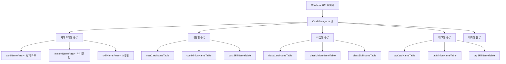

# 카드 데이터 구조

## 📋 개요

메이플 듀얼의 모든 카드 정보는 `Card.csv` 파일에 정의되어 있으며, `CardManager.mlua`에서 이 데이터를 로드하고 관리합니다. 현재 총 **266개의 카드**가 정의되어 있으며, 각 카드는 40개 이상의 속성을 가지고 있습니다.

**관련 파일**: 
- `RootDesk/MyDesk/DataSets/Card.csv`
- `RootDesk/MyDesk/Components/Managers/CardManager.mlua`

## 🗃️ 카드 데이터 구조

### 핵심 식별 속성

| 속성명 | 타입 | 설명 | 예시 |
|--------|------|------|------|
| `name` | String | 카드의 고유 이름 | "Adobis", "AirStrike" |
| `category` | String | 카드 타입 | "Minion", "Skill" |
| `class` | String | 직업 분류 | "Warrior", "Magician", "Common" |
| `theme` | String | 테마/확장팩 | "Classic", "Nautilus" |
| `rarity` | String | 희귀도 | "Normal", "Rare", "Epic", "Unique", "Legendary" |

### 카드 변형 시스템

| 속성명 | 타입 | 설명 |
|--------|------|------|
| `isToken` | Boolean | 토큰 카드 여부 (수집 불가) |
| `variantArray` | Array | 카드 외형 변형 배열 |
| `linkArray` | Array | 연결된 카드들 (소환 관계 등) |

### 게임플레이 속성

#### 기본 스탯
| 속성명 | 타입 | 설명 | 범위 |
|--------|------|------|------|
| `cost` | Integer | 사용 비용 (MP) | 0-14 |
| `maxHp` | Integer | 최대 체력 (미니언만) | 1-8 |
| `atk` | Integer | 공격력 (미니언만) | 1-8 |

#### 특수 상태
| 속성명 | 타입 | 설명 |
|--------|------|------|
| `hasBarrier` | Boolean | 방어막 보유 여부 |
| `hasVenom` | Boolean | 독 효과 보유 여부 |
| `hasChill` | Boolean | 빙결 효과 보유 여부 |
| `isDirectAttackable` | Boolean | 직접 공격 가능 여부 |
| `isImmuneToStrong` | Boolean | 강력함 면역 여부 |

### 효과 시스템

#### 트리거 시스템
| 속성명 | 타입 | 설명 |
|--------|------|------|
| `cardTriggerNameArray` | Array | 카드 사용 시 발동 트리거 |
| `minionTriggerNameArray` | Array | 미니언 상태에서 발동 트리거 |

#### 오라 시스템  
| 속성명 | 타입 | 설명 |
|--------|------|------|
| `cardAuraNameArray` | Array | 카드 사용 시 적용 오라 |
| `minionAuraNameArray` | Array | 미니언으로 배치 시 적용 오라 |

### 태그 시스템

| 속성명 | 타입 | 설명 | 주요 태그 예시 |
|--------|------|------|-------------|
| `tagArray` | Array | 카드 분류 태그들 | "Npc", "Boss", "Dragon", "Mushroom" |

**주요 태그 카테고리**:
- **몬스터 타입**: "Dragon", "Devil", "Beast", "Undead", "Plant" 
- **NPC**: "Npc", "Boss"
- **아이템**: "Toy", "Pet", "Alien"
- **자연**: "Mushroom", "Plant"

## 🎨 시각/오디오 리소스

### 사운드 속성
| 속성명 | 설명 |
|--------|------|
| `damageSound` | 데미지 받을 때 사운드 |
| `dieSound` | 파괴될 때 사운드 |
| `skillSound_1~3` | 스킬 사용 사운드 (3개까지) |
| `hitSound_1~3` | 공격 적중 사운드 (3개까지) |
| `extraSound_1~3` | 추가 효과음 (3개까지) |

### 애니메이션 속성
| 속성명 | 설명 |
|--------|------|
| `skillAnimation_1~3` | 스킬 사용 애니메이션 |
| `ballAnimation_1~3` | 투사체 애니메이션 |
| `hitAnimation_1~3` | 적중 이펙트 애니메이션 |
| `extraAnimation_1~3` | 추가 이펙트 애니메이션 |

## 📊 데이터 관리 구조

### CardManager의 데이터 분류



### 주요 접근 메서드

**CardManager.mlua**에서 제공하는 데이터 접근 메서드들:

- `GetCategory(name)` — 카드 타입 반환
- `GetClass(name)` — 직업 반환  
- `GetRarity(name)` — 희귀도 반환
- `GetCost(name)` — 사용 비용 반환
- `GetMaxHp(name)`, `GetAtk(name)` — 미니언 스탯 반환
- `GetTags(name)` — 태그 배열 반환
- `IsToken(name)` — 토큰 카드 여부 확인

## 💡 실제 카드 데이터 예시

### 미니언 카드 - Adobis
```csv
name: Adobis
category: Minion
class: Magician  
theme: Classic
rarity: Unique
cost: 1
maxHp: 2
atk: 1
tagArray: ["Npc"]
minionAuraNameArray: ["Adobis"]
```

### 스킬 카드 - AirStrike  
```csv
name: AirStrike
category: Skill
class: Pirate
theme: Nautilus  
rarity: Legendary
cost: 8
variantArray: ["Hanbok"]
cardTriggerNameArray: ["AirStrike"]
```

### 토큰 카드 - BlueSnail
```csv
name: BlueSnail
isToken: TRUE
cost: 1
maxHp: 2
atk: 2
```

## 🔧 데이터 구조 활용

### 덱 구성 검증
CardManager는 덱 구성 시 다음을 검증합니다:
- 클래스 제한 (Common + 선택 클래스)
- 카드 수량 제한 (동일 카드 최대 2장)
- 토큰 카드 제외

### 확률 시스템
카드팩에서 카드를 뽑을 때 `theme`과 `rarity` 조합으로 확률을 결정합니다.

### 검색 및 필터링
UI에서 카드를 찾을 때 `tagArray`, `class`, `cost` 등을 기준으로 필터링합니다.

## 📝 코드 참조

주요 데이터 처리 로직:
- `CardManager.mlua :: OnBeginPlay()` — 초기 데이터 로딩 및 분류
- `CardManager.mlua :: GetStarterCollection()` — 신규 플레이어 기본 카드 제공
- `CardManager.mlua :: GetCardsByClass()` — 직업별 카드 필터링

이 데이터 구조를 기반으로 게임의 모든 카드 관련 기능이 구현되며, 새로운 카드 추가 시에도 이 구조를 따라 CSV에 데이터를 추가하면 자동으로 게임에 반영됩니다.
