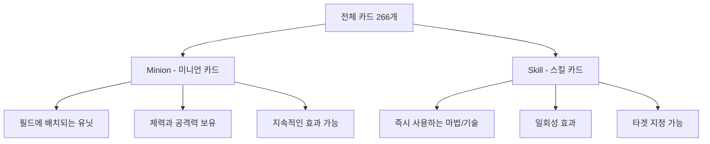
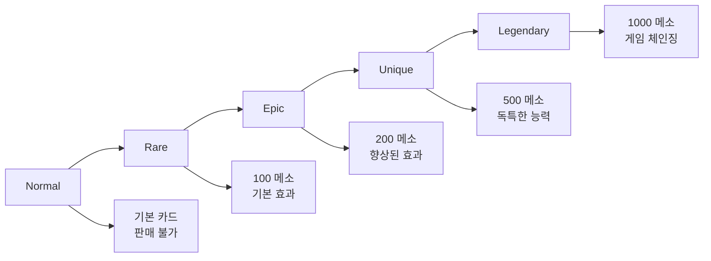
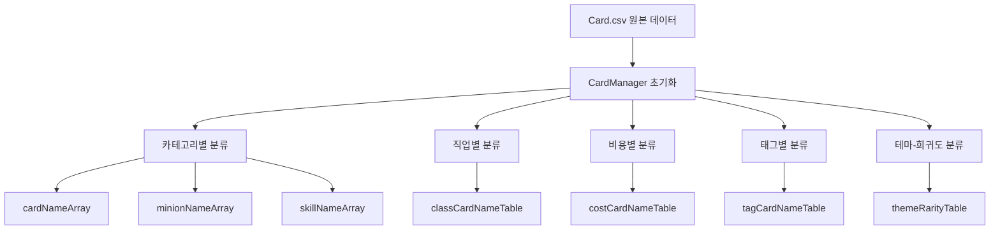

# 카드 분류 체계

## 📋 개요

메이플 듀얼의 카드는 다차원적인 분류 체계를 통해 체계적으로 관리됩니다. 카테고리, 직업, 희귀도, 테마, 태그 시스템을 통해 266개의 모든 카드가 분류되며, 이를 바탕으로 덱 구성 규칙, 카드팩 확률, 게임 밸런스가 결정됩니다.

**관련 파일**: 
- `RootDesk/MyDesk/DataSets/Card.csv`
- `RootDesk/MyDesk/Components/Managers/CardManager.mlua`

## 🎯 기본 카테고리 분류

### 1. 카드 타입 (Category)



**미니언 (Minion)**:
- 필드에 배치되어 지속적으로 존재하는 유닛
- `maxHp`와 `atk` 스탯 보유
- 상대방을 공격하거나 방어 역할 수행
- 예시: "Adobis", "AthenaPierce", "Zakum"

**스킬 (Skill)**:  
- 즉시 사용되고 사라지는 마법이나 기술
- 다양한 효과: 데미지, 힐링, 버프, 디버프, 소환 등
- 타겟이 필요한 경우가 많음
- 예시: "AirStrike", "ArmorCrash", "Heal"

### 2. 토큰 시스템

**토큰 카드** (`isToken = TRUE`):
- 수집 불가능한 특수 카드
- 다른 카드나 효과에 의해 생성됨
- 덱 구성에 직접 포함할 수 없음
- 예시: "BlueSnail", "Goblin", "IceElemental"

## 🏆 직업 분류 시스템 (Class)

### 직업별 특성

| 직업 | 영문 | 특징 | 주요 카드 예시 |
|------|------|------|------------|
| **전사** | Warrior | 높은 체력, 근접 전투 | "Brandish", "PowerStrike", "Blackbull" |
| **마법사** | Magician | 마법 공격, 다양한 효과 | "Genesis", "ThunderBolt", "Adobis" |
| **궁수** | Bowman | 원거리 공격, 정확도 | "DoubleShot", "IceShot", "AthenaPierce" |
| **도적** | Thief | 빠른 공격, 은신 기술 | "LuckySeven", "ShadowPartner", "DarkLord" |
| **해적** | Pirate | 균형잡힌 능력, 특수 기술 | "AirStrike", "Flamethrower", "Kyrin" |
| **공통** | Common | 모든 직업 사용 가능 | "OrangeMushroom", "Slime", "Stump" |

### 덱 구성 규칙과의 연관성
- 각 덱은 **Common + 하나의 직업**만 사용 가능
- 직업별 시너지 효과를 통한 전략적 깊이 제공
- 밸런스를 위해 강력한 카드는 특정 직업에만 제공

## 💎 희귀도 시스템 (Rarity)

### 희귀도 등급과 특성



### 희귀도별 상세 분석

| 희귀도 | 판매 가격 | 특징 | 대표 카드 |
|--------|----------|------|----------|
| **Normal** | 판매 불가 | 기본적인 능력, 입문용 | "ArrowRain", "Chakra", "Threaten" |
| **Rare** | 100 메소 | 적당한 효과, 안정적 | "DoubleShot", "Heal", "ArrowBlow" |  
| **Epic** | 200 메소 | 강화된 능력, 특수 효과 | "ThunderBolt", "Focus", "Rage" |
| **Unique** | 500 메소 | 독특한 메커니즘 | "LuckySeven", "IceShot", "Elquines" |
| **Legendary** | 1000 메소 | 게임을 결정짓는 강력함 | "Genesis", "AirStrike", "Zakum" |

### 카드팩과의 연관성
희귀도는 카드팩에서 뽑을 확률을 결정합니다:
- **테마별 희귀도 분포**: `themeRarityTable[theme][rarity]`로 관리
- **확률 기반 시스템**: 높은 희귀도일수록 낮은 확률
- **경제 시스템**: 판매 가격으로 카드 가치 결정

## 🌍 테마 분류 (Theme)

### 주요 테마

**Classic 테마**:
- 오리지널 메이플스토리 콘텐츠 기반
- 전통적인 몬스터와 NPC들
- 예시: "Zakum", "Mushmom", "AthenaPierce"

**Nautilus 테마**:
- 확장 콘텐츠 기반
- 새로운 지역과 캐릭터들  
- 예시: "AirStrike", "Kyrin", "Timer"

### 테마별 특성
- 각 테마는 고유한 아트 스타일과 세계관 보유
- 카드팩 구성 시 테마별 분리 또는 혼합 가능
- 플레이어 수집 목표 제공

## 🏷️ 태그 시스템

### 몬스터 타입 태그

| 태그 | 설명 | 대표 카드 |
|------|------|----------|
| **Dragon** | 용족 몬스터 | "Horntail", "RedDrake", "Manon" |
| **Devil** | 악마족 | "CrimsonBalrog", "JrBalrog" |
| **Beast** | 야수족 | "Werewolf", "WildKargo" |
| **Undead** | 언데드 | "ZombieLupin", "GhostStump" |
| **Plant** | 식물족 | "Deo", "AxeStump" |
| **Mushroom** | 버섯족 | "OrangeMushroom", "Mushmom" |

### 특수 태그

| 태그 | 설명 | 활용 |
|------|------|------|
| **Npc** | NPC 캐릭터 | 스토리 연관성, 특수 대사 |
| **Boss** | 보스 몬스터 | 높은 스탯, 강력한 효과 |
| **Pet** | 펫 | 귀여운 외형, 서포트 효과 |
| **Toy** | 장난감/인형 | 특수한 메커니즘 |
| **Alien** | 외계인 | 독특한 능력 |

### 태그 시스템 활용

**카드 검색 및 필터링**:
```lua
-- CardManager의 태그 기반 검색
GetCardNamesByTag(string tag)
GetMinionNamesByTag(string tag)  
GetSkillNamesByTag(string tag)
```

**시너지 효과**:
- 동일 태그 카드들 간의 상호작용
- 특정 태그를 타겟으로 하는 효과
- 덱 구성 시 테마 통일성 제공

## 📊 분류 체계 활용

### CardManager의 분류 관리



### 게임 시스템과의 연동

**덱 구성 검증**:
- 직업 제한 확인
- 토큰 카드 제외
- 카드 수량 제한 적용

**카드팩 시스템**:
- 테마별 카드팩 구성
- 희귀도 확률 적용
- 보장 시스템 구현

**UI 필터링**:
- 사용자 친화적 카드 검색
- 다중 조건 필터링
- 정렬 및 그룹화 기능

## 💡 코드 참조

핵심 분류 관리 로직:
- `CardManager.mlua :: OnBeginPlay()` — 초기 분류 데이터 구축
- `CardManager.mlua :: GetCardNamesByClass()` — 직업별 카드 조회
- `CardManager.mlua :: GetCardNamesByThemeAndRarity()` — 테마-희귀도 조회
- `CardManager.mlua :: GetSellPrice()` — 희귀도별 판매가 계산
- `CardManager.mlua :: GetTags()` — 태그 시스템 활용

이 분류 체계는 게임의 모든 카드 관련 기능의 기반이 되며, 새로운 카드 추가나 시스템 확장 시에도 일관된 구조를 제공합니다.
