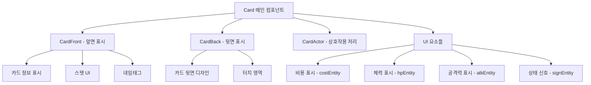
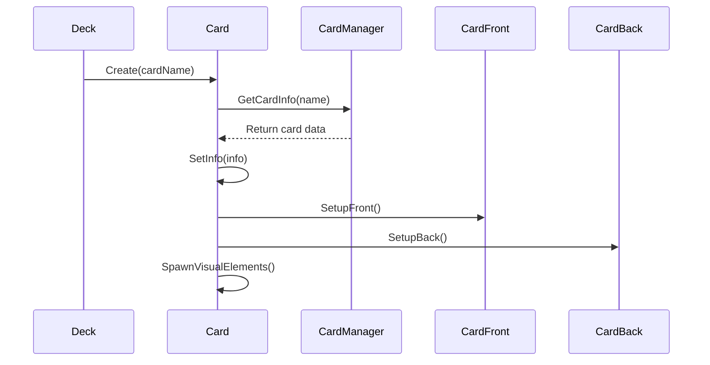

# 카드 컴포넌트 (Card.mlua)

## 📋 개요

`Card.mlua`는 메이플 듀얼에서 개별 카드의 모든 기능과 상태를 담당하는 핵심 컴포넌트입니다. 카드의 시각적 표현, 게임 로직, 사용자 상호작용, 애니메이션 등을 통합적으로 관리하며, 덱(Deck)과 손패(Hand) 시스템과 밀접하게 연동됩니다.

**관련 파일**: 
- `RootDesk/MyDesk/Components/Objects/Card.mlua`
- `RootDesk/MyDesk/Components/Helpers/CardFront.mlua`  
- `RootDesk/MyDesk/Components/Helpers/CardBack.mlua`

## 🏗️ 카드 컴포넌트 아키텍처

### 컴포넌트 구조

### 핵심 프로퍼티

#### 컴포넌트 참조
- `cardManager`: 카드 데이터 매니저 참조
- `actor`: 카드의 행동 처리 컴포넌트
- `front`: 카드 앞면 표시 컴포넌트  
- `back`: 카드 뒷면 표시 컴포넌트

#### 게임 상태
- `player`: 카드를 소유한 플레이어
- `deck`: 카드가 속한 덱
- `hand`: 카드가 속한 손패
- `isPlayable`: 현재 플레이 가능 여부
- `requiresTarget`: 타겟 지정 필요 여부

#### 카드 정보
- `info`: 카드의 기본 정보 테이블
- `variant`, `quality`: 카드 변형 및 품질
- `category`, `cost`, `maxHp`, `atk`: 게임 스탯
- `rarity`, `tagArray`: 희귀도 및 태그 정보

## 🎮 주요 기능 시스템

### 1. 카드 초기화 및 설정

#### 카드 생성 과정

**주요 메서드**:
- `Create(table info, string variant, string quality)` — 카드 생성 및 초기화
- `SetInfo(table info)` — 카드 기본 정보 설정
- `SetVariant(string variant)` — 카드 변형 설정
- `SetQuality(string quality)` — 카드 품질 설정

### 2. 시각적 표현 시스템

#### 앞면/뒷면 전환
카드는 상황에 따라 앞면과 뒷면을 전환하여 표시합니다:

- **앞면 표시** (`isFront = true`):
  - 손패에 있을 때
  - 필드에 배치되었을 때  
  - 카드 상세 보기 시

- **뒷면 표시** (`isFront = false`):
  - 덱에 있을 때
  - 상대방의 손패일 때

**관련 메서드**:
- `SetFront(boolean isFront)` — 앞면/뒷면 설정
- `UpdateDisplay()` — 표시 상태 업데이트

#### UI 요소 관리
각 카드는 다음 UI 요소들을 동적으로 관리합니다:

- **costEntity + costInteger**: MP 비용 표시
- **hpEntity + hpInteger**: 체력 표시 (미니언만)
- **atkEntity + atkInteger**: 공격력 표시 (미니언만)  
- **signEntity**: 특수 상태 신호 (플레이 가능, 타겟팅 등)
- **nametag**: 카드 이름 표시

### 3. 게임플레이 상호작용

#### 카드 사용 조건 확인
카드가 사용 가능한지 여러 조건을 검사합니다:

**주요 메서드**:
- `IsPlayable()` — 전체적인 사용 가능 여부 확인
- `CanPlay()` — 비용, 타겟 등 구체적 조건 확인
- `GetTargetableArray()` — 가능한 타겟들 반환

#### 타겟팅 시스템
스킬 카드의 경우 타겟을 지정해야 하는 경우가 있습니다:

- `requiresTarget`: 타겟 지정 필요 여부
- `targetableArray`: 선택 가능한 타겟 목록
- `SetTargetableArray(table array)` — 타겟 목록 설정

### 4. 애니메이션 및 이펙트

#### 이동 애니메이션
카드가 덱 → 손패 → 필드로 이동할 때 부드러운 애니메이션을 제공합니다:

- `tweener`: 메인 트위닝 객체
- `anchorTweener`: 앵커 포인트 애니메이션
- `costTweener`, `hpTweener`, `atkTweener`: UI 요소별 애니메이션

#### 상태 시각화
카드의 현재 상태를 시각적으로 표현합니다:

- `signState`: 현재 신호 상태 ("playable", "targetable" 등)
- `SetSignState(string state)` — 상태 신호 변경
- `UpdateSign()` — 신호 표시 업데이트

### 5. 오브젝트 풀링 시스템

#### 성능 최적화
카드는 재사용 가능한 오브젝트 풀 패턴을 사용합니다:

**생명주기 메서드**:
- `Create()` — 풀에서 가져와 초기화
- `Clear()` — 사용 완료 후 정리
- `Destroy()` — 풀로 반환

**초기화/정리**:
- `ClearInfo()` — 카드 정보 초기화
- `ClearEnchantments()` — 부여된 효과 제거  
- `ClearVariables()` — 상태 변수 리셋

## 🔄 상태 관리 시스템

### 입력 상태 관리
클라이언트-서버 간 카드 상태를 동기화합니다:

**서버 측**:
- `GetInputState(Character character)` — 플레이어별 입력 상태 계산

**클라이언트 측**:  
- `SetInputState(table inputState)` — 서버에서 받은 상태 적용

### 카드 이동 상태
카드가 어느 영역에 있는지 추적합니다:

- `deck != nil`: 덱에 있는 상태
- `hand != nil`: 손패에 있는 상태
- `deck == nil && hand == nil`: 필드나 다른 영역에 있는 상태

## 📱 사용자 인터페이스

### 터치 상호작용
카드는 다양한 터치 이벤트를 처리합니다:

- **touchAreaEntity**: 터치 영역 정의
- 터치 시 카드 선택, 드래그, 사용 등의 액션 처리
- 카드 확대 보기 및 상세 정보 표시

### 표시 제어
카드의 표시 여부를 동적으로 제어합니다:

- `isDisplayable`: 표시 가능 여부
- `displayTimer`: 표시 지연 타이머
- 상황에 따른 자동 숨김/표시 처리

## 🎨 시각적 커스터마이징

### 카드 백 시스템
플레이어가 선택한 카드 뒷면 디자인을 적용합니다:

- `backName`: 선택된 카드백 이름
- `SetBackName(string backName)` — 카드백 변경
- 캐릭터별 개인화된 카드백 표시

### 품질 시스템
카드의 시각적 품질을 관리합니다:

- `quality`: "Silver", "Gold" 등의 품질 등급
- 품질에 따른 시각 효과 및 테두리 변경

## 💡 코드 참조

핵심 카드 관리 로직:
- `Card.mlua :: Create()` — 카드 생성 및 초기화
- `Card.mlua :: SetInfo()` — 카드 데이터 설정  
- `Card.mlua :: IsPlayable()` — 사용 가능 여부 판단
- `Card.mlua :: GetInputState()` — 서버 측 상태 계산
- `CardFront.mlua` — 카드 앞면 UI 관리
- `CardBack.mlua` — 카드 뒷면 UI 관리

카드 컴포넌트는 게임의 모든 카드 관련 기능을 통합적으로 관리하며, 시각적 표현부터 게임 로직까지 카드의 전 생명주기를 담당하는 핵심 컴포넌트입니다.
