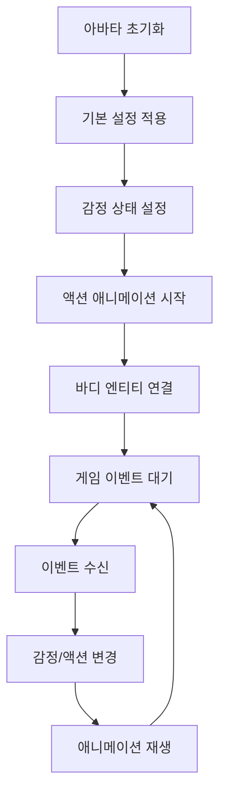

# 아바타 렌더링 시스템

## 개요

메이플 듀얼의 아바타 렌더링 시스템은 `AvatarRenderer.mlua`를 중심으로 플레이어 캐릭터의 시각적 표현을 담당하는 시스템입니다. MapleStory Worlds 플랫폼의 네이티브 `AvatarRendererComponent`를 확장하여 감정 표현, 액션 애니메이션, 바디 렌더링을 통합적으로 관리합니다.

## 핵심 컴포넌트

### AvatarRenderer.mlua
네이티브 아바타 렌더링 컴포넌트를 확장한 커스텀 렌더러입니다.

**주요 역할:**
- 아바타 감정 상태 시각적 표현
- 액션 애니메이션 재생 제어
- 바디 엔티티 상태 관리
- 에디터 모드 실시간 미리보기

```lua
@Component
script AvatarRenderer extends AvatarRendererComponent

property string emotionalType = ""    -- 감정 타입 (기본: Default)
property string actionName = ""       -- 액션 애니메이션 이름
property integer frameIndex = 0       -- 애니메이션 프레임 인덱스
```

## 감정 표현 시스템

### 감정 타입 관리

```lua
@ExecSpace("ClientOnly")
method void OnBeginPlay()
    -- 기본 무기 이펙트 비활성화 (카드 게임 특성상 불필요)
    self.ShowDefaultWeaponEffects = false
    
    -- 감정 상태 초기화
    local emotion = _UtilLogic:IsNilorEmptyString(self.emotionalType) and 
                   EmotionalType.Default or 
                   EmotionalType.CastFrom(self.emotionalType)
    
    self:PlayEmotion(emotion, 3.402823466e+38)  -- 무한 지속 시간
    
    -- 바디 액션 애니메이션 설정
    local bodyEntity = self:GetBodyEntity()
    bodyEntity:SendEvent(ActionStateChangedEvent(
        self.actionName,                    -- 현재 액션
        self.actionName,                    -- 다음 액션  
        1,                                  -- 재생 속도
        SpriteAnimClipPlayType.Loop,        -- 루프 재생
        self.frameIndex,                    -- 시작 프레임
        self.frameIndex                     -- 종료 프레임
    ))
end
```

### 지원하는 감정 타입

```lua
-- EmotionalType 열거형 (MapleStory Worlds 네이티브)
EmotionalType = {
    Default = "default",      -- 기본 표정
    Happy = "happy",          -- 기쁨
    Sad = "sad",             -- 슬픔
    Angry = "angry",          -- 분노
    Surprised = "surprised",  -- 놀람
    Confused = "confused",    -- 혼란
    Excited = "excited",      -- 흥분
    Tired = "tired",         -- 피로
    Cool = "cool",           -- 쿨함
    Love = "love"            -- 사랑
}
```

### 동적 감정 변경

```lua
method void SetEmotion(string emotionType, number duration)
    duration = duration or 3.0  -- 기본 3초
    
    if not EmotionalType[emotionType] then
        emotionType = "Default"
    end
    
    self.emotionalType = emotionType
    self:PlayEmotion(EmotionalType.CastFrom(emotionType), duration)
end

method void SetEmotionByGameEvent(string eventType)
    local emotionMap = {
        CardPlayed = "Cool",
        Victory = "Happy", 
        Defeat = "Sad",
        Critical = "Excited",
        Damaged = "Surprised",
        Thinking = "Confused"
    }
    
    local emotion = emotionMap[eventType] or "Default"
    self:SetEmotion(emotion, 2.0)
end
```

## 액션 애니메이션 시스템

### 액션 애니메이션 타입

```lua
-- 지원하는 액션 애니메이션들
ActionAnimations = {
    Idle = "stand",           -- 기본 서있기
    Walk = "walk",            -- 걷기
    Attack = "attack",        -- 공격
    Skill = "skill",         -- 스킬 사용
    Victory = "victory",      -- 승리
    Defeat = "defeat",        -- 패배
    Celebrate = "celebrate",  -- 축하
    Think = "think",          -- 생각하기
    Point = "point",          -- 가리키기
    Wave = "wave"            -- 손흔들기
}
```

### 액션 재생 시스템

```lua
method void PlayAction(string actionName, boolean loop, integer startFrame, integer endFrame)
    startFrame = startFrame or 0
    endFrame = endFrame or startFrame
    
    self.actionName = actionName
    self.frameIndex = startFrame
    
    local bodyEntity = self:GetBodyEntity()
    if not isvalid(bodyEntity) then return end
    
    local playType = loop and SpriteAnimClipPlayType.Loop or SpriteAnimClipPlayType.Once
    
    bodyEntity:SendEvent(ActionStateChangedEvent(
        actionName,      -- 현재 액션
        actionName,      -- 다음 액션
        1,              -- 재생 속도
        playType,       -- 재생 타입
        startFrame,     -- 시작 프레임
        endFrame        -- 종료 프레임
    ))
end

method void PlayActionSequence(table actionSequence, number intervalSeconds)
    intervalSeconds = intervalSeconds or 1.0
    
    for i, action in ipairs(actionSequence) do
        _TimerService:SetTimer(function()
            self:PlayAction(action.name, action.loop, action.startFrame, action.endFrame)
        end, (i - 1) * intervalSeconds)
    end
end
```

### 게임 이벤트별 액션 매핑

```lua
method void HandleGameEvent(string eventType, table eventData)
    if eventType == "CardPlayed" then
        self:PlayCardPlayAnimation(eventData.cardType)
    elseif eventType == "TurnStart" then
        self:PlayAction("Think", true)
        self:SetEmotion("Confused", 1.0)
    elseif eventType == "TurnEnd" then
        self:PlayAction("Idle", true)
        self:SetEmotion("Default")
    elseif eventType == "GameWin" then
        self:PlayVictorySequence()
    elseif eventType == "GameLose" then
        self:PlayDefeatSequence()
    end
end

method void PlayCardPlayAnimation(string cardType)
    local cardAnimations = {
        Minion = {
            {name = "Point", loop = false, startFrame = 0, endFrame = -1},
            {name = "Skill", loop = false, startFrame = 0, endFrame = -1},
            {name = "Idle", loop = true, startFrame = 0, endFrame = 0}
        },
        Skill = {
            {name = "Skill", loop = false, startFrame = 0, endFrame = -1},
            {name = "Cool", loop = false, startFrame = 0, endFrame = -1},
            {name = "Idle", loop = true, startFrame = 0, endFrame = 0}
        }
    }
    
    local sequence = cardAnimations[cardType] or cardAnimations.Minion
    self:PlayActionSequence(sequence, 0.8)
end
```

## 바디 엔티티 관리

### 바디 엔티티 접근

```lua
method Entity GetBodyEntity()
    -- 네이티브 AvatarRendererComponent의 바디 엔티티 반환
    return self:GetBodyEntity()  -- 네이티브 메서드 호출
end

method boolean IsBodyEntityValid()
    local bodyEntity = self:GetBodyEntity()
    return isvalid(bodyEntity)
end
```

### 바디 상태 관리

```lua
method void SetBodyVisibility(boolean visible)
    local bodyEntity = self:GetBodyEntity()
    if isvalid(bodyEntity) then
        bodyEntity.Enable = visible
    end
end

method void SetBodyScale(number scaleX, number scaleY)
    local bodyEntity = self:GetBodyEntity()
    if isvalid(bodyEntity) then
        local transform = bodyEntity.TransformComponent
        transform.Scale.x = scaleX
        transform.Scale.y = scaleY
    end
end

method void SetBodyPosition(Vector3 position)
    local bodyEntity = self:GetBodyEntity()
    if isvalid(bodyEntity) then
        bodyEntity.TransformComponent.Position = position
    end
end
```

## 에디터 통합

### 실시간 미리보기

```lua
@ExecSpace("ClientOnly")
@EventSender("Service", "EditorService")
handler HandleScreenTouchEditorEvent(ScreenTouchEditorEvent event)
    -- 에디터 모드에서 화면 터치 시 아바타 상태 업데이트
    local TouchPoint = event.TouchPoint
    
    -- 감정 상태 갱신
    local emotion = _UtilLogic:IsNilorEmptyString(self.emotionalType) and 
                   EmotionalType.Default or 
                   EmotionalType.CastFrom(self.emotionalType)
    
    self:PlayEmotion(emotion, 3.402823466e+38)
    
    -- 바디 애니메이션 갱신
    local bodyEntity = self:GetBodyEntity()
    if isvalid(bodyEntity) then
        bodyEntity:SendEvent(ActionStateChangedEvent(
            self.actionName, self.actionName, 1, 
            SpriteAnimClipPlayType.Loop, 
            self.frameIndex, self.frameIndex
        ))
    end
end
```

### 에디터 설정 동기화

```lua
method void SyncWithEditor()
    -- 에디터에서 설정한 값들을 런타임에 적용
    if not self:IsEditor() then return end
    
    -- 속성 검증 및 기본값 설정
    if _UtilLogic:IsNilorEmptyString(self.emotionalType) then
        self.emotionalType = "Default"
    end
    
    if _UtilLogic:IsNilorEmptyString(self.actionName) then
        self.actionName = "Idle"
    end
    
    if self.frameIndex < 0 then
        self.frameIndex = 0
    end
    
    -- 설정 적용
    self:RefreshAvatar()
end
```

## 아바타 커스터마이징

### 외형 설정

```lua
method void SetAvatarAppearance(table appearanceData)
    -- 네이티브 아바타 컴포넌트를 통한 외형 설정
    if appearanceData.hair then
        self:SetHair(appearanceData.hair.id, appearanceData.hair.color)
    end
    
    if appearanceData.face then
        self:SetFace(appearanceData.face.id)
    end
    
    if appearanceData.outfit then
        self:SetOutfit(appearanceData.outfit)
    end
    
    -- 커스터마이징 후 상태 갱신
    self:RefreshAvatar()
end

method void RefreshAvatar()
    -- 현재 설정을 바탕으로 아바타 전체 갱신
    local emotion = EmotionalType.CastFrom(self.emotionalType)
    self:PlayEmotion(emotion, 3.402823466e+38)
    
    local bodyEntity = self:GetBodyEntity()
    if isvalid(bodyEntity) then
        bodyEntity:SendEvent(ActionStateChangedEvent(
            self.actionName, self.actionName, 1,
            SpriteAnimClipPlayType.Loop,
            self.frameIndex, self.frameIndex
        ))
    end
end
```

## 특수 효과 시스템

### 파티클 이펙트

```lua
method void PlayParticleEffect(string effectName, Vector3 position, number duration)
    duration = duration or 2.0
    
    local effectEntity = _SpawnService:SpawnByModelId(
        _ResourceManager:GetEffectModelId(effectName), 
        effectName, position, self.Entity
    )
    
    if isvalid(effectEntity) then
        -- 일정 시간 후 이펙트 제거
        _TimerService:SetTimer(function()
            if isvalid(effectEntity) then
                effectEntity:Destroy()
            end
        end, duration)
    end
end

method void PlaySkillEffect(string skillName)
    local effectMap = {
        PowerStrike = "sword_slash",
        MagicMissile = "magic_spark", 
        HealPotion = "heal_glow",
        ShieldWall = "shield_shine"
    }
    
    local effectName = effectMap[skillName] or "default_effect"
    local bodyEntity = self:GetBodyEntity()
    
    if isvalid(bodyEntity) then
        local effectPosition = bodyEntity.TransformComponent.WorldPosition
        effectPosition.y += 0.5  -- 캐릭터 상단에 이펙트
        self:PlayParticleEffect(effectName, effectPosition, 1.5)
    end
end
```

## 성능 최적화

### 애니메이션 캐싱

```lua
property table animationCache = {}

method void CacheAnimation(string actionName)
    if not self.animationCache[actionName] then
        -- 애니메이션 데이터 미리 로드
        self.animationCache[actionName] = {
            loaded = true,
            frameCount = self:GetAnimationFrameCount(actionName),
            duration = self:GetAnimationDuration(actionName)
        }
    end
end

method void PreloadCommonAnimations()
    local commonAnimations = {"Idle", "Attack", "Skill", "Victory", "Defeat"}
    for _, actionName in ipairs(commonAnimations) do
        self:CacheAnimation(actionName)
    end
end
```

### 렌더링 최적화

```lua
method void SetRenderingQuality(string quality)
    local qualitySettings = {
        Low = {
            particleEffects = false,
            detailedAnimations = false,
            emotionUpdates = false
        },
        Medium = {
            particleEffects = true,
            detailedAnimations = false, 
            emotionUpdates = true
        },
        High = {
            particleEffects = true,
            detailedAnimations = true,
            emotionUpdates = true
        }
    }
    
    local settings = qualitySettings[quality] or qualitySettings.Medium
    self:ApplyQualitySettings(settings)
end
```

## 아바타 렌더링 시스템 플로우



## 통합 시스템 연동

### 게임플레이 연동

```lua
-- Player.mlua에서 아바타 제어 예시
method void OnCardPlayed(Card card)
    if isvalid(self.avatarRenderer) then
        self.avatarRenderer:HandleGameEvent("CardPlayed", {
            cardType = card:GetType(),
            cardName = card.name
        })
    end
end

method void OnTurnStart()
    if isvalid(self.avatarRenderer) then
        self.avatarRenderer:SetEmotion("Confused", 30.0)  -- 턴 지속시간
        self.avatarRenderer:PlayAction("Think", true)
    end
end
```

### UI 시스템 연동

```lua
-- UI에서 감정 버튼 클릭 처리
method void OnEmotionButtonClicked(string emotionType)
    local character = _UserService.LocalPlayer.Character
    if isvalid(character) and isvalid(character.avatarRenderer) then
        character.avatarRenderer:SetEmotion(emotionType, 5.0)
    end
end
```

이 아바타 렌더링 시스템은 메이플 듀얼의 시각적 매력을 높이고 플레이어의 감정적 몰입을 증진시키는 핵심 요소로, 게임의 전반적인 사용자 경험을 향상시킵니다.
