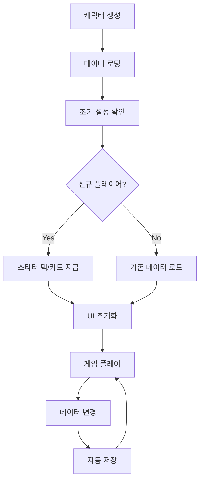

# 캐릭터 관리 시스템

## 개요

메이플 듀얼의 캐릭터 관리 시스템은 `Character.mlua`를 중심으로 플레이어의 모든 게임 관련 데이터와 상태를 관리하는 핵심 시스템입니다. 플레이어 기본 속성, 덱 관리, 카드 컬렉션, 친구 시스템, 매칭 시스템, 경제 시스템 등 게임의 모든 주요 기능과 연동됩니다.

## 핵심 컴포넌트

### Character.mlua
플레이어의 모든 데이터와 게임 상태를 중앙에서 관리하는 마스터 컴포넌트입니다.

**주요 역할:**
- 플레이어 프로필 및 진행 상황 관리
- 덱 컬렉션 및 카드 소유권 관리
- 경제 시스템 (메소, 보상) 연동
- 소셜 기능 (친구, 채팅) 지원
- 매칭 시스템 및 랭킹 연동

```lua
@Component
script Character extends Component

-- 기본 속성
property string nickname = ""
property integer profileCode = 0
property boolean isLoaded = false
property any player = nil           -- 듀얼 중일 때 Player 참조

-- 경제 시스템
property integer meso = 0                        -- 게임 화폐
property integer dailyRankedWinMeso = 0          -- 일일 랭크전 승리 메소
property integer dailyPlayMeso = 0               -- 일일 플레이 메소
property integer dailyRankedPlayCount = 0        -- 일일 랭크전 플레이 횟수

-- 컬렉션 시스템
property table cardArray = {}                    -- 보유 카드 목록
property table deckArray = {}                    -- 덱 목록
property integer deckIndex = 1                   -- 현재 선택된 덱

-- 소셜 시스템
property table friendTable = {}                  -- 친구 목록
property table friendRequestArray = {}           -- 친구 신청 목록

-- 매칭 시스템
property boolean isMatching = false              -- 매칭 중 상태
property integer rankPoint = 500                 -- 랭크 포인트

-- 임시 데이터
property table temp = {}                         -- 세션별 임시 데이터
```

## 플레이어 초기화 시스템

### 캐릭터 로딩

```lua
method void OnBeginPlay()
    -- UI 매니저 연결
    self.uiManager = _UserService.LocalPlayer.Entity.UIManagerComponent.UIManager
    
    -- 매니저 컴포넌트 참조 설정
    self.cardManager = self.Entity.CardManager
    self.deckManager = self.Entity.DeckManager
    self.cardPackManager = self.Entity.CardPackManager
    
    -- 랭킹 시스템 연동
    self.rankManager = self.Entity.RankManager
    self.matching = self.Entity.Matching
    
    -- 데이터 로딩
    if self:IsUser() then
        self:Load()
    end
end
```

### 사용자 데이터 로딩

```lua
@ExecSpace("ServerOnly")
method void Load()
    local userDataStorage = _DataStorageService:GetUserDataStorage(self.Entity.Name)
    
    -- 기본 프로필 로딩
    self.nickname = userDataStorage:GetData("nickname", "Player")
    self.profileCode = userDataStorage:GetData("profileCode", _UserService:GetRandom(1000, 9999))
    self.meso = userDataStorage:GetData("meso", 10000)  -- 초기 메소
    
    -- 컬렉션 데이터 로딩
    self.cardArray = userDataStorage:GetData("cardArray", {})
    self.deckArray = userDataStorage:GetData("deckArray", {})
    self.deckIndex = userDataStorage:GetData("deckIndex", 1)
    
    -- 소셜 데이터 로딩
    self.friendTable = userDataStorage:GetData("friendTable", {})
    
    -- 랭킹 데이터 로딩
    self.rankPoint = userDataStorage:GetData("rankPoint", 500)
    
    -- 초기 덱 설정 (신규 플레이어)
    if _Table:IsEmpty(self.deckArray) then
        self:SetupStarterDecks()
    end
    
    self.isLoaded = true
    
    -- 클라이언트에 로딩 완료 알림
    if self:IsUser() then
        self:LoadInOwner(self.Entity.Name)
    end
end
```

### 신규 플레이어 초기 설정

```lua
method void SetupStarterDecks()
    -- 각 직업별 스타터 덱 생성
    local classes = {"Warrior", "Magician", "Bowman", "Thief", "Pirate"}
    
    for _, className in ipairs(classes) do
        local starterDeck = self.deckManager:GetStarterDeck(className)
        table.insert(self.deckArray, starterDeck)
    end
    
    -- 스타터 카드 컬렉션 추가
    local starterCards = self:GetStarterCards()
    for _, cardInfo in ipairs(starterCards) do
        table.insert(self.cardArray, cardInfo)
    end
end

method table GetStarterCards()
    local starterCards = {}
    local baseCards = {
        "PowerStrike", "GuardStance", "HealPotion", "MagicMissile", 
        "ArrowShot", "SteelSkin", "QuickStep", "EnergyBolt"
    }
    
    for _, cardName in ipairs(baseCards) do
        table.insert(starterCards, {
            name = cardName,
            skinIndex = 1  -- 기본 스킨
        })
    end
    
    return starterCards
end
```

## 덱 관리 시스템

### 덱 생성 및 편집

```lua
method table CreateDeck(string className)
    local newDeck = {
        name = className .. " Deck",
        class = className,
        cardTable = {},  -- {[cardName] = count}
        index = #self.deckArray + 1
    }
    
    return newDeck
end

method boolean AddCardToDeck(integer deckIndex, string cardName)
    if deckIndex < 1 or deckIndex > #self.deckArray then return false end
    
    local deck = self.deckArray[deckIndex]
    if not self.deckManager:CanAddCardToDeck(deck, cardName) then return false end
    
    -- 카드 추가
    deck.cardTable[cardName] = (deck.cardTable[cardName] or 0) + 1
    
    -- 데이터 저장
    self:SaveDeckArray()
    
    return true
end

method boolean RemoveCardFromDeck(integer deckIndex, string cardName)
    if deckIndex < 1 or deckIndex > #self.deckArray then return false end
    
    local deck = self.deckArray[deckIndex]
    if not deck.cardTable[cardName] or deck.cardTable[cardName] <= 0 then return false end
    
    -- 카드 제거
    deck.cardTable[cardName] -= 1
    if deck.cardTable[cardName] == 0 then
        deck.cardTable[cardName] = nil
    end
    
    -- 데이터 저장
    self:SaveDeckArray()
    
    return true
end
```

### 덱 선택 및 검증

```lua
method void SetCurrentDeck(integer deckIndex)
    if deckIndex >= 1 and deckIndex <= #self.deckArray then
        self.deckIndex = deckIndex
        self:SaveDeckIndex()
    end
end

method table GetCurrentDeck()
    if self.deckIndex >= 1 and self.deckIndex <= #self.deckArray then
        return self.deckArray[self.deckIndex]
    else
        return self.deckArray[1]  -- 폴백: 첫 번째 덱
    end
end

method boolean IsCurrentDeckValid()
    local currentDeck = self:GetCurrentDeck()
    return self.deckManager:IsDeckValid(currentDeck)
end
```

## 카드 컬렉션 시스템

### 카드 획득

```lua
method void GainCard(string cardName, integer skinIndex, boolean showAnimation)
    skinIndex = skinIndex or 1
    showAnimation = showAnimation ~= false
    
    -- 컬렉션에 추가
    table.insert(self.cardArray, {
        name = cardName,
        skinIndex = skinIndex
    })
    
    -- UI 업데이트
    if showAnimation and self:IsUser() then
        self.uiManager.CardModule:ShowNewCardAnimation(cardName, skinIndex)
    end
    
    -- 데이터 저장
    self:SaveCardArray()
end

method void GainCards(table cardInfoArray, boolean showAnimation)
    for _, cardInfo in ipairs(cardInfoArray) do
        self:GainCard(cardInfo.cardName or cardInfo.name, cardInfo.skinIndex, false)
    end
    
    -- 일괄 애니메이션
    if showAnimation and self:IsUser() then
        self.uiManager.CardModule:ShowNewCardsAnimation(cardInfoArray)
    end
end
```

### 카드 소유 확인

```lua
method integer GetCardCount(string cardName)
    local count = 0
    for _, cardInfo in ipairs(self.cardArray) do
        if cardInfo.name == cardName then
            count += 1
        end
    end
    return count
end

method boolean HasCard(string cardName)
    return self:GetCardCount(cardName) > 0
end

method table GetOwnedCardsByClass(string className)
    local ownedCards = {}
    for _, cardInfo in ipairs(self.cardArray) do
        local cardClass = self.cardManager:GetClass(cardInfo.name)
        if cardClass == className or cardClass == "Common" then
            table.insert(ownedCards, cardInfo)
        end
    end
    return ownedCards
end
```

## 경제 시스템 연동

### 메소 관리

```lua
method void AddMeso(integer amount, string reason)
    if amount <= 0 then return end
    
    self.meso += amount
    
    -- UI 피드백
    if self:IsUser() then
        self.uiManager:ShowMesoGain(amount, reason)
    end
    
    -- 데이터 저장
    self:SaveMeso()
end

method boolean SpendMeso(integer amount, string reason)
    if amount <= 0 or self.meso < amount then return false end
    
    self.meso -= amount
    
    -- UI 피드백
    if self:IsUser() then
        self.uiManager:ShowMesoSpent(amount, reason)
    end
    
    -- 데이터 저장
    self:SaveMeso()
    
    return true
end
```

### 일일 보상 시스템

```lua
method void ProcessDailyReward()
    local today = _DateTime:KtcNow():ToString("yyyy-MM-dd")
    local lastRewardDate = self.temp.lastDailyReward or ""
    
    if lastRewardDate ~= today then
        -- 일일 보상 지급
        self:AddMeso(1000, "Daily Login Reward")
        
        -- 연속 로그인 보너스 계산
        local consecutiveDays = self:GetConsecutiveLoginDays()
        if consecutiveDays >= 7 then
            self:GainCard("ClassicGoldRare", 1, true)
        end
        
        self.temp.lastDailyReward = today
        self:SaveTemp()
    end
end

method integer GetConsecutiveLoginDays()
    local lastLogin = self.temp.lastLoginDate
    local today = _DateTime:KtcNow()
    
    if not lastLogin then return 1 end
    
    local lastLoginDate = DateTime(lastLogin)
    local daysDiff = (today - lastLoginDate).Days
    
    if daysDiff == 1 then
        return (self.temp.consecutiveLoginDays or 0) + 1
    elseif daysDiff == 0 then
        return self.temp.consecutiveLoginDays or 1
    else
        return 1  -- 연속 로그인 중단
    end
end
```

## 매칭 시스템 연동

### 매칭 상태 관리

```lua
method void StartMatching(string matchType)
    if self.isMatching or isvalid(self.player) then return end
    
    self.isMatching = true
    self.temp.matchType = matchType
    self.temp.matchStartTime = _TimerService:GetCurrentTime()
    
    -- UI 업데이트
    if self:IsUser() then
        self.uiManager:ShowMatchingUI(true)
    end
end

method void StopMatching()
    self.isMatching = false
    self.temp.matchType = nil
    self.temp.matchStartTime = nil
    
    -- UI 업데이트
    if self:IsUser() then
        self.uiManager:ShowMatchingUI(false)
    end
end
```

### 랭크 시스템

```lua
method string GetMajorRank()
    return self.rankManager:GetMajorRank(self.rankPoint, self:GetRanking())
end

method string GetMinorRank()
    return self.rankManager:GetMinorRank(self.rankPoint)
end

method integer GetRanking()
    return self.rankManager:GetRanking(self.Entity.Name)
end

method void UpdateRankPoint(integer change, string reason)
    local oldRankPoint = self.rankPoint
    self.rankPoint = math.max(0, self.rankPoint + change)
    
    -- 랭크 변경 확인
    local oldRank = self.rankManager:GetMajorRank(oldRankPoint, self:GetRanking())
    local newRank = self:GetMajorRank()
    
    if oldRank ~= newRank then
        -- 랭크 업/다운 이벤트
        self:OnRankChanged(oldRank, newRank)
    end
    
    -- 데이터 저장
    self:SaveRankPoint()
end
```

## 소셜 시스템 연동

### 친구 관리

앞서 소셜 시스템 문서에서 상세히 다룬 기능들이 Character.mlua에 구현되어 있습니다.

```lua
method boolean IsFriendWith(Character character)
    return self:IsUser() and self.friendTable[character.Entity.Name] ~= nil
end

method integer GetFriendCount()
    return _Table:GetSize(self.friendTable)
end

method table GetOnlineFriends()
    local onlineFriends = {}
    for userId, friendInfo in pairs(self.friendTable) do
        local userEntity = _UserService:GetUserEntityByUserId(userId)
        if isvalid(userEntity) and isvalid(userEntity.Character) then
            table.insert(onlineFriends, {
                userId = userId,
                character = userEntity.Character,
                friendInfo = friendInfo
            })
        end
    end
    return onlineFriends
end
```

## 데이터 영속성

### 자동 저장 시스템

```lua
method void SaveAll()
    if not self:IsUser() then return end
    
    self:SaveNickname()
    self:SaveProfileCode()
    self:SaveMeso()
    self:SaveCardArray()
    self:SaveDeckArray()
    self:SaveDeckIndex()
    self:SaveFriendTable()
    self:SaveRankPoint()
    self:SaveTemp()
end

method void SaveNickname()
    local userDataStorage = _DataStorageService:GetUserDataStorage(self.Entity.Name)
    userDataStorage:SetData("nickname", self.nickname)
end

method void SaveMeso()
    local userDataStorage = _DataStorageService:GetUserDataStorage(self.Entity.Name)
    userDataStorage:SetData("meso", self.meso)
end

-- 기타 저장 메서드들...
```

### 백업 및 복구

```lua
method table CreateBackup()
    return {
        nickname = self.nickname,
        profileCode = self.profileCode,
        meso = self.meso,
        cardArray = _Table:Clone(self.cardArray),
        deckArray = _Table:Clone(self.deckArray),
        deckIndex = self.deckIndex,
        friendTable = _Table:Clone(self.friendTable),
        rankPoint = self.rankPoint,
        timestamp = _DateTime:KtcNow():ToString()
    }
end

method boolean RestoreFromBackup(table backup)
    if not backup or not backup.timestamp then return false end
    
    -- 백업 유효성 검증
    if not self:ValidateBackup(backup) then return false end
    
    -- 데이터 복원
    self.nickname = backup.nickname
    self.profileCode = backup.profileCode
    self.meso = backup.meso
    self.cardArray = _Table:Clone(backup.cardArray)
    self.deckArray = _Table:Clone(backup.deckArray)
    self.deckIndex = backup.deckIndex
    self.friendTable = _Table:Clone(backup.friendTable)
    self.rankPoint = backup.rankPoint
    
    -- 모든 데이터 저장
    self:SaveAll()
    
    return true
end
```

## 캐릭터 시스템 플로우



## 성능 최적화

### 지연 로딩

```lua
property table lazyLoadedData = {}

method table GetExpensiveData(string key)
    if not self.lazyLoadedData[key] then
        self.lazyLoadedData[key] = self:LoadExpensiveData(key)
    end
    return self.lazyLoadedData[key]
end
```

### 캐싱 시스템

```lua
property table cachedCalculations = {}

method integer GetTotalCardValue()
    local cacheKey = "totalCardValue_" .. #self.cardArray
    if not self.cachedCalculations[cacheKey] then
        local totalValue = 0
        for _, cardInfo in ipairs(self.cardArray) do
            local rarity = self.cardManager:GetRarity(cardInfo.name)
            totalValue += self:GetCardValue(rarity)
        end
        self.cachedCalculations[cacheKey] = totalValue
    end
    return self.cachedCalculations[cacheKey]
end
```

이 캐릭터 관리 시스템은 메이플 듀얼의 모든 플레이어 관련 데이터와 기능을 통합적으로 관리하여, 일관된 게임 경험과 안정적인 데이터 영속성을 제공하는 핵심 시스템입니다.
