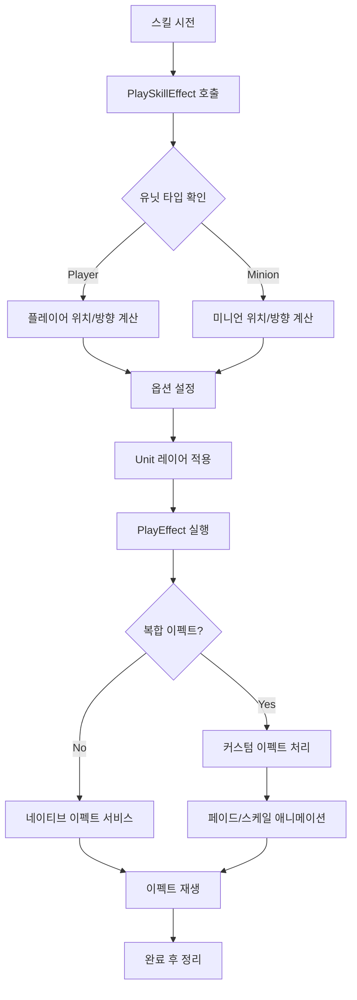
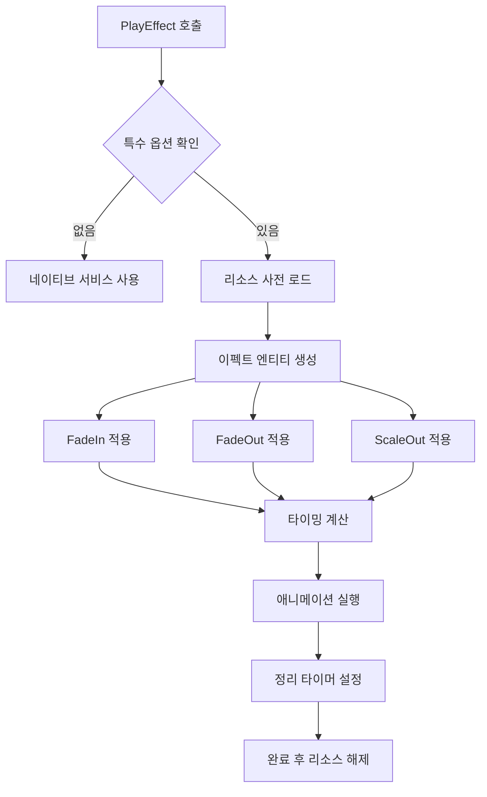

# 비주얼 이펙트 시스템

## 개요

메이플 듀얼의 비주얼 이펙트 시스템은 `Effect.mlua`를 통해 게임의 모든 시각적 효과를 관리합니다. 카드 시전 이펙트, 미니언 스킬 애니메이션, UI 전환 효과 등 다양한 비주얼 피드백을 제공하여 게임의 몰입도를 높입니다.

## 핵심 이펙트 시스템

### Effect.mlua
모든 비주얼 이펙트를 관리하는 중앙 로직 컴포넌트입니다.

**주요 역할:**
- 이펙트 스프라이트 생성 및 관리
- 애니메이션 타이밍 제어
- 레이어 및 렌더링 순서 관리
- 다양한 이펙트 패턴 제공

## 레이어 관리 시스템

### 레이어 옵션 설정

```lua
@ExecSpace("ClientOnly")
method table GetLayerOptions(table options, string sortingLayer, integer orderInLayer)
    options = options or {}
    options.SortingLayer = sortingLayer
    options.OrderInLayer = orderInLayer
    return options
end
```

### 유닛 레이어 설정

```lua
@ExecSpace("ClientOnly")
method table GetUnitLayerOptions(table options)
    return self:GetLayerOptions(options, "Unit", 1)
end
```

**레이어 구조:**
- **"Effect"**: 일반 이펙트 레이어 (기본값)
- **"Unit"**: 유닛 관련 이펙트 레이어
- **OrderInLayer**: 같은 레이어 내 렌더링 순서 (숫자가 클수록 앞에 표시)

## 이펙트 생성 시스템

### 기본 이펙트 생성

```lua
@ExecSpace("ClientOnly")
method Entity SpawnEffect(string animation, Vector3 position, Entity parent, table options)
    local sortingLayer = options and options.SortingLayer or "Effect"
    local orderInLayer = options and options.OrderInLayer or 0
    local alpha = options and options.Alpha or 1
    local flipX = options and options.FlipX or false
    local fadeIn = options and options.FadeIn or false
    
    // 이펙트 엔티티 생성
    local effectEntity = _SpawnService:SpawnByModelId(
        _EntryService:GetModelIdByName("Effect"), "Effect", 
        position, parent or _UserService.LocalPlayer.CurrentMap)
    
    // 스프라이트 렌더러 설정
    local spriteRenderer = effectEntity.SpriteRendererComponent
    spriteRenderer.Color.a = fadeIn and 0 or alpha
    spriteRenderer.SpriteRUID = animation
    spriteRenderer.SortingLayer = sortingLayer
    spriteRenderer.OrderInLayer = orderInLayer
    spriteRenderer.FlipX = flipX
    
    return effectEntity
end
```

**옵션 파라미터:**
- **SortingLayer**: 렌더링 레이어
- **OrderInLayer**: 레이어 내 순서
- **Alpha**: 투명도 (0.0 ~ 1.0)
- **FlipX**: 좌우 반전 여부
- **FadeIn**: 페이드인 효과 여부

## 고급 이펙트 플레이

### 복합 애니메이션 이펙트

```lua
@ExecSpace("ClientOnly")
method void PlayEffect(string animation, Vector3 position, Entity parent, table options)
    local fadeIn = options and options.FadeIn or false
    local fadeOut = options and options.FadeOut or false
    local scaleOut = options and options.ScaleOut or false
    
    local shouldSpawnEffect = fadeIn or fadeOut or scaleOut
    if not shouldSpawnEffect then
        // 단순 이펙트는 네이티브 서비스 사용
        if isvalid(parent) then
            _EffectService:PlayEffectAttached(animation, parent, position, 0, Vector3.one, false, options)
        else
            _EffectService:PlayEffect(animation, _UserService.LocalPlayer, position, 0, Vector3.one, false, options)
        end
        return
    end
    
    // 복합 이펙트 처리
    _ResourceService:PreloadAsync({animation}, function()
        local effectEntity = self:SpawnEffect(animation, position, parent, options)
        local transform = effectEntity.TransformComponent
        local spriteRenderer = effectEntity.SpriteRendererComponent
        local timerArray = {}
        local tweenerArray = {}
        local totalDelay = _Resource:GetTotalDelay(animation) - 0.03
        
        // 페이드인 효과
        if fadeIn then
            local alpha = options and options.Alpha or 1
            local tweener = _TweenLogic:PlayTween(0, alpha, 
                _Resource:GetStartFrameDelay(animation), EaseType.Linear, 
                function(t) spriteRenderer.Color.a = t end)
            table.insert(tweenerArray, tweener)
        end
        
        // 페이드아웃 효과
        if fadeOut then
            local alpha = options and options.Alpha or 1
            local endFrameDelay = _Resource:GetEndFrameDelay(animation)
            local timer = _TimerService:SetTimerOnce(function()
                local tweener = _TweenLogic:PlayTween(alpha, 0, endFrameDelay, EaseType.Linear,
                    function(t) spriteRenderer.Color.a = t end)
                table.insert(tweenerArray, tweener)
            end, math.max(0, totalDelay - endFrameDelay))
            table.insert(timerArray, timer)
        end
        
        // 스케일아웃 효과
        if scaleOut then
            local endFrameDelay = _Resource:GetEndFrameDelay(animation)
            local timer = _TimerService:SetTimerOnce(function()
                local tweener = _TweenLogic:PlayTween(1, 2, endFrameDelay, EaseType.Linear,
                    function(t)
                        transform.Scale.x = t
                        transform.Scale.y = t
                    end)
                table.insert(tweenerArray, tweener)
            end, math.max(0, totalDelay - endFrameDelay))
            table.insert(timerArray, timer)
        end
        
        // 정리 타이머
        _TimerService:SetTimerOnce(function()
            for _, timer in ipairs(timerArray) do
                _TimerService:ClearTimer(timer)
            end
            for _, tweener in ipairs(tweenerArray) do
                tweener:Destroy()
            end
            effectEntity:Destroy()
        end, totalDelay)
    end)
end
```

## 동적 이펙트 패턴

### 이동 이펙트

```lua
@ExecSpace("ClientOnly")
method void MoveEffect(string animation, Vector2 fromPosition, Vector2 toPosition, 
                      number zPosition, number duration, any easeType, table options)
    local position = Vector3(fromPosition.x, fromPosition.y, zPosition)
    local effectEntity = self:SpawnEffect(animation, position, nil, options)
    
    // 이동 애니메이션
    local tweener = _Tween:MoveTo(effectEntity, toPosition, duration, easeType, true)
    
    // 완료 시 정리
    _TimerService:SetTimerOnce(function()
        tweener:Destroy()
        effectEntity:Destroy()
    end, duration)
end
```

### 이동+회전 이펙트

```lua
@ExecSpace("ClientOnly")
method void MoveAndSpinEffect(string animation, Vector2 fromPosition, Vector2 toPosition,
                             number zPosition, number angle, number duration, any easeType, table options)
    local position = Vector3(fromPosition.x, fromPosition.y, zPosition)
    local effectEntity = self:SpawnEffect(animation, position, nil, options)
    
    // 이동과 회전 동시 애니메이션
    local tweener = _Tween:MoveAndSpinTo(effectEntity, toPosition, angle, duration, easeType, true)
    
    _TimerService:SetTimerOnce(function()
        tweener:Destroy()
        effectEntity:Destroy()
    end, duration)
end
```

### 투사체 이펙트

```lua
@ExecSpace("ClientOnly")
method void ThrowEffect(string animation, Vector2 fromPosition, Vector2 toPosition,
                       number zPosition, number duration, any easeType, table options)
    local dx = toPosition.x - fromPosition.x
    local dy = toPosition.y - fromPosition.y
    
    // 이동 방향에 따라 좌우 반전
    options.FlipX = dx > 0
    
    local position = Vector3(fromPosition.x, fromPosition.y, zPosition)
    local effectEntity = self:SpawnEffect(animation, position, nil, options)
    
    // 투사체 각도 설정
    local transform = effectEntity.TransformComponent
    transform.WorldZRotation = math.deg(_Math:Atan2(dy, dx)) + (dx > 0 and 0 or 180)
    
    // 이동 애니메이션
    local tweener = _Tween:MoveTo(effectEntity, toPosition, duration, easeType, true)
    _TimerService:SetTimerOnce(function()
        tweener:Destroy()
        effectEntity:Destroy()
    end, duration)
end
```

## 유닛별 특화 이펙트

### 스킬 이펙트

**스킬 이펙트 처리**:
- `Effect.mlua :: PlaySkillEffect()` — 유닛별 스킬 이펙트 재생
- 플레이어/미니언별 위치 계산 및 방향 설정

### 부착형 스킬 이펙트

**부착형 스킬 이펙트**:
- `Effect.mlua :: PlaySkillEffectAttached()` — 유닛에 부착되는 이펙트
- `_EffectService:PlayEffectAttached()` 활용하여 부모 엔티티에 연결

### 피격 이펙트

**피격 이펙트 처리**:
- `Effect.mlua :: PlayHitEffect()` — 피격시 이펙트 재생
- 공격자 방향에 따른 이펙트 방향 자동 결정

## 이펙트 최적화

### 리소스 사전 로딩

**리소스 사전 로딩**:
- `_ResourceService:PreloadAsync()` 활용으로 끊김 방지

### 메모리 관리

**메모리 관리**:
- 타이머와 트위너 자동 정리 시스템
- `_TimerService:SetTimerOnce()` 활용한 자동 해제

### 성능 최적화

- **조건부 복합 이펙트**: 필요한 경우에만 커스텀 이펙트 사용
- **네이티브 서비스 활용**: 단순 이펙트는 _EffectService 직접 사용
- **자동 정리**: 이펙트 완료 후 자동으로 리소스 해제

## 이펙트 시스템 플로우

### 스킬 이펙트 실행 플로우



### 복합 애니메이션 플로우



## 이펙트 활용 예시

### 카드 시전 이펙트
**스킬 이펙트 재생**:
- `_Effect:PlaySkillEffect()` 호출로 유닛 기준 이펙트 처리

### 투사체 공격
**투사체 이펙트**:
- `_Effect:ThrowEffect()` 활용한 시작-목표 지점 이동 이펙트

### 폭발 이펙트
**확대 폭발 이펙트**:
- `_Effect:PlayEffect()` 활용한 ScaleOut/FadeOut 조합 효과

## 코드 참조

### 핵심 파일
- `RootDesk/MyDesk/Logics/Effect.mlua` — 비주얼 이펙트 시스템 메인 로직

### 연동 시스템
- `RootDesk/MyDesk/Logics/Resource.mlua` — 애니메이션 타이밍 정보 제공
- `RootDesk/MyDesk/Logics/Tween.mlua` — 이펙트 애니메이션 처리
- `RootDesk/MyDesk/Components/Managers/ActionManager.mlua` — 게임 액션과 이펙트 연동

### 주요 메서드
- `Effect:PlayEffect()` — 복합 이펙트 재생
- `Effect:SpawnEffect()` — 이펙트 엔티티 생성
- `Effect:PlaySkillEffect()` — 유닛 스킬 이펙트
- `Effect:MoveEffect()` — 이동 이펙트
- `Effect:ThrowEffect()` — 투사체 이펙트

## 비주얼 이펙트 시스템의 특징

### 유연한 옵션 시스템
- 다양한 애니메이션 효과 조합 가능
- 레이어 및 렌더링 순서 정밀 제어
- 타이밍과 이징 완전 커스터마이징

### 성능 최적화
- 조건부 복합 이펙트로 불필요한 처리 방지
- 자동 리소스 정리로 메모리 누수 방지
- 네이티브 서비스와의 효율적인 연동

### 게임 통합성
- 유닛별 특화된 이펙트 시스템
- 카드 게임에 최적화된 시각적 피드백
- 일관된 이펙트 스타일과 타이밍

이 비주얼 이펙트 시스템은 메이플 듀얼의 모든 시각적 액션에 생동감과 몰입감을 제공하여, 플레이어에게 만족스러운 게임 경험을 선사하는 핵심 구성 요소입니다.
