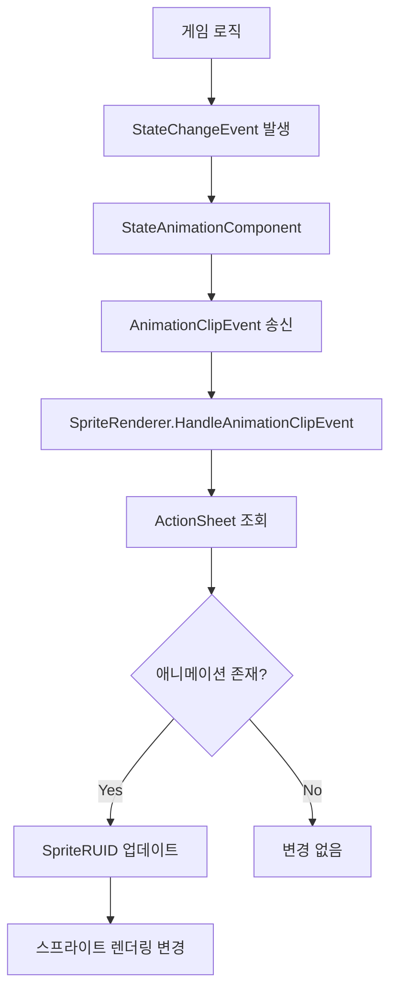
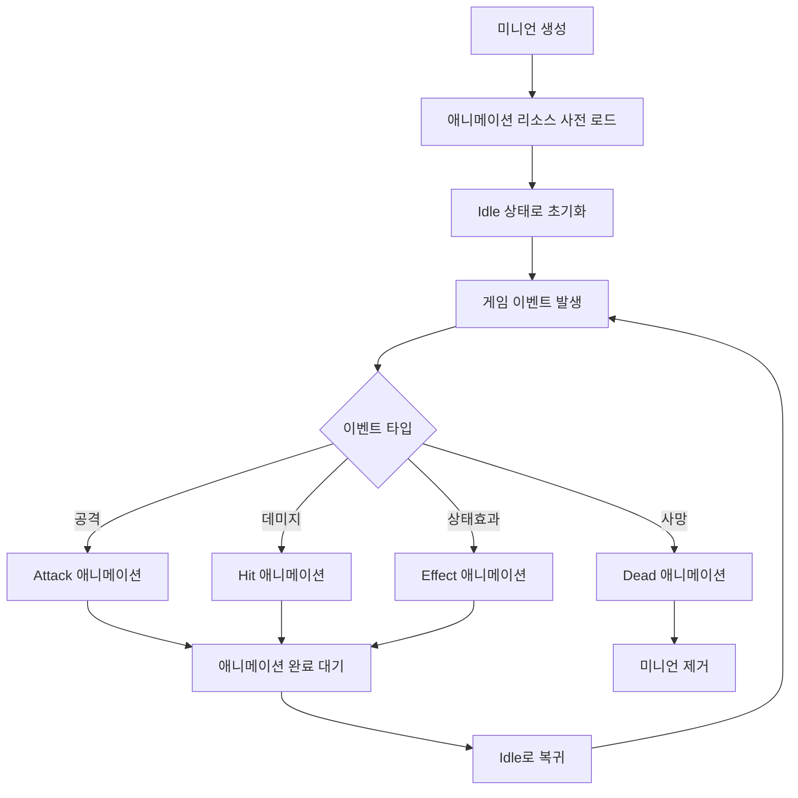
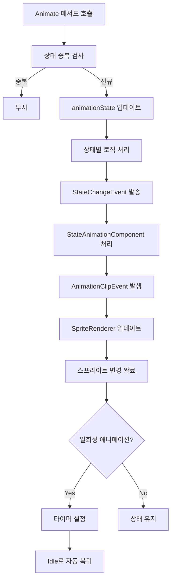

# 스프라이트 애니메이션 시스템

## 개요

메이플 듀얼의 스프라이트 애니메이션 시스템은 `SpriteRenderer.mlua`를 통해 게임 엔티티들의 동적 스프라이트 변경과 애니메이션 클립 연동을 관리합니다. 이 시스템은 MapleStory Worlds의 네이티브 애니메이션 시스템과 연동하여 미니언, 캐릭터, 이펙트 등의 시각적 상태 변화를 처리합니다.

## 핵심 스프라이트 렌더링 시스템

### SpriteRenderer.mlua
`SpriteRendererComponent`를 확장한 커스텀 렌더러 컴포넌트입니다.

**구조:**
```lua
@Component
script SpriteRenderer extends SpriteRendererComponent

    @EventSender("Self")
    handler HandleAnimationClipEvent(AnimationClipEvent event)
        -- 네이티브 이벤트 처리
        -- 송신자: StateAnimationComponent
        -- 실행 공간: Server, Client
        
        local ClipName = event.ClipName
        
        local stateAnimationComponent = self.Entity.StateAnimationComponent
        if isvalid(stateAnimationComponent) then
            local success, animation = stateAnimationComponent.ActionSheet:TryGetValue(ClipName)
            if success then
                self.SpriteRUID = animation  -- 스프라이트 동적 변경
            end
        end
    end
end
```

**주요 기능:**
- **애니메이션 클립 이벤트 처리**: `AnimationClipEvent`를 받아 스프라이트 동적 변경
- **ActionSheet 연동**: `StateAnimationComponent`의 액션시트에서 애니메이션 리소스 조회
- **자동 스프라이트 전환**: 클립 이름에 따른 자동 스프라이트 RUID 설정

## 애니메이션 시스템 아키텍처

### StateAnimationComponent 연동

**ActionSheet 구조:**
```lua
-- StateAnimationComponent에서 관리하는 애니메이션 액션 시트
ActionSheet = {
    ["Idle"] = "애니메이션_RUID_1",
    ["Attack"] = "애니메이션_RUID_2", 
    ["Dead"] = "애니메이션_RUID_3",
    -- ... 기타 애니메이션 상태들
}
```

### 이벤트 기반 스프라이트 변경



## 애니메이션 상태 관리

### 미니언 애니메이션 시스템

미니언은 다양한 애니메이션 상태를 가지고 있습니다:

```lua
-- Minion.mlua에서의 애니메이션 상태 관리
property string animationState = ""  -- 현재 애니메이션 상태

method void Animate(string toAnimationState)
    if self.animationState == toAnimationState then
        return  -- 동일한 상태면 무시
    end
    
    local fromAnimationState = self.animationState
    self.animationState = toAnimationState
    
    if toAnimationState == "Idle" then
        if self.isFreeze then
            toAnimationState = "freeze"  -- 빙결 상태 오버라이드
        end
    end
    
    -- StateChangeEvent 발생
    self.minionEntity:SendEvent(StateChangeEvent(toAnimationState, toAnimationState))
    
    -- 애니메이션 완료 후 Idle로 복귀
    if toAnimationState ~= "Idle" then
        _TimerService:SetTimerOnce(function()
            self:Animate("Idle")
        end, _Resource:GetTotalDelay(self.minionEntity.StateAnimationComponent.ActionSheet[toAnimationState]) - 0.03)
    else
        -- 소문자로 변환하여 최종 상태 설정
        toAnimationState = string.lower(toAnimationState)
        self.minionEntity:SendEvent(StateChangeEvent(toAnimationState, toAnimationState))
    end
end
```

### 주요 애니메이션 상태들

**기본 상태:**
- **"Idle"**: 대기 상태 (기본)
- **"Attack"**: 공격 애니메이션
- **"Dead"**: 사망 애니메이션
- **"Summon"**: 소환 애니메이션

**상태 효과:**
- **"freeze"**: 빙결 상태 (Idle 오버라이드)
- **"stun"**: 기절 상태
- **"barrier"**: 방어막 상태

## 리소스 사전 로딩

### 애니메이션 리소스 최적화

```lua
// MinionBody.mlua - 애니메이션 리소스 사전 로드
@ExecSpace("ClientOnly")  
method void OnBeginPlay()
    __base:OnBeginPlay()
    
    // 모든 애니메이션 리소스를 미리 로드
    _ResourceService:PreloadAsync(
        self.minionEntity.StateAnimationComponent.ActionSheet.Values, nil)
    
    // 상태 효과 엔티티 생성
    self.barrierEntity = _SpawnService:SpawnByModelId(...)
    // ... 기타 효과들
end
```

**사전 로딩의 장점:**
- 애니메이션 전환 시 끊김 없는 재생
- 네트워크 지연으로 인한 시각적 버벅거림 방지
- 게임플레이 중 원활한 사용자 경험

## 동적 스프라이트 변경

### 런타임 스프라이트 업데이트

```lua
// 스프라이트 동적 변경 예시
local spriteRenderer = entity.SpriteRendererComponent
spriteRenderer.SpriteRUID = "새로운_애니메이션_RUID"

// 또는 이벤트를 통한 자동 변경
entity:SendEvent(StateChangeEvent("Attack", "Attack"))
```

### UI 요소 스프라이트 변경

```lua
// CardPackModule.mlua에서의 카드팩 이미지 설정
self.cardPackImage.SpriteRUID = self.resourceManager:GetResource("CardPack")[self.cardPackName]

// Map.mlua에서의 플레이어 배경 설정  
player.backgroundEntity.SpriteRendererComponent.SpriteRUID = playerBackground
```

## 애니메이션 타이밍 제어

### 지속시간 기반 타이밍

```lua
// Resource.mlua를 통한 애니메이션 총 지속시간 조회
local totalDelay = _Resource:GetTotalDelay(animationRUID)

// 애니메이션 완료 0.03초 전에 다음 상태로 전환
_TimerService:SetTimerOnce(function()
    self:Animate("Idle")
end, totalDelay - 0.03)
```

### 프레임별 타이밍

```lua
// 애니메이션 시작 프레임 지연시간
local startFrameDelay = _Resource:GetStartFrameDelay(animationRUID)

// 애니메이션 종료 프레임 지연시간  
local endFrameDelay = _Resource:GetEndFrameDelay(animationRUID)
```

## 스프라이트 렌더링 최적화

### 렌더링 레이어 관리

```lua
// 스프라이트 렌더러 레이어 설정
spriteRenderer.SortingLayer = "Unit"      // 렌더링 레이어
spriteRenderer.OrderInLayer = 1           // 레이어 내 순서
spriteRenderer.FlipX = true               // 좌우 반전
spriteRenderer.Color.a = 0.8              // 투명도 설정
```

### 메모리 및 성능 최적화

**사전 로딩 전략:**
- 필요한 애니메이션만 선택적 로드
- 공통 애니메이션은 전역 사전 로드
- 특수 효과는 필요시에만 로드

**렌더링 최적화:**
- 불필요한 스프라이트 변경 방지
- 동일 상태 중복 처리 방지
- 효율적인 레이어 구성

## 애니메이션 상태 플로우

### 미니언 애니메이션 생명주기



### 애니메이션 이벤트 처리 플로우



## 확장 및 커스터마이징

### 새로운 애니메이션 상태 추가

```lua
// 1. ActionSheet에 새 애니메이션 등록
ActionSheet["NewState"] = "새로운_애니메이션_RUID"

// 2. Animate 메서드에서 상태 처리 추가
method void Animate(string toAnimationState)
    -- 기존 로직...
    
    if toAnimationState == "NewState" then
        // 특수 로직 처리
        self:HandleNewState()
    end
    
    -- StateChangeEvent 발송...
end
```

### 커스텀 애니메이션 이벤트

```lua
// 새로운 애니메이션 이벤트 핸들러 추가
@EventSender("Self")
handler HandleCustomAnimationEvent(CustomAnimationEvent event)
    local customClipName = event.CustomClipName
    local customData = event.CustomData
    
    // 커스텀 로직 처리
    self:ProcessCustomAnimation(customClipName, customData)
end
```

## 코드 참조

### 핵심 컴포넌트
- `RootDesk/MyDesk/Components/SpriteRenderer.mlua` — 커스텀 스프라이트 렌더러
- `Environment/NativeScripts/Component/StateAnimationComponent.d.mlua` — 네이티브 애니메이션 컴포넌트

### 애니메이션 사용처
- `RootDesk/MyDesk/Components/Objects/Minion.mlua` — 미니언 애니메이션 상태 관리
- `RootDesk/MyDesk/Components/Helpers/MinionBody.mlua` — 미니언 애니메이션 리소스 사전 로드
- `RootDesk/MyDesk/Logics/Resource.mlua` — 애니메이션 타이밍 정보 제공

### 연동 시스템
- `RootDesk/MyDesk/Components/Map.mlua` — 엔티티별 스프라이트 설정
- `RootDesk/MyDesk/Components/UIs/CardPackModule.mlua` — UI 스프라이트 동적 변경
- `RootDesk/MyDesk/Logics/Effect.mlua` — 이펙트 애니메이션과 연동

## 스프라이트 애니메이션 시스템의 특징

### 이벤트 기반 아키텍처
- `AnimationClipEvent`를 통한 자동 스프라이트 전환
- 게임 로직과 시각적 표현의 분리
- 확장 가능한 이벤트 처리 구조

### 성능 최적화
- 사전 로딩을 통한 끊김 없는 애니메이션
- 중복 상태 처리 방지로 불필요한 연산 최소화
- 효율적인 타이밍 제어

### 유연한 확장성
- 새로운 애니메이션 상태 추가 용이
- 커스텀 이벤트 핸들러 지원
- 다양한 엔티티 타입에 적용 가능

### 일관성 보장
- 모든 애니메이션이 동일한 패턴으로 처리
- 상태 관리의 일관성
- 예측 가능한 애니메이션 흐름

이 스프라이트 애니메이션 시스템은 메이플 듀얼의 모든 시각적 요소들이 게임 상태 변화에 따라 자연스럽고 일관성 있게 반응할 수 있도록 하는 핵심 기반을 제공합니다.
