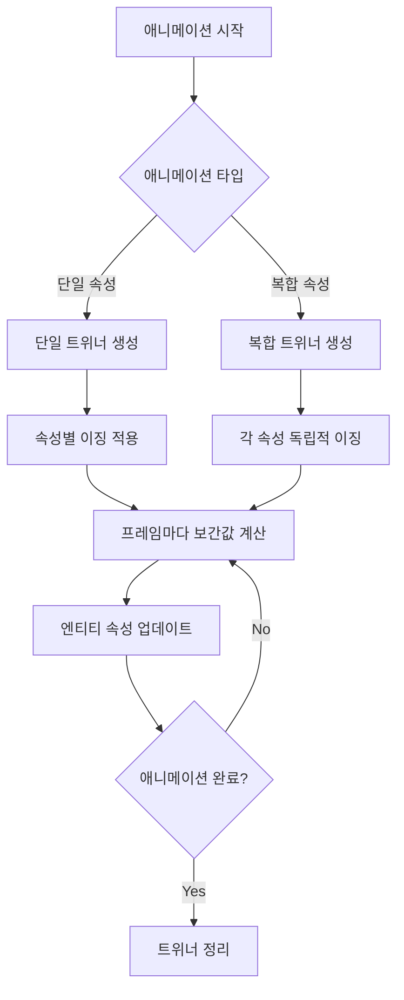
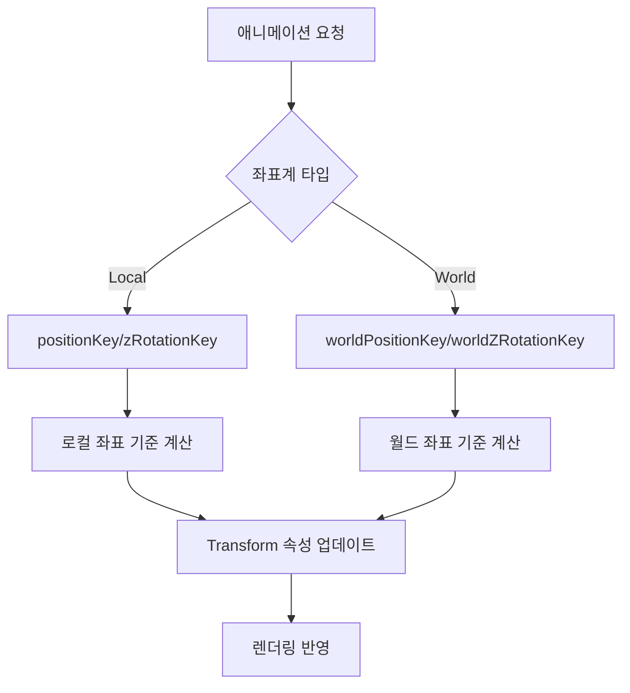

# 트위닝 시스템

## 개요

메이플 듀얼의 트위닝 시스템은 `Tween.mlua`를 통해 게임의 모든 애니메이션 효과를 처리합니다. UI 요소의 부드러운 전환, 카드의 강조 효과, 캐릭터와 이펙트의 동적 움직임 등을 제공하여 게임에 생동감과 시각적 매력을 더합니다.

## 핵심 트위닝 시스템

### Tween.mlua
엔티티 기반의 모든 애니메이션을 담당하는 중앙 로직 컴포넌트입니다.

**주요 속성:**
```lua
property string worldPositionKey = "WorldPosition"  -- 월드 좌표 키
property string positionKey = "Position"             -- 로컬 좌표 키  
property string worldZRotationKey = "WorldZRotation" -- 월드 회전 키
property string zRotationKey = "ZRotation"           -- 로컬 회전 키
```

**역할:**
- 다양한 애니메이션 패턴 제공
- 월드/로컬 좌표계 지원
- 이징(Easing) 함수 통합
- 트위너(Tweener) 객체 관리

## 특수 효과 애니메이션

### Emphasize (강조 효과)

카드나 UI 요소를 강조할 때 사용하는 스케일 애니메이션입니다.

```lua
method any Emphasize(Entity entity, number amplitude, number duration)
    local scale = entity.TransformComponent.Scale
    return _TweenLogic:PlayTween(0, 1, duration, EaseType.Linear, function(t)
        local value
        if t < 0.5 then
            -- 첫 번째 절반: 0에서 amplitude로 확대
            value = _TweenLogic:Ease(0, amplitude, 1, EaseType.QuintEaseOut, t * 2)
        else
            -- 두 번째 절반: amplitude에서 0으로 축소
            value = _TweenLogic:Ease(amplitude, 0, 1, EaseType.QuintEaseIn, t * 2 - 1)
        end
        scale.x = value
        scale.y = value
    end)
end
```

**특징:**
- 두 단계로 나뉜 애니메이션 (확대 → 축소)
- QuintEase 이징으로 자연스러운 강조 효과
- X, Y 축 동시 스케일 변화

### Damp (댄핑 진동 효과)

충격이나 반동을 시뮬레이션하는 진동 애니메이션입니다.

```lua
method any Damp(Entity entity, Vector2 toScale, number amplitude, number duration)
    local scale = entity.TransformComponent.Scale
    local fromScale = toScale:Clone()
    return _TweenLogic:PlayTween(0, 1, duration, EaseType.Linear, function(t)
        -- 사인파와 감쇠 함수를 결합한 진동
        local value = amplitude * _TweenLogic:Ease(1, 0, 1, EaseType.CubicEaseOut, t) * math.sin(t * 6 * math.pi)
        scale.x = fromScale.x + value
        scale.y = fromScale.y + value
    end)
end
```

**특징:**
- 6번의 사인파 진동
- CubicEaseOut으로 점진적 감쇠
- 목표 스케일을 중심으로 진동

### Twitch (떨림 효과)

신경질적이거나 불안정한 상태를 표현하는 회전 떨림입니다.

```lua
method any Twitch(Entity entity, number toZRotation, number amplitude, number duration)
    local transform = entity.TransformComponent
    local fromZRotation = toZRotation
    return _TweenLogic:PlayTween(0, 1, duration, EaseType.Linear, function(t)
        -- 8번의 사인파 회전 진동
        local value = amplitude * _TweenLogic:Ease(1, 0, 1, EaseType.Linear, t) * math.sin(t * 8 * math.pi)
        transform.ZRotation = fromZRotation + value
    end)
end
```

**특징:**
- 8번의 빠른 회전 진동
- Linear 감쇠로 직선적 강도 감소
- 회전축 중심의 떨림 효과

## 기본 변환 애니메이션

### 회전 애니메이션

```lua
method any Spin(Entity entity, number angle, any duration, any type, boolean isWorldSpace)
    local transform = entity.TransformComponent
    local zRotationKey = isWorldSpace and self.worldZRotationKey or self.zRotationKey
    local fromZRotation = transform[zRotationKey]
    return _TweenLogic:PlayTween(0, 1, duration, EaseType.Linear, function(t)
        transform[zRotationKey] = fromZRotation + _TweenLogic:Ease(0, angle, 1, type, t)
    end)
end
```

**특징:**
- 월드/로컬 좌표계 지원
- 커스텀 이징 타입 적용
- 누적 회전 (현재 각도에서 추가 회전)

### 위치 이동 애니메이션

```lua
method any MoveTo(Entity entity, Vector2 toPosition, number duration, any type, boolean isWorldSpace)
    local transform = entity.TransformComponent
    local positionKey = isWorldSpace and self.worldPositionKey or self.positionKey
    local fromPosition = transform[positionKey]:Clone()
    return _TweenLogic:PlayTween(0, 1, duration, EaseType.Linear, function(t)
        transform[positionKey].x = _TweenLogic:Ease(fromPosition.x, toPosition.x, 1, type, t)
        transform[positionKey].y = _TweenLogic:Ease(fromPosition.y, toPosition.y, 1, type, t)
    end)
end
```

**X축 전용 이동:**
```lua
method any MoveXTo(Entity entity, number toXPosition, number duration, any type, boolean isWorldSpace)
    local transform = entity.TransformComponent
    local positionKey = isWorldSpace and self.worldPositionKey or self.positionKey
    local fromXPosition = transform[positionKey].x
    return _TweenLogic:PlayTween(0, 1, duration, EaseType.Linear, function(t)
        transform[positionKey].x = _TweenLogic:Ease(fromXPosition, toXPosition, 1, type, t)
    end)
end
```

### 스케일 애니메이션

```lua
method any ScaleTo(Entity entity, Vector2 toScale, number duration, any type)
    local scale = entity.TransformComponent.Scale
    local fromScale = scale:Clone()
    return _TweenLogic:PlayTween(0, 1, duration, EaseType.Linear, function(t)
        scale.x = _TweenLogic:Ease(fromScale.x, toScale.x, 1, type, t)
        scale.y = _TweenLogic:Ease(fromScale.y, toScale.y, 1, type, t)
    end)
end
```

## 복합 애니메이션

### 이동 + 회전 애니메이션

```lua
method any MoveAndRotateTo(Entity entity, Vector2 toPosition, number toZRotation, 
                          number duration, any moveType, any rotateType, boolean isWorldSpace)
    local transform = entity.TransformComponent
    local positionKey = isWorldSpace and self.worldPositionKey or self.positionKey
    local zRotationKey = isWorldSpace and self.worldZRotationKey or self.zRotationKey
    local fromPosition = transform[positionKey]:ToVector2()
    
    // 회전 각도 최적화 (최단 경로)
    local fromZRotation = math.fmod(transform[zRotationKey], 360)
    toZRotation = math.fmod(toZRotation, 360)
    if toZRotation - fromZRotation > 180 then
        fromZRotation = fromZRotation + 360
    elseif fromZRotation - toZRotation > 180 then
        toZRotation = toZRotation + 360
    end
    
    return _TweenLogic:PlayTween(0, 1, duration, EaseType.Linear, function(t)
        transform[positionKey].x = _TweenLogic:Ease(fromPosition.x, toPosition.x, 1, moveType, t)
        transform[positionKey].y = _TweenLogic:Ease(fromPosition.y, toPosition.y, 1, moveType, t)
        transform[zRotationKey] = _TweenLogic:Ease(fromZRotation, toZRotation, 1, rotateType, t)
    end)
end
```

**회전 최적화:**
- 360도 기준으로 최단 경로 회전
- 180도 이상 차이 시 방향 조정
- 부드러운 회전 보장

### 이동 + 스핀 애니메이션

```lua
method any MoveAndSpinTo(Entity entity, Vector2 toPosition, number angle, 
                        number duration, any type, boolean isWorldSpace)
    local transform = entity.TransformComponent
    local positionKey = isWorldSpace and self.worldPositionKey or self.positionKey
    local fromPosition = transform[positionKey]:Clone()
    local zRotationKey = isWorldSpace and self.worldZRotationKey or self.zRotationKey
    local fromZRotation = transform[zRotationKey]
    
    return _TweenLogic:PlayTween(0, 1, duration, type, function(t)
        // 이동은 Linear, 회전은 커스텀 이징
        transform[positionKey].x = _TweenLogic:Ease(fromPosition.x, toPosition.x, 1, EaseType.Linear, t)
        transform[positionKey].y = _TweenLogic:Ease(fromPosition.y, toPosition.y, 1, EaseType.Linear, t)
        transform[zRotationKey] = fromZRotation + _TweenLogic:Ease(0, angle, 1, type, t)
    end)
end
```

### 이동 + 스케일 애니메이션

```lua
method any MoveAndScaleTo(Entity entity, Vector2 toPosition, Vector2 toScale, 
                         number duration, any moveType, any scaleType, boolean isWorldSpace)
    local transform = entity.TransformComponent
    local positionKey = isWorldSpace and self.worldPositionKey or self.positionKey
    local fromPosition = transform[positionKey]:ToVector2()
    local fromScale = transform.Scale:ToVector2()
    
    return _TweenLogic:PlayTween(0, 1, duration, EaseType.Linear, function(t)
        transform[positionKey].x = _TweenLogic:Ease(fromPosition.x, toPosition.x, 1, moveType, t)
        transform[positionKey].y = _TweenLogic:Ease(fromPosition.y, toPosition.y, 1, moveType, t)
        transform.Scale.x = _TweenLogic:Ease(fromScale.x, toScale.x, 1, scaleType, t)
        transform.Scale.y = _TweenLogic:Ease(fromScale.y, toScale.y, 1, scaleType, t)
    end)
end
```

### 전체 트랜스폼 애니메이션

```lua
method any TransformTo(Entity entity, Vector2 toPosition, number toZRotation, Vector2 toScale,
                      number duration, any moveType, any rotateType, any scaleType, boolean isWorldSpace)
    // 이동, 회전, 스케일을 모두 동시에 애니메이션
    // 각각 독립적인 이징 타입 적용 가능
end
```

## 색상 및 특수 애니메이션

### 색상 변화 애니메이션

```lua
method any ColorTo(Entity entity, Color toColor, number duration, any type)
    local spriteRenderer = entity.SpriteRendererComponent
    local fromColor = spriteRenderer.Color:Clone()
    
    return _TweenLogic:PlayTween(0, 1, duration, type, function(t)
        spriteRenderer.Color.r = _TweenLogic:Ease(fromColor.r, toColor.r, 1, EaseType.Linear, t)
        spriteRenderer.Color.g = _TweenLogic:Ease(fromColor.g, toColor.g, 1, EaseType.Linear, t)
        spriteRenderer.Color.b = _TweenLogic:Ease(fromColor.b, toColor.b, 1, EaseType.Linear, t)
        spriteRenderer.Color.a = _TweenLogic:Ease(fromColor.a, toColor.a, 1, EaseType.Linear, t)
    end)
end
```

**특징:**
- RGBA 채널 독립적 보간
- SpriteRendererComponent 의존
- 페이드 인/아웃 효과 지원

### 엔티티 간 보간 (Lerp)

```lua
method any Lerp(Entity entity, Entity fromEntity, Entity toEntity, number fromT, number toT, 
               number duration, any type, Vector2 fromOffset, Vector2 toOffset)
    local transform = entity.TransformComponent
    return _TweenLogic:PlayTween(fromT, toT, duration, type, function(t)
        local fromWorldPosition = fromEntity.TransformComponent.WorldPosition
        local toWorldPosition = toEntity.TransformComponent.WorldPosition
        
        // 오프셋을 포함한 위치 보간
        transform.WorldPosition.x = (fromWorldPosition.x + (fromOffset and fromOffset.x or 0)) * (1 - t) + 
                                   (toWorldPosition.x + (toOffset and toOffset.x or 0)) * t
        transform.WorldPosition.y = (fromWorldPosition.y + (fromOffset and fromOffset.y or 0)) * (1 - t) + 
                                   (toWorldPosition.y + (toOffset and toOffset.y or 0)) * t
    end)
end
```

**특징:**
- 두 엔티티 간 상대 위치 애니메이션
- 오프셋 지원으로 세밀한 위치 제어
- 동적 추적 애니메이션 가능

## 트위닝 시스템 활용 패턴

### 카드 강조 효과
```lua
// 카드 선택 시 강조
local tweener = _Tween:Emphasize(cardEntity, 0.1, 0.3)
```

### UI 부드러운 전환
```lua
// 패널 슬라이드 인
local tweener = _Tween:MoveTo(panelEntity, Vector2(0, 0), 0.5, EaseType.QuintEaseOut, false)
```

### 폭발 효과
```lua
// 확대와 페이드 아웃 조합
local scaleTweener = _Tween:ScaleTo(effectEntity, Vector2(3, 3), 0.8, EaseType.QuartEaseOut)
local colorTweener = _Tween:ColorTo(effectEntity, Color(1, 1, 1, 0), 0.8, EaseType.Linear)
```

### 카드 드래그 복귀
```lua
// 카드가 원래 위치로 돌아가는 애니메이션
local tweener = _Tween:MoveAndRotateTo(cardEntity, originalPos, 0, 0.4, 
                                      EaseType.BackEaseOut, EaseType.QuintEaseOut, false)
```

## 트위닝 시스템 플로우

### 복합 애니메이션 실행 플로우



### 좌표계 처리 플로우



## 성능 최적화

### 트위너 메모리 관리
```lua
// 트위너 객체는 애니메이션 완료 후 자동 정리
// 하지만 수동으로도 제어 가능
tweener:Destroy()  -- 조기 종료 및 메모리 해제
```

### 이징 함수 최적화
- Linear 이징은 최소 연산으로 최적화
- 복잡한 이징은 필요시에만 사용
- 프레임 드롭 방지를 위한 계산 최적화

### 불필요한 업데이트 방지
- 동일한 값으로의 변경은 스킵
- 엔티티 유효성 검사로 오류 방지
- 짧은 지속시간 애니메이션 우선 처리

## 코드 참조

### 핵심 파일
- `RootDesk/MyDesk/Logics/Tween.mlua` — 트위닝 시스템 메인 로직

### 연동 시스템
- `Environment/NativeScripts/Logic/TweenLogic.d.mlua` — 네이티브 트위닝 엔진
- `RootDesk/MyDesk/Logics/Effect.mlua` — 이펙트와 트위닝 연동
- 각종 UI 모듈 — 인터페이스 애니메이션 적용

### 주요 메서드 카테고리
- **특수 효과**: `Emphasize()`, `Damp()`, `Twitch()`
- **기본 변환**: `MoveTo()`, `ScaleTo()`, `Spin()`
- **복합 변환**: `MoveAndRotateTo()`, `TransformTo()`
- **색상/보간**: `ColorTo()`, `Lerp()`

## 트위닝 시스템의 특징

### 직관적인 API
- 메서드명으로 기능을 명확히 표현
- 일관된 파라미터 구조
- 월드/로컬 좌표계 투명한 지원

### 유연한 조합
- 다양한 애니메이션 패턴 제공
- 독립적인 이징 함수 적용
- 동시 실행 가능한 복합 애니메이션

### 게임 최적화
- 카드 게임에 특화된 강조 효과
- UI 전환에 최적화된 타이밍
- 성능을 고려한 메모리 관리

이 트위닝 시스템은 메이플 듀얼의 모든 시각적 움직임과 전환 효과를 담당하여, 플레이어에게 부드럽고 만족스러운 시각적 경험을 제공하는 핵심 엔진입니다.
