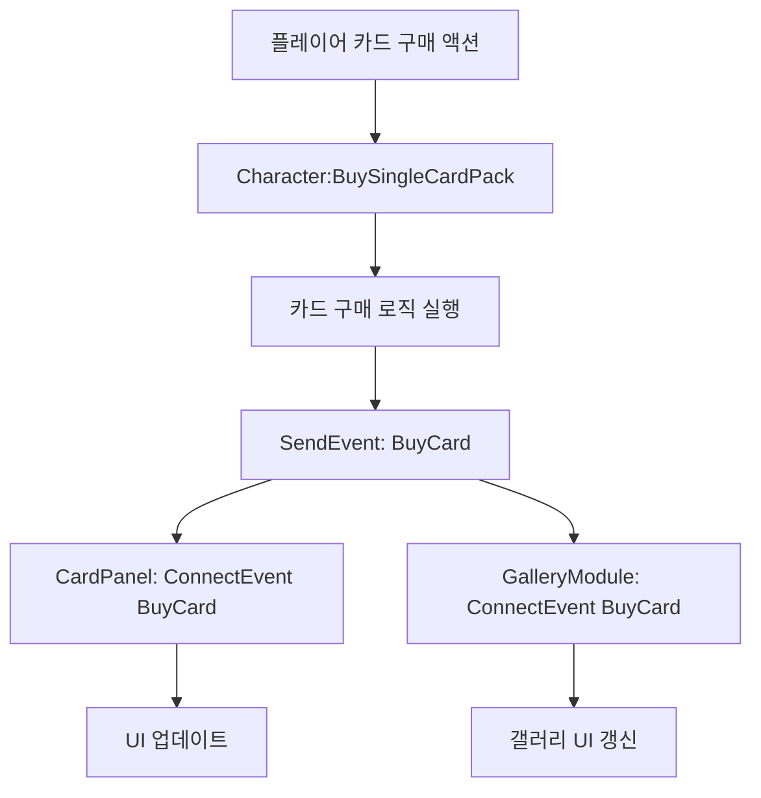
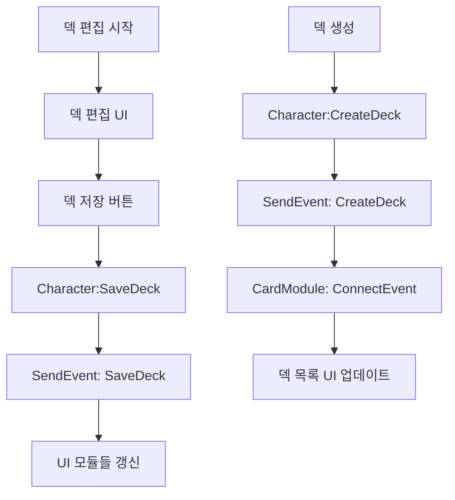

# 게임 이벤트 시스템

## 개요

메이플 듀얼의 게임 이벤트 시스템은 게임 내 다양한 액션과 상태 변화를 처리하기 위한 이벤트 기반 아키텍처를 제공합니다. 카드 구매/판매, 덱 관리, 경제 시스템, 플레이어 상태 변화 등 모든 주요 게임 플레이 요소들이 이벤트를 통해 통신합니다.

## 이벤트 시스템 구조

### 이벤트 타입 정의

모든 게임 이벤트는 `RootDesk/MyDesk/Events/` 폴더에서 `EventType`을 확장하여 정의됩니다.

**기본 구조:**
```lua
@Event
script [EventName] extends EventType

    property [dataType] [propertyName] = [defaultValue]  -- 선택적

end
```

### 이벤트 팩토리 (Event.mlua)

`Event.mlua`는 이벤트 인스턴스 생성과 데이터 설정을 담당하는 팩토리 클래스입니다.

```lua
@Logic
script Event extends Logic

method BuyCard BuyCard(table info)
    local event = BuyCard()
    event.info = info
    return event
end

method SellCard SellCard(table info)
    local event = SellCard()
    event.info = info
    return event
end
```

## 주요 게임 이벤트

### 카드 관련 이벤트

#### BuyCard
카드 구매 시 발생하는 이벤트입니다.

**구조:**
- `RootDesk/MyDesk/Events/BuyCard.mlua`
- `property table info = {}`

**사용 예시:**
```lua
-- 이벤트 발생 (Character.mlua)
local info = {
    cardName = cardName,
    skinIndex = skinIndex,
    index = index
}
self.Entity:SendEvent(_Event:BuyCard(info))

-- 이벤트 수신 (CardPanel.mlua)
character.Entity:ConnectEvent(BuyCard, function(event)
    local info = event.info
    -- 카드 구매 처리 로직
end)
```

#### SellCard
카드 판매 시 발생하는 이벤트입니다.

**구조:**
- `RootDesk/MyDesk/Events/SellCard.mlua`
- `property table info = {}`

**사용 예시:**
```lua
-- 이벤트 발생
self.Entity:SendEvent(_Event:SellCard(info))

-- 이벤트 수신
character.Entity:ConnectEvent(SellCard, function(event)
    -- 카드 판매 처리 로직
end)
```

### 덱 관리 이벤트

#### CreateDeck
새로운 덱 생성 시 발생하는 이벤트입니다.

**구조:**
- `RootDesk/MyDesk/Events/CreateDeck.mlua`
- 추가 속성 없음

**사용 예시:**
```lua
-- 이벤트 발생 (Character.mlua)
self.Entity:SendEvent(CreateDeck())

-- 이벤트 수신 (CardModule.mlua)
character.Entity:ConnectEvent(CreateDeck, function()
    -- 덱 생성 UI 업데이트
end)
```

#### SaveDeck
덱 저장 시 발생하는 이벤트입니다.

**구조:**
- `RootDesk/MyDesk/Events/SaveDeck.mlua`
- 추가 속성 없음

**사용 예시:**
```lua
-- Character.mlua에서 발생
self.Entity:SendEvent(SaveDeck())
```

#### DeleteDeck
덱 삭제 시 발생하는 이벤트입니다.

**구조:**
- `RootDesk/MyDesk/Events/DeleteDeck.mlua`
- 추가 속성 없음

**사용 예시:**
```lua
-- Character.mlua에서 발생
self.Entity:SendEvent(DeleteDeck())
```

#### FinishDeck
덱 편집 완료 시 발생하는 이벤트입니다.

**구조:**
- `RootDesk/MyDesk/Events/FinishDeck.mlua`
- 추가 속성 없음

**사용 예시:**
```lua
-- Character.mlua에서 발생
self.Entity:SendEvent(FinishDeck())
```

### 플레이어 상태 이벤트

#### SetMeso
플레이어 메소 변경 시 발생하는 이벤트입니다.

**구조:**
- `RootDesk/MyDesk/Events/SetMeso.mlua`
- 추가 속성 없음

#### SetRank
플레이어 랭크 변경 시 발생하는 이벤트입니다.

**구조:**
- `RootDesk/MyDesk/Events/SetRank.mlua`
- 추가 속성 없음

#### SetDeckIndex
현재 선택된 덱 인덱스 변경 시 발생하는 이벤트입니다.

**구조:**
- `RootDesk/MyDesk/Events/SetDeckIndex.mlua`
- 추가 속성 없음

#### SetCardBack
카드백 변경 시 발생하는 이벤트입니다.

**구조:**
- `RootDesk/MyDesk/Events/SetCardBack.mlua`
- 추가 속성 없음

### 특별 이벤트

#### SetOpenEventCardPackCount
오픈 이벤트 카드팩 수량 설정 이벤트입니다.

**구조:**
- `RootDesk/MyDesk/Events/SetOpenEventCardPackCount.mlua`
- 추가 속성 없음

## 소셜 관련 이벤트

### GetFriends
친구 목록 조회 결과 전달 이벤트입니다.

**구조:**
- `RootDesk/MyDesk/Events/GetFriends.mlua`
- 추가 속성 없음 (Event.mlua에서 데이터 설정)

**사용 예시:**
```lua
-- Map.mlua에서 발생
self.Entity:SendEvent(_Event:GetFriends(userIdArray, friendArray))
```

### Unfriend
친구 관계 해제 이벤트입니다.

**구조:**
- `RootDesk/MyDesk/Events/Unfriend.mlua`
- 추가 속성 없음 (Event.mlua에서 userId 설정)

**사용 예시:**
```lua
-- Character.mlua에서 발생
self.Entity:SendEvent(_Event:Unfriend(userId))
```

### GetChannels
채널 목록 조회 결과 전달 이벤트입니다.

**구조:**
- `RootDesk/MyDesk/Events/GetChannels.mlua`
- 추가 속성 없음 (Event.mlua에서 channelArray 설정)

**사용 예시:**
```lua
-- Home.mlua에서 발생
self.Entity:SendEvent(_Event:GetChannels(channelArray))
```

### GetFriendlyMatchRooms
친선전 방 목록 조회 결과 전달 이벤트입니다.

**구조:**
- `RootDesk/MyDesk/Events/GetFriendlyMatchRooms.mlua`
- 추가 속성 없음 (Event.mlua에서 roomArray 설정)

### SetRoom
현재 방 설정 이벤트입니다.

**구조:**
- `RootDesk/MyDesk/Events/SetRoom.mlua`
- 추가 속성 없음 (Event.mlua에서 room 설정)

## 특수 이벤트

### Coroutine
코루틴 관련 이벤트입니다.

**구조:**
- `RootDesk/MyDesk/Events/Coroutine.mlua`
- 추가 속성 없음

## 이벤트 사용 패턴

### 이벤트 발생

```lua
-- 단순 이벤트 (데이터 없음)
self.Entity:SendEvent(CreateDeck())

-- 팩토리를 통한 이벤트 (데이터 포함)
self.Entity:SendEvent(_Event:BuyCard(cardInfo))
```

### 이벤트 수신

```lua
-- 기본 패턴
character.Entity:ConnectEvent(EventType, function(event)
    -- event.property를 통해 데이터 접근
    local data = event.info
    -- 처리 로직
end)

-- 데이터가 없는 단순 이벤트
character.Entity:ConnectEvent(CreateDeck, function()
    -- 처리 로직
end)
```

## 이벤트 플로우

### 카드 구매 플로우



### 덱 관리 플로우



## 코드 참조

### 이벤트 정의 파일들
- `RootDesk/MyDesk/Events/BuyCard.mlua` — 카드 구매 이벤트
- `RootDesk/MyDesk/Events/SellCard.mlua` — 카드 판매 이벤트
- `RootDesk/MyDesk/Events/CreateDeck.mlua` — 덱 생성 이벤트
- `RootDesk/MyDesk/Events/DeleteDeck.mlua` — 덱 삭제 이벤트
- `RootDesk/MyDesk/Events/SaveDeck.mlua` — 덱 저장 이벤트
- `RootDesk/MyDesk/Events/FinishDeck.mlua` — 덱 편집 완료 이벤트

### 팩토리 및 사용처
- `RootDesk/MyDesk/Logics/Event.mlua` — 이벤트 팩토리 클래스
- `RootDesk/MyDesk/Components/Character.mlua` — 주요 게임 이벤트 발생원
- `RootDesk/MyDesk/Components/UIs/CardPanel.mlua` — 카드 관련 이벤트 수신
- `RootDesk/MyDesk/Components/UIs/CardModule.mlua` — 덱 관련 이벤트 수신
- `RootDesk/MyDesk/Components/Managers/GalleryModule.mlua` — 카드 갤러리 이벤트 수신

## 이벤트 시스템의 특징

### 장점
1. **느슨한 결합**: 컴포넌트 간 직접적인 의존성 없이 통신
2. **확장성**: 새로운 이벤트 리스너를 쉽게 추가
3. **일관성**: 모든 게임 액션이 동일한 패턴으로 처리
4. **디버깅**: 이벤트 플로우를 통한 명확한 상태 추적

### 주의사항
1. **타이밍**: 이벤트 발생과 수신 순서 고려 필요
2. **메모리**: 이벤트 리스너 해제로 메모리 누수 방지
3. **데이터**: 이벤트 데이터의 생명주기 관리

이 이벤트 시스템은 메이플 듀얼의 모든 게임 플레이 요소들을 유기적으로 연결하여, 확장 가능하고 유지보수가 용이한 게임 아키텍처를 구성하는 핵심 기반입니다.
