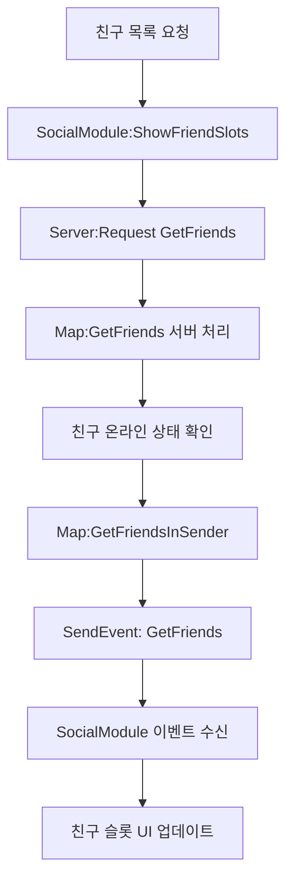
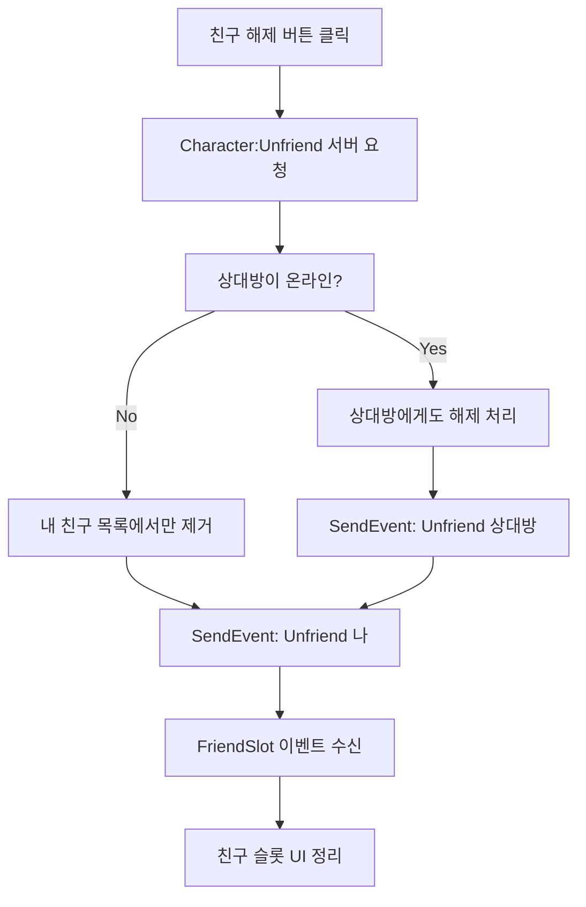
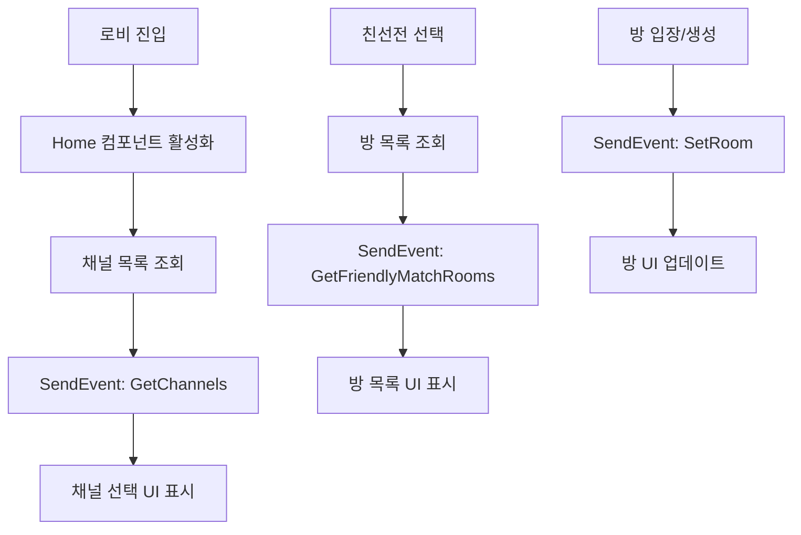

# 소셜 이벤트 시스템

## 개요

메이플 듀얼의 소셜 이벤트 시스템은 친구 관리, 채팅, 채널/방 관리 등 플레이어 간 상호작용과 커뮤니티 기능을 지원하는 이벤트들을 처리합니다. 이러한 이벤트들은 실시간 소셜 상태 업데이트와 사용자 간 연결을 담당합니다.

## 주요 소셜 이벤트

### 친구 시스템 이벤트

#### GetFriends
친구 목록 조회 결과를 전달하는 이벤트입니다.

**구조:**
- `RootDesk/MyDesk/Events/GetFriends.mlua`
- EventType 확장, 추가 속성 없음
- Event.mlua에서 데이터 설정

**팩토리 메서드:**
```lua
method GetFriends GetFriends(table userIdArray, table friendArray)
    local event = GetFriends()
    event.userIdArray = userIdArray
    event.friendArray = friendArray
    return event
end
```

**사용 예시:**
```lua
-- Map.mlua에서 친구 정보 조회 후 결과 전송
@ExecSpace("Client")
method void GetFriendsInSender(table userIdArray, table friendArray)
    local character = _UserService.LocalPlayer.Character
    for i, friend in ipairs(friendArray) do
        local userId = userIdArray[i]
        if not _Table:IsEmpty(friend) and friend.nickname ~= character.friendTable[userId].nickname then
            character.friendTable[userId].nickname = friend.nickname
        end
    end
    
    self.Entity:SendEvent(_Event:GetFriends(userIdArray, friendArray))
end
```

**데이터 구조:**
- `userIdArray`: 조회한 사용자 ID 배열
- `friendArray`: 각 사용자의 친구 정보 배열 (온라인/오프라인 상태 포함)

#### Unfriend
친구 관계 해제 시 발생하는 이벤트입니다.

**구조:**
- `RootDesk/MyDesk/Events/Unfriend.mlua`
- EventType 확장, 추가 속성 없음
- Event.mlua에서 userId 설정

**팩토리 메서드:**
```lua
method Unfriend Unfriend(string userId)
    local event = Unfriend()
    event.userId = userId
    return event
end
```

**사용 예시:**
```lua
-- Character.mlua에서 친구 해제 처리
@ExecSpace("Client")
method void UnfriendInOther()
    local other = _UserService.LocalPlayer.Character
    other.friendTable[self.Entity.Name] = nil
    
    other.Entity:SendEvent(_Event:Unfriend(self.Entity.Name))
end

@ExecSpace("Client")
method void UnfriendInOwner(string userId)
    self.friendTable[userId] = nil
    self.uiManager.InteractionModule:Close()
    
    self.Entity:SendEvent(_Event:Unfriend(userId))
end
```

**이벤트 수신:**
```lua
-- FriendSlot.mlua에서 친구 해제 이벤트 처리
character.Entity:ConnectEvent(Unfriend, function(event)
    local userId = event.userId
    
    if self.userId == userId then
        self:Clear()  -- 친구 슬롯 정리
    end
end)
```

### 채널 시스템 이벤트

#### GetChannels
채널 목록 조회 결과를 전달하는 이벤트입니다.

**구조:**
- `RootDesk/MyDesk/Events/GetChannels.mlua`
- EventType 확장, 추가 속성 없음
- Event.mlua에서 channelArray 설정

**팩토리 메서드:**
```lua
method GetChannels GetChannels(table channelArray)
    local event = GetChannels()
    event.channelArray = channelArray
    return event
end
```

**사용 예시:**
```lua
-- Home.mlua에서 채널 정보 전송
self.Entity:SendEvent(_Event:GetChannels(channelArray))
```

**데이터 구조:**
- `channelArray`: 사용 가능한 채널 정보 배열
  - 각 채널에는 id, 사용자 수, 상태 등의 정보 포함

### 방 시스템 이벤트

#### GetFriendlyMatchRooms
친선전 방 목록 조회 결과를 전달하는 이벤트입니다.

**구조:**
- `RootDesk/MyDesk/Events/GetFriendlyMatchRooms.mlua`
- EventType 확장, 추가 속성 없음
- Event.mlua에서 roomArray 설정

**팩토리 메서드:**
```lua
method GetFriendlyMatchRooms GetFriendlyMatchRooms(table roomArray)
    local event = GetFriendlyMatchRooms()
    event.roomArray = roomArray
    return event
end
```

**데이터 구조:**
- `roomArray`: 친선전 방 정보 배열
  - 방 ID, 방 이름, 현재 인원, 최대 인원, 방장 정보 등

#### SetRoom
현재 방 설정 변경 이벤트입니다.

**구조:**
- `RootDesk/MyDesk/Events/SetRoom.mlua`
- EventType 확장, 추가 속성 없음
- Event.mlua에서 room 데이터 설정

**팩토리 메서드:**
```lua
method SetRoom SetRoom(table room)
    local event = SetRoom()
    event.room = room
    return event
end
```

**데이터 구조:**
- `room`: 방 정보 객체
  - 방 설정, 참가자 목록, 게임 모드 등

## 소셜 이벤트 플로우

### 친구 목록 조회 플로우



### 친구 해제 플로우



### 채널/방 관리 플로우



## 실시간 상태 업데이트

### 친구 온라인 상태 갱신

```lua
-- SocialModule.mlua - 5초마다 친구 상태 갱신
self.refreshTimer = _TimerService:SetTimerRepeat(function()
    self:ShowFriendSlots(self.pageIndex)
end, 5)
```

### 친구 정보 동기화

```lua
-- Map.mlua - 친구 정보 변경 시 실시간 동기화
for i, friend in ipairs(friendArray) do
    local userId = userIdArray[i]
    if not _Table:IsEmpty(friend) and friend.nickname ~= character.friendTable[userId].nickname then
        character.friendTable[userId].nickname = friend.nickname
    end
end
```

## 이벤트 데이터 상세

### 친구 정보 구조
```lua
friend = {
    nickname = "플레이어이름",
    profileCode = "1234", 
    majorRank = "Gold",
    location = {
        mode = "Lobby" | "RankedMatch" | "FriendlyMatch" | "Practice" | "Tutorial",
        channel = { id = 1 },
        room = { channel = { id = 1 }, id = 1 }
    }
}
```

### 채널 정보 구조
```lua
channel = {
    id = 1,
    userCount = 15,
    maxUsers = 50,
    status = "active" | "maintenance"
}
```

### 방 정보 구조
```lua
room = {
    id = 1,
    name = "친선전방",
    hostId = "user123",
    currentPlayers = 1,
    maxPlayers = 2,
    gameMode = "FriendlyMatch",
    isPrivate = false,
    channel = { id = 1 }
}
```

## 코드 참조

### 이벤트 정의
- `RootDesk/MyDesk/Events/GetFriends.mlua` — 친구 목록 조회 결과 이벤트
- `RootDesk/MyDesk/Events/Unfriend.mlua` — 친구 해제 이벤트
- `RootDesk/MyDesk/Events/GetChannels.mlua` — 채널 목록 조회 결과 이벤트
- `RootDesk/MyDesk/Events/GetFriendlyMatchRooms.mlua` — 친선전 방 목록 조회 결과 이벤트
- `RootDesk/MyDesk/Events/SetRoom.mlua` — 방 설정 변경 이벤트

### 이벤트 발생 및 처리
- `RootDesk/MyDesk/Logics/Event.mlua` — 소셜 이벤트 팩토리 메서드들
- `RootDesk/MyDesk/Components/Map.mlua` — GetFriends 이벤트 발생
- `RootDesk/MyDesk/Components/Character.mlua` — Unfriend 이벤트 발생 및 처리
- `RootDesk/MyDesk/Components/Home.mlua` — GetChannels 이벤트 발생
- `RootDesk/MyDesk/Components/UIs/SocialModule.mlua` — 친구 관련 이벤트 수신
- `RootDesk/MyDesk/Components/UIs/FriendSlot.mlua` — Unfriend 이벤트 수신

## 소셜 이벤트 시스템의 특징

### 실시간성
- 친구 온라인 상태 실시간 갱신 (5초 간격)
- 즉각적인 친구 관계 변경 반영
- 채널/방 상태 동적 업데이트

### 양방향 동기화
- 친구 관계는 양방향으로 동기화
- 한 쪽에서 친구 해제 시 상대방에게도 자동 반영
- 온라인 상태 변경 시 모든 친구에게 전파

### UI 반응성
- 이벤트 기반으로 UI 즉시 업데이트
- 네트워크 지연과 무관한 로컬 상태 관리
- 서버 응답 후 최종 상태 동기화

### 확장성
- 새로운 소셜 기능 추가 시 이벤트만 확장
- 기존 컴포넌트에 영향 없는 독립적 처리
- 다양한 UI 컴포넌트에서 동일 이벤트 수신 가능

이 소셜 이벤트 시스템은 메이플 듀얼의 커뮤니티 기능을 뒷받침하여, 플레이어들이 서로 소통하고 함께 게임을 즐길 수 있는 환경을 제공합니다.
