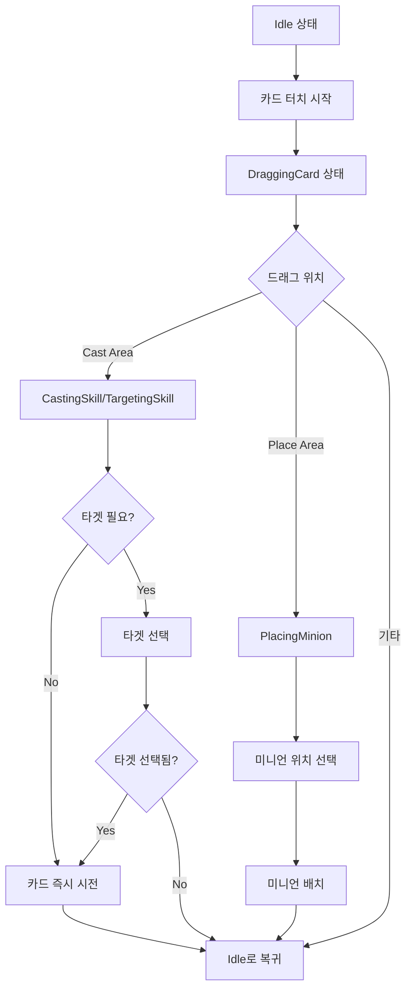
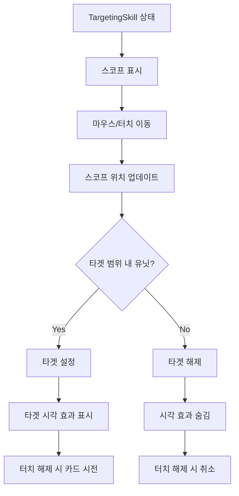

# 입력 처리 시스템

## 개요

메이플 듀얼의 입력 처리 시스템은 `Input.mlua`를 통해 터치/마우스 이벤트를 받아 카드 드래그 앤 드롭, 타겟팅, 미니언 배치 등의 복잡한 게임 상호작용을 관리합니다. 상태 기반 아키텍처로 설계되어 다양한 입력 시나리오를 일관성 있게 처리합니다.

## 핵심 입력 시스템

### Input.mlua
모든 게임 입력을 중앙에서 관리하는 컴포넌트입니다.

**주요 속성:**
```lua
@Component
script Input extends Component

    // 매니저 의존성
    property DeckManager deckManager = nil
    property ResourceManager resourceManager = nil
    property UIManager uiManager = nil
    property Duel duel = nil
    property CommandManager commandManager = nil
    
    // 영역 엔티티들
    property Entity castAreaEntity = nil      -- 스킬 시전 영역
    property Entity placeAreaEntity = nil     -- 미니언 배치 영역
    property Entity putAreaEntity = nil       -- 덱 편집 카드 추가 영역
    property Entity eraseAreaEntity = nil     -- 카드/썸네일 삭제 영역
    property Entity scopeEntity = nil         -- 타겟팅 범위 엔티티
    property Entity lineEntity = nil          -- 타겟팅 라인 엔티티
    
    // 상태 관리
    property string state = "Idle"            -- 현재 입력 상태
    
    // 현재 터치/드래그 중인 객체들
    property Card touchingCard = nil          -- 터치 중인 카드
    property Minion touchingMinion = nil      -- 터치 중인 미니언
    property Thumbnail touchingThumbnail = nil -- 터치 중인 썸네일
    
    // 현재 작업 중인 객체들
    property Card card = nil                  -- 드래그 중인 카드
    property Unit target = nil                -- 타겟팅 중인 유닛
    property Thumbnail thumbnail = nil        -- 작업 중인 썸네일
end
```

## 상태 기반 입력 관리

### 입력 상태 정의

**기본 상태:**
- **"Idle"** - 대기 상태 (아무것도 하지 않음)

**카드 관련 상태:**
- **"DraggingCard"** - 카드 드래그 중
- **"CastingSkill"** - 스킬 카드 시전 중 (타겟 불필요)
- **"TargetingSkill"** - 스킬 타겟 선택 중 (타겟 필요)
- **"PlacingMinion"** - 미니언 카드 배치 중

**덱 편집 상태:**
- **"PuttingCard"** - 카드 덱에 추가 중
- **"PuttingThumbnail"** - 썸네일 덱에 배치 중
- **"ErasingThumbnail"** - 썸네일 삭제 중
- **"ErasingCard"** - 카드 삭제 중

### 상태 전환 시스템

```lua
method void SetState(string toState)
    if self.state == toState then
        return  // 동일한 상태면 무시
    end
    
    local fromState = self.state
    self.state = toState
    
    // 상태별 전환 로직 처리
    // ... (다양한 fromState -> toState 조합 처리)
end
```

## 터치 이벤트 처리

### 터치 시작 (ScreenTouchPressEvent)

```lua
@EventSender("Service", "InputService")
handler HandleScreenTouchPressEvent(ScreenTouchPressEvent event)
    local TouchId = event.TouchId
    local TouchPoint = event.TouchPoint
    
    local worldPosition = _UILogic:ScreenToWorldPosition(TouchPoint)
    
    // 터치된 객체들 식별
    if isvalid(self.touchingCard) and self.touchingCard:IsInTouchArea(worldPosition) then
        // 카드 터치 처리
        if self.touchingCard.isDisplayable then
            _SoundService:PlaySound(pickCardSound, 1)
            self:SetState("DraggingCard")
        end
    end
    
    if isvalid(self.touchingThumbnail) then
        // 썸네일 터치 처리
        if cardModule.isDeckEditMode and not self.touchingThumbnail:IsInTouchArea(worldPosition) then
            _SoundService:PlaySound(pickCardSound, 1)
            self:SetState("ErasingThumbnail")
        end
    end
end
```

### 터치 이동 (ScreenTouchEvent)

```lua
@EventSender("Service", "InputService") 
handler HandleScreenTouchEvent(ScreenTouchEvent event)
    local TouchId = event.TouchId
    local TouchPoint = event.TouchPoint
    local worldPosition = _UILogic:ScreenToWorldPosition(TouchPoint)
    
    local state = self.state
    
    // 상태별 드래그 처리
    if state == "DraggingCard" or state == "CastingSkill" or state == "PlacingMinion" 
       or state == "PuttingCard" or state == "PuttingThumbnail" then
        // 카드/썸네일 위치 업데이트
        local transform = self.card.actor.Entity.TransformComponent
        transform.WorldPosition.x = worldPosition.x
        transform.WorldPosition.y = worldPosition.y
        transform.WorldZRotation = 0
        self.card:PlaceFront()
    end
    
    if state == "TargetingSkill" then
        // 타겟팅 스코프 위치 업데이트
        self:PlaceScope(worldPosition)
    end
    
    if state == "PlacingMinion" then
        // 미니언 배치 위치 업데이트
        local minion = self.duel.placingMinion
        local transform = minion.actor.Entity.TransformComponent
        transform.WorldPosition.x = worldPosition.x
        transform.WorldPosition.y = worldPosition.y
        minion:PlaceFront()
        
        // 필드 내 배치 위치 계산
        local field = self.card.player.field
        field:InsertPlacingMinon(worldPosition.x)
    end
end
```

### 터치 해제 (ScreenTouchReleaseEvent)

```lua
@EventSender("Service", "InputService")
handler HandleScreenTouchReleaseEvent(ScreenTouchReleaseEvent event)
    local TouchId = event.TouchId
    local TouchPoint = event.TouchPoint
    local worldPosition = _UILogic:ScreenToWorldPosition(TouchPoint)
    local state = self.state
    
    // 카드 클릭 처리 (갤러리 모드)
    if isvalid(self.touchingCard) and self.touchingCard:IsInTouchArea(worldPosition) then
        if self.uiManager.GalleryModule.isOpen then
            if self.touchingCard.isFront then
                self.uiManager.GalleryModule:SelectNext()
            end
        end
    end
    
    // 상태별 완료 처리
    if state == "CastingSkill" then
        self:PlayCard()
        self:SetState("Idle")
    elseif state == "TargetingSkill" then
        if isvalid(self.target) then
            self:PlayCard()
            self:SetState("Idle")
        end
    elseif state == "PlacingMinion" then
        self:PlayCard()
        self:SetState("Idle")
    end
    
    // 기타 상태들도 Idle로 복귀
    if state ~= "Idle" then
        self:SetState("Idle")
    end
end
```

## 영역 기반 상호작용

### 트리거 영역 시스템

**Cast Area (스킬 시전 영역):**
```lua
self.castAreaEntity:ConnectEvent(TriggerEnterEvent, function(event)
    local TriggerBodyEntity = event.TriggerBodyEntity
    
    if self.state == "DraggingCard" and TriggerBodyEntity == self.card.actor.Entity then
        if self.card.isPlayable and self.card.category == "Skill" then
            if self.card.requiresTarget then
                self:SetState("TargetingSkill")
            else
                self:SetState("CastingSkill")
            end
        else
            self:SetState("Idle")
            self.touchingCard = nil
        end
    end
end)
```

**Place Area (미니언 배치 영역):**
```lua
self.placeAreaEntity:ConnectEvent(TriggerEnterEvent, function(event)
    local TriggerBodyEntity = event.TriggerBodyEntity
    
    if self.state == "DraggingCard" and TriggerBodyEntity == self.card.actor.Entity then
        if self.card.isPlayable then
            local field = self.card.player.field
            if self.card.category == "Minion" and not field:IsFull() and field.isPlaceable then
                self:SetState("PlacingMinion")
            end
        else
            self:SetState("Idle")
            self.touchingCard = nil
        end
    end
end)
```

**Scope Area (타겟팅 범위):**
```lua
self.scopeEntity:ConnectEvent(TriggerEnterEvent, function(event)
    local TriggerBodyEntity = event.TriggerBodyEntity
    
    local unit = TriggerBodyEntity.UnitBody and TriggerBodyEntity.UnitBody.object
    if self.state == "TargetingSkill" and isvalid(unit) and 
       unit.signState == "Targetable" and not isvalid(self.target) then
        self:SetTarget(unit)
    end
end)
```

## 상태별 전환 로직

### Idle → DraggingCard

```lua
if fromState == "Idle" and toState == "DraggingCard" then
    self.card = self.touchingCard
    self.card:DestroyTweener()  // 기존 애니메이션 정리
    self.card.actor.Entity:AttachTo(self.card.hand.Entity)  // 손패에 부착
    self.card:SetDisplayTimer(0.25)  // 표시 타이머 설정
end
```

### DraggingCard → TargetingSkill

```lua
if fromState == "DraggingCard" and toState == "TargetingSkill" then
    self.commandManager:SetTargetableSigns(self.card)  // 타겟 가능한 유닛 표시
    self.card:TransformToTarget()  // 카드를 타겟팅 모드로 변환
end
```

### DraggingCard → PlacingMinion

```lua
if fromState == "DraggingCard" and toState == "PlacingMinion" then
    self.card.actor.Entity.Visible = false  // 원본 카드 숨김
    self.card.touchAreaEntity.Enable = false  // 터치 비활성화
    self.duel.placingMinion:SetBlueprint(self.card:GetMinionBlueprint())  // 미니언 프리뷰 설정
end
```

### 게임플레이 상태 → Idle

```lua
if (fromState == "CastingSkill" or fromState == "TargetingSkill" or fromState == "PlacingMinion") 
   and toState == "Idle" then
    self.card:AttachToAnchor()  // 앵커에 재부착
    self.card:TransformToAnchor()  // 원래 위치로 애니메이션 복귀
    self.card.isDisplayable = true  // 표시 가능 상태로 복원
    self.card = nil  // 참조 정리
end
```

## 시각적 피드백 시스템

### 타겟팅 시각 효과

```lua
method void PlaceScope(Vector2 worldPosition)
    // 타겟팅 스코프 위치 설정
    local scopeTransform = self.scopeEntity.TransformComponent
    scopeTransform.WorldPosition.x = worldPosition.x
    scopeTransform.WorldPosition.y = worldPosition.y
end

method void ShowScope()
    self.scopeEntity.Enable = true
end

method void HideScope() 
    self.scopeEntity.Enable = false
end
```

### 타겟 설정 및 해제

```lua
method void SetTarget(Unit target)
    if self.target == target then return end
    
    if isvalid(self.target) then
        self.target:SetSign("Targetable")  // 이전 타겟 표시 해제
    end
    
    self.target = target
    
    if isvalid(self.target) then
        self.target:SetSign("Targeted")  // 새 타겟 표시
        self:ShowScope()
        self:ShowLine()
    else
        self:HideScope()
        self:HideLine()
    end
end
```

## 카드 플레이 실행

### 카드 플레이 명령

```lua
method void PlayCard()
    if not isvalid(self.card) then return end
    
    if self.card.category == "Skill" and self.card.requiresTarget then
        if isvalid(self.target) then
            // 타겟이 있는 스킬 실행
            self.commandManager:RunCommand("PlayCard", 
                {self.card, self.target}, {})
        end
    else
        // 일반 카드 또는 타겟이 없는 스킬 실행
        self.commandManager:RunCommand("PlayCard", 
            {self.card}, {})
    end
end
```

## 입력 상태 플로우

### 카드 드래그 앤 드롭 플로우



### 타겟팅 시스템 플로우



## 코드 참조

### 핵심 컴포넌트
- `RootDesk/MyDesk/Components/Input.mlua` — 입력 처리 메인 시스템

### 연동 시스템
- `RootDesk/MyDesk/Components/Managers/CommandManager.mlua` — 카드 플레이 명령 처리
- `RootDesk/MyDesk/Components/Objects/Card.mlua` — 카드 상호작용 지원
- `RootDesk/MyDesk/Components/Helpers/Thumbnail.mlua` — 썸네일 터치 영역 계산
- `RootDesk/MyDesk/Components/Managers/UIManager.mlua` — UI 상태 연동

### 주요 메서드
- `Input:SetState()` — 입력 상태 전환 관리
- `Input:PlayCard()` — 카드 플레이 실행
- `Input:SetTarget()` — 타겟 설정 및 시각 효과
- `Input:PlaceScope()` — 타겟팅 스코프 위치 설정

## 입력 처리 시스템의 특징

### 상태 기반 관리
- 명확한 상태 정의로 입력 모드 구분
- 상태 전환 시 자동으로 적절한 UI 업데이트
- 복잡한 드래그 앤 드롭 시나리오를 일관성 있게 처리

### 영역 기반 상호작용
- 트리거 영역으로 직관적인 상호작용 제공
- 카드 종류에 따른 자동 상태 전환
- 시각적 피드백과 연동된 영역 감지

### 멀티모달 지원
- 터치와 마우스 이벤트 통합 처리
- 모바일과 데스크톱 환경 모두 지원
- 일관된 사용자 경험 제공

### 성능 최적화
- 불필요한 상태 전환 방지
- 효율적인 터치 영역 계산
- 메모리 누수 방지를 위한 참조 정리

이 입력 처리 시스템은 메이플 듀얼의 복잡한 카드 게임 상호작용을 직관적이고 반응성 높게 처리하여, 플레이어에게 만족스러운 조작감을 제공하는 핵심 시스템입니다.
