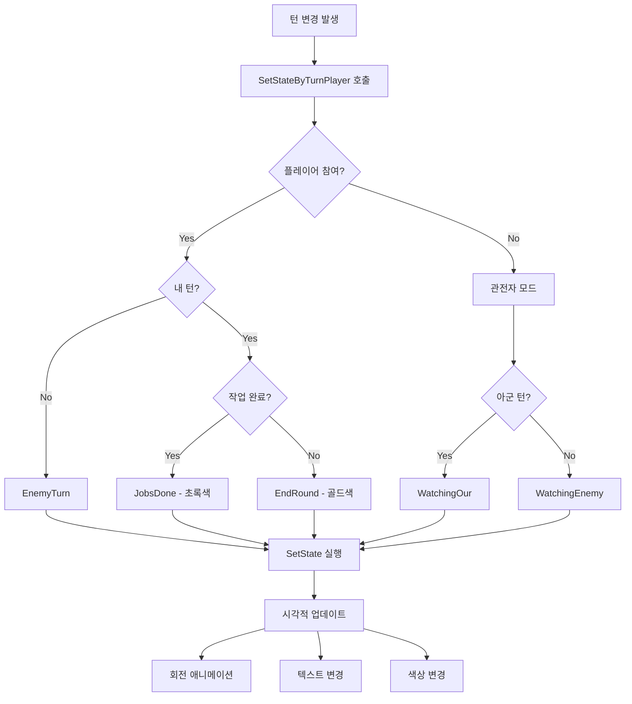
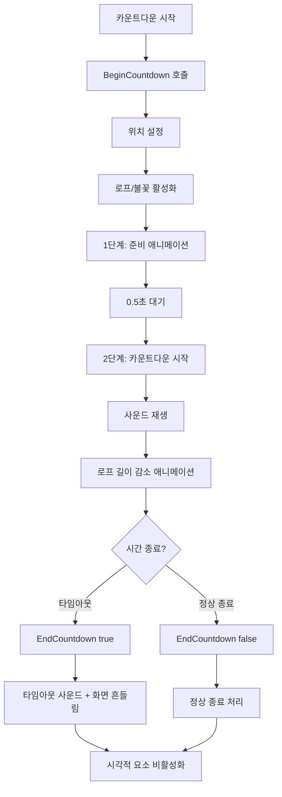
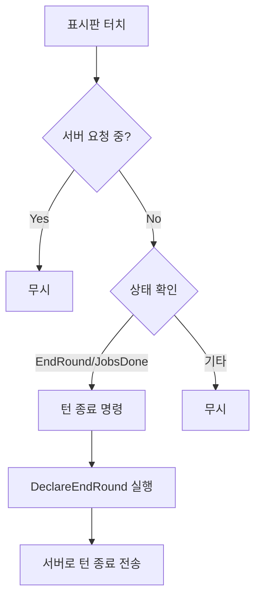

# 턴 시스템 UI

## 개요

메이플 듀얼의 턴 시스템 UI는 `TurnSign.mlua`를 통해 현재 게임 턴 상태를 시각적으로 표시하고 플레이어와의 상호작용을 관리합니다. 턴 표시판, 카운트다운 타이머, 터치 상호작용을 통해 턴제 게임의 진행 상황을 명확하게 전달합니다.

## 핵심 턴 표시 시스템

### TurnSign.mlua
턴 상태 표시와 상호작용을 담당하는 UI 컴포넌트입니다.

**주요 속성:**
```lua
@Component
script TurnSign extends Component

    // 매니저 의존성
    property ResourceManager resourceManager = nil
    property Duel duel = nil
    property CommandManager commandManager = nil
    
    // UI 엔티티들
    property Entity signEntity = nil         -- 표시판 엔티티
    property Entity imageEntity = nil        -- 배경 이미지
    property Entity jobsDoneEntity = nil     -- 작업 완료 표시
    property Entity textEntity = nil         -- 텍스트 엔티티
    property TextComponent textComponent = nil -- 텍스트 컴포넌트
    
    // 카운트다운 시스템
    property ClimbableSpriteRendererComponent rope = nil -- 로프 시각화
    property TransformComponent spark = nil              -- 불꽃 효과
    
    // 애니메이션 관리
    property any signTweener = nil           -- 표시판 애니메이션
    property any textTweener = nil           -- 텍스트 애니메이션
    property any countdownTweener = nil      -- 카운트다운 애니메이션
    property any countdownTimer = nil        -- 카운트다운 타이머
    
    // 상태 관리
    property string state = "Idle"           -- 현재 턴 상태
end
```

## 턴 상태 시스템

### 턴 상태 정의

**기본 상태:**
- **"Idle"** - 대기 상태 (기본)

**플레이어 턴 상태:**
- **"EndRound"** - 내 턴, 라운드 종료 가능
- **"JobsDone"** - 내 턴, 모든 작업 완료 (초록색)

**상대방 턴 상태:**
- **"EnemyTurn"** - 상대방 턴

**관전 상태:**
- **"WatchingOur"** - 아군 관전 중
- **"WatchingEnemy"** - 적군 관전 중

**게임 진행 상태:**
- **"Waiting"** - 대기 중
- **"Battle"** - 전투 중

### 상태별 시각적 설정

```lua
method void SetState(string toState)
    if self.state == toState then return end
    
    local fromState = self.state
    self.state = toState
    
    local zRotation, text, color, jobsDone
    
    if toState == "Idle" then
        zRotation = 0
        text = ""
        color = Color.FromHexCode("#DEA214")  -- 골드
        jobsDone = false
    elseif toState == "EndRound" then
        zRotation = 15   -- 오른쪽 기울임
        text = "EndRound"
        color = Color.FromHexCode("#DEA214")  -- 골드
        jobsDone = false
    elseif toState == "JobsDone" then
        zRotation = 15   -- 오른쪽 기울임
        text = "EndRound"
        color = Color.FromHexCode("#2CB571")  -- 초록 (완료 상태)
        jobsDone = true
    elseif toState == "EnemyTurn" then
        zRotation = -15  -- 왼쪽 기울임
        text = "EnemyTurn"
        color = Color.FromHexCode("#9B9B9A")  -- 회색
        jobsDone = false
    elseif toState == "WatchingOur" then
        zRotation = 15   -- 오른쪽 기울임
        text = "Watching"
        color = Color.FromHexCode("#9B9B9A")  -- 회색
    elseif toState == "WatchingEnemy" then
        zRotation = -15  -- 왼쪽 기울임
        text = "Watching"
        color = Color.FromHexCode("#9B9B9A")  -- 회색
    elseif toState == "Waiting" then
        zRotation = 0    -- 중앙 정렬
        text = "Waiting"
        color = Color.FromHexCode("#9B9B9A")  -- 회색
    elseif toState == "Battle" then
        zRotation = 0    -- 중앙 정렬
        text = "Battle"
        color = Color.FromHexCode("#F78427")  -- 주황 (전투 상태)
    end
    
    // 시각적 요소 업데이트
    self:RotateSign(zRotation)
    self:SetText(text)
    self:SetColor(color)
    self.jobsDoneEntity.Enable = jobsDone
end
```

## 플레이어 기반 상태 설정

### 자동 상태 결정

```lua
method void SetStateByTurnPlayer(Player turnPlayer)
    local state
    local player = _UserService.LocalPlayer.Character.player
    
    if isvalid(player) then
        // 플레이어가 게임에 참여 중
        if player == turnPlayer then
            // 내 턴
            if player:JobsDone() then
                state = "JobsDone"      -- 모든 작업 완료
            else
                state = "EndRound"      -- 라운드 종료 가능
            end
        else
            // 상대방 턴
            state = "EnemyTurn"
        end
    else
        // 관전자 모드
        state = turnPlayer.isOurs and "WatchingOur" or "WatchingEnemy"
    end
    
    self:SetState(state)
end
```

**상태 결정 로직:**
1. 현재 플레이어가 게임 참여자인지 확인
2. 턴 플레이어와 비교하여 내 턴/상대 턴 구분
3. 내 턴일 경우 작업 완료 여부에 따라 세부 상태 결정
4. 관전자일 경우 아군/적군 여부로 상태 결정

## 시각적 애니메이션

### 표시판 회전 애니메이션

```lua
method void RotateSign(number zRotation)
    // 기존 애니메이션 정리
    if self.signTweener then
        self.signTweener:Destroy()
    end
    
    // 탄성 이징으로 부드러운 회전
    local currentRotation = self.signEntity.TransformComponent.ZRotation
    self.signTweener = _TweenLogic:RotateTo(
        self.signEntity, 
        zRotation - currentRotation, 
        1,                           -- 1초 지속
        EaseType.ElasticEaseOut     -- 탄성 효과
    )
end
```

### 텍스트 댄핑 효과

```lua
method void SetText(string text)
    self.textComponent.Text = text
    
    // 기존 애니메이션 정리
    if self.textTweener then
        self.textTweener:Destroy()
    end
    
    // 텍스트 변경 시 댄핑 진동 효과
    self.textTweener = _Tween:Damp(
        self.textEntity, 
        Vector2.one,    -- 목표 스케일
        0.75,           -- 진폭
        0.5             -- 지속시간
    )
end
```

### 색상 설정

```lua
method void SetColor(Color color)
    self.imageEntity.SpriteRendererComponent.Color = color
end
```

## 카운트다운 시스템

### 카운트다운 시작

```lua
method void BeginCountdown(number countdownTime, boolean isOurTurn)
    // 위치 조정 (내 턴/상대 턴에 따라)
    local yPositionDelta = isOurTurn and 0 or 0.25
    self.rope.Entity.TransformComponent.Position.y = -0.55 + yPositionDelta
    
    // 시각적 요소 활성화
    self.rope.Entity.Visible = true
    self.spark.Entity.Visible = true
    
    local resource = self.resourceManager:GetResource("Countdown")
    local spareTime = 0.5  // 준비 시간
    
    // 1단계: 준비 단계 애니메이션 (0.5초)
    self.countdownTweener = _TweenLogic:PlayTween(0, 1, spareTime, EaseType.Linear, 
        function(t)
            self:PlaceRope(t, isOurTurn)
        end)
    
    // 2단계: 실제 카운트다운 시작
    self.countdownTimer = _TimerService:SetTimerOnce(function()
        // 카운트다운 사운드 재생
        _SoundService:PlaySound(resource.sound, 1.5)
        
        // 카운트다운 애니메이션 (역방향)
        self.countdownTweener = _TweenLogic:PlayTween(
            countdownTime - spareTime, 0,           -- 시간에서 0으로
            countdownTime - spareTime,              -- 실제 카운트다운 시간
            EaseType.Linear, 
            function(t)
                local value = math.max(0, (t - 1) / (countdownTime - spareTime))
                self:PlaceRope(value, isOurTurn)
            end)
    end, spareTime)
end
```

### 카운트다운 종료

```lua
method void EndCountdown(boolean isTimeout)
    // 애니메이션 정리
    if self.countdownTweener then
        self.countdownTweener:Destroy()
    end
    _TimerService:ClearTimer(self.countdownTimer)
    
    // 시각적 요소 비활성화
    self.rope.Entity.Visible = false
    self.spark.Entity.Visible = false
    
    local resource = self.resourceManager:GetResource("Countdown")
    _SoundService:StopSound(resource.sound)
    
    // 타임아웃 처리
    if isTimeout then
        _SoundService:PlaySound(resource.timeoutSound, 1.5)
        _CameraService:GetCurrentCameraComponent():ShakeCamera(1, 0.5) -- 화면 흔들림
    end
end
```

### 로프 시각화

```lua
method void PlaceRope(number value, boolean isOurTurn)
    local yPositionDelta = isOurTurn and 0 or 0.3
    
    // 로프 길이 조정 (시간에 따라 줄어듦)
    self.rope.TiledSize.y = 0.01 + 3.99 * value
    
    // 불꽃 위치 조정 (로프 끝에 배치)
    self.spark.Position.y = -0.35 - 1.3 * value + yPositionDelta
end
```

**시각화 원리:**
- **로프**: `TiledSize.y`로 길이 조절 (시간이 지날수록 짧아짐)
- **불꽃**: 로프 끝에 위치하여 타이밍 시각화
- **위치 오프셋**: 내 턴/상대 턴에 따른 위치 차별화

## 터치 상호작용

### 턴 종료 터치

```lua
method void OnBeginPlay()
    self.imageEntity:ConnectEvent(TouchEvent, function(event)
        local TouchId = event.TouchId
        local TouchPoint = event.TouchPoint
        
        // 조건 확인
        if not _Server:IsRequesting() and 
           (self.duel.turnSign.state == "EndRound" or self.duel.turnSign.state == "JobsDone") then
            
            local player = _UserService.LocalPlayer.Character.player
            if isvalid(player) then
                // 턴 종료 명령 실행
                self.commandManager:RunCommand("DeclareEndRound", {player, false}, {})
            end
        end
    end)
end
```

**상호작용 조건:**
1. 서버 요청 중이 아닐 것
2. 현재 상태가 "EndRound" 또는 "JobsDone"일 것
3. 유효한 플레이어가 존재할 것

## 턴 시스템 UI 플로우

### 턴 상태 변화 플로우



### 카운트다운 시스템 플로우



### 터치 상호작용 플로우



## 상태별 시각적 특성

### 색상 체계

**골드 (#DEA214):**
- Idle, EndRound 상태
- 기본 활성 상태를 나타냄

**초록 (#2CB571):**
- JobsDone 상태
- 모든 작업 완료 (긍정적)

**회색 (#9B9B9A):**
- EnemyTurn, Watching, Waiting 상태
- 비활성 또는 대기 상태

**주황 (#F78427):**
- Battle 상태
- 전투 진행 중 (긴장감)

### 회전 각도

**중앙 정렬 (0도):**
- Idle, Waiting, Battle

**오른쪽 기울임 (+15도):**
- EndRound, JobsDone, WatchingOur
- 아군 관련 상태

**왼쪽 기울임 (-15도):**
- EnemyTurn, WatchingEnemy  
- 적군 관련 상태

## 코드 참조

### 핵심 컴포넌트
- `RootDesk/MyDesk/Components/TurnSign.mlua` — 턴 시스템 UI 메인 컴포넌트

### 연동 시스템
- `RootDesk/MyDesk/Components/Managers/CommandManager.mlua` — 턴 종료 명령 처리
- `RootDesk/MyDesk/Components/Objects/Duel.mlua` — 턴 상태 정보 제공
- `RootDesk/MyDesk/Components/Objects/Player.mlua` — 플레이어 작업 완료 여부 확인

### 주요 메서드
- `TurnSign:SetState()` — 턴 상태 시각적 설정
- `TurnSign:SetStateByTurnPlayer()` — 플레이어 기반 자동 상태 결정
- `TurnSign:BeginCountdown()` — 카운트다운 시작
- `TurnSign:EndCountdown()` — 카운트다운 종료

## 턴 시스템 UI의 특징

### 직관적인 시각 디자인
- 색상으로 상태 구분 (골드/초록/회색/주황)
- 회전각으로 턴 소속 표시 (아군/적군/중립)
- 명확한 텍스트 라벨로 현재 상태 표시

### 실시간 피드백
- 탄성 애니메이션으로 상태 변화 강조
- 댄핑 효과로 텍스트 변경 시각화
- 카운트다운 로프/불꽃으로 시간 시각화

### 사용자 상호작용
- 터치로 턴 종료 가능
- 상태에 따른 조건부 상호작용
- 타임아웃 시 시각/청각 피드백

### 성능 최적화
- 불필요한 상태 변경 방지
- 애니메이션 트위너 적절한 정리
- 효율적인 카운트다운 타이머 관리

이 턴 시스템 UI는 메이플 듀얼의 턴제 게임플레이에서 현재 상황을 명확히 전달하고, 플레이어가 적절한 타이밍에 행동할 수 있도록 안내하는 핵심 인터페이스입니다.
