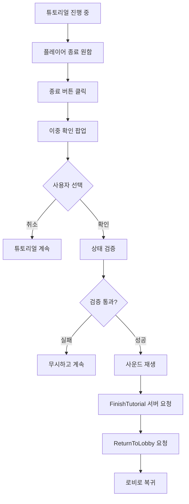
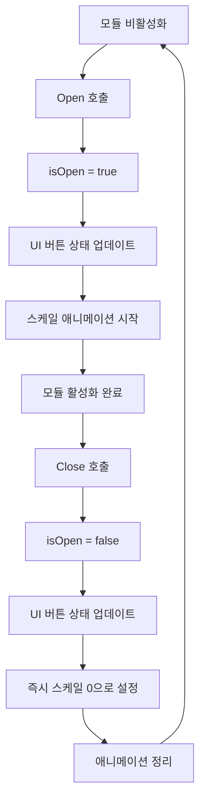

# 튜토리얼 UI 모듈

## 개요

메이플 듀얼의 튜토리얼 UI 모듈은 `TutorialModule.mlua`를 통해 튜토리얼 진행 중 플레이어가 접근할 수 있는 인터페이스를 제공합니다. 주로 튜토리얼 종료 확인과 로비 복귀 기능을 담당하여, 플레이어가 원할 때 튜토리얼을 중단하고 메인 게임으로 돌아갈 수 있게 합니다.

## 핵심 튜토리얼 UI 시스템

### TutorialModule.mlua
튜토리얼 전용 UI 인터페이스를 관리하는 모듈입니다.

**주요 속성:**
```lua
@Component
script TutorialModule extends Component

    // 매니저 의존성
    property ResourceManager resourceManager = nil
    property UIManager uiManager = nil
    
    // UI 요소들
    property Entity menuEntity = nil         -- 메뉴 엔티티
    property ButtonComponent leaveButton = nil -- 튜토리얼 종료 버튼
    
    // 상태 관리
    property boolean isOpen = false          -- 모듈 열림 상태
    
    // 애니메이션
    property any menuTweener = nil           -- 메뉴 애니메이션 트위너
end
```

**특징:**
- 간단하고 직관적인 UI 구성
- 튜토리얼 전용 기능에 집중
- 확인 팝업을 통한 안전한 종료 프로세스

## 튜토리얼 종료 시스템

### 종료 버튼 이벤트

```lua
@ExecSpace("ClientOnly")
method void OnBeginPlay()
    local character = _UserService.LocalPlayer.Character
    
    // 튜토리얼 종료 버튼 이벤트 처리
    self.leaveButton.Entity:ConnectEvent(ButtonClickEvent, function()
        // 이중 확인 팝업 표시
        self.uiManager.PopupModule:Open("DoubleCheckFinishTutorial", false, 
            function()  -- 확인 콜백
                // 안전성 검사
                if not character.isLoaded or _Server:IsRequesting() then
                    return
                end
                
                // 사운드 재생
                _SoundService:PlaySound(
                    self.resourceManager:GetResource("UI").buttonClickOpenSound, 1)
                
                // 서버에 튜토리얼 완료 요청
                _Server:Request(character, "FinishTutorial", {})
                
                // 로비로 복귀
                local room = self.Entity.CurrentMap.Room
                _Server:Request(room, "ReturnToLobby", {character})
            end, 
            nil  -- 취소 콜백 (없음)
        )
    end)
end
```

**종료 프로세스:**
1. 종료 버튼 클릭
2. 이중 확인 팝업 표시 ("DoubleCheckFinishTutorial")
3. 플레이어 확인 시:
   - 캐릭터 로드 상태 및 서버 요청 상태 확인
   - 확인 사운드 재생
   - 서버에 튜토리얼 완료 통보
   - 로비로 자동 복귀

## UI 상태 관리

### 모듈 열기

```lua
@ExecSpace("ClientOnly")
method void Open()
    self.isOpen = true
    self.uiManager:UpdateButtons()  // UI 버튼 상태 업데이트
    
    // 기존 애니메이션 정리
    if self.menuTweener then
        self.menuTweener:Destroy()
    end
    
    // 스케일 애니메이션으로 메뉴 표시
    self.menuTweener = _Tween:ScaleTo(
        self.menuEntity, 
        Vector2.one,        // 목표 스케일 (1, 1)
        0.125,             // 0.125초 지속
        EaseType.Linear    // 선형 이징
    )
end
```

### 모듈 닫기

```lua
@ExecSpace("ClientOnly")
method void Close()
    self.isOpen = false
    self.uiManager:UpdateButtons()  // UI 버튼 상태 업데이트
    
    // 메뉴 즉시 숨김 (스케일 0으로)
    local menulTransform = self.menuEntity.TransformComponent
    menulTransform.Scale.x = 0
    menulTransform.Scale.y = 0
    
    // 애니메이션 정리
    if self.menuTweener then
        self.menuTweener:Destroy()
    end
end
```

**애니메이션 특성:**
- **열기**: 스케일 애니메이션으로 부드럽게 나타남
- **닫기**: 즉시 숨김 (빠른 반응성)

### 버튼 상태 제어

```lua
@ExecSpace("ClientOnly")
method void SetButtonsEnable(boolean enable)
    // 레이캐스트 타겟 설정으로 버튼 활성화/비활성화
    self.leaveButton.Entity.SpriteGUIRendererComponent.RaycastTarget = enable
end
```

**용도:**
- 특정 상황에서 버튼 비활성화
- 튜토리얼 진행 중 실수로 종료하는 것 방지
- UI 상태에 따른 동적 제어

## 안전성 및 사용자 경험

### 이중 확인 시스템

```lua
// PopupModule을 통한 확인 팝업
self.uiManager.PopupModule:Open("DoubleCheckFinishTutorial", false, ...)
```

**"DoubleCheckFinishTutorial" 팝업:**
- 튜토리얼 종료 전 마지막 확인
- 실수로 인한 진행 상실 방지
- 명확한 의사 표현 유도

### 상태 검증

```lua
// 안전성 검사
if not character.isLoaded or _Server:IsRequesting() then
    return
end
```

**검증 항목:**
- **character.isLoaded**: 캐릭터 데이터 로드 완료 여부
- **_Server:IsRequesting()**: 서버 요청 진행 중 여부

**목적:**
- 데이터 불일치 방지
- 중복 요청 방지
- 안정적인 게임 상태 유지

## 튜토리얼 UI 플로우

### 일반적인 사용 플로우



### 모듈 상태 변화



## 서버 통신

### 튜토리얼 완료 처리

```lua
// 캐릭터에 튜토리얼 완료 통보
_Server:Request(character, "FinishTutorial", {})
```

**서버 측 처리 예상:**
- 캐릭터의 튜토리얼 완료 상태 업데이트
- 튜토리얼 진행 데이터 정리
- 메인 게임 접근 권한 부여

### 로비 복귀

```lua
// 방에서 로비로 복귀 요청
local room = self.Entity.CurrentMap.Room
_Server:Request(room, "ReturnToLobby", {character})
```

**처리 과정:**
- 현재 튜토리얼 방에서 퇴장
- 캐릭터 상태를 로비 모드로 전환
- 메인 로비 맵으로 이동

## 통합 시스템 연동

### UIManager 연동

```lua
self.uiManager:UpdateButtons()
```

**역할:**
- 전체 UI 시스템의 버튼 상태 동기화
- 다른 UI 모듈과의 상호작용 조정
- 일관된 사용자 경험 제공

### PopupModule 연동

```lua
self.uiManager.PopupModule:Open("DoubleCheckFinishTutorial", ...)
```

**장점:**
- 표준화된 확인 팝업 사용
- 일관된 UI 디자인과 동작
- 중앙집중식 팝업 관리

## 코드 참조

### 핵심 컴포넌트
- `RootDesk/MyDesk/Components/UIs/TutorialModule.mlua` — 튜토리얼 UI 모듈

### 연동 시스템
- `RootDesk/MyDesk/Components/Managers/UIManager.mlua` — UI 상태 관리
- `RootDesk/MyDesk/Components/UIs/PopupModule.mlua` — 확인 팝업 표시
- `RootDesk/MyDesk/Components/Character.mlua` — 튜토리얼 완료 처리
- `RootDesk/MyDesk/Components/Room.mlua` — 로비 복귀 처리

### 주요 메서드
- `TutorialModule:Open()` — 모듈 활성화 및 애니메이션
- `TutorialModule:Close()` — 모듈 비활성화
- `TutorialModule:SetButtonsEnable()` — 버튼 상태 제어

## 튜토리얼 UI 모듈의 특징

### 사용자 중심 설계
- 명확하고 직관적인 종료 옵션
- 실수 방지를 위한 이중 확인
- 부드러운 애니메이션으로 시각적 만족도 향상

### 안전성 우선
- 다중 상태 검증으로 안정적인 종료
- 서버 요청 중복 방지
- 데이터 무결성 보장

### 최소한의 복잡도
- 단순하고 집중된 기능
- 불필요한 옵션 제거
- 핵심 목적에 충실한 디자인

### 시스템 통합성
- 기존 UI 시스템과의 완벽한 호환
- 표준화된 팝업과 애니메이션 사용
- 전체 게임 플로우와의 자연스러운 연결

이 튜토리얼 UI 모듈은 플레이어가 튜토리얼 중 언제든지 안전하고 편리하게 메인 게임으로 돌아갈 수 있는 경로를 제공하여, 학습과 자율성의 균형을 맞추는 중요한 역할을 합니다.
