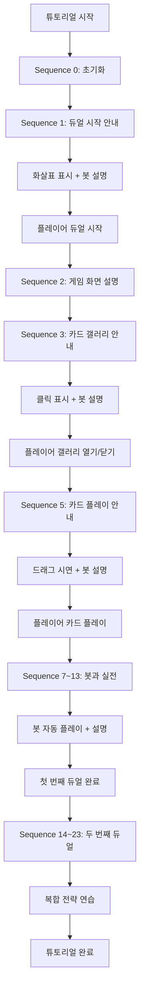
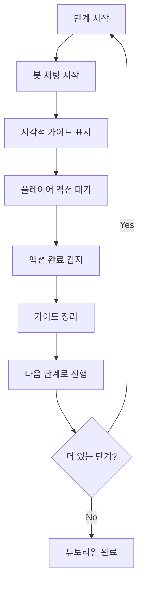
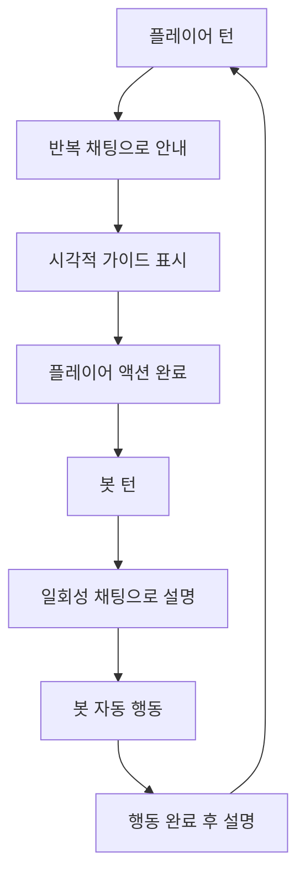

# 튜토리얼 가이드 시스템

## 개요

메이플 듀얼의 튜토리얼 가이드 시스템은 `Tutorial.mlua`를 통해 신규 플레이어에게 게임의 기본 조작법과 규칙을 단계별로 안내합니다. 시각적 가이드(화살표, 클릭, 드래그 표시)와 봇과의 대화를 결합하여 직관적이고 체계적인 학습 경험을 제공합니다.

## 핵심 튜토리얼 시스템

### Tutorial.mlua
튜토리얼 진행과 시각적 가이드를 관리하는 컴포넌트입니다.

**주요 속성:**
```lua
@Component
script Tutorial extends Component

    // 시각적 가이드 엔티티들
    property Entity arrowEntity = nil        -- 화살표 가이드
    property Entity clickEntity = nil        -- 클릭 가이드
    property Entity dragEntity = nil         -- 드래그 가이드
    
    // 튜토리얼 진행 관리
    property Bot bot = nil                   -- 튜토리얼 봇
    property integer duelId = 0              -- 듀얼 ID
    property integer sequence = 0            -- 현재 튜토리얼 단계
    
    // 드래그 애니메이션 관리
    property integer dragTimer_1 = 0         -- 드래그 타이머 1
    property integer dragTimer_2 = 0         -- 드래그 타이머 2
    property any dragTweener = nil           -- 드래그 애니메이션
end
```

## 시각적 가이드 시스템

### 화살표 가이드

```lua
@ExecSpace("ClientOnly")
method void SetArrow(Vector3 position)
    // 화살표를 지정된 위치에 표시
    self.arrowEntity.TransformComponent.WorldPosition = position:Clone()
end

@ExecSpace("ClientOnly")
method void ClearArrow()
    // 화면 밖으로 이동하여 화살표 숨김
    self.arrowEntity.TransformComponent.WorldPosition = Vector3(100, 100, 0)
end
```

**사용 예시:**
```lua
// 듀얼 시작 버튼을 가리키는 화살표
self:SetArrow(Vector3(-3.05, -0.5, 0))
```

### 클릭 가이드

```lua
@ExecSpace("ClientOnly")
method void SetClick(Vector3 position)
    // 클릭 표시를 지정된 위치에 표시
    self.clickEntity.TransformComponent.WorldPosition = position:Clone()
end

@ExecSpace("ClientOnly")
method void ClearClick()
    // 화면 밖으로 이동하여 클릭 표시 숨김
    self.clickEntity.TransformComponent.WorldPosition = Vector3(100, 100, 0)
end
```

**사용 예시:**
```lua
// 카드를 클릭하라는 표시
self:SetClick(Vector3(0, -2.8, 0))
```

### 드래그 가이드

```lua
@ExecSpace("ClientOnly")
method void SetDrag(Vector3 source, Vector3 destination)
    // 기존 타이머와 애니메이션 정리
    _TimerService:ClearTimer(self.dragTimer_1)
    _TimerService:ClearTimer(self.dragTimer_2)
    if self.dragTweener then
        self.dragTweener:Destroy()
    end
    
    // 드래그 애니메이션 반복 실행
    self.dragTimer_1 = _TimerService:SetTimerRepeat(function()
        // 시작 위치에 드래그 엔티티 배치
        self.dragEntity.TransformComponent.WorldPosition = source:Clone()
        _Util:Restart(self.dragEntity.SpriteRendererComponent)  // 스프라이트 재시작
        
        // 0.5초 후 목적지로 이동 애니메이션 시작
        self.dragTimer_2 = _TimerService:SetTimerOnce(function()
            self.dragTweener = _Tween:MoveTo(
                self.dragEntity, 
                destination:ToVector2(), 
                0.8,                    // 0.8초 지속
                EaseType.CubicEaseOut,  // 부드러운 이징
                true                    // 월드 좌표 사용
            )
        end, 0.5)
    end, 1.6)  // 1.6초마다 반복
end

@ExecSpace("ClientOnly")
method void ClearDrag()
    // 모든 드래그 관련 타이머와 애니메이션 정리
    _TimerService:ClearTimer(self.dragTimer_1)
    _TimerService:ClearTimer(self.dragTimer_2)
    if self.dragTweener then
        self.dragTweener:Destroy()
    end
    
    // 드래그 엔티티를 화면 밖으로 이동
    self.dragEntity.TransformComponent.WorldPosition = Vector3(100, 100, 0)
end
```

**사용 예시:**
```lua
// 카드를 손패에서 필드로 드래그하는 방법 표시
self:SetDrag(Vector3(0, -2.8, 0), Vector3(0, -1, 0))
```

## 튜토리얼 진행 시스템

### 시퀀스 기반 진행

```lua
@ExecSpace("ServerOnly")
method void Progress(string key)
    _Server.sender = nil
    
    local success = false
    
    // 현재 시퀀스와 키 매칭으로 진행 조건 확인
    if self.sequence == 0 then
        success = true
    elseif self.sequence == 1 and key == "PreBeginDuel" then
        success = true
    elseif self.sequence == 2 and key == "PostBeginDuel" then
        success = true
    elseif self.sequence == 3 and key == "OpenGallery" then
        success = true
    elseif self.sequence == 4 and key == "CloseGallery" then
        success = true
    elseif self.sequence == 5 and key == "PrePlay" then
        success = true
    elseif self.sequence == 6 and key == "PostPlay" then
        success = true
    // ... 더 많은 시퀀스들
    end
    
    if success then
        self.sequence += 1  // 다음 단계로 진행
        self:ProgressInClient()  // 클라이언트 업데이트
        
        // 특정 단계에서 봇 액션 실행
        local botPlayer = self.bot.Entity.Character.player
        if self.sequence == 7 then
            _TimerService:SetTimerOnce(function()
                self.bot:Play(botPlayer.hand.cardArray[1], nil, nil)
            end, 4)
        elseif self.sequence == 10 then
            _TimerService:SetTimerOnce(function()
                self.bot:DeclareEndRound()
            end, 4)
        end
        // ... 기타 봇 액션들
    end
end
```

### 클라이언트 진행 처리

```lua
@ExecSpace("Client")
method void ProgressInClient()
    self.sequence += 1
    
    // 단계별 튜토리얼 가이드 표시
    if self.sequence == 1 then
        // 1단계: 듀얼 시작 안내
        self.bot:ChatRepeat(_LocalizationService:GetText("TutorialTalk_1"), 1, 0)
        self:SetArrow(Vector3(-3.05, -0.5, 0))  // 듀얼 버튼에 화살표
        
    elseif self.sequence == 2 then
        // 2단계: 듀얼 시작 후
        self.duelId += 1
        self.bot:ChatOnce(_LocalizationService:GetText("TutorialTalk_2"), 3)
        self:ClearArrow()
        
    elseif self.sequence == 3 then
        // 3단계: 카드 갤러리 열기
        self.bot:ChatRepeat(_LocalizationService:GetText("TutorialTalk_3"), 1, 0)
        self:SetClick(Vector3(0, -2.8, 0))  // 카드에 클릭 표시
        
    elseif self.sequence == 4 then
        // 4단계: 갤러리 닫기
        self.bot:StopChat()
        self:ClearClick()
        
    elseif self.sequence == 5 then
        // 5단계: 카드 드래그 안내
        self.bot:ChatRepeat(_LocalizationService:GetText("TutorialTalk_4"), 1, 0)
        self:SetDrag(Vector3(0, -2.8, 0), Vector3(0, -1, 0))  // 드래그 시연
        
    elseif self.sequence == 6 then
        // 6단계: 카드 플레이 완료
        self.bot:StopChat()
        self:ClearDrag()
        
    elseif self.sequence == 7 then
        // 7단계: 봇 턴 설명
        self.bot:ChatOnce(_LocalizationService:GetText("TutorialTalk_5"), 4)
        
    // ... 더 많은 단계들
    end
end
```

## 튜토리얼 단계 상세

### 주요 튜토리얼 키

**게임 진행 관련:**
- **"PreBeginDuel"** - 듀얼 시작 전
- **"PostBeginDuel"** - 듀얼 시작 후
- **"PrePlay"** - 카드 플레이 전
- **"PostPlay"** - 카드 플레이 후
- **"PreDeclareEndRound"** - 라운드 종료 선언 전
- **"PostDeclareEndRound"** - 라운드 종료 선언 후
- **"PostEndDuel"** - 듀얼 종료 후

**UI 상호작용 관련:**
- **"OpenGallery"** - 카드 갤러리 열기
- **"CloseGallery"** - 카드 갤러리 닫기

### 봇과의 상호작용

```lua
// 반복 채팅 (지속적 안내)
self.bot:ChatRepeat(message, interval, delay)

// 일회성 채팅 (단발적 설명)
self.bot:ChatOnce(message, duration)

// 채팅 중단
self.bot:StopChat()

// 봇 자동 행동
self.bot:Play(card, target, position)
self.bot:DeclareEndRound()
self.bot:Run()  // AI 모드로 전환
```

## 속성 동기화 시스템

### 서버-클라이언트 동기화

```lua
method table GetProperties()
    // 동기화할 속성들 수집
    local propertyTable = {
        bot = self.bot,
    }
    return propertyTable
end

method void SetProperties(table propertyTable)
    // 속성 일괄 설정
    for propertyName, propertyValue in pairs(propertyTable) do
        self[propertyName] = propertyValue
    end
end

@ExecSpace("ServerOnly")
method void SyncProperties(string userId)
    // 클라이언트에 속성 동기화
    self:SetPropertiesInClient(self:GetProperties(), userId)
end
```

## 튜토리얼 플로우

### 전체 진행 구조



### 시각적 가이드 타이밍



### 봇 상호작용 패턴



## 로컬라이제이션 지원

### 다국어 메시지

```lua
// 튜토리얼 메시지들
"TutorialTalk_1" - 게임 시작 안내
"TutorialTalk_2" - 게임 화면 설명  
"TutorialTalk_3" - 카드 정보 보기 안내
"TutorialTalk_4" - 카드 플레이 방법
"TutorialTalk_5" - 봇 턴 설명
"TutorialTalk_6" - 라운드 종료 방법
"TutorialTalk_7" - 턴제 시스템 설명
"TutorialTalk_8" - 전투 시스템 설명
"TutorialTalk_9" - 고급 전략 안내
// ... 더 많은 메시지들
```

## 코드 참조

### 핵심 컴포넌트
- `RootDesk/MyDesk/Components/Tutorial.mlua` — 튜토리얼 가이드 메인 시스템

### 연동 시스템
- `RootDesk/MyDesk/Components/Bot.mlua` — 튜토리얼 봇 AI
- `RootDesk/MyDesk/Logics/Tween.mlua` — 가이드 애니메이션
- 로컬라이제이션 서비스 — 다국어 메시지 지원

### 주요 메서드
- `Tutorial:SetArrow()` — 화살표 가이드 표시
- `Tutorial:SetClick()` — 클릭 가이드 표시
- `Tutorial:SetDrag()` — 드래그 가이드 애니메이션
- `Tutorial:Progress()` — 튜토리얼 단계 진행
- `Tutorial:ProgressInClient()` — 클라이언트 가이드 업데이트

## 튜토리얼 가이드 시스템의 특징

### 단계별 학습
- 24단계의 체계적인 진행 구조
- 각 단계별 명확한 학습 목표
- 플레이어 액션 완료 후 다음 단계 진행

### 시각적 직관성
- 화살표: 클릭할 위치 명확 표시
- 클릭 표시: 상호작용 가능한 요소 강조
- 드래그 애니메이션: 복잡한 조작 시연

### 봇과의 상호작용
- 친근한 대화체로 게임 규칙 설명
- 실시간 피드백과 격려
- 플레이어 실수 시 재안내

### 점진적 복잡도 증가
- 기본 조작 → 게임 규칙 → 전략적 사고
- 첫 번째 듀얼: 기초 학습
- 두 번째 듀얼: 응용 및 심화

### 성능 최적화
- 불필요한 가이드 요소 화면 밖 배치
- 타이머와 애니메이션 적절한 정리
- 서버-클라이언트 효율적 동기화

이 튜토리얼 가이드 시스템은 메이플 듀얼의 복잡한 카드 게임 메커니즘을 신규 플레이어가 쉽고 재미있게 학습할 수 있도록 돕는 핵심 교육 도구입니다.
