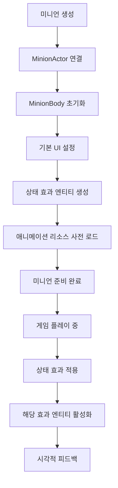
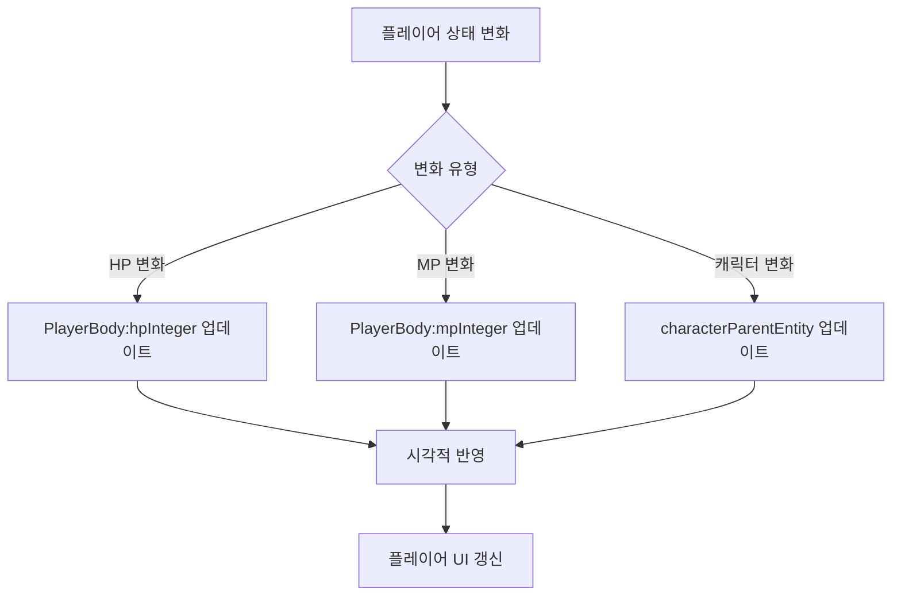
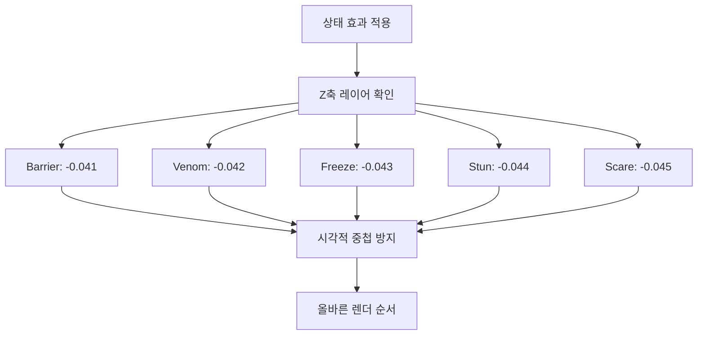

# 유닛 헬퍼 시스템

## 개요

메이플 듀얼의 유닛 헬퍼 시스템은 플레이어와 미니언의 시각적 표현과 UI 요소들을 관리하는 계층화된 컴포넌트 구조입니다. `RootDesk/MyDesk/Components/Helpers/` 폴더에 위치한 이 시스템은 기본 유닛 클래스로부터 상속받아 각 유닛 타입별 특화된 기능을 제공합니다.

## 유닛 헬퍼 계층구조

### 상속 구조

```
Component
├── UnitActor (기본 유닛 액터)
│   ├── PlayerActor (플레이어 액터)
│   └── MinionActor (미니언 액터)
└── UnitBody (기본 유닛 바디)
    ├── PlayerBody (플레이어 바디)
    └── MinionBody (미니언 바디)
```

## 기본 유닛 헬퍼

### UnitActor.mlua
모든 유닛 액터의 기본 클래스입니다.

**구조:**
```lua
@Component
script UnitActor extends Component
    property Unit object = nil  -- 연결된 유닛 객체
end
```

**역할:**
- 유닛 객체와 시각적 표현 간의 기본 연결
- 상속 클래스들의 공통 기반 제공
- 유닛 식별 및 참조 기준점

### UnitBody.mlua
유닛의 UI 요소들을 관리하는 기본 바디 클래스입니다.

**주요 속성:**
```lua
property Unit object = nil                -- 연결된 유닛 객체
property Entity signEntity = nil          -- 시그널 표시 엔티티
property Entity touchAreaEntity = nil     -- 터치 영역
property Entity hpEntity = nil            -- 체력 표시 영역
property Integer hpInteger = nil          -- 체력 숫자
```

**초기화:**
```lua
@ExecSpace("ClientOnly")
method void OnBeginPlay()
    self.signEntity.Enable = false  -- 시그널 엔티티 기본 비활성화
end
```

**공통 기능:**
- 체력 표시 관리
- 터치 상호작용 영역 제공
- 시그널 표시 시스템 (기본 비활성화)

## 플레이어 헬퍼

### PlayerActor.mlua
플레이어 전용 액터 컴포넌트입니다.

**구조:**
```lua
@Component
script PlayerActor extends UnitActor
    property Player object = nil          -- 플레이어 객체 참조
    property Entity backgroundEntity = nil -- 배경 엔티티
end
```

**특징:**
- UnitActor를 상속하여 플레이어 특화 기능 제공
- 배경 엔티티를 통한 플레이어 영역 시각화
- 플레이어 전용 UI 요소 관리

### PlayerBody.mlua
플레이어의 바디 및 MP 시스템을 관리합니다.

**주요 속성:**
```lua
@Component
script PlayerBody extends UnitBody
    property Player object = nil               -- 플레이어 객체 참조
    property Entity characterParentEntity = nil -- 캐릭터 부모 엔티티
    property Entity mpEntity = nil             -- MP 표시 영역
    property Integer mpInteger = nil           -- MP 숫자
end
```

**특화 기능:**
- **MP 시스템**: 플레이어의 마나 포인트 시각적 표시
- **캐릭터 통합**: 캐릭터 아바타와의 연동
- **기본 UI**: UnitBody의 체력 시스템 상속

## 미니언 헬퍼

### MinionActor.mlua
미니언 전용 액터 컴포넌트입니다.

**구조:**
```lua
@Component
script MinionActor extends UnitActor
    property Minion object = nil  -- 미니언 객체 참조
end
```

**특징:**
- UnitActor를 상속한 미니언 특화 버전
- 미니언 객체와의 직접적인 연결
- 간단하고 효율적인 구조

### MinionBody.mlua
미니언의 복합적인 시각적 표현과 상태 효과를 관리하는 핵심 컴포넌트입니다.

**주요 속성:**
```lua
@Component
script MinionBody extends UnitBody
    property Minion object = nil          -- 미니언 객체 참조
    
    // 스탯 표시
    property Entity atkEntity = nil       -- 공격력 표시 영역
    property Integer atkInteger = nil     -- 공격력 숫자
    
    // 미니언 모델
    property Entity minionEntity = nil    -- 미니언 모델 엔티티
    
    // 상태 효과 엔티티들
    property Entity barrierEntity = nil   -- 방어막 효과
    property Entity venomEntity = nil     -- 독 효과
    property Entity freezeEntity = nil    -- 빙결 효과
    property Entity stunEntity = nil      -- 기절 효과
    property Entity scareEntity = nil     -- 공포 효과
end
```

## 상태 효과 시스템

### 상태 효과 초기화

```lua
@ExecSpace("ClientOnly")
method void OnBeginPlay()
    __base:OnBeginPlay()  -- UnitBody 초기화 호출
    
    // 미니언 애니메이션 리소스 사전 로드
    _ResourceService:PreloadAsync(self.minionEntity.StateAnimationComponent.ActionSheet.Values, nil)
    
    // 상태 효과 엔티티들 동적 생성
    self.barrierEntity = _SpawnService:SpawnByModelId(
        _EntryService:GetModelIdByName("Barrier"), "Barrier", 
        Vector3(0, 0.14, -0.041), self.Entity)
        
    self.venomEntity = _SpawnService:SpawnByModelId(
        _EntryService:GetModelIdByName("Venom"), "Venom", 
        Vector3(0, 0, -0.042), self.Entity)
        
    self.freezeEntity = _SpawnService:SpawnByModelId(
        _EntryService:GetModelIdByName("Freeze"), "Freeze", 
        Vector3(0, 0.45, -0.043), self.Entity)
        
    self.stunEntity = _SpawnService:SpawnByModelId(
        _EntryService:GetModelIdByName("Stun"), "Stun", 
        Vector3(0, 0.45, -0.044), self.Entity)
        
    self.scareEntity = _SpawnService:SpawnByModelId(
        _EntryService:GetModelIdByName("Scare"), "Scare", 
        Vector3(0, 0.45, -0.045), self.Entity)
end
```

### 상태 효과별 위치 및 레이어

**위치 배치:**
- **Barrier**: (0, 0.14, -0.041) - 미니언 중앙 약간 위쪽
- **Venom**: (0, 0, -0.042) - 미니언 중앙
- **Freeze**: (0, 0.45, -0.043) - 미니언 상단
- **Stun**: (0, 0.45, -0.044) - 미니언 상단 (Freeze보다 뒤)
- **Scare**: (0, 0.45, -0.045) - 미니언 상단 (가장 뒤)

**Z축 레이어링:**
상태 효과들이 겹치지 않도록 미세한 Z축 차이로 레이어 분리

## 상태 효과 유형

### Barrier (방어막)
- **위치**: 미니언 중앙부
- **기능**: 피해 흡수 시각적 표현
- **상태**: 방어막 보유 시 활성화

### Venom (독)
- **위치**: 미니언 중앙
- **기능**: 독 데미지 표시
- **상태**: 중독 상태 표시

### Freeze (빙결)
- **위치**: 미니언 상단
- **기능**: 행동 불가 상태 표시
- **상태**: 빙결 시 활성화

### Stun (기절)
- **위치**: 미니언 상단
- **기능**: 턴 스킵 상태 표시
- **상태**: 기절 시 활성화

### Scare (공포)
- **위치**: 미니언 상단
- **기능**: 공격 불가 상태 표시
- **상태**: 공포 상태 시 활성화

## 유닛 헬퍼 시스템 플로우

### 미니언 생성 및 초기화



### 플레이어 UI 업데이트



### 상태 효과 레이어 관리



## 성능 최적화

### 리소스 사전 로드
```lua
// 미니언 애니메이션 리소스 미리 로드
_ResourceService:PreloadAsync(self.minionEntity.StateAnimationComponent.ActionSheet.Values, nil)
```

### 동적 엔티티 생성
- 상태 효과 엔티티들은 초기화 시 한 번만 생성
- 필요에 따라 Enable/Disable 토글로 성능 최적화
- 메모리 사용량 최소화

### 계층적 상속 구조
- 공통 기능은 기본 클래스에서 처리
- 특화 기능만 하위 클래스에서 구현
- 코드 중복 최소화

## 확장성

### 새로운 상태 효과 추가
```lua
// MinionBody.mlua 확장 예시
property Entity newEffectEntity = nil

// OnBeginPlay에서 추가
self.newEffectEntity = _SpawnService:SpawnByModelId(
    _EntryService:GetModelIdByName("NewEffect"), "NewEffect", 
    Vector3(0, 0.3, -0.046), self.Entity)
```

### 커스텀 유닛 타입
- UnitActor/UnitBody를 상속하여 새로운 유닛 타입 생성 가능
- 기본 기능은 유지하면서 특화 기능 추가
- 일관된 인터페이스 제공

## 코드 참조

### 기본 헬퍼
- `RootDesk/MyDesk/Components/Helpers/UnitActor.mlua` — 기본 유닛 액터
- `RootDesk/MyDesk/Components/Helpers/UnitBody.mlua` — 기본 유닛 바디

### 플레이어 헬퍼
- `RootDesk/MyDesk/Components/Helpers/PlayerActor.mlua` — 플레이어 액터
- `RootDesk/MyDesk/Components/Helpers/PlayerBody.mlua` — 플레이어 바디 (MP 시스템)

### 미니언 헬퍼
- `RootDesk/MyDesk/Components/Helpers/MinionActor.mlua` — 미니언 액터
- `RootDesk/MyDesk/Components/Helpers/MinionBody.mlua` — 미니언 바디 (상태 효과 시스템)

### 연동 컴포넌트
- `RootDesk/MyDesk/Components/Objects/Player.mlua` — 플레이어 로직 컴포넌트
- `RootDesk/MyDesk/Components/Objects/Minion.mlua` — 미니언 로직 컴포넌트
- `RootDesk/MyDesk/Components/Objects/Unit.mlua` — 기본 유닛 로직

## 유닛 헬퍼 시스템의 특징

### 계층적 설계
- 상속을 통한 코드 재사용성
- 공통 기능과 특화 기능의 명확한 분리
- 유지보수성 향상

### 상태 효과 전문화
- 미니언의 다양한 상태 효과 체계적 관리
- 시각적 레이어 분리로 겹침 방지
- 동적 생성으로 성능 최적화

### 확장 가능성
- 새로운 유닛 타입 추가 용이
- 상태 효과 시스템 확장 지원
- 일관된 인터페이스 유지

### 성능 효율성
- 사전 로드를 통한 렌더링 최적화
- 필요시에만 활성화되는 효과 시스템
- 메모리 사용량 최소화

이 유닛 헬퍼 시스템은 메이플 듀얼의 플레이어와 미니언이 각각의 특성에 맞는 시각적 표현과 상호작용을 제공하면서도, 공통 기능을 효율적으로 재사용할 수 있는 유연한 아키텍처를 제공합니다.
