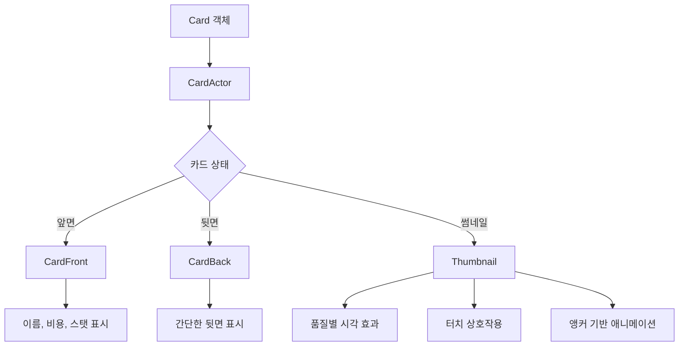
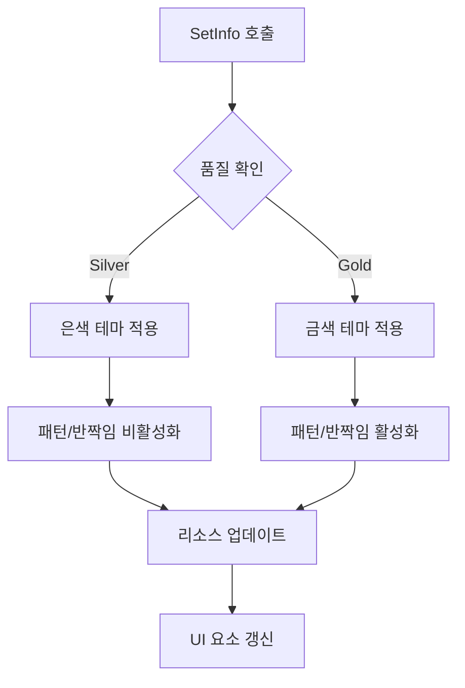
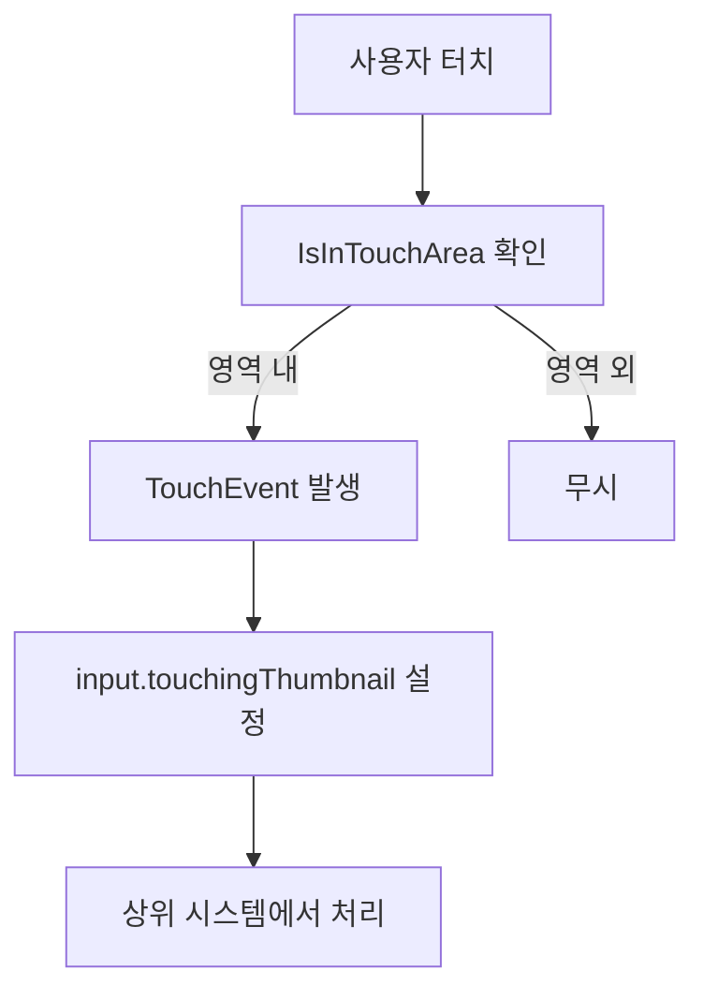

# 카드 헬퍼 시스템

## 개요

메이플 듀얼의 카드 헬퍼 시스템은 카드의 시각적 표현과 상호작용을 담당하는 경량화된 컴포넌트들의 집합입니다. `RootDesk/MyDesk/Components/Helpers/` 폴더에 위치한 이 헬퍼들은 카드의 다양한 시각적 상태와 UI 요소들을 효율적으로 관리합니다.

## 핵심 카드 헬퍼 컴포넌트

### CardActor.mlua
카드 객체와 시각적 표현을 연결하는 기본 액터 컴포넌트입니다.

**구조:**
```lua
@Component
script CardActor extends Component
    property Card object = nil
end
```

**역할:**
- Card 객체와 UI 엔티티 간의 연결고리
- 카드의 기본 식별자 역할
- 다른 헬퍼 컴포넌트들이 참조하는 기준점

### CardFront.mlua
카드 앞면의 모든 UI 요소들을 관리하는 헬퍼입니다.

**주요 속성:**
```lua
property Card object = nil                -- 연결된 카드 객체
property Entity signEntity = nil          -- 시그널 표시 엔티티
property NameTagComponent nametag = nil   -- 카드 이름 태그
property Entity touchAreaEntity = nil     -- 터치 영역
property Entity costEntity = nil          -- 비용 표시 영역
property Integer costInteger = nil        -- 비용 숫자
property Entity hpEntity = nil            -- 체력 표시 영역
property Integer hpInteger = nil          -- 체력 숫자
property Entity atkEntity = nil           -- 공격력 표시 영역
property Integer atkInteger = nil         -- 공격력 숫자
```

**초기화:**
```lua
@ExecSpace("ClientOnly")
method void OnBeginPlay()
    self.signEntity.Enable = false  -- 시그널 엔티티 비활성화
end
```

**UI 요소들:**
- **네임태그**: 카드 이름 표시
- **비용 표시**: MP 비용 시각화
- **스탯 표시**: 미니언 카드의 공격력/체력
- **시그널**: 특별한 상태 표시용 (기본 비활성화)
- **터치 영역**: 카드 상호작용을 위한 터치 감지

### CardBack.mlua
카드 뒷면의 간단한 표현을 담당합니다.

**구조:**
```lua
@Component
script CardBack extends Component
    property Card object = nil            -- 연결된 카드 객체
    property Entity touchAreaEntity = nil -- 터치 영역
end
```

**특징:**
- 최소한의 구조로 카드뒷면 표현
- 터치 감지만 지원 (드래그, 클릭 등)
- 카드 내용은 숨김 상태

### Thumbnail.mlua
카드 썸네일의 복합적인 시각적 표현을 관리하는 고급 헬퍼입니다.

**주요 속성:**
```lua
property CardManager cardManager = nil
property ResourceManager resourceManager = nil

-- UI 엔티티들
property Entity costEntity = nil          -- 비용 표시
property SpriteRendererComponent costImage = nil
property Integer costInteger = nil
property Entity rarityEntity = nil        -- 등급 표시
property Entity touchAreaEntity = nil     -- 터치 영역
property Entity backgroundEntity = nil    -- 배경 이미지
property Entity borderEntity = nil        -- 테두리
property Entity patternEntity = nil       -- 패턴 효과
property Entity glitterEntity = nil       -- 반짝임 효과
property Entity anchorEntity = nil        -- 앵커 포인트

-- 카드 정보
property table info = nil                 -- 카드 정보 테이블
property string name = nil                -- 카드 이름
property string variant = nil             -- 변형 (Default, Skin1 등)
property string quality = nil             -- 품질 (Silver, Gold)
property integer cost = nil               -- 비용
property string rarity = nil              -- 등급

-- 애니메이션 및 상태
property any tweener = nil                -- 메인 트위너
property any anchorTweener = nil          -- 앵커 트위너
property boolean isDisplayable = true     -- 표시 가능 여부
property integer displayTimer = 0         -- 표시 타이머
```

## Thumbnail 시스템 상세 기능

### 카드 정보 설정

```lua
@ExecSpace("ClientOnly")
method void SetInfo(table info)
    local name = info.name
    local variant = info.variant
    local quality = info.quality
    
    self.info = info
    self.name = name
    self.variant = variant
    self.quality = quality
    
    -- 카드 매니저에서 정보 가져오기
    self.cost = self.cardManager:GetCost(info.name)
    self.rarity = self.cardManager:GetRarity(info.name)
    
    local resource = self.resourceManager:GetResource("Thumbnail")
    
    -- 품질별 비주얼 설정
    local costImage, borderImage
    if self.quality == "Silver" then
        costImage = resource.silverCost
        borderImage = resource.silverBorder
        self.patternEntity.Enable = false
        self.glitterEntity.Enable = false
    elseif self.quality == "Gold" then
        costImage = resource.goldCost
        borderImage = resource.goldBorder
        self.patternEntity.Enable = true
        self.glitterEntity.Enable = true
    end
    
    -- UI 요소 업데이트
    self.costInteger:SetInteger(self.cost)
    self.costImage.SpriteRUID = costImage
    self.backgroundEntity.SpriteRendererComponent.SpriteRUID = resource[name .. variant] or ""
    self.borderEntity.SpriteRendererComponent.SpriteRUID = borderImage
    self.rarityEntity.SpriteRendererComponent.SpriteRUID = resource[self.rarity] or ""
end
```

### 품질 시스템 (Silver/Gold)

**Silver 품질:**
- 기본 은색 테두리와 비용 아이콘
- 패턴과 반짝임 효과 비활성화
- 심플한 시각적 표현

**Gold 품질:**
- 고급 금색 테두리와 비용 아이콘
- 패턴과 반짝임 효과 활성화
- 화려한 시각적 표현

### 터치 영역 관리

```lua
@ExecSpace("ClientOnly")
method boolean IsInTouchArea(Vector2 point)
    local transform = self.Entity.TransformComponent
    local position = transform.WorldPosition
    local angle = math.rad(transform.ZRotation)
    local x = position.x
    local y = position.y
    
    -- 좌표 변환 (회전 고려)
    point.x = point.x - x
    point.y = point.y - y
    point.x = math.cos(angle) * point.x + math.sin(angle) * point.y
    point.y = -math.sin(angle) * point.x + math.cos(angle) * point.y
    
    -- 터치 영역 크기 (0.70 x 0.95)
    local touchAreaHalfX = 0.70 * 0.5
    local touchAreaHalfY = 0.95 * 0.5
    
    return point.x > -touchAreaHalfX and point.x < touchAreaHalfX
        and point.y > -touchAreaHalfY and point.y < touchAreaHalfY
end
```

**터치 이벤트 처리:**
```lua
@ExecSpace("ClientOnly")
method void OnBeginPlay()
    self.touchAreaEntity:ConnectEvent(TouchEvent, function()
        self.Entity.CurrentMap.Map.input.touchingThumbnail = self
    end)
end
```

### 앵커 시스템

썸네일의 위치 및 이동을 관리하는 앵커 시스템:

```lua
-- 앵커 위치 즉시 설정
method void SetAnchorTransform(Vector2 position)
    self:DestroyAnchorTweener()
    
    local worldPosition = self.Entity.TransformComponent.WorldPosition:Clone()
    
    local transform = self.anchorEntity.TransformComponent
    transform.Position.x = position.x
    transform.Position.y = position.y
    
    self.Entity.TransformComponent.WorldPosition = worldPosition
end

-- 앵커 위치로 애니메이션 이동
method void TransformAnchorTo(Vector2 position)
    if not isvalid(self.anchorEntity) then return end
    
    self:DestroyAnchorTweener()
    self.anchorTweener = _Tween:MoveTo(self.anchorEntity, position, 0.5, EaseType.QuintEaseOut, false)
end

-- 앵커 위치로 썸네일 이동
method void TransformToAnchor()
    if not isvalid(self.anchorEntity) then return end
    
    self:DestroyTweener()
    self.Entity.TransformComponent.Position.z = 0
    self.tweener = _Tween:MoveTo(self.Entity, Vector2.zero, 0.125, EaseType.Linear, false)
end
```

### 블루프린트 시스템

카드 생성을 위한 블루프린트 제공:

```lua
-- 현재 썸네일 기반 블루프린트
method table GetBlueprint()
    return {
        info = self.info,
        enchantmentArray = {},
        independentVariableTable = {}
    }
end

-- 특정 카드명 기반 블루프린트
method table GetBlueprintByName(string name)
    local blueprint
    if _UtilLogic:IsNilorEmptyString(name) then
        blueprint = {}
    else
        local modelName = string.format("%s%s%sCardFront", name, self.variant, self.quality)
        local modelId = _EntryService:GetModelIdByName(modelName)
        local variant = _UtilLogic:IsNilorEmptyString(modelId) and "Default" or self.variant
        blueprint = {
            info = {name = name, variant = variant, quality = self.quality},
            enchantmentArray = {},
            independentVariableTable = {}
        }
    end
    
    return blueprint
end
```

## 애니메이션 및 이펙트

### 레이어 관리

```lua
-- 앞으로 가져오기 (z = -40)
method void PlaceFront()
    self.Entity.TransformComponent.Position.z = -40
end

-- 뒤로 보내기 (z = 0)
method void PlaceBack()
    self.Entity.TransformComponent.Position.z = 0
end
```

### 트위너 관리

```lua
-- 메인 트위너 정리
method void DestroyTweener()
    if self.tweener then
        self.tweener:Destroy()
    end
end

-- 앵커 트위너 정리
method void DestroyAnchorTweener()
    if self.anchorTweener then
        self.anchorTweener:Destroy()
    end
end
```

### 표시 제어

```lua
-- 일정 시간 후 표시 불가 설정
method void SetDisplayTimer(number delaySeconds)
    self.displayTimer = _TimerService:SetTimerOnce(function()
        self.isDisplayable = false
    end, delaySeconds)
end

-- 표시 타이머 해제
method void ClearDisplayTimer()
    _TimerService:ClearTimer(self.displayTimer)
end
```

## 카드 헬퍼 시스템 활용

### 카드 상태 표현



### 품질 시스템 플로우



### 터치 상호작용 플로우



## 성능 최적화

### 리소스 관리
- 필요할 때만 이펙트 활성화 (Gold 품질)
- 트위너 적절한 해제로 메모리 누수 방지
- 터치 영역 효율적인 계산

### 애니메이션 최적화
- EaseType을 활용한 자연스러운 애니메이션
- 짧은 지속시간으로 반응성 확보
- 불필요한 애니메이션 중복 방지

## 코드 참조

### 헬퍼 컴포넌트
- `RootDesk/MyDesk/Components/Helpers/CardActor.mlua` — 카드 액터 기본 컴포넌트
- `RootDesk/MyDesk/Components/Helpers/CardFront.mlua` — 카드 앞면 UI 관리
- `RootDesk/MyDesk/Components/Helpers/CardBack.mlua` — 카드 뒷면 UI 관리
- `RootDesk/MyDesk/Components/Helpers/Thumbnail.mlua` — 카드 썸네일 시스템

### 연동 시스템
- `RootDesk/MyDesk/Components/Managers/CardManager.mlua` — 카드 데이터 제공
- `RootDesk/MyDesk/Components/Managers/ResourceManager.mlua` — 시각 리소스 관리
- `RootDesk/MyDesk/Components/Input.mlua` — 터치 입력 처리

## 카드 헬퍼 시스템의 특징

### 모듈화 설계
- 각 헬퍼가 특정 역할에 집중
- 독립적인 기능으로 재사용 가능
- 시각적 복잡도에 따른 계층화

### 확장성
- 새로운 카드 품질 추가 용이
- 다양한 시각적 효과 적용 가능
- 터치 상호작용 패턴 확장 지원

### 성능 효율성
- 경량화된 컴포넌트 구조
- 필요시에만 활성화되는 이펙트
- 효율적인 애니메이션 관리

이 카드 헬퍼 시스템은 메이플 듀얼의 카드들이 다양한 상황에서 적절한 시각적 표현과 상호작용을 제공할 수 있도록 하는 유연하고 효율적인 기반을 제공합니다.
